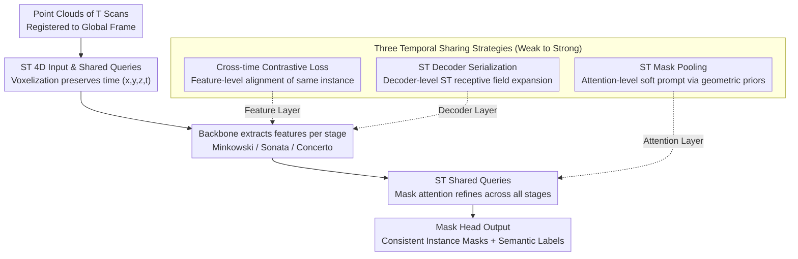

# ReScene4D: Temporally Consistent Semantic Instance Segmentation of Evolving Indoor 3D Scenes

**Conference**: CVPR 2026  
**arXiv**: [2601.11508](https://arxiv.org/abs/2601.11508)  
**Code**: [Project Page](https://www.easteine.com/rescene4d/)  
**Area**: Autonomous Driving / 3D Vision / Instance Segmentation  
**Keywords**: 4D Semantic Instance Segmentation, Temporal Consistency, Indoor Scene Changes, Contrastive Learning, Spatio-Temporal Queries

## TL;DR

Defines and formalizes the task of temporally sparse 4D indoor semantic instance segmentation (4DSIS). The proposed ReScene4D method extends 3D instance segmentation architectures to the 4D dimension through three temporal information sharing strategies: spatio-temporal contrastive loss, spatio-temporal mask pooling, and spatio-temporal serialization. It achieves SOTA on the 3RScan dataset and introduces the new t-mAP metric to jointly evaluate segmentation quality and temporal identity consistency.

## Background & Motivation

1. **Background**: 3D semantic instance segmentation (3DSIS) has achieved excellent performance on static scenes, represented by query-based Transformer architectures like Mask3D, SPFormer, and Relation3D. Simultaneously, 4D LiDAR panoptic segmentation methods (Mask4D, Mask4Former) have progressed on densely sampled autonomous driving sequences. Large-scale self-supervised point cloud encoders (Sonata, Concerto) have refreshed SOTA on various 3D tasks.

2. **Limitations of Prior Work**: (a) 3DSIS methods process each observation independently, ignoring temporal identity continuity—the same chair in two scans is fragmented into two independent instances; (b) 4D LiDAR methods rely on high-frequency dense sampling and minimal inter-frame change assumptions (optical flow tracking, motion models), whereas indoor observations may span days, months, or years, during which object positions, appearances, and even topologies change significantly; (c) Change detection methods find differences but do not establish semantic or instance-level correspondences; (d) No existing metrics jointly evaluate segmentation quality and temporal identity consistency.

3. **Key Challenge**: 4D understanding of indoor environments faces a unique challenge: observations are sparse in time (intervals of days to years), yet scene changes can be large (objects moving, appearing, or disappearing). Traditional methods relying on continuous observations or motion models fail. Maintaining instance identity consistency across scans without dense observations is required.

4. **Goal**: (1) Formally define the temporally sparse 4DSIS task; (2) Design temporal information sharing methods without dense observations; (3) Propose metrics for joint evaluation of segmentation and temporal consistency.

5. **Key Insight**: Sharing information across temporal observations—even when the scene changes—improves both 4DSIS and single-stage 3DSIS. Geometric and semantic priors can be utilized flexibly rather than strictly requiring geometric alignment.

6. **Core Idea**: Use spatio-temporal queries to jointly predict instance masks for all temporal stages. Achieve temporally consistent instance segmentation through three progressive temporal information sharing strategies (contrastive loss, spatio-temporal masking, spatio-temporal serialization) without relying on dense observations.

## Method

### Overall Architecture

ReScene4D addresses a scenario where the same room is scanned $T$ times at different time points (with intervals from days to years). Furniture might move, and items might be added or removed. The goal is to perform semantic segmentation for all instances across scans and ensure the "same chair" receives the same identity. It performs a 4D extension on Mask3D, a query-based mask Transformer: first, $T$ scans are registered to the same coordinate system, but the temporal dimension is preserved during voxelization (each point carries $(x,y,z,t)$). The backbone extracts features independently for each temporal stage. Then, a set of **spatio-temporal shared queries** iteratively refines representations across all stages via mask attention. Finally, a mask head outputs identity-consistent instance masks and semantic labels for the entire sequence. Temporal identity alignment is driven by three sharing modules at different architectural levels: contrastive loss (feature level), spatio-temporal masking (attention level), and spatio-temporal serialization (decoder level).

### Key Designs

**1. Spatio-Temporal 4D Input and Shared Queries: No Stacking, No Flattening**

LiDAR 4D methods (e.g., Mask4D) typically stack multi-frame point clouds into a single 3D mass, implying that spatially aligned points belong to the same instance. This holds for autonomous driving sequences with minimal movement, but indoor scans across months see objects moved; stacking would blur different entities. ReScene4D keeps the sequence registered globally as $\mathcal{P} \in \mathbb{R}^{N \times 4}$, where the fourth dimension is the time label. Voxelization does **not** collapse time; points from different observations remain independent in the voxel grid. Identity alignment relies on shared queries predicting all masks jointly rather than post-hoc matching. Position encoding uses 4D Fourier features to incorporate time. To suppress duplicate predictions, unmatched queries face a heavier no-object penalty ($\lambda_{noobj}=0.2$).

**2. Cross-Time Contrastive Loss: Feature-Level Alignment**

The first and most lightweight sharing strategy adds a loss term without altering the architecture. It performs supervised contrastive learning on pooled superpoint features: a binary relation matrix $R_{GT} \in \{0,1\}^{S \times S}$ is built from instance annotations, where superpoints of the same instance are positive pairs, and different instances are negative. Sampling **spans the entire temporal sequence**, pulling together features of the "same chair" from scan 1 and scan 3. Specifically, using the InfoNCE form:

$$\mathcal{L}_{cont} = -\frac{1}{|S^+|}\sum_{i \in S^+}\log\frac{\sum_{j \in P(i)}\exp(L_{ij})}{\sum_k \exp(L_{ik})}$$

This forces the network to learn temporally consistent features. As this only injects signals during training, it is the most cost-effective strategy and is particularly effective for ambiguous instances.

**3. Spatio-Temporal Mask Pooling: Geometric Alignment as a Soft Prompt**

Since contrastive loss only acts on features, the attention layer provides another avenue for sharing. Mask attention uses auxiliary masks from the previous round to determine which voxels a query focuses on. Here, auxiliary masks from **different temporal stages** undergo logical OR temporal pooling, allowing a query at one time step to focus on aligned voxel positions in other time steps. This is adaptive: at coarse resolutions with large voxels, sharing is strong; at fine resolutions with smaller voxels, sharing tapers off. It never forces "spatially aligned points must share labels"—it simply uses geometric priors to guide attention. This suits indoor scenes where most furniture is static while some moves, aiding non-rigid changes with small displacement but large local geometric variation.

**4. Spatio-Temporal Decoder Serialization: Expanding Receptive Fields**

Designed for PTv3-style backbones (Sonata/Concerto), where attention is built on serialization (ordered 1D sequences via Z-order or Hilbert curves). ReScene4D expands this to the spatio-temporal dimension. In the decoder, point clouds from all temporal stages are merged before generating a spatio-temporal serialization pattern. This pattern is randomly mixed with original spatial-only serialization, allowing the decoder to see complementary neighbors from other time steps. The encoder maintains fixed spatial serialization to avoid domain shifts and preserve pre-trained representations.

### Loss & Training

- Main loss follows Mask3D (semantic classification and binary mask loss).
- Additional cross-time contrastive loss $\mathcal{L}_{cont}$.
- Higher no-object penalty for unmatched queries.
- Mixed training set: 3RScan 2-stage sequences and ScanNet single scans mixed at a 1.0:0.8 ratio.
- For PTv3 backbones, the encoder is frozen (utilizing pre-trained weights) while the decoder is trained from scratch.

## Key Experimental Results

### Main Results

**4DSIS Evaluation (3RScan Dataset)**:

| Method | t-mAP | t-mAP50 | t-mAP25 | mAP | mAP50 | mAP25 |
|------|-------|---------|---------|-----|-------|-------|
| Mask4D | 1.3 | 2.9 | 8.7 | 2.1 | 5.5 | 21.2 |
| Mask4Former | 17.0 | 38.9 | 59.1 | 21.7 | 45.6 | 66.3 |
| Mask3D + Semantic Match | 20.1 | 32.9 | 38.6 | 25.9 | 42.3 | 73.9 |
| Mask3D + Geometric Match | 20.7 | 43.1 | 62.4 | 29.7 | 54.1 | 70.9 |
| ReScene4D (Mink.) | 31.6 | 49.5 | 61.6 | 39.2 | 60.7 | 74.1 |
| ReScene4D (Sonata) | 33.2 | 50.7 | 63.3 | 40.9 | 62.8 | 79.1 |
| **ReScene4D (Concerto)** | **34.8** | **52.5** | **66.8** | **43.3** | **64.3** | **81.9** |

**Single-stage 3DSIS Performance (4D predictions evaluated independently)**:

| Method | Stage | mAP | mAP50 | mAP25 |
|------|-------|-----|-------|-------|
| Mask3D (3D only) | - | 46.4 | 68.5 | 78.5 |
| Mask3D + Geom. Match | 2 | 21.9 | 46.4 | 68.4 |
| **Ours (Concerto)** | 1 | **47.8** | 68.4 | **82.0** |
| **Ours (Concerto)** | 2 | **48.3** | **69.8** | **83.0** |

### Ablation Study

**Ablation of Temporal Sharing Strategies (Concerto backbone)**:

| Contrastive | ST-Serialization | ST-Mask | t-mAP | t-mREC | Ambiguous | Rigid | Non-Rigid |
|---------|----------|--------|-------|--------|---------|---------|----------|
| × | × | × | 28.4 | 41.8 | 20.4 | 44.9 | 62.1 |
| ✓ | × | × | 34.1 | 49.6 | 42.8 | 48.4 | 63.2 |
| × | ✓ | × | 32.9 | 48.8 | 43.2 | 40.9 | 67.0 |
| × | × | ✓ | 32.4 | 48.5 | 42.3 | 40.2 | 70.7 |
| ✓ | ✓ | × | **34.8** | 52.1 | 47.2 | 48.6 | 66.5 |

### Key Findings

- **LiDAR methods degrade severely in sparse indoor 4D scenes**: Mask4D's t-mAP is only 1.3 because its LiDAR-specific backbone performs poorly on limited 3RScan data. Mask4Former relies on dense observations and smooth motion, which do not hold here.
- **Backbone choice determines the optimal temporal strategy**: The optimal for Concerto is Contrastive + ST-Serialization; for Sonata, it is ST-Serialization + ST-Mask; Minkowski benefits most from Contrastive Loss.
- **Joint 4D reasoning boosts 3D performance**: ReScene4D's single-stage mAP (47.8/48.3) exceeds the specialized Mask3D (46.4), showing temporal sharing acts as a form of observation augmentation.
- **Different change types require different strategies**: Contrastive loss is best for ambiguous instances and rigid changes, while ST-Masking excels in non-rigid changes by using spatial alignment to help local geometry.

## Highlights & Insights

- **The t-mAP metric design** is highly sophisticated—using min-IoU across temporal stages to ensure any identity inconsistency is penalized. It also handles ambiguous instance groups (e.g., swapped identical chairs) via an iterative assignment strategy. This metric is ready for adoption by the indoor 4D community.
- **Philosophy of "not stacking, not aligning, not matching"**: Unlike LiDAR methods that stack frames, ReScene4D maintains 4D independence but shares info via soft strategies, ensuring robustness against sparse observations and large changes.
- **Mixing ScanNet single-scan data** is a practical trick—since the model lacks an explicit temporal bottleneck, it can handle both single and multi-stage inputs, leveraging ScanNet for better semantic coverage.

## Limitations & Future Work

- Limited by 3RScan scale and quality: Only 17% of validation instances change, and temporal annotations are sometimes inconsistent for foreground objects.
- Currently supports sequence lengths of $T=2$; scalability to $T>2$ is unverified.
- PTv3 encoder is frozen due to computation limits; end-to-end fine-tuning might yield further gains.
- Small objects (e.g., pillows) remain difficult to segment due to non-systematic labeling in 3RScan.
- Larger, more diverse 4D indoor datasets are needed.

## Related Work & Insights

- **vs Mask4D**: Mask4D propagates queries but lacks explicit information sharing—later scans cannot fix earlier predictions or align features in a shared context. ReScene4D's joint refinement solves this.
- **vs Mask4Former / SP2Mask4D**: Operating on stacked scans forces spatial alignment—good for LiDAR but bad for significant indoor changes.
- **vs RescanNet**: Associative approach relying on GT segmentation and manual pipelines. ReScene4D is end-to-end.
- **vs MORE**: Joint reconstruction and relocalization but relies on GT mask filtering.

## Rating

- Novelty: ⭐⭐⭐⭐⭐ Formalizes the task, metric, and method in a unified framework.
- Experimental Thoroughness: ⭐⭐⭐⭐ Extensive ablations across three backbones, though limited to 3RScan.
- Writing Quality: ⭐⭐⭐⭐⭐ Clear problem definition and rigorous metric derivation.
- Value: ⭐⭐⭐⭐ Provides a systematic foundation for long-term indoor dynamic understanding.

<!-- RELATED:START -->

## Related Papers

- [\[CVPR 2026\] Monocular Open Vocabulary Occupancy Prediction for Indoor Scenes (LegoOcc)](monocular_open_vocabulary_occupancy_prediction_for_indoor_scenes.md)
- [\[CVPR 2026\] TopoHR: Hierarchical Centerline Representation for Cyclic Topology Reasoning in Driving Scenes with Point-to-Instance Relations](topohr_hierarchical_centerline_representation_for_cyclic_topology_reasoning_in_d.md)
- [\[CVPR 2026\] CogDriver: Integrating Cognitive Inertia for Temporally Coherent Planning in Autonomous Driving](cogdriver_integrating_cognitive_inertia_for_temporally_coherent_planning_in_auto.md)
- [\[CVPR 2026\] EditSSC: Toward Editable Semantic Occupancy Scenes with Unconditional Diffusion Models](editssc_toward_editable_semantic_occupancy_scenes_with_unconditional_diffusion_m.md)
- [\[ECCV 2024\] Monocular Occupancy Prediction for Scalable Indoor Scenes](../../ECCV2024/autonomous_driving/monocular_occupancy_prediction_for_scalable_indoor_scenes.md)

<!-- RELATED:END -->
