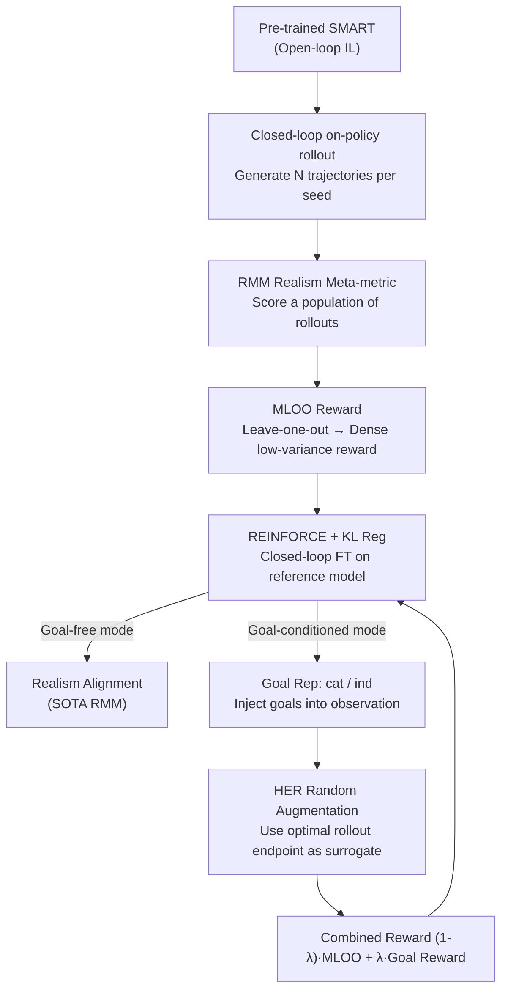

# RLFTSim: Realistic and Controllable Multi-Agent Traffic Simulation via Reinforcement Learning Fine-Tuning

**Conference**: CVPR2026  
**arXiv**: [2605.19033](https://arxiv.org/abs/2605.19033)  
**Code**: [Project Homepage](https://ehsan-ami.github.io/rlftsim)  
**Area**: Autonomous Driving / Traffic Simulation  
**Keywords**: Multi-agent traffic simulation, Reinforcement Learning Fine-Tuning, Realism Meta-metric, Goal-conditioned control, Hindsight Experience Replay  

## TL;DR
A pre-trained imitation learning traffic simulation model (SMART) is fine-tuned in a closed-loop setting using Reinforcement Learning. By utilizing Waymo's Realism Meta-metric (RMM) as the reward and transforming it into a low-variance, dense per-rollout reward via a Leave-One-Out modification (MLOO), the method achieves SOTA realism on WOMD. Furthermore, the ability to "controllably generate specific scenarios" is distilled using goal-conditioning and Hindsight Experience Replay (HER).

## Background & Motivation
**Background**: Multi-agent traffic simulation is a critical infrastructure for autonomous driving (AD) testing. Verifying the safety of an AV requires simulating scenarios equivalent to millions of kilometers. Early methods relied on rule-based simulators (IDM, constant velocity, log replay), while recent works have shifted toward learning-based models. These treat multi-agent simulation as a "next-token prediction" problem, with SMART being a representative work trained on billions of motion tokens, achieving SOTA realism on the WOMD Sim Agents Challenge.

**Limitations of Prior Work**: Most learning-based models are trained using **open-loop imitation learning**, where ground truth history is provided at each step. However, deployment involves **closed-loop** autoregressive rollouts. Open-loop training fails to capture dynamic multi-agent interactions in real driving, leading to compounding errors (distribution shift) and causal confusion during closed-loop deployment. This causes agents to drift into unobserved or unrealistic states. Even log replay of ground truth is unrealistic in closed loops due to being non-reactive.

**Key Challenge**: To combat closed-loop error accumulation, training must occur in a closed-loop; however, closed-loop RL lacks a proper reward signal. The most direct reward—the Average Displacement Error (ADE) between simulated and ground truth trajectories—is unsuitable: once an agent deviates due to stochasticity, "forcing it back" to the pre-recorded ground truth often results in unrealistic behavior (e.g., violating physics or traffic rules in a critical safety scenario). While the official RMM from WOSAC is comprehensive and insensitive to randomness, it maps a population of 32 rollouts to a single scalar—making it naturally sparse and high-variance when grouped in smaller sets, which has prevented its direct use as an RL optimization objective.

**Goal**: (1) Design a realism-aligned reward signal for closed-loop RL fine-tuning that is both dense and low-variance; (2) Distill "controllability" (directing agents to specific goal points) into the simulation model while maintaining realism.

**Key Insight**: Inspired by the idea that "RL with verifiable rewards can inject new skills into foundation models," this work proposes adapting the RMM realism metric itself into an RL reward. Since it is the standard for leaderboard evaluation, optimizing it directly aligns the model with realism. The challenge lies in transforming a population-level sparse scalar into a dense, per-rollout signal.

**Core Idea**: The **Meta-metric Leave-One-Out (MLOO)** is proposed. By using a "leave-one-out" approach, the RMM is decomposed into the relative contribution of each rollout. This yields a zero-mean, low-variance reward (where variance decays quadratically with the number of rollouts $N$) for each sample. This is then used with REINFORCE and KL regularization for closed-loop fine-tuning, supplemented by goal-conditioning and HER to distill controllability.

## Method

### Overall Architecture
RLFTSim is a **post-training framework**. It takes a traffic simulation model pre-trained via open-loop imitation learning (SMART-tiny is used as the reference) and outputs a fine-tuned model with higher realism and goal-controllability. The process is closed-loop and on-policy: for a seed scenario from the dataset, the model autoregressively generates a population of $N$ rollouts (each representing the joint trajectories of all agents over $T$ steps). These rollouts are scored via the realism metric, converted into per-rollout rewards, and the policy is updated via REINFORCE.

The framework operates in two modes: **goal-free mode** focuses solely on realism alignment using MLOO rewards; **goal-conditioned mode (GCFT)** adds controllability by requiring agents to reach specified target points. The reward for GCFT is a weighted combination of MLOO and a goal-reaching reward, with HER used to mitigate the sparsity of goal rewards. Both modes share the same REINFORCE framework, differing only in reward terms and observation inputs.

The problem is modeled as a contextual MDP $(S_t, A_t, S_{t+1}, R_{t+1}, C, G)$: State $S_t$ contains finite history for up to $N_a$ agents, action $A_t$ represents decisions over a discrete token vocabulary $\mathcal{V}$, context $C$ includes map features, and optional goals $G=\{\mathbf{x}_g^j\}$ specify coordinates for a subset of agents ($G=\emptyset$ for goal-free).

### Key Designs

**1. MLOO: Transforming sparse RMM into dense, low-variance per-rollout rewards**

This is the core innovation. The WOSAC RMM (Eq. 1) discretizes $N=32$ simulation rollouts and ground truth trajectories into $K=20$ bins across kinematic, interactive, and map-based features. It measures the fit of empirical distributions, resulting in a scalar:

$$\mathrm{RMM}=\sum_{d=1}^{D} w_d \left[\prod_{(a,t)\in V}\hat{P}_{d,a}(k^*_{d,a,t})\right]^{\frac{1}{|V|}}$$

where $\hat{P}_{d,a}(k)$ is the empirical probability of feature $d$ at bin $k$ estimated from simulation, and $k^*$ is the ground truth bin. Because it maps a group to a scalar, it is naturally sparse and cannot be fed directly to RL. MLOO circumvents the density-variance trade-off via leave-one-out. The reward for the $i$-th rollout is defined as:

$$\mathrm{RMM}_i \mathrm{^{MLOO}}=\frac{1}{N}\sum_{j=1}^{N}\mathrm{RMM}_{-j}-\mathrm{RMM}_{-i}$$

where $\mathrm{RMM}_{-i}$ is calculated using the population excluding the $i$-th rollout. This ensures every rollout receives a reward (dense), and by construction $\sum_i \mathrm{RMM}_i \mathrm{^{MLOO}}=0$. It measures the **relative contribution** of each rollout to the overall realism. Optimization uses REINFORCE with gradient $g=\sum_i \nabla_\theta \log\pi_\theta(\tau_i)\,\mathrm{RMM}_i \mathrm{^{MLOO}}$, regulated by KL divergence. The gradient estimate is proven to be **unbiased** (Proposition 1) and its variance is $O(1/(N^2 T))$, achieving **quadratic variance decay** with respect to the number of rollouts (Propositions 2-3).

**2. Goal-Conditioning: Defining and representing "where to go"**

For controllability, targets must be visible to the model. Two criteria are defined: **hard goals** (displacement within 2.0m of the coordinate) and **soft goals** (any point in the rollout within 2.0m of the target). Since goals are map-related, a **goal polyline** $P_g^i$ is introduced as the map line closest to the target coordinate.

Targets are injected via two methods: **Concatenation (cat)** appends goal coordinates to agent state vectors; **Indication (ind)** adds a binary indicator to the relative position encoding between agent and road tokens if the road belongs to the target polyline. Experiments show "ind" preserves realism better than "cat" by minimally perturbing the original state representation.

**3. HER Random Goal Augmentation: Mitigating reward sparsity**

Reaching a specific coordinate is a rare event. RLFTSim utilizes Hindsight Experience Replay: for a history $S_{<t}$, rollouts are generated via temperature sampling on top-32 trajectory tokens. The **optimal rollout** (highest RMM) is selected, and its agents' final states are used as surrogate goals $\hat{X}_g$ (Algorithm 1). During training, the original goals $\mathbf{x}_g^i$ are replaced with $\hat{\mathbf{x}}_g^i$, and policy ratios are recalculated via hindsight policy gradient. This provides intermediate, reachable targets to facilitate learning.

**4. GCFT Combined Reward: Balancing realism and controllability**

The Goal-Conditioned Fine-Tuning (GCFT) reward fuses realism and goal-reaching:

$$R_i \mathrm{^{GCFT}}=(1-\lambda)\,\mathrm{RMM}_i \mathrm{^{MLOO}}+\lambda\,R_i \mathrm{^{goal}}$$

where $R_i \mathrm{^{goal}}$ is the binary average of whether agents reached their goals, and $\lambda$ balances the trade-off.

### Loss & Training
- The base SMART-tiny is pre-trained on WOMD for 32 epochs; RLFT requires only 1 epoch of fine-tuning.
- Hyperparameters: Learning rate 3e-6, target KL 0.01 nats, $N=4$ rollouts per step (evaluated with 32), batch size 8.
- Training objective is REINFORCE policy gradient (using MLOO or GCFT reward) with KL regularization against the reference model.

## Key Experimental Results

The dataset is the Waymo Open Motion Dataset (WOMD), evaluated using the WOSAC Realism Meta-metric (RMM).

### Main Results

Private WOSAC test set (v2025 weights, ↑ is better), RLFTSim fine-tuned for 1 epoch:

| Model | RMM↑ | Kinematic↑ | Interactive↑ | Map-based↑ |
|:---|:---:|:---:|:---:|:---:|
| TrajTok | 0.7861 | 0.4887 | 0.8116 | 0.9231 |
| UniMM | 0.7839 | 0.4914 | 0.8089 | 0.9188 |
| SMART-tiny (Ref)† | 0.7824 | 0.4854 | 0.8089 | 0.9180 |
| SMART-tiny CAT-K | 0.7856 | 0.4931 | 0.8106 | 0.9205 |
| **RLFTSim (Ours)** | **0.7867** | 0.4927 | **0.8129** | 0.9210 |

Ours achieves SOTA on the primary RMM and interactive dimension, outperforming both the base model and CAT-K.

### Ablation Study

Reward function ablation (Full validation set):

| Reward | RMM↑ | Kinematic↑ | Interactive↑ | Map-based↑ | minADE↓ |
|:---|:---:|:---:|:---:|:---:|:---:|
| SMART-tiny Ref | 0.7804 | 0.4904 | 0.8032 | 0.9167 | 1.3016 |
| minADE$^{\mathrm{RLOO}}$ | 0.7801 | 0.4897 | 0.8032 | 0.9161 | 1.3202 |
| RMM$^{\mathrm{RLOO}}$ | 0.7821 | 0.4913 | 0.8065 | 0.9169 | 1.3229 |
| **RMM$^{\mathrm{MLOO}}$ (Ours)** | **0.7830** | **0.4924** | **0.8070** | **0.9182** | 1.3150 |

Goal-conditioning ablation (Representation × Criterion, Passing Miss Rate ↓ is better):

| Config | Passing Miss Rate↓ | Kinematic↑ | Interactive↑ | Map-based↑ | RMM↑ |
|:---|:---:|:---:|:---:|:---:|:---:|
| Goal-Free (RLFTSim) | 16.631 | 0.4924 | 0.8070 | 0.9182 | 0.7830 |
| **(Indication, Soft)** | **9.180** | 0.4887 | 0.8068 | 0.9175 | 0.7819 |
| (Indication, Hard) | 13.393 | 0.4916 | 0.8068 | 0.9179 | 0.7827 |

### Key Findings
- **Optimizing RMM directly is superior to imitation rewards**: Using minADE as a reward yields almost no realism gain, supporting the claim that forced imitation after divergence is non-realistic.
- **MLOO outperforms RLOO and is more stable**: Empirical variance analysis confirms MLOO variance decays by $1/N^2$, whereas RLOO variance plateaus.
- **Controllability comes at a minimal cost to realism**: GCFT variants significantly reduce miss rates; "indication + soft" provides the best balance (Miss rate 9.180 while maintaining RMM of 0.7819).

## Highlights & Insights
- **"Metric-as-Reward" Alignment**: Using the official leaderboard metric (RMM) directly as an RL reward avoids the manual design of complex rewards for traffic simulation.
- **Elegant MLOO Construction**: The leave-one-out approach provides a dense, zero-mean reward with $1/N^2$ variance decay, making it applicable to any population-based metric.
- **Controllability as an Alignment Problem**: Goal-directed generation is treated as part of the alignment process using the same REINFORCE framework, simplifying the engineering pipeline.

## Limitations & Future Work
- **Tokenization Latency**: Representing trajectories as 0.5s tokens may reduce responsiveness in highly dynamic scenarios.
- **Imperfect Controllability**: Miss rates remain around 9%; reaching hard targets remains challenging.
- **RMM as a Proxy**: Optimizing for RMM might encounter a ceiling if the metric itself does not capture all nuances of realism.
- **Base Model Dependency**: Improvements are highly dependent on the quality of the pre-trained SMART model.

## Related Work & Insights
- **vs CAT-K**: CAT-K uses offline demonstrations, but lacks explicit alignment targets; RLFTSim provides explicit realism alignment and higher SOTA performance.
- **vs RLHF**: RLFTSim uses an automated verifiable reward (RMM), avoiding the high scaling costs and time required for human preference labeling.
- **vs DPA-OMF**: While DPA-OMF is an offline method, RLFTSim is on-policy and more sample-efficient due to MLOO.

## Rating
- Novelty: ⭐⭐⭐⭐
- Experimental Thoroughness: ⭐⭐⭐⭐
- Writing Quality: ⭐⭐⭐⭐
- Value: ⭐⭐⭐⭐

<!-- RELATED:START -->

## Related Papers

- [\[ICLR 2026\] SMART-R1: Advancing Multi-agent Traffic Simulation via R1-Style Reinforcement Fine-Tuning](../../ICLR2026/autonomous_driving/advancing_multi-agent_traffic_simulation_via_r1-style_reinforcement_fine-tuning.md)
- [\[AAAI 2026\] WorldRFT: Latent World Model Planning with Reinforcement Fine-Tuning for Autonomous Driving](../../AAAI2026/autonomous_driving/worldrft_latent_world_model_planning_with_reinforcement_fine-tuning_for_autonomo.md)
- [\[CVPR 2026\] Beyond Rule-Based Agents: Active Markov Games for Realistic Multi-Agent Interaction in Autonomous Driving](beyond_rule-based_agents_active_markov_games_for_realistic_multi-agent_interacti.md)
- [\[ECCV 2024\] Improving Agent Behaviors with RL Fine-tuning for Autonomous Driving](../../ECCV2024/autonomous_driving/improving_agent_behaviors_with_rl_fine-tuning_for_autonomous_driving.md)
- [\[CVPR 2026\] Unsupervised Multi-agent and Single-agent Perception from Cooperative Views](unsupervised_multi-agent_and_single-agent_perception_from_cooperative_views.md)

<!-- RELATED:END -->
