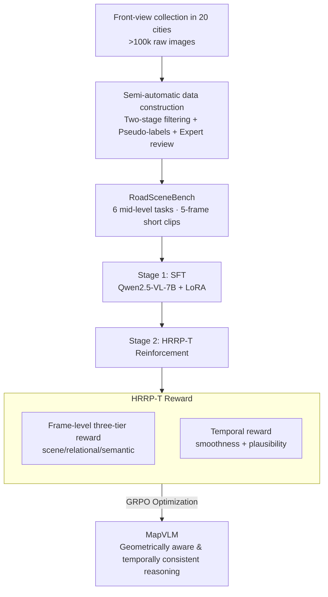

# RoadSceneBench: A Lightweight Benchmark for Mid-Level Road Scene Understanding

**Conference**: CVPR 2026  
**Paper**: [CVF Open Access](https://openaccess.thecvf.com/content/CVPR2026/html/Liu_RoadSceneBench_A_Lightweight_Benchmark_for_Mid-Level_Road_Scene_Understanding_CVPR_2026_paper.html)  
**Code**: https://github.com/XiyanLiu/RoadSceneBench  
**Area**: Autonomous Driving / Multimodal VLM  
**Keywords**: Road Scene Understanding, Mid-Level Semantics, VLM, Temporal Consistency, Reinforcement Learning Reward

## TL;DR
Addressing the long-neglected **mid-level road semantics** in autonomous driving (e.g., lane count, ego-lane index, lane-change feasibility, ramps, congestion) wedged between "pixel-level perception" and "high-level planning," this paper introduces a lightweight yet densely annotated benchmark, **RoadSceneBench** (11,705 images / 2,341 5-frame short video clips / 160k annotations). Furthermore, the authors propose **MapVLM**: first Supervised Fine-Tuning (SFT) on Qwen2.5-VL-7B, followed by reinforcement learning with Group Relative Policy Optimization (GRPO) using a Hierarchical Relational Reward with Temporal Consistency (**HRRP-T**) (frame-level three-tier reward + temporal smoothness/plausibility reward). This elevates the overall Precision/Recall from 60.6/52.7% of the strongest baseline Gemini-2.5-Pro to 75.8/72.2%.

## Background & Motivation
**Background**: The mainstream of autonomous driving perception and High-Definition (HD) map construction revolves around **low-level perception** tasks such as detection, segmentation, and 3D reconstruction. Large-scale datasets like Cityscapes, BDD100K, and nuScenes provide dense pixel- or box-level annotations to answer "what is where." Recently, benchmarks like NuScenes-QA, DriveLM, and VLADBench have introduced VLMs to tackle high-level language tasks such as VQA, instruction following, and traffic scene reasoning.

**Limitations of Prior Work**: Low-level perception datasets focus only on local, low-level "what is where" and rarely encode "mid-level semantics"—such as the feasibility of lane changes, whether a ramp entrance/exit is ahead, or current congestion status—which are precisely the links between perception and planning. Meanwhile, annotations in high-level VLM benchmarks are often **sparse and loosely coupled**, seldom defining mid-level attributes with **explicit logical dependencies** (like lane count and ego-lane index) on **each frame**. Consequently, they fail to evaluate whether models maintain a self-consistent, geometrically aware representation of the local road topology.

**Key Challenge**: Although HD map reconstruction methods can accurately recover lane lines and connectivity, they require **multi-sensor fusion, expensive computation, and heavy labeling**. Many industrial scenarios (e.g., map freshness monitoring and change detection) only require **lightweight, camera-only** semantic judgments (e.g., whether the lane count changed or a new exit ramp was added). A mismatch exists between "heavy perception" and "lightweight semantic judgment," as existing benchmarks do not serve the latter.

**Goal**: (1) To construct a compact, interpretable, and reasoning-oriented mid-level semantic benchmark; (2) To ensure VLMs not only answer accurately on each frame but also perform with intra-frame logical self-consistency and cross-frame temporal coherence.

**Key Insight**: To design mid-level tasks as **interdependent** rather than isolated. For instance, the lane count constrains the ego-lane index (one cannot be in the 4th lane if there are only 3 lanes), ramp cues affect connectivity reasoning, and congestion is often correlated with geometrically complex areas like ramps. This structural dependency aligns precisely with the mid-level representations in industrial HD mapping pipelines, allowing "structural consistency" to serve as an auxiliary constraint beyond standard supervision.

**Core Idea**: To formulate the VLM's reasoning process as a **structured decision sequence** and use a hierarchical, temporal reinforcement learning reward (HRRP-T) to incentivize predictions with "intra-frame topological validity + cross-frame plausible evolution." This transforms static recognizers into geometrically aware, temporally consistent reasoning agents without requiring additional manual labeling.

## Method

### Overall Architecture
There are two main threads in this work: the construction of the **RoadSceneBench** dataset, followed by the **MapVLM** training paradigm. On the data side, over 100k front-view images were collected by a vehicle fleet across 20 Chinese cities. Through a two-stage filtering process ("automated low-quality model filtering + manual review by 20 annotators"), 2,341 video clips of 5 consecutive frames each were obtained. A semi-automatic labeling protocol combining "pseudo-labels + expert correction" was then applied to generate Q&A annotations across 6 types of tasks, enforcing logical consistency among tasks and temporal coherence across frames. On the model side, based on Qwen2.5-VL-7B, the first stage employs LoRA SFT to establish baseline mid-level semantic answering capabilities (directly outputting a structured description of lane count, ego-lane index, ramps, lane-change feasibility, congestion, and scene type). The second stage uses **HRRP-T** enrichment, which decomposes each frame into scene/relational/semantic layers to calculate **frame-level rewards**, alongside **temporal rewards** (smoothness + plausibility) computed over 5-frame short windows. These two reward streams are combined and optimized via GRPO.

### Key Designs

**1. Three-Tier Hierarchical Task Taxonomy: Decomposing "mid-level road semantics" into 6 interdependent reasoning tasks**

The core of a benchmark is not simply scaling data but formalizing "mid-level semantics" into a set of **structurally constrained** tasks organized across three levels: **scene-level** (low-level spatial topology: Lane Count, Ego-lane Index), **relational-level** (mid-level relationships: Ramp Entrance/Exit Recognition, Lane-change Feasibility), and **semantic-level** (high-level context: road type like urban/suburban/highway, traffic status like free-flow/moderate/congestion). Crucially, these tasks are **not independent classification problems**: the lane count constrains the valid range of the ego-lane index, ramps affect connectivity, and geometrically complex areas are more prone to congestion. This explicit logical dependency enables the benchmark to directly assess whether "a model maintains a self-consistent local topological representation" rather than answering each task in isolation. This serves as the prerequisite for the reinforcement learning rewards. Empirical results show that the Ego-lane Index and Lane-change Feasibility are the two most challenging tasks (most VLMs show very low P/R on these), yet they are the closest to actual driving decisions.

**2. Semi-Automatic Data Construction: Pseudo-labeling with expert-forced logical and temporal consistency**

To balance annotation cost and quality, the authors generate initial pseudo-labels using classification/segmentation models from prior work, followed by human expert review and correction. Annotators were explicitly instructed to **enforce logical consistency across tasks** (e.g., if the ego-vehicle is in the leftmost lane, "left lane change" is strictly disallowed) and **temporal coherence across frame sequences**. The dataset specifications choose 5-frame short clips at 1 FPS rather than single images, using raw images of high 4096×2160 resolution, yielding a total of 11,705 images from 2,341 clips with over 160k annotations. Designing short clips is intentional: it preserves temporal continuity (providing grounds for HRRP-T's temporal reward) while keeping the annotation workload manageable, embodying the "lightweight yet information-rich" nature of the benchmark.

**3. Frame-Level Hierarchical Reward: Scoring separately across scene, relational, and semantic tiers**

What the SFT-trained model lacks is **intra-frame cross-task consistency**. HRRP-T yields a hierarchical reward vector for each frame, which is the weighted sum of comparing each of the three tiers against the frame-level ground truth:

$$\mathcal{R}_{frame}^{t}=\alpha \mathcal{R}_{sce}^{t}+\beta \mathcal{R}_{rel}^{t}+\gamma \mathcal{R}_{sem}^{t}$$

where $t$ denotes the $t$-th frame within the clip, $\mathcal{R}_{sce}$ evaluates low-level topology (Lane Count, Ego-lane Index), $\mathcal{R}_{rel}$ evaluates relational reasoning (ramp recognition, lane-change feasibility based on solid lines or dynamic obstacles), and $\mathcal{R}_{sem}$ evaluates high-level semantics (scene type, congestion). The advantage of hierarchical scoring over a single global score is that different tiers derive their accuracy from disparate sources (geometry vs. semantics). Disentangling the rewards allows reinforcement learning signals to target and correct errors in each specific tier, preventing lower-level topological mistakes from being "averaged out" by correct higher-level semantic outputs.

**4. Temporal Hierarchical Reward: Smoothness + plausibility, embedding a lightweight finite state machine constraint**

Real-world roads are non-stationary (e.g., ego-motion, merging/splitting lanes, sudden occlusions), meaning temporal rewards **do not mandate strict frame-by-frame continuity** but rather evaluate whether the evolution over a short window is "plausible." It is split into two terms, weighted by $\lambda$:

$$\mathcal{R}_{temp}=\lambda \mathcal{R}_{smooth}+(1-\lambda)\mathcal{R}_{plaus}$$

**Smoothness** $\mathcal{R}_{smooth}=1-\frac{1}{T-1}\sum_{t=1}^{T-1}|y_t-y_{t-1}|$ penalizes abrupt changes or oscillations between adjacent frames, primarily regularizing ordered discrete variables like lane count—granting high scores to gradual transitions like 3 $\rightarrow$ 2 $\rightarrow$ 2 while penalizing erratic jumps like 3 $\rightarrow$ 1 $\rightarrow$ 3. However, smoothness alone does not guarantee semantic validity, so **plausibility** $\mathcal{R}_{plaus}=\frac{1}{T-1}\sum_{t=1}^{T-1}\mathbb{I}\big(V(y_t,y_{t+1})\big)$ uses a logical transition function $V(\cdot)$ to check if each transition conforms to domain priors. For instance, transitioning lane-change feasibility from "feasible" to "infeasible" (due to solid lines) is valid, whereas rapidly toggling back and forth between the two states is suppressed. $V$ acts as a **lightweight finite state machine (FSM)** constraint embedded within the temporal sequence, ensuring predictions are both temporally smooth and physically/semantically self-consistent. Finally, the frame-level and temporal rewards are merged and optimized via GRPO:

$$\mathcal{R}_{\text{HRRP-T}}=\lambda_{frame}\frac{1}{T}\sum_{t=1}^{T}\mathcal{R}_{frame}^{t}+\lambda_{temp}\mathcal{R}_{temp}$$

> ⚠️ Note: Equations (1)-(5) had fragmented LaTeX representations in the CVF-cached OCR text; they are reconstructed here according to the paper's semantic structure, with notations following the original manuscript.

### Loss & Training
A two-stage process is adopted. In the first stage, Qwen2.5-VL-7B with LoRA is utilized for supervised fine-tuning to establish baseline alignment for mid-level semantics. In the second stage, after freezing or reusing SFT weights, self-critical reinforcement learning is performed using HRRP-T, with the reward signal defined of $\mathcal{R}_{\text{HRRP-T}}$ above, optimized via GRPO without requiring additional manual labeling. Training is completed using the ms-swift framework on an A800 cluster; deterministic decoding (temperature=0.0, top_p=1.0) is employed for evaluation.

## Key Experimental Results

### Main Results
The evaluation covers 3 closed-source VLMs (GPT-4o, Gemini-2.5-Pro, Claude-3.7-Sonnet) and 12 open-source VLMs from 5 major model families (ERNIE, DeepSeek, LLaVA, InternVL, Qwen families). The evaluation metrics are Precision (P) and Recall (R), with closed-source models evaluated zero-shot via official APIs. The overall main results are detailed below (%):

| Model | Lane Count P/R | Ego-lane Index P/R | Lane-change P/R | Overall P | Overall R |
|------|------|------|------|------|------|
| GPT-4o | 51.0/32.4 | 23.6/24.5 | 42.2/35.6 | 51.8 | 42.1 |
| Gemini-2.5-Pro (Strongest Baseline) | 52.8/43.1 | 72.7/46.5 | 59.3/53.0 | 60.6 | 52.7 |
| Claude-3.7-Sonnet | 28.6/28.3 | 27.5/25.2 | 41.1/44.9 | 47.3 | 41.4 |
| InternVL3-78B | 53.4/36.8 | 29.0/25.4 | 50.9/47.7 | 55.5 | 45.3 |
| Qwen3-VL-8B | 55.0/34.9 | 29.8/31.5 | 47.2/40.9 | 57.3 | 43.8 |
| **MapVLM (SFT)** | 66.0/61.6 | 69.3/50.4 | 87.6/88.3 | 72.1 | 67.3 |
| **MapVLM (SFT+HRRP-T)** | 63.4/65.9 | 75.4/84.7 | 83.8/84.7 | **75.8** | **72.2** |

MapVLM achieves the highest P/R across almost all 6 tasks. Its overall score exceeds the strongest baseline, Gemini-2.5-Pro (60.6/52.7%), by approximately 15 percentage points, showing the most prominent advantages on the hardest Ego-lane Index and Lane-change Feasibility tasks.

### Ablation Study
The ablation study focuses on comparing SFT against SFT+HRRP-T (measuring the incremental benefit of the HRRP-T reinforcement learning stage):

| Configuration | Overall P/R | Ego-lane Index P/R | Description |
|------|------|------|------|
| MapVLM (SFT) | 72.1 / 67.3 | 69.3 / 50.4 | SFT only, lacking intra-frame/temporal consistency |
| MapVLM (SFT+HRRP-T) | 75.8 / 72.2 | 75.4 / 84.7 | Incorporating HRRP-T yields overall +3.7/+4.9 gains |

### Key Findings
- **HRRP-T gains are concentrated in tasks "rescued" by temporal context**: Recall for the Ego-lane Index soared from 50.4% to 84.7% (+34.3 points), whereas Lane Count Precision showed minor fluctuations or even a slight decline. This indicates that temporal consistency rewards primarily assist in "stabilizing ego-lane predictions using multi-frame evidence under single-frame occlusion or ambiguity," rather than simply boosting single-frame pixel-level accuracy.
- **Most critical tasks are precisely pinpointed**: Ego-lane Index and Lane-change Feasibility constitute mutual weak spots for all models (for instance, Qwen2.5-VL-3B achieves 71.8% Overall Precision on Road Scene but only 9.7% on Ego-lane Index). These two tasks are highly relevant to actual driving decisions, highlighting the targeted utility of the proposed benchmark.
- **Closed-source models generally outperform open-source models, but open-source models show clear P/R trade-offs**: Qwen3-VL-8B achieves the highest open-source Precision (57.3%), while InternVL3-78B records the highest open-source Recall (45.3%).
- Qualitative analysis (Fig. 5) on a 5-frame urban congested scenario shows that the first two frames clearly display 5 lanes, while the remaining three frames are heavily occluded. SFT predictions drift with visual changes, causing lane counts and ego-lane indices to oscillate rapidly. In contrast, SFT+HRRP-T leverage temporal cues and "no lane-change" priors to maintain a stable 5-lane topological representation.

## Highlights & Insights
- **Directly repurposing structural dependencies of the benchmark into RL rewards**: The logical dependencies among tasks (such as lane count constraining the ego-lane, and lane-changing behavior constrained by solid lines) are both core design principles of the dataset and directly encoded into the training signals via the $V(\cdot)$ plausibility function and hierarchical rewards. This unified structural perspective between the data and methodology is highly self-consistent.
- **Cleverly decoupled smoothness and plausibility terms**: Merely optimizing for smoothness would stifle valid state transitions (such as actual lane changes). Augmenting this with an FSM-style plausibility term effectively separates "gradual changes from erratic jumps" and "valid transitions from invalid oscillations," providing a highly reusable trick for handling temporal consistency in discrete ordered variables.
- **Industrially valuable positioning of "lightweight, camera-only, mid-level semantics"**: For industrial use cases like map freshness monitoring/change detection, full HD map reconstruction is unnecessary. Simply identifying changes in lane counts or new ramps suffices, which is precisely the niche this benchmark addresses.
- **High transferability**: The paradigm of hierarchical rewards combined with short-window temporal consistency can easily be adapted to any video understanding task involving frame-by-frame structured predictions that require temporal coherence (e.g., surgical phase recognition, sports state estimation).

## Limitations & Future Work
- **Geographic limitation**: Due to data policies, collection was restricted to 20 Chinese cities; generalization to road markings and traffic regulations in other countries remains unverified.
- **Short temporal window** (5 frames at 1 FPS): The transition plausibility priors in $V(\cdot)$ rely on manual or empirical statistical formulations, raising questions about rule coverage and scalability. The paper also omits sensitivity analyses for multiple hyperparameters such as $\alpha,\beta,\gamma,\lambda,\lambda_{frame},\lambda_{temp}$.
- **Relatively thin ablation study**: The evaluation only provides an SFT vs. SFT+HRRP-T comparison, omitting individual ablations of the frame-level three-tier rewards, smoothness term, and plausibility term, leaving it unclear which component of HRRP-T contributes the most.
- **OCR equation reliability**: The LaTeX rendering of the equations in CVF-cached text is fragmented; replication should refer strictly to the original PDF.
- **Future extensions**: The authors plan to expand to broader geographical regions, incorporate dynamic events like construction zones, accidents, and temporary roadblocks, and introduce object grounding and interaction-level reasoning.

## Related Work & Insights
- **vs. Cityscapes / BDD100K / nuScenes (Low-level perception)**: These focus on dense pixel- or 3D-level annotations to answer "what is where." In contrast, this work addresses mid-level relational semantics to determine "feasibility of lane changes" or "presence of ramps," thereby providing a complementary focus with significantly lighter annotation overhead.
- **vs. NuScenes-QA / DriveLM / VLADBench (High-level VLM reasoning)**: These benchmarks feature sparse, loosely coupled annotations and rarely define mid-level attributes with logical dependencies on a frame-by-frame basis. This work defines 6 structurally constrained tasks per frame, validating "local topological self-consistency."
- **vs. Vectorized HD mapping methods**: HD map reconstruction offers precision but demands multi-sensor setups, heavy computation, and astronomical annotation costs. This work targets a lightweight, camera-only semantic evaluation paradigm tailored for "good-enough" industrial scenarios like map change detection.
- **vs. Conventional RLHF / self-critical sequence training**: Standard RL focuses on optimizing global behaviors or open-ended human preferences. This work decomposes rewards into fine-grained structural constraints (intra-frame topological validity + inter-frame plausible transition), bridging structural semantics directly with multimodal reasoning processes.

## Rating
- Novelty: ⭐⭐⭐⭐ The neglected niche of mid-level road scene semantics is accurately identified. The design of the hierarchical and temporally consistent reward aligns seamlessly with the structural nature of the benchmark.
- Experimental Thoroughness: ⭐⭐⭐ Horizontal coverage across 15 VLMs is extensive, but the internal ablation study is basic, lacking sub-component breakdowns and hyperparameter sensitivity analyses.
- Writing Quality: ⭐⭐⭐⭐ The logical progression (motivation $\rightarrow$ task definition $\rightarrow$ methodology) is robust. The equations are slightly broken due to OCR, but the original manuscript is presumed to be coherent.
- Value: ⭐⭐⭐⭐ Provides a lightweight, reproducible, industry-aligned evaluation suite for mid-level semantics and a cohesive reinforcement learning paradigm for temporal consistency.

<!-- RELATED:START -->

## Related Papers

- [\[CVPR 2026\] GaussianDWM: 3D Gaussian Driving World Model for Unified Scene Understanding and Multi-Modal Generation](gaussiandwm_3d_gaussian_driving_world_model_for_unified_scene_understanding_and_.md)
- [\[CVPR 2026\] OccuFly: A 3D Vision Benchmark for Semantic Scene Completion from the Aerial Perspective](occufly_a_3d_vision_benchmark_for_semantic_scene_completion_from_the_aerial_pers.md)
- [\[CVPR 2026\] URScenes: A Multi-scenario Dataset for Unstructured Road Environments](urscenes_a_multi-scenario_dataset_for_unstructured_road_environments.md)
- [\[CVPR 2026\] CARD: A Multi-Modal Automotive Dataset for Dense 3D Reconstruction in Challenging Road Topography](card_a_multi-modal_automotive_dataset_for_dense_3d_reconstruction_in_challenging.md)
- [\[ICCV 2025\] MCAM: Multimodal Causal Analysis Model for Ego-Vehicle-Level Driving Video Understanding](../../ICCV2025/autonomous_driving/mcam_multimodal_causal_analysis_model_for_ego-vehicle-level_driving_video_unders.md)

<!-- RELATED:END -->
