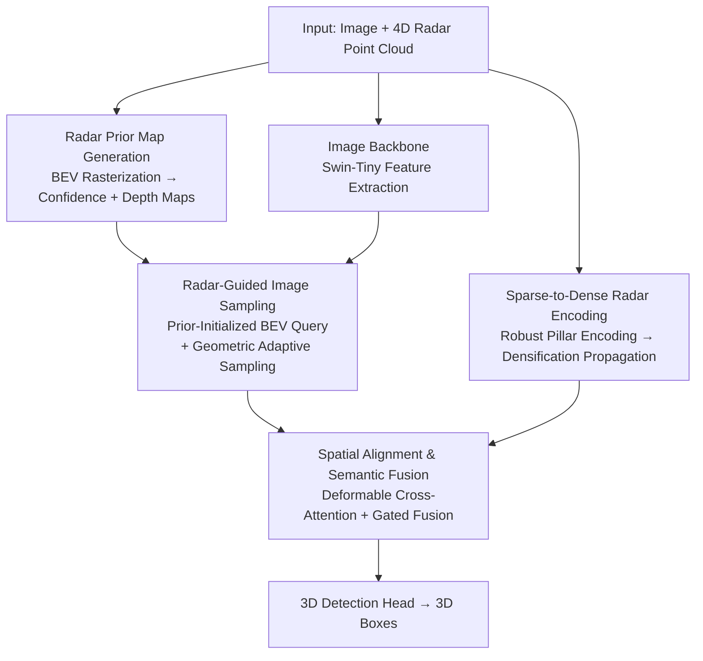

# RPGFusion: 4D Radar Prior-Guided Multi-Modal Fusion for 3D Detection

**Conference**: CVPR 2026  
**Paper**: [CVF Open Access](https://openaccess.thecvf.com/content/CVPR2026/html/Qiu_RPGFusion_4D_Radar_Prior-Guided_Multi-Modal_Fusion_for_3D_Detection_CVPR_2026_paper.html)  
**Code**: None (Code not public)  
**Area**: Autonomous Driving / 3D Detection / Multi-Modal Fusion  
**Keywords**: 4D mmWave Radar, Radar-Camera Fusion, BEV Perception, 3D Object Detection, Sparse-to-Dense

## TL;DR
RPGFusion injects physical priors from 4D radar (confidence and depth maps) into the image-to-BEV transformation process. Simultaneously, it performs robust encoding and densification of sparse, noisy radar point clouds, followed by spatial alignment and semantic fusion to obtain a consistent Bird's Eye View (BEV) representation. This approach achieves SOTA results for radar-camera 3D detection on VoD (69.31% mAP in Entire Annotated Area) and TJ4DRadSet.

## Background & Motivation
**Background**: 3D detection in autonomous driving increasingly favors multi-sensor fusion in the Bird's Eye View (BEV) space, as BEV unifies different sensors into a geometrically consistent coordinate system where object scales are normalized and cross-modal alignment is natural. Lifting images to BEV primarily follows two paths: Lift-Splat-Shoot (LSS, explicit lifting via forward projection) and BEV Query (implicit aggregation via backward projection with learnable queries). Compared to traditional 3D radar, 4D mmWave radar adds an elevation dimension and provides range, azimuth, elevation, Doppler velocity, and strong penetration capabilities, remaining stable under adverse weather conditions—making it an ideal modality to complement cameras.

**Limitations of Prior Work**: Both BEV lifting paths have inherent flaws. LSS lacks depth refinement, and BEV features become increasingly sparse with distance. While BEV Query provides more accurate geometric reasoning, multiple queries on the same viewing ray tend to sample highly similar image features, leading to **spatial ambiguity**—the inability to distinguish depth. Directly adding or concatenating radar and image BEV features is also problematic: radar point clouds are sparse, irregularly distributed, and noisy. The resulting radar BEV features have broken spatial relationships, and forced fusion with dense, structured image features introduces misalignment and dilutes useful signals.

**Key Challenge**: Despite 4D radar carrying rich physical priors (RCS intensity implying category, Doppler velocity providing motion context, and height measurements aiding BEV-to-image alignment), these priors were difficult to utilize in the 2.5D/3D radar era due to weak spatial coherence and high noise. While 4D radar makes these priors more reliable, they have not been fully exploited to guide the construction of image BEV representations.

**Goal**: To effectively utilize 4D radar physical priors by decomposing the task into three parts: ① Using radar priors to guide image-to-BEV sampling to alleviate viewing ray ambiguity and perspective sparsity; ② Performing robust denoising and sparse-to-dense feature propagation on the radar point clouds; ③ Achieving complementary semantic fusion of aligned radar and image BEV features.

**Key Insight**: The spatial distribution and RCS intensity of radar points can be discretized into two dense BEV prior maps—a confidence map (indicating where objects exist) and a depth map (indicating distance). These maps can serve directly as "geometric anchors" for image sampling.

**Core Idea**: Use radar-derived confidence/depth prior maps to anchor and modulate the initialization and sampling of image BEV queries. Meanwhile, a "robust encoding → densification" two-step process is applied to the radar branch. Finally, deformable cross-attention is used for spatial alignment and semantic fusion to produce consistent and complementary BEV representations end-to-end.

## Method

### Overall Architecture
RPGFusion takes a single-frame image and 4D radar point clouds as input and outputs 3D detection boxes. The pipeline uses a dual-branch progressive encoding-fusion approach: the image branch extracts features via a backbone and is then guided by radar-derived prior maps during sampling into BEV. The radar branch encodes raw point clouds into pillar features, densifies them, and flattens them into radar BEV features. Both BEV features are then spatially aligned and semantically fused before being sent to the detection head. Crucially, radar acts not just as a fusion branch but as a "conductor," providing prior maps that guide the entire initialization and sampling process of the image BEV.

### Key Designs

**1. Radar Prior Maps: Converting Point Clouds into Samplable Confidence and Depth Maps**

To address the limitations of LSS (sparsity at distance) and BEV Query (viewing ray ambiguity), the authors avoid Gaussian diffusion in the image plane (where projection and calibration errors distort geometry) and instead rasterize the radar points directly in BEV space into two dense prior maps. For each BEV grid cell $g$, the radial distance $D_i=\sqrt{x_i^2+y_i^2}$ and normalized reflection weight $w_i=\text{Norm}(\text{RCS}_i)$ of each radar point are calculated. Each point contributes to surrounding grids via a Gaussian kernel centered at $(x_i, y_i)$, forming a confidence map $M_{\text{conf}}[g]=\sum_i w_i\exp(-d_{g,i}^2/2\sigma_1^2)$ and a depth map $M_{\text{depth}}[g]=\frac{\sum_i w_i D_i\exp(-d_{g,i}^2/2\sigma_2^2)}{\sum_i w_i\exp(-d_{g,i}^2/2\sigma_2^2)}$. The confidence map encodes geometric distribution, while the depth map encodes distance. These maps retain the true spatial structure of the radar, providing explicit physical guidance for image sampling.

**2. Radar-Guided Image Sampling: Anchoring Query Initialization and Sampling**

This is the core of eliminating viewing ray ambiguity. The initialization of image BEV queries fuses three types of information: a learnable semantic base embedding $E_{\text{base}}$, a geometric position embedding $E_{\text{pos}}$ (sine-cosine encoding via MLP), and a radar prior embedding $E_{\text{prior}}$. The prior embedding uses a cross-modulation scheme where depth and confidence maps condition each other: $A=\sigma(\text{Conv}_{1\times1}(M_{\text{depth}}))$, $B=\sigma(\text{Conv}_{1\times1}(M_{\text{conf}}))$, and $E_{\text{prior}}=\text{Conv}_{3\times3}(\text{Concat}(M_{\text{conf}}\odot A,\ M_{\text{depth}}\odot B)+\text{Conv}_{1\times1}(M_{\text{conf}}+M_{\text{depth}}))$. This allows depth cues to suppress false reflections and confidence cues to reinforce reliable regions. The initial query is $Q^{(0)}=E_{\text{prior}}+E_{\text{pos}}+E_{\text{base}}$. During sampling, each BEV grid is projected back to the image plane using the height $z=h_g$ provided by the 4D radar (leveraging the elevation dimension for accurate vertical localization), supplemented by learnable offsets $\Delta^{\text{learned}}_{g,m}$ for multiple sampling points. During aggregation, attention weights are amplified by radar priors: $\hat Q_j=\sum_{m\in S_j}\alpha_{j,m}(1+\lambda M_{\text{conf}}[g_j]+M_{\text{depth}}[g_j])V_{j,m}$, where $\lambda$ is a learnable scalar.

**3. Sparse-to-Dense Radar Encoding: Robust Denoising and Propagation to Empty Grids**

To address broken radar BEV features caused by sparsity, a two-step process is used. **Robust Encoding**: Points are discretized into BEV pillars. Non-empty cells use mean/median statistics $t_g=[x^{\text{mean}}_g,y^{\text{mean}}_g,z^{\text{median}}_g,u^{\text{median}}_g,\text{RCS}^{\text{mean}}_g,n_g]$. Neighborhood-weighted RCS confidence $c_i=\frac{\sum_{j\in N_i}\text{RCS}_j}{\sum_{k\in P}\text{RCS}_k+\epsilon}$ is introduced; spatially isolated points or those with anomalous RCS distributions receive low confidence ($c_i\approx0$), while consistent reflections receive high weights. Pillar features are weighted as $\hat t_g=\text{MLP}(t_g)\odot(\frac{1}{|P_g|}\sum_{i\in P_g}c_i)$. **Densification**: Since many BEV grids lack measurements, empty grids aggregate features from neighbors based on spatial proximity and feature similarity: $\hat M_{\text{dense}}[g]=\sum_{i\in N_g}\alpha_{i,g}t_i$, where $\alpha_{i,g}\propto\exp(c_i\cdot\exp(-d_{j,i}^2/2\sigma^2)\cdot\text{sim}(t_g,t_i))$. This is then fused with raw pillar features via residual convolution.

**4. Spatial Alignment and Semantic Fusion: DCMA and Gated Fusion**

Both image and radar BEV features are standardized using LayerNorm, $3\times3$ convolution, BN, and ReLU. **Spatial Alignment**: Deformable Cross-Modal Attention (DCMA) is performed within a local geometric neighborhood using learnable offsets $\Delta p_{hmjk}$ to achieve precise alignment, yielding $B^{\text{align}}_I, B^{\text{align}}_R$. **Semantic Fusion**: DCMA with fixed sampling locations allows modalities to exchange semantic cues, where the opposing modality acts as key/value. Finally, **Unified Fusion** uses a gated map $G=\sigma(\text{Conv}_{1\times1}([B^{\text{align}}_I\|B^{\text{align}}_R]))$ to modulate the features grid-wise: $B_{\text{mix}}=G\odot B^{\text{align}}_I+(1-G)\odot B^{\text{align}}_R$. This allows the model to adaptively decide whether to trust image details or radar geometry at each BEV grid.

## Key Experimental Results

### Main Results
Evaluated on the View-of-Delft (VoD) validation set and TJ4DRadSet test set. VoD reports mAP for the Entire Annotated Area (EAA) and the Driving Corridor Area (DCA), with IoU thresholds of 0.5 for Car/Truck and 0.25 for Pedestrian/Cyclist.

| Dataset | Area/Metric | RPGFusion (Ours) | Prev. SOTA (CVFusion) | Gain |
| :--- | :--- | :--- | :--- | :--- |
| VoD val | EAA mAP | **69.31%** | 65.41% | +3.90% |
| VoD val | DCA mAP | **86.20%** | 82.42% | +3.78% |
| TJ4DRadSet | 3D mAP | **43.05%** | 40.00% | +3.05% |
| TJ4DRadSet | BEV mAP | **46.86%** | 44.07% | +2.79% |

Looking at VoD EAA categories: Car 67.37% (vs. CVFusion 60.87%), Pedestrian 59.94%, Cyclist 80.62%. RPGFusion consistently outperforms competitors across different 2D backbones (ResNet-101 RPGFusion EAA 67.24% vs. HGSFusion 58.96%).

### Ablation Study
Four sets of ablations decompose the contributions of prior maps, encoding/densification, and fusion strategies (values in VoD EAA mAP).

| Configuration | VoD-EAA mAP | Description |
| :--- | :--- | :--- |
| Full model | 69.31% | Complete model |
| Query Init w/o Conf Map | 64.72% (↓4.59) | Missing confidence prior in query init |
| Query Init w/o Both Maps | 58.29% (↓11.02) | Prior maps are crucial for query init |
| Image Sampling w/o Both Maps | 52.47% (↓16.84) | Prior is even more critical for sampling |
| w/o Robust Enc + Densification | 54.10% | No radar branch enhancement |
| Densification Only | 66.68% | Primary contributor |
| Robust Encoding Only | 59.34% | Secondary contributor |

### Key Findings
- **Prior maps are more critical for image sampling than query initialization**: Removing prior maps from the sampling module caused a 16.84% drop in mAP, compared to 11.02% for initialization, proving radar's primary value is in anchoring sampling locations and resolving viewing ray ambiguity.
- **Densification is the main driver for the radar branch**: Adding only densification reached 66.68% mAP, whereas robust encoding alone only reached 59.34%.
- **Semantic fusion is directionally sensitive**: Disabling bidirectional semantic fusion dropped EAA mAP by 16.52%. Disabling "camera updating from radar" alone caused an 11.73% drop, indicating the image branch's heavy reliance on radar for spatial disambiguation.

## Highlights & Insights
- **Elevating Radar from "Fused Input" to "Guide"**: Prior maps do not participate in final prediction but anchor image query initialization and sampling. This lightweight injection of priors significantly reduces ambiguity without a heavy radar backbone.
- **Prior Map Generation in BEV Space**: Generating priors in BEV space instead of the image plane avoids geometric distortion from projection errors, a useful trick for any task using sparse geometric priors.
- **Gated Unified Fusion**: The sigmoid gate $G$ allows the model to handle spatial heterogeneity, trusting image details nearby and radar geometry at longer ranges.
- **Neighborhood-Weighted RCS Confidence**: A clever denoising signal that uses spatial consistency of reflection intensity to distinguish true objects from multi-path noise with zero extra parameters.

## Limitations & Future Work
- Code is not public; replication requires implementing DCMA and prior map generation. ⚠️
- Validated only on relatively small 4D radar datasets (VoD and TJ4DRadSet). Lacks evaluation on large-scale datasets or specific night/rain/fog subsets. ⚠️
- Results are reported on the VoD validation set as the test server was closed; caution is needed when comparing with test-set results of other methods.
- The method is single-frame and does not utilize Doppler velocity for temporal aggregation, which could further improve dynamic object detection.
- Prior map hyperparameters (e.g., $\sigma=1.6$m, $r=2.0$m) might be sensitive to different radar densities.

## Related Work & Insights
- **vs. CVFusion / RaGS**: While they also fuse in BEV, RPGFusion injects radar priors explicitly into the image BEV "construction" phase (query init + sampling) rather than just at the fusion stage, leading to a 3.90% mAP lead on VoD EAA.
- **vs. LSS / BEV Query**: RPGFusion mitigates both LSS sparsity and BEV Query viewing ray ambiguity by providing missing spatial separation signals.
- **vs. SMURF**: Where SMURF uses KDE and multi-representation fusion for sparsity, RPGFusion combines robust encoding with feature-similarity-guided densification.

## Rating
- Novelty: ⭐⭐⭐⭐ Combination of radar-guided sampling and sparse-to-dense encoding is innovative, though individual modules build on existing work.
- Experimental Thoroughness: ⭐⭐⭐⭐ Detailed ablations, though lacks large-scale or extreme weather benchmarks.
- Writing Quality: ⭐⭐⭐⭐ Clear motivation, complete formulas, and effective diagrams.
- Value: ⭐⭐⭐⭐ Practical approach to 4D radar-camera perception for autonomous driving.

<!-- RELATED:START -->

## Related Papers

- [\[CVPR 2026\] R4Det: 4D Radar-Camera Fusion for High-Performance 3D Object Detection](r4det_4d_radar-camera_fusion_for_high-performance_3d_object_detection.md)
- [\[CVPR 2026\] Look Before You Fuse: 2D-Guided Cross-Modal Alignment for Robust 3D Detection](look_before_you_fuse_2d-guided_cross-modal_alignment_for_robust_3d_detection.md)
- [\[CVPR 2025\] RaCFormer: Towards High-Quality 3D Object Detection via Query-based Radar-Camera Fusion](../../CVPR2025/autonomous_driving/racformer_towards_high-quality_3d_object_detection_via_query-based_radar-camera_.md)
- [\[CVPR 2026\] CCF: Complementary Collaborative Fusion for Domain Generalized Multi-Modal 3D Object Detection](ccf_complementary_collaborative_fusion_for_domain_generalized_multi-modal_3d_obj.md)
- [\[CVPR 2026\] DSERT-RoLL: Robust Multi-Modal Perception for Diverse Driving Conditions with Stereo Event-RGB-Thermal Cameras, 4D Radar, and Dual-LiDAR](dsert-roll_robust_multi-modal_perception_for_diverse_driving_conditions_with_ste.md)

<!-- RELATED:END -->
