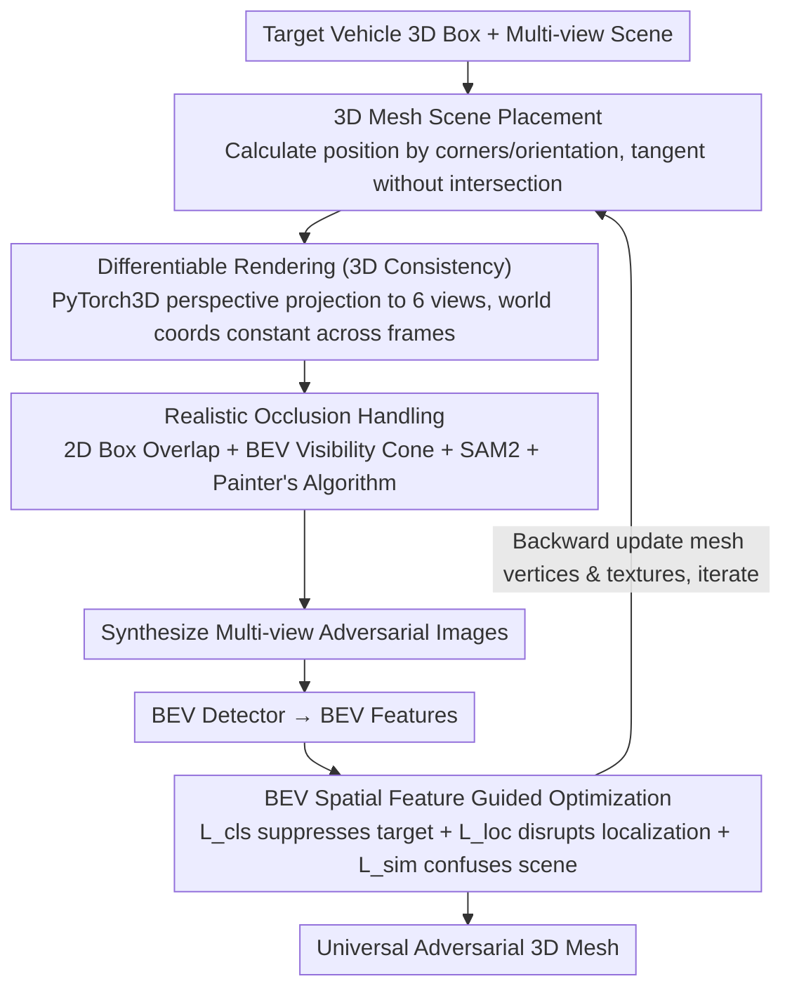

# SABER: Spatially Consistent 3D Universal Adversarial Objects for BEV Detectors

**Conference**: CVPR2026  
**arXiv**: [2505.22499](https://arxiv.org/abs/2505.22499)  
**Code**: [Project Page](https://npucvr.github.io/SABER)  
**Area**: Autonomous Driving  
**Keywords**: Adversarial Attack, BEV 3D detection, non-intrusive attack, differentiable rendering, universal adversarial object, multi-view consistency

## TL;DR

This paper proposes SABER, the first non-intrusive, 3D-consistent universal adversarial object generation framework for BEV 3D detectors. By placing optimized 3D meshes in the scene to interfere with multi-view and multi-frame detection, it reveals the over-reliance of BEV models on environmental context priors.

## Background & Motivation

**Wide Deployment of BEV Detection**: Vision-centric BEV 3D detection (e.g., BEVDet, BEVFormer) has been widely adopted by automotive companies due to its low cost. Its adversarial robustness directly impacts driving safety.

**Limitations of Prior Work**: Current mainstream methods (adversarial patches/textures) require physical contact and modification of the target vehicle, which is impractical and non-scalable in real-world scenarios.

**2D Attacks Lack 3D Consistency**: Existing non-intrusive attacks are mostly based on 2D patch pasting, ignoring 3D spatial structure and failing to maintain attack effectiveness across multiple views and frames.

**Unreasonable Occlusion Modeling**: NeRF-based methods like Adv3D render from a single view and then "paste" onto images, failing to handle occlusion relationships in the scene correctly.

**Scene-level Attacks are More Dangerous**: Compared to modifying a single target, placing malicious objects in the environment can cause large-scale, unpredictable detection failures, posing a greater threat.

**Revealing Model Vulnerabilities**: A systematic approach is needed to evaluate whether BEV models over-rely on learned environmental co-occurrence priors rather than truly understanding the scene.

## Method

### Overall Architecture

SABER aims to answer whether a vision-centric BEV detector can be deceived by a 3D object placed near a vehicle without touching the target. Its pipeline consists of three steps: first, automatically selecting a suitable position for the adversarial mesh in the 3D scene; second, using differentiable rendering to generate multi-view consistent adversarial images with an occlusion handling module to ensure physical plausibility; finally, utilizing BEV spatial feature-guided optimization to make the attack effective across views and frames. The gradients from the optimization back-propagate to update the vertices and textures of the mesh iteratively until convergence.

### Key Designs

**1. 3D Mesh Scene Placement: Placing Adversarial Objects Near Vehicles Instead of Attaching Them**

Mainstream adversarial attacks require physical contact and modification of the target vehicle, which is impractical and non-scalable. SABER instead places an adversarial mesh near the bottom corner of the target's 3D bounding box. The placement position is calculated based on the vehicle's 8 corner coordinates and orientation angle, ensuring the mesh is tangent to but does not intersect with the vehicle. The distance $d$ is adjustable to support different offsets. The mesh uses an explicit surface representation (vertices $\mathcal{V}$, faces $\mathcal{F}$, textures $\mathcal{T}$), which is naturally compatible with physical engines for potential real-world deployment.

**2. Differentiable Rendering for 3D Consistency: Ensuring Attack Validity Across Six Views and Multiple Frames**

2D patch mapping ignores 3D structure, causing attacks to fail when views or frames change. SABER uses PyTorch3D for perspective projection rendering for each camera view: mesh vertices $v_j$ are transformed to the camera system via extrinsic parameters $(R_i, T_i)$ and then projected to 2D via intrinsic parameters $K_i$. This outputs RGB images $I_{\mathcal{M},i}^{\text{rgb}}$ and soft masks $I_{\mathcal{M},i}^{\text{mask}}$. In multi-frame scenarios, the mesh maintains constant world coordinates. Because the same 3D mesh is consistently rendered into all views and frames, the attack possesses true 3D consistency rather than being a single-view illusion.

**3. Realistic Occlusion Handling Module: Making "Being Occupied" Physically Real in Rendering**

Methods like Adv3D render from a single view and simply "paste" onto images, resulting in incorrect occlusion relationships. SABER utilizes a two-stage filtering process: first, an overlap check is performed on 2D bounding boxes in each view (Eq. 2), followed by constructing a visibility cone $\mathcal{F}_{\mathcal{M},i}^{\text{BEV}}$ from the camera origin to the mesh vertices on the BEV plane (Eq. 3) to check if scene objects fall within the cone. For confirmed occlusions, SAM2 is used to segment the mask and update mesh transparency (Eq. 4). In multi-mesh scenes, the Painter's Algorithm is used for alpha blending from back to front (Eq. 5). This ensures the rendered adversarial images are visually and physically plausible.

**4. BEV Spatial Feature Guided Optimization: Disrupting Features Directly Beyond Bounding Boxes**

Attacks targeting only the final prediction boxes often have poor transferability. SABER applies the loss to the BEV feature layer, consisting of three components: target suppression $\mathcal{L}_{\text{cls}}$ to minimize confidence responses in the target area (Eq. 6), localization disruption $\mathcal{L}_{\text{loc}}$ to maximize the L1 distance between predicted and GT boxes (Eq. 7), and scene confusion $\mathcal{L}_{\text{sim}}$ which minimizes the cosine similarity between the BEV features of the adversarial and original images to induce global misdetections (Eq. 8). Directly perturbing feature representations makes the attack more stable across views and distances, which reveals the model's over-reliance on environmental co-occurrence priors.

### Loss & Training

The overall objective optimizes both mesh vertices and textures:

$$\min_{\mathcal{V},\mathcal{T}} \mathcal{L}_{\text{attack}} = \mathcal{L}_{\text{cls}} + \alpha \mathcal{L}_{\text{loc}} + \beta \mathcal{L}_{\text{sim}}$$

where $\alpha = \beta = 10$.

## Key Experimental Results

### Experimental Settings

- **Dataset**: nuScenes (28,130 frames for training, 6,019 for validation, 360° coverage via 6 cameras)
- **Target Models**: BEVDet (ResNet-50), BEVDet4D (ResNet-50), BEVFormer (ResNet-101)
- **Metrics**: ASR (Attack Success Rate, IoU threshold 0.3-0.7), mAP, NDS
- **Initial Mesh**: Cylinder (radius 0.3m, height 2.0m), placed 0.1m from the target vehicle's rear-right bottom corner.

### Main Results

| Model | Clean mAP | Adv mAP | Gain (mAP) | Clean NDS | Adv NDS | Gain (NDS) |
|------|-----------|---------|---------|-----------|---------|---------|
| BEVDet (w/o Occlusion) | 0.309 | 0.130 | 57.9% | 0.394 | 0.210 | 46.7% |
| BEVDet (w/ Occlusion) | 0.309 | 0.160 | 48.2% | 0.394 | 0.267 | 32.2% |
| BEVDet4D (w/o Occlusion) | 0.314 | 0.156 | 50.3% | 0.447 | 0.276 | 38.3% |
| BEVFormer (w/o Occlusion) | 0.370 | 0.165 | 55.4% | 0.478 | 0.288 | 39.7% |

### Comparison with Prior Work

**Comparison with Adv3D** (Tab. 2): SABER causes a 41.4% drop in NDS vs. Adv3D's 19.3%, and a 55.6% drop in mAP vs. 44.0%. Adv3D's baseline already significantly degrades due to severe self-occlusion from randomly rendering two cars.

**Comparison with UAP** (Tab. 3): SABER significantly outperforms UAP at low/medium IoU thresholds (ASR₀.₁=0.568 vs 0.405, ASR₀.₃=0.613 vs 0.514), while UAP requires intrusive patches directly covering the target.

### Ablation Study

**Initial Shape**: Cylinders, cubes, and spheres are all effective. Cubes have a slight advantage in scene-level attacks due to vehicle-like geometric similarity (NDS reduced to 0.205), but cylinders are more suitable for physical deployment due to their smooth surfaces.

**Attack Distance**: Effective within 0.1m to 1.0m (Adv NDS between 0.263-0.276), proving the attack does not rely on specific offsets.

**Number of Random Objects**: ASR₀.₃ for 1/3/5/7/10 visible meshes is 0.175/0.300/0.401/0.590/0.793, respectively, showing linear growth in attack effectiveness.

### Key Findings

- Non-adversarial gray cylinders (Init) cause minimal performance degradation, while optimized adversarial meshes (Adv) cause significant additional drops, indicating the attack exploits vulnerabilities in the model's contextual reasoning.
- Adversarial objects optimized for BEVFormer exhibit pedestrian-like textures, suggesting the model has learned semantically incorrect associations, likely stemming from dataset biases.
- Physical experiments confirm: Placing 3D-printed adversarial meshes near real vehicles leads to localization errors and misdetections.

## Highlights & Insights

- **Pioneering Non-intrusive 3D-Consistent Attack**: Causes scene-level detection failure simply by placing a mesh in the environment without touching the target.
- **Full Physical Plausibility Guarantees**: The occlusion handling module combines 2D and BEV double-checks with SAM2 segmentation for visually plausible rendering results.
- **BEV Feature-Level Attack**: Moves beyond attacking only final predictions to directly disrupting feature representations, enhancing robustness across views and distances.
- **Revealing Deep Vulnerabilities**: Proves that BEV models over-rely on object co-occurrence priors and lack robustness to environmental context.
- **Physical World Validation**: Digital-to-physical proof-of-concept enhances the argument for practical utility.

## Limitations & Future Work

- White-box attack setting requires full model access; black-box transferability is not fully validated.
- Occlusion handling depends on SAM2 segmentation quality and GT annotations, which may be unavailable during actual deployment.
- Physical experiments are limited to a proof-of-concept (single scene) and lack large-scale outdoor testing.
- Mesh initialization uses simple geometries; more complex or stealthy camouflaged shapes were not explored.
- Only three BEV detectors were evaluated, excluding the latest streaming or end-to-end architectures.

## Related Work & Insights

- **Intrusive 3D Attacks**: Adversarial textures [Athalye 2018], adversarial camouflage [Wu 2020]; these require target modification and are impractical.
- **Non-intrusive 2D Attacks**: UAP [38] applies patches to vehicle surfaces; Brown 2017 uses adversarial patches; both lack 3D consistency.
- **Adv3D** [15]: Generates adversarial vehicles via NeRF but renders and pastes from single views, leading to incorrect occlusion and perspective.
- **LiDAR Attacks** [Chen 2024, Tu 2020]: Modify point cloud distributions, differing from this vision-only setting.
- **Fusion Attacks** [Abdelfattah 2021]: Place adversarial meshes on vehicles to attack multimodal pipelines; still intrusive.

## Rating

- Novelty: ⭐⭐⭐⭐ — First systematic study of non-intrusive 3D-consistent adversarial attacks with a novel threat model.
- Experimental Thoroughness: ⭐⭐⭐⭐ — Three models, physical experiments, and rich ablations, though black-box transfer and large-scale physical validation are lacking.
- Writing Quality: ⭐⭐⭐⭐ — Clear problem definition, detailed methodology, and effective illustrative figures.
- Value: ⭐⭐⭐⭐ — Significant warning regarding BEV perception safety, exposing model dependence on environmental priors.

<!-- RELATED:START -->

## Related Papers

- [\[CVPR 2026\] Learning to Identify Out-of-Distribution Objects for 3D LiDAR Anomaly Segmentation](learning_to_identify_out-of-distribution_objects_for_3d_lidar_anomaly_segmentati.md)
- [\[CVPR 2026\] ReScene4D: Temporally Consistent Semantic Instance Segmentation of Evolving Indoor 3D Scenes](rescene4d_temporally_consistent_semantic_instance_segmentation_of_evolving_indoo.md)
- [\[CVPR 2026\] Learning Mutual View Information Graph for Adaptive Adversarial Collaborative Perception](learning_mutual_view_information_graph_for_adaptive_adversarial_collaborative_pe.md)
- [\[ICCV 2025\] Counting Stacked Objects](../../ICCV2025/autonomous_driving/counting_stacked_objects.md)
- [\[ICML 2026\] Plug-and-Play Label Map Diffusion for Universal Goal-Oriented Navigation](../../ICML2026/autonomous_driving/plug-and-play_label_map_diffusion_for_universal_goal-oriented_navigation.md)

<!-- RELATED:END -->
