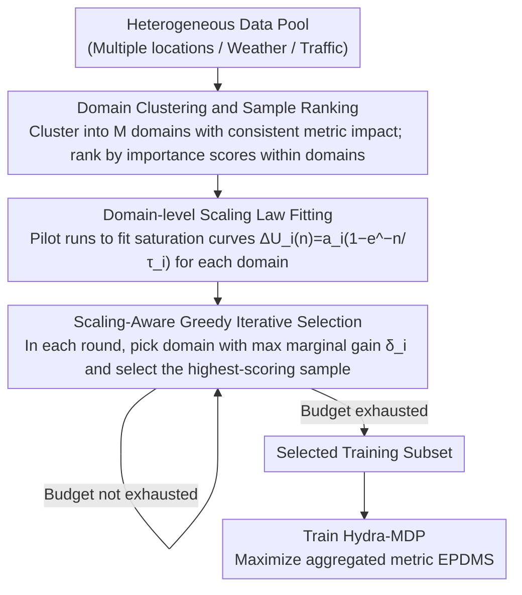

# Scaling-Aware Data Selection for End-to-End Autonomous Driving Systems

**Conference**: CVPR 2026  
**arXiv**: [2604.08366](https://arxiv.org/abs/2604.08366)  
**Code**: None  
**Area**: Autonomous Driving  
**Keywords**: Data Selection, Neural Scaling Laws, Data Mixture Optimization, End-to-End Autonomous Driving, EPDMS

## TL;DR

The MOSAIC framework is proposed, which achieves efficient data selection for end-to-end autonomous driving models by clustering data, fitting scaling laws for each domain relative to evaluation metrics, and iteratively selecting data cluster samples with the maximum marginal gain. This method reaches or exceeds baseline performance with 80% less data.

## Background & Motivation

1. **Background**: Large-scale deep learning models rely on diverse training data, especially in physical AI applications like autonomous driving, where data covers different locations, weather conditions, and traffic scenarios. However, training on the full dataset is computationally expensive, necessitating intelligent data selection strategies.
2. **Limitations of Prior Work**: (A) Influence estimation and active learning methods operate in feature space but do not consider how different data impacts various evaluation metrics; (B) Existing data mixture methods (e.g., DoReMi, ADO) assume domains are well-defined and homogeneous, ignoring heterogeneous impact rates of data sources on different metrics; (C) Physical AI systems need to optimize multiple potentially competing metrics (e.g., route progress vs. driving comfort vs. collision avoidance).
3. **Key Challenge**: The same training sample contributes differently to different metrics; existing frameworks cannot model this "data-metric" many-to-many and heterogeneous impact relationship.
4. **Goal**: Select a training subset from a heterogeneous data pool that maximizes the aggregated metric (EPDMS) under a limited data budget.
5. **Key Insight**: Cluster the data pool into domains with similar metric impacts, fit scaling laws for each domain individually, and then determine the optimal mixture ratio through iterative greedy selection.
6. **Core Idea**: Cluster first, fit scaling laws, then select greedily—decomposing the complex multi-metric data selection problem into independently estimable domain-level scaling problems.

## Method

### Overall Architecture

MOSAIC addresses a practical problem: when the cost of training all autonomous driving data is too high and only a subset can be utilized, which samples and how many from each domain should be selected to maximize the aggregated driving metric EPDMS? The approach decomposes this multi-metric selection problem into three steps: first, **clustering the heterogeneous data pool into several "internally consistent" domains**; second, **fitting a scaling law for each domain** to characterize the metric gain per additional data unit; and finally, using **greedy iteration** to select samples from the domain with the highest current marginal gain until the budget is exhausted. The pipeline reduces the global problem of identifying useful data into local judgments of marginal utility.

### Key Designs

**1. Domain Clustering and Sample Ranking: Segmenting Heterogeneous Pools into Consistent Subsets**

Autonomous driving data is inherently heterogeneous—curves in Pittsburgh and urban areas in Las Vegas contribute differently to collision avoidance or route progress. Directly estimating gain on the entire pool is compromised by this heterogeneity. MOSAIC first uses feature representations (semantic descriptions, geographic locations, etc.) to cluster the pool into $M$ domains, ensuring that internal samples have roughly consistent impacts on metrics. This provides a stable statistical premise for fitting scaling laws. Within domains, samples are ranked by importance scores defined as the aggregated metric value of the current model on that sample: $\mathcal{I}(x) = U(\{\mathcal{G}_r(f(\cdot; \mathcal{D}_{train}), x)\}_{r=1}^R)$. Clustering decouples heterogeneous influences while ranking ensures intra-domain quality.

**2. Domain-level Scaling Law Fitting: Modeling Diminishing Marginal Returns via Saturation Curves**

Greedy selection requires knowing the gain of adding $n$ samples from a specific domain. MOSAIC assumes that domain contributions to the mixture utility are linearly separable:

$$\Delta U_{mix}(n_1,\dots,n_M) \approx \sum_{i=1}^M \Delta U_i(n_i)$$

Thus, the joint optimization is decomposed into $M$ independent estimations. For each domain, a saturated exponential scaling law is fitted: $\Delta \hat{U_i}(n) = a_i(1 - e^{-n/\tau_i})$, where $a_i$ represents the asymptotic gain upper bound and $\tau_i$ is the rate of approach. Parameters are estimated using small-scale pilot runs. This saturation form aligns with the intuition that marginal contribution decreases as data volume increases.

**3. Scaling-Aware Greedy Iterative Selection: First-order Difference Ascent on Concave Objectives**

Given the scaling curves, MOSAIC determines the allocation for each domain under a fixed budget by maintaining the count of selected samples $b_i$. In each round, the marginal gain is calculated:

$$\delta_i(b_i) = \Delta\hat{U_i}(b_i+1) - \Delta\hat{U_i}(b_i)$$

The domain $j = \arg\max_i \delta_i(b_i)$ is selected, and its highest-ranked unselected sample is added to the subset. Since $\Delta\hat{U_i}(n)$ is a concave function, the greedy strategy naturally shifts allocation from saturated domains to those with higher growth potential, achieving a balanced distribution. This process effectively performs gradient ascent on a concave objective with approximation guarantees.

### A Complete Example

> ⚠️ The following numbers are illustrative to demonstrate the greedy iteration and are not reported values from the paper.

Assume 3 domains are clustered with fitted scaling laws: Urban ($a=10, \tau=200$), Highway ($a=6, \tau=400$), and Curves ($a=8, \tau=150$). The budget allows for 4 samples.

- Start $b=(0,0,0)$, marginal gains $a/\tau$: Urban $0.050$, Highway $0.015$, Curves $0.053$ → Select **Curves**, $b=(0,0,1)$.
- Curves marginal gain drops slightly to $0.052$, still the highest → Select **Curves**, $b=(0,0,2)$.
- Curves marginal gain stays near $0.052$, Urban $0.050$ is slightly lower → Select **Curves** again (or switch to Urban if they equalize), $b=(0,0,3)$.
- Fourth round: Urban and Curves marginal gains are similar and higher than Highway → Select from higher gain, $b$ converges toward $(1,0,3)$.

The budget is prioritized for the "Curves" domain due to high marginal utility, rather than the "Highway" domain which has lower reach and slower saturation.

### Loss & Training

- Uses the Hydra-MDP model (NAVSIM 2024 winner) with a VoVNetV2-99 backbone and a trajectory vocabulary of 16,384.
- Metric: EPDMS (aggregation of 9 rule-compliance metrics), including penalties (NC, DAC, DDC, TLC) and weighted averages (EP, TTC, LK, HC, EC).
- Pilot runs are used to estimate scaling law parameters; main training utilizes the selected subset.

## Key Experimental Results

### Main Results

OpenScene experiments (selecting from 31,539 clips):

| Budget | Method | EPDMS ↑ | BRMR ↓ |
| :--- | :--- | :--- | :--- |
| 250 | Random | 72.84 | 1.00 |
| 250 | Coreset | 76.26 | 0.20 |
| 250 | MOSAIC | **77.38** | **0.15** |
| 1000 | Random | 75.84 | 1.00 |
| 1000 | MOSAIC | **81.68** | **0.18** |
| 4000 | Random | 80.38 | 1.00 |
| 4000 | MOSAIC | **84.25** | **0.18** |

Navtrain experiments:

| Budget | Method | EPDMS ↑ | BRMR ↓ |
| :--- | :--- | :--- | :--- |
| 100 | Random | 84.66 | 1.00 |
| 100 | MOSAIC | **86.29** | **0.30** |
| 1600 | Random | 88.62 | 1.00 |
| 1600 | MOSAIC | **90.18** | **0.37** |

MOSAIC requires approximately 18-30% of the data used by random selection to achieve equivalent EPDMS performance (BRMR 0.15-0.37).

### Ablation Study

EPDMS sub-metric decomposition (OpenScene, 4000 clips):

| Method | NC ↑ | DAC ↑ | EP ↑ | TTC ↑ | LK ↑ | EPDMS ↑ |
| :--- | :--- | :--- | :--- | :--- | :--- | :--- |
| Base | 94.05 | 83.9 | 85.96 | 92.95 | 93.26 | 72.0 |
| Random | 96.32 | 90.53 | 86.36 | 95.66 | 95.68 | 80.38 |
| Uncertainty | 94.67 | 85.11 | 84.26 | 93.72 | 93.26 | 73.46 |
| Coreset | 97.11 | 92.93 | 86.65 | 96.42 | 96.66 | 83.63 |
| MOSAIC | 96.97 | **93.59** | **87.14** | 96.18 | 96.62 | **84.25** |

### Key Findings

- Uncertainty sampling performs the worst—high entropy samples may be noise or outliers, and prioritizing them can degrade overall performance.
- MOSAIC outperforms Coreset across all budget levels, with the gap being more significant at small budgets (indicating scaling laws are critical under data scarcity).
- The combination of clustering and scaling laws is superior to clustering alone (e.g., Chameleon)—even with imperfect clustering, the domain-level improvement estimation via scaling laws compensates.
- MOSAIC reaches full-training EPDMS performance using only approximately 42% of the data.
- Different domains (e.g., Pittsburgh curves vs. Las Vegas urban) specifically contribute to different metrics, validating the heterogeneous impact hypothesis.

## Highlights & Insights

- **Scaling Law as a Data Selection Signal**: Unlike sample-level signals like influence functions or uncertainty, scaling laws provide a stable domain-level signal that inherently models diminishing returns, suitable for large-scale selection.
- **Elegance of the Greedy Algorithm**: For concave objective functions, step-wise selection based on maximum marginal gain is equivalent to first-order discrete optimization, offering both simplicity and theoretical guarantees.
- **BRMR Metric**: The proposed "Budget Relative to Manual Random" (BRMR) metric provides an intuitive measure of data efficiency.
- **Flexibility of Clustering**: Results indicate that whether using semantic descriptions or geographic locations for clustering, MOSAIC consistently outperforms baselines, suggesting the primary benefit stems from scaling law guidance.

## Limitations & Future Work

- The linear separability assumption ignores interaction effects between domains—certain combinations may yield super- or sub-additive effects.
- Fitting scaling laws requires multiple pilot runs, which incurs computational overhead.
- Validated only on NAVSIM/OpenScene; not yet tested in real-world closed-loop driving or other physical AI systems.
- The choice of clustering number $M$ depends on prior knowledge (the paper uses 4 domains based on map metadata).
- Future directions: Introducing non-linear scaling models with interaction terms; online adaptive scaling law parameters; generalization to other multi-metric scenarios like robotic manipulation.

## Related Work & Insights

- **vs. Chameleon**: Chameleon uses Kernel Ridge scores in feature space for domain weighting but does not explicitly model the data volume-performance scaling relationship. MOSAIC outperforms it by layering scaling laws onto the clustering.
- **vs. ADO**: ADO fits scaling estimators online for mixture reweighting but doesn't model domain-level independent scaling and requires multiple hyperparameters like time averaging. MOSAIC's offline approach is more stable.
- **vs. CoreSet**: CoreSet pursues feature space diversity, which ranks second in most MOSAIC settings, indicating that diversity is important but insufficient without metric-sensitive selection.

## Rating

- Novelty: ⭐⭐⭐⭐ 
- Experimental Thoroughness: ⭐⭐⭐⭐ 
- Writing Quality: ⭐⭐⭐⭐ 
- Value: ⭐⭐⭐⭐ 

<!-- RELATED:START -->

## Related Papers

- [\[CVPR 2026\] E3AD: An Emotion-Aware Vision-Language-Action Model for Human-Centric End-to-End Autonomous Driving](e3ad_an_emotion-aware_vision-language-action_model_for_human-centric_end-to-end_.md)
- [\[CVPR 2026\] ActiveAD: Planning-Oriented Active Learning for End-to-End Autonomous Driving](activead_planning-oriented_active_learning_for_end-to-end_autonomous_driving.md)
- [\[CVPR 2026\] ResAD: Normalized Residual Trajectory Modeling for End-to-End Autonomous Driving](resad_normalized_residual_trajectory_modeling_for_end-to-end_autonomous_driving.md)
- [\[CVPR 2026\] DriveMoE: Mixture-of-Experts for Vision-Language-Action Model in End-to-End Autonomous Driving](drivemoe_mixture-of-experts_for_vision-language-action_model_in_end-to-end_auton.md)
- [\[CVPR 2026\] Percept-WAM: Perception-Enhanced World-Awareness-Action Model for Robust End-to-End Autonomous Driving](percept-wam_perception-enhanced_world-awareness-action_model_for_robust_end-to-e.md)

<!-- RELATED:END -->
