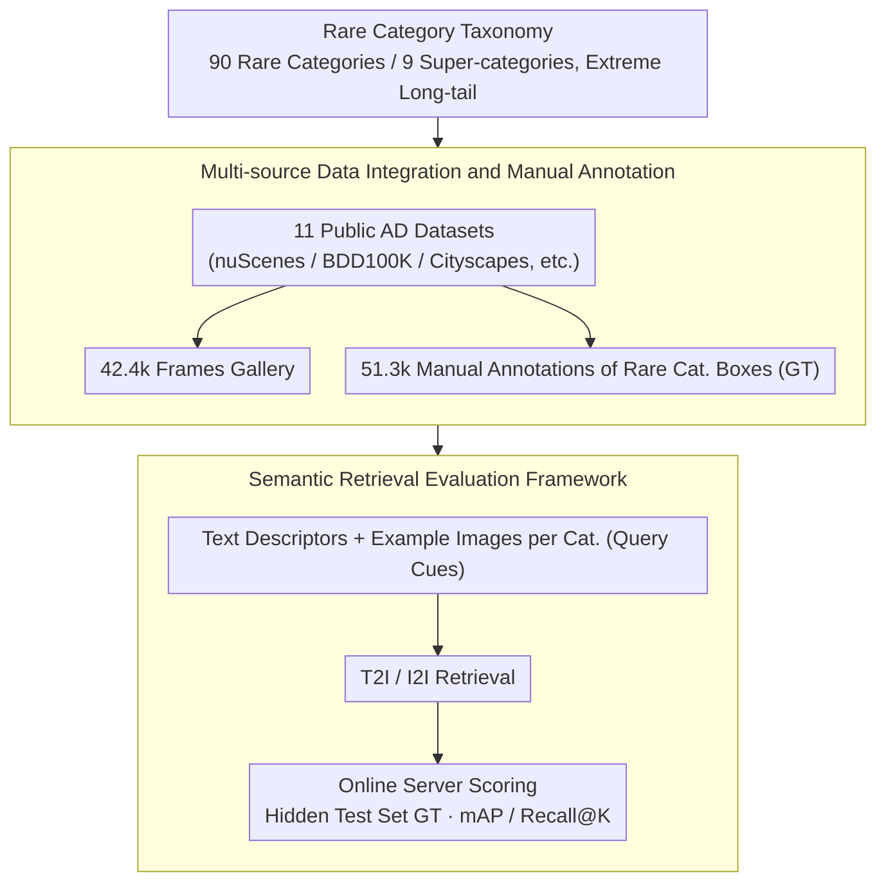

# SearchAD: Large-Scale Rare Image Retrieval Dataset for Autonomous Driving

**Conference**: CVPR 2026  
**arXiv**: [2604.08008](https://arxiv.org/abs/2604.08008)  
**Code**: [https://github.com/iis-esslingen/searchad_devkit](https://github.com/iis-esslingen/searchad_devkit)  
**Area**: Autonomous Driving / Dataset  
**Keywords**: Rare image retrieval, autonomous driving, long-tail distribution, semantic retrieval, dataset benchmark

## TL;DR

SearchAD constructs the first large-scale rare image retrieval dataset for autonomous driving, containing 420k+ frames, 510k+ bounding boxes, and 90 rare categories. It supports text-to-image and image-to-image retrieval and reveals the deficiencies of current multimodal retrieval models in rare object retrieval through comprehensive evaluation.

## Background & Motivation

**Background**: The safety of autonomous driving (AD) systems highly depends on the ability to handle rare and safety-critical scenarios. As dataset scales continue to grow (reaching the million-frame level), the key challenge shifts from "collecting more data" to "how to efficiently find the most relevant samples."

**Limitations of Prior Work**: (1) Existing AD datasets mainly focus on common categories (vehicles, pedestrians, bicycles, etc.) with minimal coverage of rare objects (e.g., pedestrians with crutches, animals, abnormal road markings); (2) Existing image retrieval benchmarks primarily target instance-level retrieval (different views of the same object) rather than semantic-level retrieval required by AD scenarios (finding images containing specific rare categories); (3) There is a lack of a unified large-scale benchmark to evaluate and advance retrieval technologies for rare driving scenarios.

**Key Challenge**: Rare safety-critical scenarios appear with extremely low frequency (the "needle in a haystack" problem) but are crucial for AD system safety. Existing methods do not specifically evaluate retrieval capabilities for such extreme long-tail distributions.

**Goal**: Build the first large-scale dataset and benchmark focusing on rare object/scenario retrieval in autonomous driving to fill this gap.

**Key Insight**: Integrate data from 11 existing AD datasets and create a unified retrieval benchmark by manually labeling bounding boxes for 90 rare categories.

**Core Idea**: Address the "needle in a haystack" problem in autonomous driving by constructing a large-scale rare image retrieval dataset supporting semantic-level text-to-image and image-to-image retrieval.

## Method

### Overall Architecture

SearchAD aims to solve "needle-in-a-haystack" style rare scenario mining in autonomous driving—given a rare category (e.g., "pedestrian with crutches"), how to extract all images containing it from a gallery of millions of frames. This work does not train a new model but frames the task as an evaluable retrieval mission: first aggregating 423,798 frames from 11 public AD datasets as the retrieval gallery, then manually annotating 513,265 bounding boxes for 90 rare categories as ground truth. Each category is provided with two sets of "query cues" (text descriptions and example images), and scores are unified via a public server with a hidden test set. The three designs below answer "what to retrieve," "where to retrieve from," and "how to score."

### Key Designs

**1. Rare Category Taxonomy: Defining "Safety-Critical but Rare" Objects as Retrievable Targets**

AD datasets often contain millions of frames, but most are common categories like cars, people, or bicycles. Safety is determined by rare cases—if encountered but never seen, the system might fail. SearchAD organizes such objects into 90 rare categories under 9 super-categories: Animal, Human (special pedestrian states like using crutches or wheelchairs), Marking (abnormal road markings), Object (road obstacles), Rideable, Scene (special scenes), Sign (non-standard traffic signs), Trailer, and Vehicle (special vehicles). This two-level structure allows for evaluation at both coarse and fine granularities. "Rare" here is literal—some categories appear fewer than 50 times across the 420k frames, with frequency gaps between categories exceeding three orders of magnitude. This extreme long-tail makes retrieval significantly harder than standard benchmarks.

**2. Multi-source Data Integration and Manual Annotation: Approximating Real-world Rare Distributions via Diversity**

Single datasets tend to have fixed sensors, regions, and weather. Rare objects are already scarce; sourcing from one place makes it harder to gather diverse conditions. SearchAD horizontally integrates 11 sources: Lost and Found, WildDash2, ACDC, IDD, KITTI, Cityscapes, Mapillary Vistas, ECP, nuScenes, BDD100K, and Mapillary Sign. Each brings different camera configurations, geographic distributions, and lighting, allowing the same rare category to appear in multiple visual forms, closer to distributions encountered in real deployment. All 510k+ rare category bounding boxes are manually annotated rather than auto-labeled, ensuring ground truth quality—critical for evaluating rare, small-scale objects where off-the-shelf detectors easily miss targets.

**3. Semantic Retrieval Evaluation Framework: Using "Category Meaning" Instead of "Specific Instances"**

Traditional image retrieval benchmarks (like Oxford5K) perform instance-level retrieval—given a photo of a landmark, find other views of that *same* landmark. AD data mining requires semantic-level retrieval—developers want to "find all images containing animals," not "find this specific dog." Accordingly, SearchAD provides both linguistic support sets (text descriptions) and visual support sets (example images) for each rare category, enabling models to perform Text-to-Image (T2I) and Image-to-Image (I2I) retrieval. Performance is measured by mAP and Recall@K. Test set ground truths are withheld, with scoring handled by an online server, preventing over-tuning on the test set and ensuring horizontal comparability across methods.

### Loss & Training

SearchAD is a dataset and benchmark work and does not propose a new model. However, it provides two types of baselines: zero-shot retrieval using pre-trained multimodal models (CLIP, SigLIP, RegionCLIP, etc.) to calculate similarities between queries and images, and fine-tuned baselines using standard contrastive learning loss (InfoNCE) on the SearchAD training set. Both are measured using standard retrieval metrics including mAP and Recall@1/5/10.

## Key Experimental Results

### Main Results

| Method Type | Model | mAP (T2I) | Recall@10 (T2I) | Description |
| :--- | :--- | :--- | :--- | :--- |
| Global Feature | CLIP | Baseline level | Low | Global semantic matching |
| Global Feature | SigLIP | Slightly better than CLIP | Slightly better | Stronger pre-training |
| Spatial Alignment | RegionCLIP | Best Zero-shot | Best Zero-shot | Optimal spatial vision-language alignment |
| Fine-tuned | CLIP-ft | Significant gain | Significant gain | Fine-tuning improves significantly |
| Image-to-Image | CLIP (I2I) | Lower than T2I | Lower than T2I | Image retrieval weaker than text |

### Ablation Study

| Analysis Dimension | Finding | Description |
| :--- | :--- | :--- |
| Text vs. Image Retrieval | Text outperforms image | Text has stronger semantic priors |
| Impact of Rareness | Rarer is harder | Categories with <50 instances are extremely difficult |
| Impact of Object Size | Small objects are harder | Small-scale rare objects have the lowest accuracy |
| Fine-tuning Effect | Significant gain but still insufficient | Absolute retrieval capability remains unsatisfactory |

### Key Findings

- Text-to-Image retrieval significantly outperforms Image-to-Image retrieval, indicating that linguistic semantic localization is crucial for rare object retrieval.
- Models that directly align spatial visual features with language (e.g., RegionCLIP) perform best in zero-shot retrieval.
- Even after fine-tuning, retrieval accuracy for extremely rare categories (<50 occurrences) remains very low, showing the problem is far from solved.
- The long-tail distribution in the dataset is the core challenge—the appearance frequency of the 90 categories spans over three orders of magnitude.

## Highlights & Insights

- **Unique Problem Definition**: Focuses on "needle in a haystack" retrieval of rare safety-critical scenarios, an overlooked but vital issue. In autonomous driving, the system's reaction to a one-time rare event can be a matter of life and death.
- **Balance of Scale and Quality**: 420k+ frames integrate diversity from 11 datasets, while 510k+ manual bounding boxes ensure annotation quality. The 90 rare categories reflect a deep understanding of AD safety requirements.
- **Reveals Deficiencies in Current Methods**: Even the best models after fine-tuning struggle with rare object retrieval, providing a clear direction for community improvement.

## Limitations & Future Work

- Annotations are limited to 2D bounding boxes; the lack of 3D annotations and semantic segmentation masks limits more granular retrieval evaluation.
- While 90 rare categories cover major safety scenarios, real-world long-tail distributions may be even more extreme.
- Currently supports only static single-frame retrieval; temporal retrieval (finding video clips containing rare events) is not addressed.
- The distribution of rare categories is limited by the geographical distribution of source datasets, potentially introducing regional bias.
- Future work could consider combining active learning or few-shot detection technologies to enhance rare object retrieval capabilities.

## Related Work & Insights

- **vs. nuScenes/Waymo Retrieval**: Traditional AD dataset retrieval is mainly based on metadata tags; SearchAD emphasizes retrieval based on multimodal semantics.
- **vs. Oxford5K/Paris6K Benchmarks**: Traditional benchmarks target instance-level retrieval (e.g., landmarks); SearchAD targets semantic-level rare category retrieval.
- **vs. OpenImages/LVIS Long-tail Detection**: These datasets focus on long-tail detection, whereas SearchAD focuses on long-tail retrieval; the focus differs but the problem structure is similar.

## Rating

- Novelty: ⭐⭐⭐⭐ First large-scale semantic retrieval benchmark for rare AD scenarios; problem definition is valuable.
- Experimental Thoroughness: ⭐⭐⭐⭐ Comprehensive comparison of multiple baselines with in-depth analysis.
- Writing Quality: ⭐⭐⭐⭐ Clear description of the dataset construction process.
- Value: ⭐⭐⭐⭐ Dataset + benchmark + public server; clear contribution to the community.

<!-- RELATED:START -->

## Related Papers

- [\[CVPR 2026\] V2U4Real: A Real-world Large-scale Dataset for Vehicle-to-UAV Cooperative Perception](v2u4real_a_real-world_large-scale_dataset_for_vehicle-to-uav_cooperative_percept.md)
- [\[CVPR 2026\] Spatial Retrieval Augmented Autonomous Driving](spatial_retrieval_augmented_autonomous_driving.md)
- [\[CVPR 2026\] Ghost-FWL: A Large-Scale Full-Waveform LiDAR Dataset for Ghost Detection and Removal](ghost-fwl_a_large-scale_full-waveform_lidar_dataset_for_ghost_detection_and_remo.md)
- [\[CVPR 2026\] TruckDrive: Long-Range Autonomous Highway Driving Dataset](truckdrive_long-range_autonomous_highway_driving_dataset.md)
- [\[ECCV 2024\] H-V2X: A Large Scale Highway Dataset for BEV Perception](../../ECCV2024/autonomous_driving/h-v2x_a_large_scale_highway_dataset_for_bev_perception.md)

<!-- RELATED:END -->
