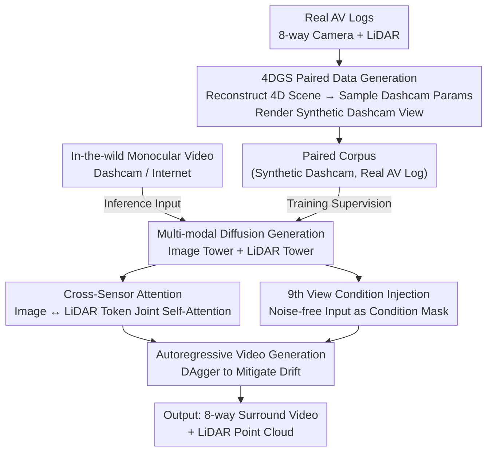

# Sensor2Sensor: Cross-Embodiment Sensor Conversion for Autonomous Driving

**Conference**: CVPR 2026  
**arXiv**: [2605.22809](https://arxiv.org/abs/2605.22809)  
**Code**: None (Waymo, not open-sourced)  
**Area**: Autonomous Driving / Generative World Models / Diffusion Models  
**Keywords**: Cross-embodiment sensor conversion, 4D Gaussian Splatting, Multi-modal diffusion, LiDAR generation, Dashcam

## TL;DR
Addressing the lack of long-tail data in autonomous driving, this paper utilizes 4DGS to inverse-render real AV logs into "dashcam-style" videos to **self-generate paired data**. A conditional diffusion model is then trained to convert monocular dashcam videos into the complete multi-view camera + LiDAR sensor suite of a target vehicle. It achieves an FID of 6.47 and reduces the Chamfer distance by 13.4% compared to X-Drive, enabling the "translation" of long-tail accident/night videos from the internet into usable multi-modal AV logs.

## Background & Motivation
**Background**: Training and validation of Autonomous Driving Systems (ADS) require massive, diverse data covering long-tail scenarios. While fleet-collected proprietary data provides high-fidelity multi-modality (8-way surround cameras + LiDAR), it is limited by scale, sensor configuration diversity, and geographical/behavioral coverage. Conversely, "in-the-wild" data like dashcams and internet videos are vast, diverse, and naturally biased towards long-tail events (rare events are more likely to be recorded and shared), but they are **monocular and unstructured**, making them incompatible with the structured multi-modal inputs expected by ADS.

**Limitations of Prior Work**: Two main paths exist to bridge this gap, both with significant flaws. The first uses generative models to **synthesize scenes from scratch** (e.g., GAIA-1, Cosmos), but generated data often suffers from a "rationality gap" (non-physical dynamics) and "realism issues" (low sensor fidelity), making it unsuitable for ADS validation. The second **leveraged in-the-wild third-party data**, which is rooted in physical reality and avoids rationality issues but faces a severe **embodiment gap**: in-the-wild data is typically monocular, lacks 360° multi-camera views, and completely lacks LiDAR, creating a significant geometric and sensory misalignment with target ADS platforms.

**Key Challenge**: Converting monocular uncalibrated video into a coherent, temporally consistent multi-modal sensor suite is fundamentally a **highly difficult unpaired domain translation** task. Classical unpaired translation methods (e.g., CycleGAN variants) cannot handle such large domain gaps as they lack strong geometric priors and the capability to synthesize geometric surround views and point clouds from a single video stream. Furthermore, supervised training is hindered by the **total lack of large-scale paired (dashcam, AV log) data**.

**Core Idea**: Utilize 4D Gaussian Splatting (4DGS) to reconstruct existing high-fidelity AV logs into 4D scenes, then render "synthetic dashcam views" from these scenes. This **artificially creates perfectly paired training data** (Synthetic Dashcam, Real AV Log), transforming the unsupervised cross-embodiment challenge into a fully supervised, geometrically anchored generation task. A conditional diffusion model then performs the "monocular video $\rightarrow$ multi-view camera + LiDAR" conversion.

## Method

### Overall Architecture
The core insight of Sensor2Sensor is that **the bottleneck is not generative capacity, but paired data**. Real AV logs contain 360° coverage and rich 3D information, sufficient to infer what the same scene would look like if captured by a dashcam from a specific angle. The pipeline consists of three stages:

1.  **Paired Data Self-Generation (4DGS Simulation)**: Approximately 100,000 10-second AV clips are reconstructed into 4D representations using 4DGS supporting dynamic/static objects. Synthetic dashcam views are rendered using virtual cameras (sampling from real dashcam intrinsic/extrinsic distributions). Each synthetic frame is **temporally synced and spatially aligned** with the original 8-camera + LiDAR data.
2.  **Multi-modal Diffusion Generation**: A conditional diffusion model is trained to take a single "third-party camera" view as input and **simultaneously** generate 8 surround images and LiDAR point clouds. Image and LiDAR branches have independent VAE and U-Net towers. Multi-view consistency is maintained via 3D attention, while cross-modal consistency is handled by cross-sensor attention. The input is injected as a "9th view" condition.
3.  **Autoregressive Video Generation**: The single-frame model is extended to video by autoregressively conditioning on the previous frame's generated output. The DAgger algorithm is employed to mitigate autoregressive drift.

The flowchart below illustrates the data flow (the 4DGS paired corpus is only for training; in-the-wild video is the inference input):

### Key Designs

**1. 4DGS Paired Data Generation: Turning "Unpaired" into "Fully Supervised"**
This is the most critical step, breaking the deadlock of missing paired data. The authors reconstruct ~100k 10-second multi-view AV scenes using a 3DGS variant supporting dynamic rigid bodies (cars) and deformable objects (pedestrians). LiDAR is used for initialization and geometric regularization. Once reconstructed, **virtual cameras** are used for rendering: intrinsics $\mathbf{p}_i$ are sampled from distributions of focal length, principal point, and distortion $\boldsymbol{\kappa}$ of real dashcams; extrinsics $\mathbf{p}_e = [\mathbf{R} \mid \mathbf{t}]$ sample 6-DoF poses (simulating different vehicle models, mounting positions, and installation errors $\theta_p, \theta_y, \theta_r$). Since these are rendered from the same 4DGS scene, every synthetic frame is perfectly aligned with the ground truth sensors.

**2. Multi-modal Diffusion: Dual Towers + Cross-Sensor Attention**
Based on Latent Diffusion, the model generates multi-view images $C = \{\mathbf{c}_i\}_{i=1}^N$ ($N=8$) and LiDAR point clouds $L$ simultaneously. The image branch uses **3D attention** (1D cross-view + 2D spatial) to ensure multi-view consistency, with camera poses controlled via **raymaps** (encoding origin and direction of light for each pixel). LiDAR is represented as **range-view spin images** with shape $[H_L, W_L, D_L]$, where channels include range, intensity, elongation, and validity. **Cross-sensor attention** occurs after each U-Net convolution block by flattening image features $\mathbf{f}_C^i$ and LiDAR features $\mathbf{f}_L^i$ into tokens and performing self-attention on the concatenated sequence, allowing for a coherent underlying 3D representation.

**3. 9th View Conditioning: Input as a "Known, Noise-free" Extra Perspective**
Instead of simple channel concatenation, the third-party input is injected as an **additional 9th conditional view**. It is encoded into a latent space and concatenated with its raymap and a **binary condition mask** (telling the model this view is a noise-free condition). This $(N+1)$ tensor is fed into the diffusion layers, allowing the 8 target views to anchor their synthesis to the dashcam context via attention. This 9th view is **excluded from the loss calculation**.

**4. Autoregressive + DAgger: Suppressing Long-range Drift**
To model $P(C_t, L_t \mid \mathbf{x}_t, C_{t-1}, L_{t-1})$, the model conditions on its own previous output. To solve the **drift** caused by the train-test mismatch (training uses ground truth context; inference uses imperfect generated context), the authors use **DAgger**. They iteratively rollout the model to generate videos and use these "self-generated contexts" to train the model further, while keeping a 0.2 probability of using ground truth context for robustness.

### Loss & Training
The LiDAR VAE uses a joint loss for range, intensity, elongation, and validity:

$$\mathcal{L}^{\text{TOTAL}} = \mathcal{L}^{\text{L1}}_{\text{range}} + \mathcal{L}^{\text{L1}}_{\text{elongation}} + \mathcal{L}^{\text{L1}}_{\text{intensity}} + \mathcal{L}^{\text{BCE}}_{\text{validity}} + \mathcal{L}^{\text{LPIPS}}_{\text{normals}} + \mathcal{L}^{\text{LPIPS}}_{\text{elongation}} + \mathcal{L}^{\text{LPIPS}}_{\text{intensity}} + \mathcal{L}^{\text{LPIPS}}_{\text{validity}} + \mathcal{L}^{\text{KL}}$$

Continuous values use L1, validity uses BCE, and multiple LPIPS perceptual losses (including normals derived from range) are applied alongside KL regularization.

## Key Experimental Results

### Main Results
Metrics include FID↓/FVD↓ for realism and PSNR↑/SSIM↑/LPIPS↓ for paired comparison. Baselines like X-Drive and modified CAT3D (Ours w/o VC) were used.

**Multi-view Image Generation (Fixed Camera $\rightarrow$ AV)**:

| Method | FID ↓ | PSNR ↑ | SSIM ↑ | LPIPS ↓ |
| :--- | :--- | :--- | :--- | :--- |
| VGGT | 250.93 | 14.73 | 0.433 | 0.491 |
| $\pi^3$ | 246.27 | 14.93 | 0.470 | 0.458 |
| X-Drive | 8.30 | 18.61 | 0.536 | 0.345 |
| Ours w/o VC | 6.88 | 18.69 | 0.531 | 0.346 |
| **Ours** | **6.47** | **19.06** | **0.539** | **0.316** |

**LiDAR Generation (Chamfer Distance)**:

| Method | Chamfer Distance ↓ | Gain |
| :--- | :--- | :--- |
| X-Drive | 10.02 | — |
| **Ours** | **8.68** | **13.37%** |

### Ablation Study
**View Concatenation (VC)** significantly outperformed Channel Concatenation (CC). Adding LiDAR co-training causes a slight drop in image FID (6.20 $\rightarrow$ 6.47) but provides the essential LiDAR modality. **DAgger** improved front-view FVD from 288.90 to 278.12.

## Highlights & Insights
-   **Reconstruction as a Geometric Oracle**: Using 4DGS to create paired data is a brilliant workaround for data scarcity. This paradigm can be transferred to any domain where target data is rich and the source/target can be rendered from the same 3D scene.
-   **9th View Conditioning**: A clean multi-view diffusion technique that integrates context without architecture changes, proving superior to channel-wise concatenation.
-   **Multi-modal Synergy**: Cross-sensor attention allows the model to learn a unified 3D representation, ensuring generated LiDAR points align with objects in generated images.
-   **Unlocking In-the-wild Data**: Successfully converting internet accident videos into AV logs allows for validation of scenarios that are too dangerous/rare for fleet collection.

## Limitations & Future Work
-   **4DGS Rendering Boundaries**: Rendering quality degrades significantly when the virtual camera pose is far from the original camera poses used for reconstruction.
-   **Limited LiDAR Evaluation**: LiDAR quality is primarily measured by Chamfer distance; physical fidelity of intensity and elongation lacks deeper verification.
-   **Downstream Utility**: The paper proves realism but does not yet validate whether this generated data improves the performance of actual perception or planning models in a closed loop.

## Rating
-   Novelty: ⭐⭐⭐⭐⭐ 
-   Experimental Thoroughness: ⭐⭐⭐⭐ 
-   Writing Quality: ⭐⭐⭐⭐⭐ 
-   Value: ⭐⭐⭐⭐⭐ 

<!-- RELATED:START -->

## Related Papers

- [\[CVPR 2026\] VGGDrive: Empowering Vision-Language Models with Cross-View Geometric Grounding for Autonomous Driving](vggdrive_empowering_vision-language_models_with_cross-view_geometric_grounding_f.md)
- [\[ICML 2026\] RoCA: Robust Cross-Domain End-to-End Autonomous Driving](../../ICML2026/autonomous_driving/roca_robust_cross-domain_end-to-end_autonomous_driving.md)
- [\[CVPR 2026\] x2-Fusion: Cross-Modality and Cross-Dimension Flow Estimation in Event Edge Space](x2-fusion_cross-modality_and_cross-dimension_flow_estimation_in_event_edge_space.md)
- [\[CVPR 2026\] Spatial Retrieval Augmented Autonomous Driving](spatial_retrieval_augmented_autonomous_driving.md)
- [\[CVPR 2026\] SpaceDrive: Infusing Spatial Awareness into VLM-based Autonomous Driving](spacedrive_infusing_spatial_awareness_into_vlm-based_autonomous_driving.md)

<!-- RELATED:END -->
## Related Papers

- [\[CVPR 2026\] VGGDrive: Empowering Vision-Language Models with Cross-View Geometric Grounding for Autonomous Driving](vggdrive_empowering_vision-language_models_with_cross-view_geometric_grounding_f.md)
- [\[CVPR 2026\] x2-Fusion: Cross-Modality and Cross-Dimension Flow Estimation in Event Edge Space](x2-fusion_cross-modality_and_cross-dimension_flow_estimation_in_event_edge_space.md)
- [\[CVPR 2026\] SpaceDrive: Infusing Spatial Awareness into VLM-based Autonomous Driving](spacedrive_infusing_spatial_awareness_into_vlm-based_autonomous_driving.md)
- [\[CVPR 2026\] Unifying Language-Action Understanding and Generation for Autonomous Driving](unifying_language-action_understanding_and_generation_for_autonomous_driving.md)
- [\[CVPR 2026\] MindDriver: Introducing Progressive Multimodal Reasoning for Autonomous Driving](minddriver_introducing_progressive_multimodal_reasoning_for_autonomous_driving.md)

<!-- RELATED:END -->
