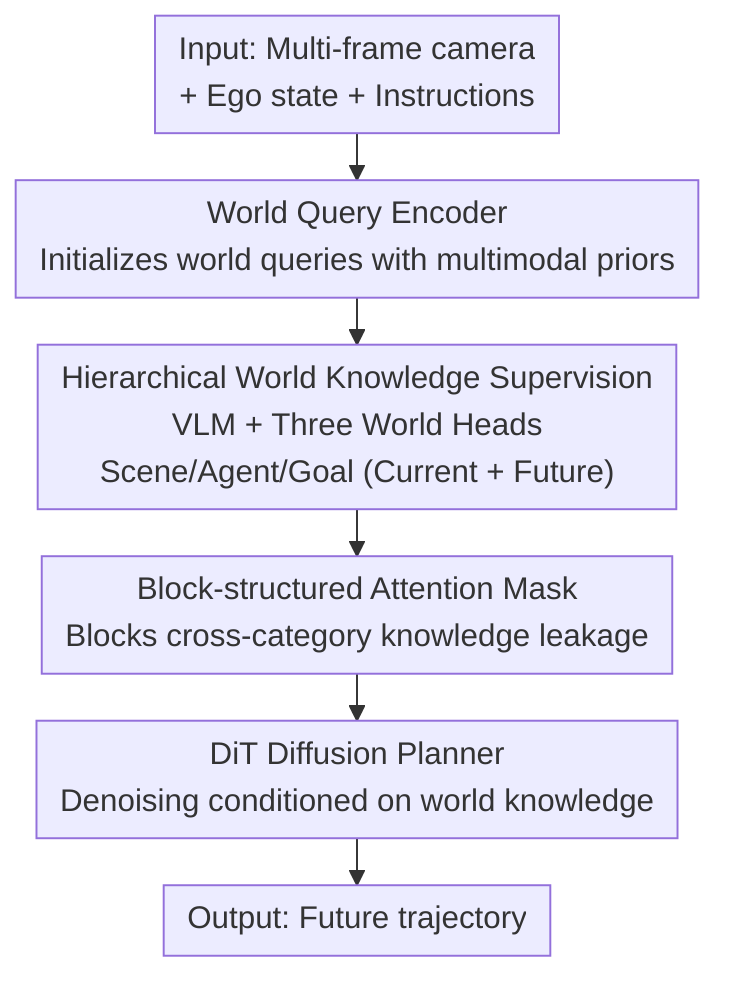

# SGDrive: Scene-to-Goal Hierarchical World Cognition for Autonomous Driving  

**Conference**: CVPR 2026  
**Paper**: [CVF Open Access](https://openaccess.thecvf.com/content/CVPR2026/html/Li_SGDrive_Scene-to-Goal_Hierarchical_World_Cognition_for_Autonomous_Driving_CVPR_2026_paper.html)  
**Code**: https://github.com/LogosRoboticsGroup/SGDrive  
**Area**: Autonomous Driving / Multimodal VLM  
**Keywords**: End-to-end driving, Vision-Language Model, World knowledge, Hierarchical Cognition, Diffusion Planning  

## TL;DR  
SGDrive explicitly injects a hierarchical world knowledge set of "scene geometry-key agents-short-term goals" into a Vision-Language Model (VLM). It uses a set of trainable `<world>` queries to predict current and future world states, then translates this knowledge into trajectories via a DiT diffusion planner, achieving SOTA on the NAVSIM camera-only track (PDMS 87.4, 91.1 after RL).  

## Background & Motivation  
**Background**: End-to-end (E2E) autonomous driving has shifted from modular pipelines to unified planning frameworks (UniAD, VAD, SparseDrive, etc.). Recent works integrate prior knowledge and reasoning from VLMs into planning (DriveLM, EMMA, ReCogDrive, etc.) to mitigate the lack of causal reasoning in imitation learning for long-tail scenarios.  

**Limitations of Prior Work**: VLMs are inherently "generalist" models trained for semantic understanding. They lack three essentials for driving: (1) Spatial perception: little concept of 3D geometry or depth; (2) Prioritization: a tendency to view scenes uniformly without identifying critical agents affecting the ego-vehicle; (3) Future world prediction: absence of temporal modeling for scene evolution.  

**Key Challenge**: Generalist VLMs learn understanding on a "semantic plane," whereas safe driving requires a "3D spatio-structurally" structured world representation that organizes geometric relationships, scene context, and motion patterns into a compact form for planning. Connecting a VLM directly to a trajectory decoder forces a model lacking spatial structure to perform tasks requiring it.  

**Goal**: To enforce a "driving-specific knowledge hierarchy" onto VLM representation learning without discarding its strong priors, enabling it to represent the current world and extrapolate future states.  

**Key Insight**: Imitating the cognitive sequence of human drivers: first observing the overall environment (scene), then focusing on safety-critical objects and behaviors (agents), and finally determining a short-term goal before executing actions. This scene-agent-goal hierarchy serves as a natural structured spatio-temporal representation.  

**Core Idea**: Introduce a set of `<world>` special tokens divided into scene/agent/goal sub-queries. Supervise these using occupancy, detection, and goal regression to learn hierarchical world knowledge. Use block-structured attention masks to prevent cross-contamination of knowledge types. Finally, use a DiT diffusion planner to generate trajectories conditioned on this world knowledge.  

## Method  

### Overall Architecture  
SGDrive is built upon a pre-trained VLM (InternVL3-2B, InternViT image encoder + Qwen2.5 language model). Inputs consist of multi-frame front camera images $I_{cam}$, ego-state $S_{ego}$, and natural language instructions $L_{ins}$; the output is the future trajectory. The core component is a set of `<world>` queries initialized by a "World Query Encoder" using multimodal priors. These are fused by the VLM with text/visual embeddings into a compact hierarchical world representation $O_{world}$. A set of hierarchical world heads $D$ decodes three types of knowledge—scene geometry $w_{geo}$, key agent states $w_{agt}$, and short-term goals $w_{goal}$—predicting both current time $t$ and future $t+n$. These `<world>` queries serve as latent conditions for a DiT diffusion planner to denoise and generate future waypoints.  

### Key Designs  

**1. Hierarchical World Knowledge Supervision: Forcing 3D Spatio-temporal Structure via Three Explicit Supervisions**  
This core design addresses VLM limitations in space, focus, and prediction. Driving understanding is decomposed into scene-agent-goal layers:  

- **Scene Geometry**: Occupancy supervision forces the model to learn geometric structure rather than just semantic distribution. In the absence of occupancy labels, they are generated from point clouds. $W_{geo}$ is treated as a latent embedding for geometric reconstruction via a VAE decoder. Due to sparsity, a resampling strategy uses two classification losses to balance occupied/unoccupied space: $L_{geo}^{t,t+n}=\frac{1}{M}\sum_i \mathrm{CE}(o_i,\hat o_i)+\frac{1}{N}\sum_j \mathrm{BCE}(p_j,\hat p_j)$, where $o_i\in\{0,1\}$ is the occupancy label and $p_j$ the candidate position.  
- **Key Agent Detection**: Instead of detecting all objects, the model focuses on "safety-critical" agents (cars, pedestrians, cyclists) based on ego-trajectories and visibility. Standard DETR-style set matching loss (bipartite matching $\hat\sigma$) is used to predict 3D states at $t$ and $t+n$: $L_{agent}=\sum_i [\lambda_{cls}L_{cls}+\mathbb{1}_{c\neq\varnothing}L_{reg}]$, prioritizing representation capacity for relevant objects.  
- **Short-term Goal Prediction**: At the top of the hierarchy, ego-intent is implicitly derived to predict the goal pose $\hat p_{goal}$ at approximately 4 seconds into the future. A lightweight MLP decodes this with L1 supervision: $L_{goal}=\|\hat p_{goal}-p_{goal}\|_1$. This decouples high-level decision-making from low-level trajectory planning.  

**2. Block-structured Attention Mask: Preventing Knowledge Contamination**  
To avoid representation pollution where different `<world>` queries interfere with each other, queries are divided into five sub-queries. A block-structured mask (Figure 3b in original paper) prohibits mutual attention between different knowledge categories while allowing temporal attention within the same category. All sub-queries retain cross-attention to visual/text inputs. This maintains specialized hierarchical representations while allowing necessary information flow.  

**3. DiT Diffusion Planner: Lossless Translation of World Knowledge to Trajectories**  
The DiT diffusion planner uses `<world>` queries directly as latent conditions. It denoises a waypoint sequence $A=(a_1,\dots,a_N)$ from noise $A_T$ to $A_0$. Rather than pure Gaussian noise, $A_T$ starts from a "learned prior" projected from the world queries and history, anchoring the diffusion process. Training follows the L2 objective $L_{diff}=\mathbb{E}\|\epsilon-\epsilon_\theta(A_t,t,c)\|_2^2$.  

### Loss & Training  
Two-stage training is employed. **Stage 1 (SFT)**: Trains the VLM for VQA and world knowledge acquisition with $L_{Stage1}=L_{text}+L_{occ}^{t,t+n}+\lambda_{agent}L_{agent}^{t,t+n}+L_{goal}$ ($\lambda_{agent}=0.1$). It uses 3.1M QA pairs for 1 epoch and 85k trajectory QA pairs for 3 epochs. **Stage 2**: Freezes the VLM and trains the DiT planner for 220 epochs using $L_{diff}$. Training utilized 32 H20 GPUs.  

## Key Experimental Results  

### Main Results  
Evaluated on NAVSIM v1 navtest (PDMS metric including NC, DAC, TTC, Comf., EP). SGDrive-2B (SFT) achieved 87.4 PDMS, outperforming larger VLMs (InternVL3-8B 83.3) and ReCogDrive-8B (86.8). With RL-based fine-tuning (RFT), it reached 91.1.  

| Setting | Method | Input | NC↑ | DAC↑ | TTC↑ | EP↑ | PDMS↑ |  
| :--- | :--- | :--- | :--- | :--- | :--- | :--- | :--- |  
| E2E | WoTE | Image+LiDAR | 98.5 | 96.8 | 94.9 | 81.9 | 88.3 |  
| SFT | ReCogDrive-8B | Image | 98.3 | 95.1 | 94.3 | 81.1 | 86.8 |  
| SFT | **Ours-2B** | Image | **98.6** | 95.1 | **95.4** | 81.2 | **87.4** |  
| RFT | ReCogDrive-2B | Image | 97.9 | 97.3 | 94.9 | 87.3 | 90.8 |  
| RFT | **Ours-2B** | Image | **98.6** | **97.8** | **96.2** | 85.8 | **91.1** |  

Ours achieved best results in collision-related metrics (NC, TTC), validating that explicit spatio-temporal prediction enhances safety perception.  

### Ablation Study  

| Experiment | Config | PDMS↑ | Description |  
| :--- | :--- | :--- | :--- |  
| Stage 1 (a) | Base only, no world knowledge | 82.2 | Baseline |  
| Stage 1 (b) | + Current world representation | 84.7 | Activates 3D environmental understanding (+2.5) |  
| Stage 1 (c) | + Future world prediction | 85.5 | Enhances safety and efficiency |  
| Planning (a) | Scene queries only | 86.0 | Only scene geometry |  
| Planning (b) | + Agent | 86.3 | Gain in NC/DAC |  
| Planning (c) | + Goal | 87.0 | Gain in EP (high-level intent) |  
| Planning (d) | + Future | **87.4** | Full config, further TTC/NC gain |  
| Mask | Causal Attention | 87.1 | Cross-category noise, over-conservative |  
| Mask | Structured Mask | **87.4** | Higher EP, more realistic driving |  

### Key Findings  
- Hierarchical world knowledge is the primary source of gain.  
- Sub-query types serve distinct purposes: agents improve NC/DAC (collision avoidance), goals improve EP (efficiency), and future prediction boosts TTC/NC.  
- Structured masks correct over-conservative behavior caused by causal attention, increasing EP.  
- Qualitatively, SGDrive adaptively expands perception at high speeds and shifts attention toward turns.  

## Highlights & Insights  
- **Encoding Human Cognitive Sequences**: Scene→agent→goal is implemented as concrete losses (occupancy, detection, regression), providing the VLM with 3D structure.  
- **Dual-purpose `<world>` Queries**: Tokens act as both supervision anchors and planning conditions, avoiding lossy decoding during inference.  
- **Transferable Mask Strategy**: The block-structured mask is a generic solution for preventing feature pollution in multi-task shared token designs.  
- **Superiority of Camera-only Input**: A 2B model outperforms 8B VLMs and LiDAR-based E2E methods, suggesting that supervision structure is more critical than parameters or sensors.  

## Limitations & Future Work  
- Evaluation relies on NAVSIM (small navtest set with 136 scenes); broader validation is needed for closed-loop generalization.  
- Dependence on supervision quality: Pseudo-labels for occupancy and agents may introduce noise.  
- High training cost and reliance on RFT to reach peak performance.  
- Goal setting is limited to a single future pose, which may be insufficient for multi-modal intent branches.  

## Related Work & Insights  
- **vs ReCogDrive / EMMA**: These models lacks explicit hierarchical world modeling; SGDrive’s 2B model outperforms their 8B counterparts by predicting scene-agent-goal states.  
- **vs UniAD / SparseDrive**: While those use vectorized perception for E2E learning, SGDrive leverages VLM priors for superior causal reasoning and generalization.  
- **vs WoTE**: SGDrive integrates world modeling into the VLM representation itself, surpassing LiDAR-based WoTE with cameras only.  

## Rating  
- Novelty: ⭐⭐⭐⭐  
- Experimental Thoroughness: ⭐⭐⭐⭐  
- Writing Quality: ⭐⭐⭐⭐  
- Value: ⭐⭐⭐⭐  

<!-- RELATED:START -->

## Related Papers

- [\[CVPR 2026\] ColaVLA: Leveraging Cognitive Latent Reasoning for Hierarchical Parallel Trajectory Planning in Autonomous Driving](colavla_leveraging_cognitive_latent_reasoning_for_hierarchical_parallel_trajecto.md)
- [\[CVPR 2026\] Learning Vision-Language-Action World Models for Autonomous Driving](vla_world_learning_vision_language_action_world_models_for_autonomous_driving.md)
- [\[ICCV 2025\] DriveX: Omni Scene Modeling for Learning Generalizable World Knowledge in Autonomous Driving](../../ICCV2025/autonomous_driving/drivex_omni_scene_modeling_for_learning_generalizable_world_knowledge_in_autonom.md)
- [\[CVPR 2026\] GaussianDWM: 3D Gaussian Driving World Model for Unified Scene Understanding and Multi-Modal Generation](gaussiandwm_3d_gaussian_driving_world_model_for_unified_scene_understanding_and_.md)
- [\[CVPR 2026\] DynamicVGGT: Learning Dynamic Point Maps for 4D Scene Reconstruction in Autonomous Driving](dynamicvggt_learning_dynamic_point_maps_for_4d_scene_reconstruction_in_autonomou.md)

<!-- RELATED:END -->
