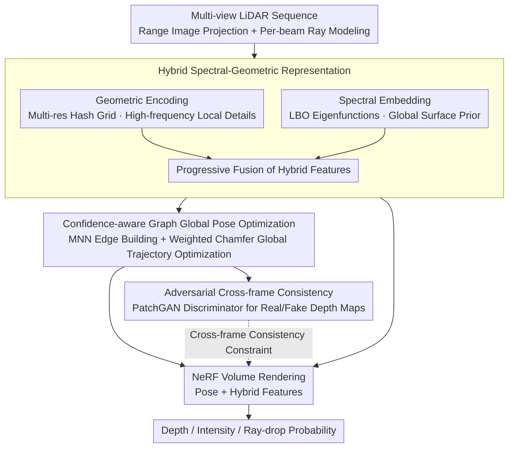

# SG-NLF: Spectral-Geometric Neural Fields for Pose-Free LiDAR View Synthesis

**Conference**: CVPR 2026  
**arXiv**: [2603.12903](https://arxiv.org/abs/2603.12903)  
**Code**: None  
**Area**: Autonomous Driving  
**Keywords**: Pose-free LiDAR, NeRF, Spectral Embedding, Confidence-aware Graph Optimization, Adversarial Cross-frame Consistency  

## TL;DR
SG-NLF proposes a LiDAR NeRF framework that does not require precise poses. It solves geometric holes caused by sparse LiDAR data through a hybrid spectral-geometric representation, achieves global pose optimization via a confidence-aware graph, and strengthens cross-frame consistency using adversarial learning. Reconstruction quality and pose accuracy improve by 35.8% and 68.8% respectively compared to SOTA on nuScenes.

## Background & Motivation
LiDAR Novel View Synthesis (NVS) is crucial for autonomous driving perception, as it expands the perception horizon and enhances system robustness. Existing methods face two core challenges: (1) most LiDAR NeRF methods rely on precise camera poses, which are difficult to obtain in real-world scenarios; (2) LiDAR point clouds are naturally sparse and lack texture information. Traditional geometric interpolation encoding (such as multi-resolution hash encoding) struggles to reconstruct continuous and complete surfaces in unobserved regions, leading to geometric holes and discontinuities. Existing pose-free methods like GeoNLF attempt simultaneous registration and reconstruction but rely only on pairwise alignment constraints, resulting in limited global trajectory accuracy. These issues are exacerbated in low-frequency LiDAR sequences with large inter-frame motion and minimal overlap.

## Core Problem
How to achieve high-quality scene reconstruction and precise global pose estimation simultaneously from sparse LiDAR point cloud sequences without relying on precise poses? The key difficulty lies in the sparse, textureless nature of LiDAR data, where pure geometric interpolation cannot fill in geometric information for unobserved areas, and pairwise pose alignment cannot guarantee global trajectory consistency.

## Method

### Overall Architecture

SG-NLF aims to perform high-quality reconstruction and global pose estimation from sparse LiDAR sequences without precise poses. Given multi-view LiDAR sequences $\{S_i\}$, point clouds are first projected into range images, with each laser beam modeled as a ray. Subsequently, a hybrid spectral-geometric representation extracts scene features. A confidence-aware graph performs global pose optimization based on these features, and adversarial learning tightens consistency across frames. The optimized poses and hybrid features are fed into NeRF to synthesize depth, intensity, and ray-drop probability through volume rendering.

### Key Designs

**1. Hybrid Spectral-Geometric Representation: Providing Global Surface Priors for Sparse LiDAR**

LiDAR point clouds are naturally sparse and lack texture; pure geometric interpolation encoding ($f_{geo}$) cannot fill continuous surfaces in unobserved areas, leaving holes. Beyond $f_{geo}$, SG-NLF introduces differentiable spectral embeddings $f_{spe}$ based on the Laplace-Beltrami Operator (LBO). An MLP approximates the first $K$ LBO eigenfunctions by minimizing the Rayleigh quotient, with orthogonality and normalization constraints applied to ensure validity. Spectral embeddings possess intrinsic isometric invariance and naturally encode global structural priors, compensating for interpolation failures. These are progressively fused into hybrid features $f_{hyb}$, where low-frequency spectral embeddings provide smooth global geometry and high-frequency geometric encoding preserves local details.

**2. Confidence-aware Graph Global Pose Optimization: Replacing Pairwise Alignment with a Consistent Pose Graph**

GeoNLF uses only pairwise constraints, limiting global trajectory accuracy, especially in low-frequency sequences. SG-NLF constructs a pose graph $G=(V,E)$, where vertices represent frame point clouds and poses. Edges are created between adjacent frames and non-adjacent frames based on compatibility scores of hybrid features. A coarse-to-fine Mutually Nearest Neighbors (MNN) strategy establishes point-level correspondences, using cosine similarity as a compatibility score for edge creation. Each edge is weighted by a spatial consistency score (checking distance preservation between point pairs). Finally, the global pose is optimized using a weighted Chamfer Distance loss. Compared to pairwise constraints, the graph structure allows distant but reliable frame pairs to constrain each other.

**3. Adversarial Cross-frame Consistency: Using a Discriminator to Verify Reconstruction and Pose**

Existing methods only perform pixel-level supervision on single range images, ignoring cross-frame structural information. SG-NLF transforms reconstructed point clouds into adjacent frame coordinates using estimated relative poses to render "fake" depth maps. These are paired with "real" depth maps and fed into a multi-scale PatchGAN discriminator. To distinguish real from fake, the discriminator must monitor both reconstruction quality and pose accuracy, detecting geometric misalignments at both global and local scales, serving as a self-supervised consistency referee for pose-free training.

### Loss & Training

Total Loss = Spectral Loss (Rayleigh quotient + Orthogonality + Normalization) + Graph Optimization Loss (Weighted CD) + Cross-frame Consistency Loss (Adversarial hinge loss) + Range image supervision loss. Training involves 60k iterations with a batch size of 4096 rays, using the Adam optimizer and linear power decay for the 0.01 learning rate. Poses are optimized in Lie algebra space, with Jacobian-free implementations for stable convergence.

## Key Experimental Results

### Low-frequency Scenes (KITTI-360, 2Hz sampling)

| Method | CD↓ | Depth PSNR↑ | Intensity PSNR↑ |
|------|------|-------------|-----------------|
| LiDAR4D (with GT pose) | 0.276 | 24.728 | 16.951 |
| GeoNLF (pose-free) | 0.236 | 25.276 | 16.581 |
| **SG-NLF (Ours)** | **0.170** | **28.707** | **19.265** |

### Low-frequency Scenes (nuScenes, 2Hz sampling)

| Method | CD↓ | Depth PSNR↑ | Intensity PSNR↑ |
|------|------|-------------|-----------------|
| LiDAR4D (with GT pose) | 0.567 | 17.092 | 24.475 |
| GeoNLF (pose-free) | 0.241 | 22.947 | 28.608 |
| **SG-NLF (Ours)** | **0.155** | **28.409** | **30.499** |

### Pose Estimation (ATE, m)

| Method | KITTI-360 | nuScenes |
|------|-----------|----------|
| GeoNLF | 0.170 | 0.228 |
| **SG-NLF** | **0.074** | **0.071** |

### Ablation Study

- **Spectral Embedding Contribution**: Removing geometric encoding and using only spectral embedding (w/o GE) still outperforms GeoNLF significantly (CD: 0.181 vs 0.241), indicating that the spectral prior is the core component.
- **Optimal Hybrid Representation**: Adding geometric encoding further improves performance (CD: 0.155) as it provides necessary high-frequency details.
- **Necessity of Module Synergy**: Removing any module (HR/GP/CFC) leads to a significant performance drop. Performance drops to CD 0.217 without HR and to CD 0.463 without GP.
- **Effectiveness of Cross-frame Consistency**: Even without pose optimization, adding CFC improves training through regularization (compared to baseline and w/o GP).

## Highlights & Insights
- **Spectral Embeddings for LiDAR NeRF**: Utilizing the isometric invariance of LBO eigenfunctions to compensate for geometric holes is an ingenious design. Introducing tools from differential geometry into volume rendering provides a structural prior advantage over pure hash encoding interpolation.
- **GAN Discriminator for Cross-frame Consistency**: By comparing real/fake transformed depth maps, the discriminator evaluates both reconstruction quality and pose accuracy simultaneously. This self-supervised approach can be transferred to other multi-view reconstruction tasks.
- **Compatibility Scoring in Graph Optimization**: Using learned feature similarity for edge selection is more flexible than fixed temporal adjacency, which is particularly suitable for low-frequency (large motion) scenarios.

## Limitations & Future Work
- Currently handles only static scenes, neglecting dynamic objects (unlike LiDAR4D or STGC).
- Spectral embedding requires additional Monte Carlo sampling and eigenfunction MLPs, increasing computational overhead; efficiency is not discussed in detail.
- Validated only on KITTI-360 and nuScenes; other LiDAR sensor configurations have not been tested.
- The paper claims "an efficient implementation," hinting at other unexplored potential implementations of the framework.

## Related Work & Insights
- **vs GeoNLF**: The most direct comparison as pose-free LiDAR NeRF. GeoNLF uses pure geometric interpolation and pairwise alignment; SG-NLF surpasses it in all aspects (35.8% reduction in CD, 68.8% reduction in ATE on nuScenes).
- **vs LiDAR4D**: Despite LiDAR4D using GT poses, SG-NLF outperforms it (38.5% reduction in CD), suggesting that representation capability is more critical than pose precision.
- **vs BARF/HASH (Image-based pose-free methods)**: These perform poorly when adapted to LiDAR, highlighting the need for methods specifically designed for sparse data.

## Relevance to research
- The use of spectral embeddings as geometric priors can be transferred to other 3D tasks such as 3D occupancy prediction or point cloud registration.
- The edge selection strategy in confidence-aware graph optimization can serve as a reference for dynamically selecting reliable view pairs in multi-view fusion.

## Rating
- Novelty: ⭐⭐⭐⭐ The combination of spectral embedding and LiDAR NeRF is novel, though individual components (spectral analysis, graph optimization, GAN) are established.
- Experimental Thoroughness: ⭐⭐⭐⭐⭐ Comprehensive evaluation across two datasets, variants of frequency, extensive ablations, and qualitative/quantitative comparisons.
- Writing Quality: ⭐⭐⭐⭐ Clear structure, complete mathematical derivations, and informative diagrams.
- Value: ⭐⭐⭐ The spectral embedding concept is inspiring, though LiDAR NVS is not the core research focus.

<!-- RELATED:START -->

## Related Papers

- [\[ICLR 2026\] Spectral-Geometric Neural Fields for Pose-Free LiDAR View Synthesis](../../ICLR2026/autonomous_driving/spectral-geometric_neural_fields_for_pose-free_lidar_view_synthesis.md)
- [\[CVPR 2026\] VGGDrive: Empowering Vision-Language Models with Cross-View Geometric Grounding for Autonomous Driving](vggdrive_empowering_vision-language_models_with_cross-view_geometric_grounding_f.md)
- [\[CVPR 2026\] Neural Distribution Prior for LiDAR Out-of-Distribution Detection](neural_distribution_prior_for_lidar_ood_detection.md)
- [\[CVPR 2026\] Learning Geometric and Photometric Features from Panoramic LiDAR Scans for Outdoor Place Categorization](learning_geometric_and_photometric_features_from_p.md)
- [\[CVPR 2026\] LiREC-Net: A Target-Free and Learning-Based Network for LiDAR, RGB, and Event Calibration](lirec-net_a_target-free_and_learning-based_network_for_lidar_rgb_and_event_calib.md)

<!-- RELATED:END -->
