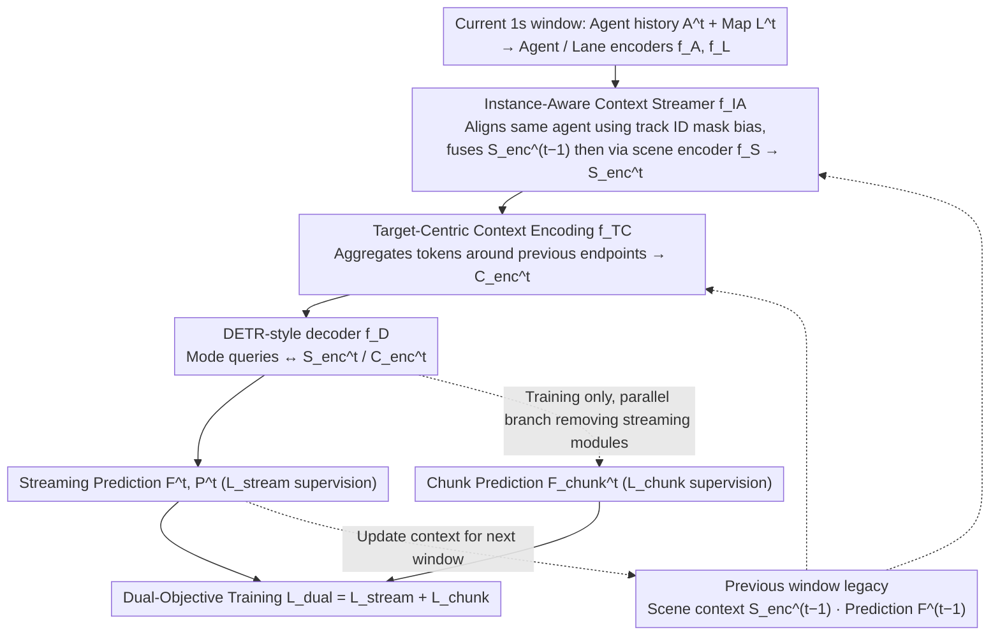

# SHARP: Short-Window Streaming for Accurate and Robust Prediction in Motion Forecasting

**Conference**: CVPR 2026  
**arXiv**: [2603.28091](https://arxiv.org/abs/2603.28091)  
**Code**: None  
**Area**: Autonomous Driving / Trajectory Prediction  
**Keywords**: Streaming Motion Forecasting, Heterogeneous Observation Lengths, Instance-Aware Context Stream, Short-Window Inference, Multi-Agent Prediction

## TL;DR

Proposes SHARP, a motion forecasting framework based on short-window streaming inference. It explicitly maintains and updates agent latent representations across time steps via an instance-aware context stream module. Combined with a dual-objective training strategy, it achieves SOTA on the Argoverse 2 multi-agent benchmark for streaming inference while maintaining extremely low latency.

## Background & Motivation

1. **Background**: Trajectory prediction is a core component of the autonomous driving control stack. SOTA methods achieve high precision on large-scale datasets. However, these benchmarks only consider fixed-size historical and future windows, whereas in real driving, historical context lengths are heterogeneous—vehicles newly entering the field of view have very short observation histories.

2. **Limitations of Prior Work**: (1) Methods relying on long context must delay prediction for newly detected agents until sufficient observations are accumulated; (2) Existing streaming methods (e.g., RealMotion, DeMo) transmit information across time steps but use a fixed number of streaming passes during training, leading to performance degradation under different streaming step counts; (3) Existing context stream mechanisms rely solely on positional correspondence without explicitly modeling instance correspondence.

3. **Key Challenge**: Real-world driving scenarios involve continuous evolution where the available observation lengths of different agents vary significantly (from several frames to several seconds), but most methods can only handle fixed-length inputs.

4. **Goal**: (1) How to make accurate predictions from short observation windows; (2) How to reliably propagate context information in continuously evolving scenarios; (3) How to maintain a lightweight architecture to meet real-time inference requirements.

5. **Key Insight**: Process observation streams incrementally using short windows (1 second) and maintain long-term memory for agents through an instance-aware context stream mechanism.

6. **Core Idea**: Short-window input + Instance-aware cross-window context transfer + Streaming/Single-chunk dual-objective training = Accurate and robust prediction under arbitrary observation lengths.

## Method

### Overall Architecture

The core problem SHARP addresses is the significant variance in historical lengths for agents in real driving (some vehicles have only a few frames while others have several seconds). Mainstream models take fixed-length inputs, leading to delayed predictions or failure with short histories. SHARP segments continuous observation streams into 1-second short windows processed incrementally, allowing long-term information to flow between windows as "context" rather than re-feeding long history segments each time.

Specifically: The current window's agent historical states $A^t \in \mathbb{R}^{N_a \times T_h \times D_a}$ and map $L^t$ go through an encoder $f_E$ to obtain scene context $S_{\text{enc}}^t$ and target-centric features $C_{\text{enc}}^t$ (guided by the previous step's predicted endpoints). During streaming inference, the model fuses the scene context $S_{\text{enc}}^{t-1}$ and prediction $F^{t-1}$ from the previous window into the current representation. A DETR-style decoder then outputs multimodal trajectories $(F^t, P^t)$ and passes the updated context to the next step. During training, the model is intentionally tasked to learn both "with context" and "without context" predictions, ensuring robustness regardless of observation length.

### Key Designs

**1. Instance-Aware Context Streamer: Aligning representations of the same vehicle across windows using track IDs**

The simplest way to pass context across windows is cross-attention—using the current scene representation $S^t$ to query $S_{\text{enc}}^{t-1}$ from the previous step. However, attention only considers geometric positions and does not identify that a specific token in the previous frame is the same vehicle in the current frame. Existing methods like RealMotion and DeMo rely on motion-aware layer norm to compensate for coordinate drift, leaving instance correspondence implicit and prone to mismatch. SHARP utilizes the track IDs already present in the input: a mask is added to the cross-attention to apply a learnable bias to query-key pairs matching the same instance, explicitly increasing the correlation weight for the same agent across time steps. Combined with the short-window design, this also gains the ability to recover from tracking loss—if a track breaks, it is treated as a new instance in the next window without accumulating errors.

**2. Target-Centric Context Encoding: Supplementing fine-grained context around predicted future positions**

Encoding only the context where the agent is currently located provides limited help for predicting distant endpoints. SHARP treats the $K$ predicted endpoints from the previous step as anchors. Centered at each endpoint, scene tokens (nearby agents + lanes) are re-aggregated in a compact local region to form target-centric features $C_{\text{enc}}^t \in \mathbb{R}^{K \times (N_a + N_l)' \times D}$. Each endpoint acts as the origin of its local coordinate system, additionally encoding its spatial relationship with the focal agent. While $f_{TC}$ uses the same architecture as the agent-centric encoder $f_S$, it only processes a small cluster of tokens near the endpoints, maintaining low latency. The intuition is that predicted endpoints point to where vehicles might go; seeing the environment clearly at those locations leads to more accurate predictions.

**3. Dual Training: Simultaneously learning to use and ignore context on the same data**

Short windows enable streaming inference but introduce a risk: if the model always sees context during training, it may fail on newly detected agents with no history. SHARP splits training scenarios into non-overlapping short windows. For each new chunk, it produces two predictions: one with streaming context $F^t$ (supervised by $\mathcal{L}_{\text{stream}}$) and one viewing only the current chunk $F_{\text{chunk}}^t$ (supervised by $\mathcal{L}_{\text{chunk}}$), optimizing:

$$\mathcal{L}_{\text{dual}} = \mathcal{L}_{\text{stream}} + \mathcal{L}_{\text{chunk}}$$

Each term consists of cross-entropy classification loss and Smooth L1 regression loss (WTA strategy). This ensures the model learns to exploit context when available while retaining the capability to provide reliable predictions from a single chunk. Combined with short windows, this increases gradient updates and prediction range, improving stability over any observation length.

### Loss & Training

The overall training objective is $\mathcal{L}_{\text{dual}}$ as defined above, using WTA-based cross-entropy and Smooth L1 regression for both streaming and chunk branches. Window length is set to 1 second (compared to 3s windows with 1s shifts in RealMotion/DeMo), allowing denser gradient updates. Multi-agent prediction expands on this: marginal predictions are generated for each agent, then combined into joint predictions via cross-agent/cross-modal interaction blocks.

## Key Experimental Results

### Main Results

AV2 Multi-agent Test Set:

| Method | Streaming | avgMinADE₁ | avgMinFDE₁ | actorMR₆ | avgBrierMinFDE₆ |
|------|------|-----------|-----------|---------|----------------|
| Forecast-MAE | ✗ | 1.30 | 3.33 | 0.19 | 2.24 |
| RealMotion | ✓ | 1.14 | 2.87 | 0.18 | 2.01 |
| DeMo | ✓ | 1.12 | 2.78 | 0.16 | 1.93 |
| **SHARP (Ours)** | ✓ | **1.03** | **2.53** | **0.15** | **1.80** |

AV2 Single-agent Test Set:

| Method | MR₆ | mADE₆ | mFDE₆ | b-mFDE₆ |
|------|-----|-------|-------|---------|
| QCNet | 0.16 | 0.65 | 1.29 | 1.91 |
| DeMo | 0.13 | 0.61 | 1.17 | 1.84 |
| **SHARP** | 0.14 | 0.64 | 1.19 | **1.83** |

### Ablation Study

Contribution of components on AV2 Val ($T_{cl}=5s$):

| TCF | IA | DT | mADE₆ | mFDE₆ | b-mFDE₆ |
|-----|----|----|-------|-------|---------|
| ✗ | ✗ | ✗ | 0.74 | 1.28 | 1.91 |
| ✓ | ✗ | ✗ | 0.64 | 1.22 | 1.84 |
| ✓ | ✓ | ✗ | 0.63 | 1.19 | 1.81 |
| ✓ | ✓ | ✓ | 0.64 | 1.20 | 1.82 |

Critical role of Dual Training at short context $T_{cl}=1s$:

| TCF | IA | DT | mADE₆ | mFDE₆ | b-mFDE₆ |
|-----|----|----|-------|-------|---------|
| ✓ | ✗ | ✗ | 1.09 | 2.49 | 3.18 |
| ✓ | ✓ | ✗ | 1.11 | 2.55 | 3.25 |
| ✓ | ✓ | ✓ | **0.76** | **1.48** | **2.13** |

### Key Findings

- **Dual Training is vital for short context**: At $T_{cl}=1s$, adding DT reduces b-mFDE₆ by 34% (3.25 to 2.13), showing the chunk branch provides critical short-window capability.
- **SHARP consistency across context lengths**: In evolving scenario evaluations, competitive performance is maintained from 1s to 8s lengths, whereas others degrade when deviating from standard configurations.
- **Instance-aware mechanism value**: While improvements at 5s are marginal (1.81 to 1.82), it allows the model to explicitly leverage tracking information.
- **Multi-agent SOTA**: Outperforms DeMo by 6.7% (1.93 to 1.80), demonstrating the advantage of streaming in joint prediction.
- **Longer horizon advantage**: At $T_{cl}=8s$, $t_p=8s$, SHARP's b-mFDE₆=1.08 while DeMo degrades to 1.48.

## Highlights & Insights

- **Implicit advantages of short windows**: Improvements in training efficiency (more updates per scene) and natural recovery from tracking loss represent significant advantages over 3-second window methods.
- **Elegant Dual Training design**: Explicitly handles the presence/absence of context, ensuring the model exploits context when available without collapsing when it is missing.
- **Evolving scenario evaluation protocol**: The proposed framework for evaluating combinations of $t_p$ and $T_{cl}$ is closer to real deployment needs and represents a significant contribution to the community.

## Limitations & Future Work

- **Perception noise unconsidered**: Assumes perfect inputs for detection and tracking; real-world noise may impact performance.
- **Window size selection**: Whether a 1-second window is optimal for all scenarios is not fully discussed.
- **Single-agent trade-off**: Not optimal across all metrics (e.g., MR₆ = 0.14 vs. DeMo's 0.13), trading off for robustness to heterogeneous lengths.
- **Missing detailed latency analysis**: While "minimal latency" is mentioned, specific numbers are not provided.

## Related Work & Insights

- **vs RealMotion**: Performance degrades significantly when deviating from standard configurations; SHARP is much more generalizable due to short windows and dual training.
- **vs DeMo**: Similar degradation in non-standard steps; SHARP excels at longer contexts (8s).
- **vs FLN/LaKD**: These use knowledge distillation for length but lack information flow, making predictions independent—unsuitable for the continuous operation of actual deployment.

## Rating

- Novelty: ⭐⭐⭐⭐
- Experimental Thoroughness: ⭐⭐⭐⭐⭐
- Writing Quality: ⭐⭐⭐⭐
- Value: ⭐⭐⭐⭐⭐

<!-- RELATED:START -->

## Related Papers

- [\[CVPR 2026\] FlashCap: Millisecond-Accurate Human Motion Capture via Flashing LEDs and Event-Based Vision](flashcap_millisecond-accurate_human_motion_capture_via_flashing_leds_and_event-b.md)
- [\[ICCV 2025\] Future-Aware Interaction Network For Motion Forecasting](../../ICCV2025/autonomous_driving/future-aware_interaction_network_for_motion_forecasting.md)
- [\[CVPR 2026\] StreamVLO: Streaming Visual-LiDAR Odometry with Cumulative Drift Compensation](streamvlo_streaming_visual-lidar_odometry_with_cumulative_drift_compensation.md)
- [\[CVPR 2026\] ReMoT: Reinforcement Learning with Motion Contrast Triplets](remot_reinforcement_learning_with_motion_contrast_triplets.md)
- [\[CVPR 2026\] Bezier Degradation Modeling for LiDAR-based Human Motion Capture](bezier_degradation_modeling_for_lidar-based_human_motion_capture.md)

<!-- RELATED:END -->
