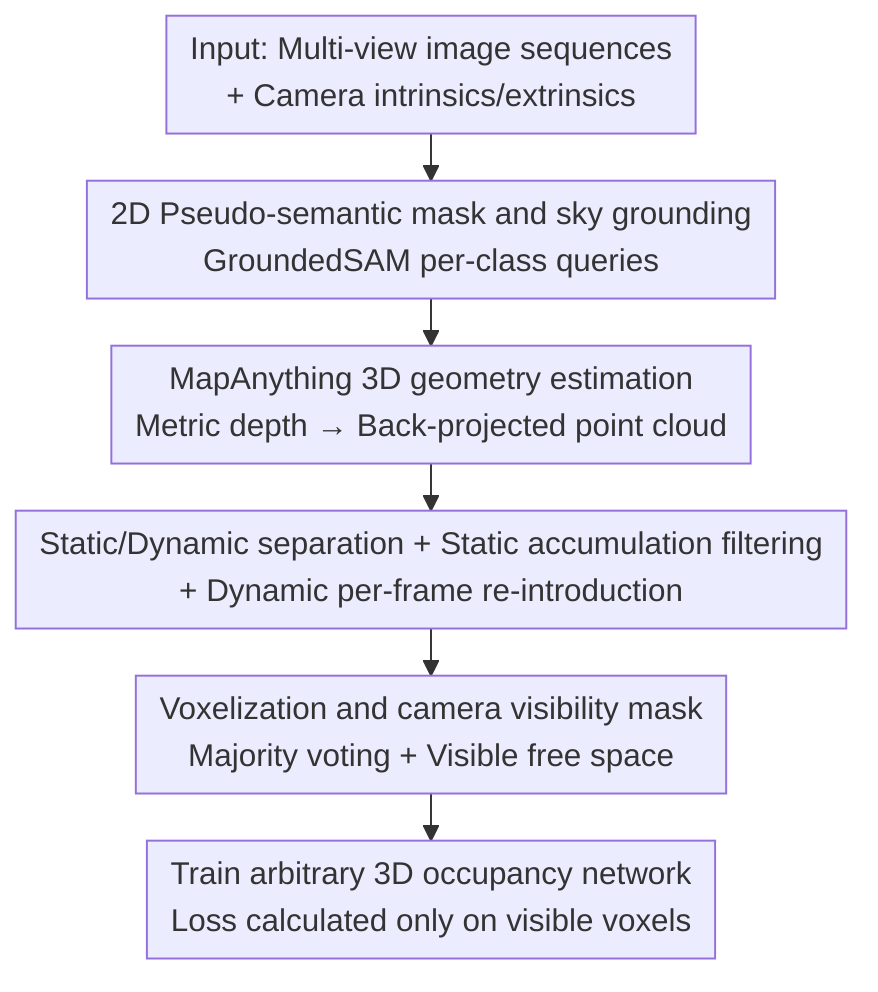

# ShelfOcc: Native 3D Supervision beyond LiDAR for Vision-Based Occupancy Estimation

**Conference**: CVPR 2026  
**Paper**: [CVF Open Access](https://openaccess.thecvf.com/content/CVPR2026/html/Boeder_ShelfOcc_Native_3D_Supervision_beyond_LiDAR_for_Vision-Based_Occupancy_Estimation_CVPR_2026_paper.html)  
**Code**: https://github.com/boschresearch/ShelfOcc  
**Area**: Autonomous Driving / 3D Vision  
**Keywords**: Occupancy Estimation, Weakly Supervised, Geometric Foundation Models, Pseudo-labels, LiDAR-free  

## TL;DR
ShelfOcc departs from using 2D rendering losses to supervise occupancy networks. Instead, it utilizes geometric foundation models (MapAnything) and semantic segmentation foundation models (GroundedSAM) to generate metric-consistent 3D semantic voxel pseudo-labels from pure multi-view video as "native 3D supervision." This achieves up to a 34% relative improvement in weakly/shelf-supervised occupancy estimation on Occ3D-nuScenes without any reliance on LiDAR.

## Background & Motivation
**Background**: 3D occupancy estimation is fundamental for autonomous driving perception. Fully supervised methods perform well but rely heavily on dense 3D ground truth from LiDAR annotations, which are costly and rare in fleet vehicles lack reference sensors. To eliminate 3D labels, researchers have turned to weakly supervised or "shelf-supervised" methods (utilizing off-the-shelf foundation models as geometric/semantic priors). Prevailing approaches (SelfOcc, OccNeRF, GaussianFlowOcc, etc.) use NeRF or 3DGS to render predicted 3D occupancy back to 2D, using easy-to-obtain cues like 2D semantic masks and monocular depth for photometric or semantic supervision.

**Limitations of Prior Work**: Learning complex 3D geometry purely from 2D image losses is inherently difficult. A typical side effect is **depth bleeding**, where models fail to accurately capture the volumetric extent of objects along the line of sight because 2D signals primarily provide visible boundary information. To compensate for 3D supervision, rendering methods must rely on temporal consistency and handle dynamic objects, further complicating training while only mitigating rather than eliminating depth bleeding.

**Key Challenge**: There is a mismatch between the "dimension" of the supervision signal and the "dimension" required by the task. The task requires native 3D voxel supervision, whereas current methods compress supervision into a 2D projection space. The authors argue that high-quality supervision itself is the key to robust occupancy learning and serves as a vital complementary direction to architectural innovation.

**Goal**: To provide supervision directly in the native 3D voxel space for occupancy networks without the need for LiDAR, manual 3D annotations, or 2D rendering supervision.

**Key Insight**: Existing 3D geometric foundation models (VGGT, MapAnything) can infer camera parameters, depth maps, and dense 3D point clouds from images in a single forward pass, serving as natural sources for geometric priors. However, they assume static scenes and consistent camera parameters; applying them directly to dynamic multi-camera driving sequences leads to sparse labels from single frames or ghosting artifacts from simple temporal accumulation of dynamic objects.

**Core Idea**: Design a pseudo-label generation pipeline that separates static and dynamic scenes, performs cross-frame accumulation and confidence filtering for static geometry, re-introduces dynamic objects frame-by-frame, and propagates semantics into voxels to produce clean, consistent 3D semantic voxel labels. These labels can provide plug-and-play supervision for **any** occupancy network.

## Method

### Overall Architecture
ShelfOcc is a pseudo-label generation pipeline that takes multi-view image sequences (each frame with $C$ cameras, intrinsic $K_{i,t}$, and extrinsic $T_{i,t}$) as input and outputs metric-scale 3D semantic voxel pseudo-labels $V_t$ and camera visibility masks $M_{vis,t}$ to train any 3D occupancy network. The pipeline consists of six steps: ① generating 2D pseudo-semantic masks via GroundedSAM; ② estimating 3D geometry and performing static/dynamic separation via MapAnything; ③ cross-frame accumulation and confidence filtering of static point clouds; ④ frame-by-frame re-introduction of dynamic objects; ⑤ voxelization and visibility mask generation; ⑥ training the occupancy network with generated labels. The entire process is vision-only and requires no LiDAR or manual 3D annotations.

### Key Designs

**1. Native 3D Voxel Supervision Paradigm: Moving Supervision from 2D Projection to 3D**

This is a fundamental paradigm shift that addresses the pain point where 2D rendering supervision fails to learn accurate 3D geometry and suffers from depth bleeding. The authors' central hypothesis is that even if the supervision comes from foundation model pseudo-labels, as long as it is **native 3D**, it can significantly enhance geometric understanding beyond 2D-supervised counterparts without expensive labels. This offers two benefits: first, the network learns from explicit 3D targets, mitigating depth bleeding; second, the training pipeline is simplified by removing complex differentiable rendering, reducing memory and computational overhead. The supervision is a standard voxel cross-entropy $L=\sum_t\sum_{v\in V_t} M_{vis,t}(v)\cdot L_{CE}(\hat V_t(v),V_t(v))$, allowing the use of mature architectures (COTR, CVT-Occ, STCOcc).

**2. 2D Pseudo-semantic Masks and Sky Grounding: Per-class Queries to Eliminate Missing and False Detections**

Semantics for pseudo-labels come from GroundedSAM. The authors identified a practical issue: passing all target classes to Grounding DINO at once results in many missed detections, while querying classes individually forces the model to detect objects even when absent, leading to confident but incorrect boxes. The solution is **sky grounding**: adding a universal background label (e.g., `sky`) during per-class queries. When the queried object is absent, the model assigns high confidence to the background label, suppressing false positives. Any box predicted as background is discarded before SAM processing. This creates dense 2D masks that assign semantics to 3D points and aid dynamic object identification. Ablations show sky grounding adds +0.39 mIoU and +1.8 geometric IoU.

**3. Static/Dynamic Separated Accumulation and Re-introduction: Resolving Temporal Ghosting**

In dynamic driving scenes, naively accumulating points leads to moving objects appearing repeatedly along trajectories. The authors classify dynamic pixels based on semantic categories. For the **static scene**, only non-dynamic pixels from the 2D masks are back-projected into 3D using $P(u,v)=T_i\cdot(K_i^{-1}\cdot[u,v,1]^\top\cdot D_i(u,v))$. Static points from all cameras and time steps are aggregated into a global point cloud $P_{static}$. **Confidence filtering** is applied: (a) for each pixel ray, the number of times it passes through a voxel cell versus terminates in it is counted; points passing through much more than terminating are discarded; (b) voxels with insufficient point density (fewer than 4 points) are pruned. **Dynamic objects** are handled by back-projecting dynamic pixels separately for each frame $t$, obtaining $P_{dynamic,t}$, and precisely re-placing them in their real positions for that frame.

**4. Voxelization and Camera Visibility Mask: Dense Labels + Differentiating "Empty" from "Unobserved"**

After merging global static points with current-frame dynamic points, voxelization is performed (e.g., on nuScenes: X/Y $[-40,40]$m, Z $[-1,5.4]$m, 0.4m resolution). The semantics of each voxel are determined by **majority voting** of points within it, with priority given to minority classes near the ground (e.g., traffic cones) to mitigate class imbalance. Voxels without points are marked as empty. Crucially, a **camera visibility mask** $M_{vis,t}$ is generated by casting rays from each camera; voxels before the first occupied voxel are marked as "visible free space," while those behind or outside the frustum are marked "unobserved." During training, loss is only computed on visible voxels (using $M_{vis,t}$ as weight), ensuring the model is not penalized for unobserved regions.

### Loss & Training
ShelfOcc does not introduce new loss functions; its output is the pseudo-labels. Downstream occupancy networks are trained with their original losses (usually voxel cross-entropy), with the only constraint being the use of the camera visibility mask $M_{vis,t}$ as a weight. Downstream networks (COTR / CVT-Occ / STCOcc) take $256\times704$ images with a ResNet-50 backbone.

## Key Experimental Results

### Main Results
On the Occ3D-nuScenes validation set, ShelfOcc pseudo-labels were used to train three fully-supervised architectures (COTR/CVT-Occ/STCOcc), consistently setting new shelf-supervised SOTAs. The best combination, ShelfOcc+STCOcc, reached 22.87 mIoU / 56.14 Geometric IoU, outperforming the previous best GaussianFlowOcc by +5.79 mIoU and +9.23 IoU, a relative improvement of approximately **34% mIoU / 20% IoU**.

| Method | Supervision | mIoU↑ | Geometric IoU↑ |
| :--- | :--- | :--- | :--- |
| SelfOcc | 2D Rendering | 10.54 | 44.05 |
| OccNeRF | 2D Rendering | 10.81 | 46.43 |
| GaussTR | 2D Rendering | 13.26 | 44.54 |
| EasyOcc | 2D→3D Monocular Depth | 15.96 | 38.86 |
| GaussianFlowOcc | 2D Rendering | 17.08 | 46.91 |
| **ShelfOcc + COTR** | Native 3D | 18.65 | 53.71 |
| **ShelfOcc + CVT-Occ** | Native 3D | 19.21 | 52.72 |
| **ShelfOcc + STCOcc** | Native 3D | **22.87** | **56.14** |

Note: Geometric IoU measures voxel occupancy accuracy regardless of semantic class.

### Ablation Study

| Configuration | mIoU | Geometric IoU | Note |
| :--- | :--- | :--- | :--- |
| Direct Pseudo-label Evaluation | 9.62 | 26.00 | Foundation model raw labels are insufficient |
| Trained STCOcc w/ Pseudo-labels | 22.87 | 56.14 | Network learns completion/denoising |
| Training w/o sky grounding | 22.48 | 54.26 | Removing sky grounding |
| Training w/ sky grounding | 22.87 | 56.14 | +0.39 mIoU / +1.8 IoU |

### Key Findings
- **Superiority of Training over Raw Labels**: While raw pseudo-labels achieve only 9.62 mIoU, training STCOcc with them increases performance to 22.87. This proves that while FMs are insufficient as direct predictors, they serve as powerful **supervision signals** from which networks can learn generalization and completion.
- **Data-Centric > Architecture-Centric**: Consistent gains across COTR, CVT-Occ, and STCOcc suggest that improvement stems from supervision quality rather than specific network designs.
- **Density**: Pseudo-labels are often denser than LiDAR ground truth, providing better spatial coverage.
- **Sky Grounding**: This simple technique effectively improves 2D mask quality and reduces false positives/negatives when projected into 3D.

## Highlights & Insights
- **Paradigm Insight**: "Supervision dimension must align with task dimension." By moving supervision to native 3D, ShelfOcc bypasses depth bleeding and the complexity of differentiable rendering.
- **FMs as Supervision, Not Prediction**: The leap from 9.62 to 22.87 mIoU cleanly demonstrates that foundation models do not need to be perfect; they only need to provide consistent supervision anchors.
- **Plug-and-Play**: The method requires no architectural changes and is highly suitable for industrial application using massive amounts of camera-only fleet data.

## Limitations & Future Work
- Strong dependency on the upper bounds of the external foundation models (MapAnything for geometry, GroundedSAM for semantics).
- Dynamic object reconstruction quality for high-speed or occluded objects remains a concern as they are handled per-frame.
- Evaluation is limited to Occ3D-nuScenes; direct comparison with LiDAR-supervised methods is provided in supplementary material, but cross-dataset generalization is not fully explored.
- Semantic granularity for rare classes (e.g., traffic cones, trailers) remains a bottleneck, with relatively low IoU scores.

## Related Work & Insights
- **vs. SelfOcc / OccNeRF / GaussianFlowOcc**: These rendering-based methods suffer from depth bleeding and temporal artifacts. ShelfOcc's native 3D supervision raises mIoU from 17.08 to 22.87.
- **vs. EasyOcc**: EasyOcc lifts 2D masks using monocular depth but shows limited improvement. ShelfOcc's use of a metric-consistent geometric FM and static/dynamic separation provides significantly higher quality labels.

## Rating
- Novelty: ⭐⭐⭐⭐
- Experimental Thoroughness: ⭐⭐⭐⭐
- Writing Quality: ⭐⭐⭐⭐
- Value: ⭐⭐⭐⭐⭐

<!-- RELATED:START -->

## Related Papers

- [\[CVPR 2026\] QueryOcc: Query-based Self-Supervision for 3D Semantic Occupancy](queryocc_query-based_self-supervision_for_3d_semantic_occupancy.md)
- [\[CVPR 2026\] EMDUL: Expanding mmWave Datasets for Human Pose Estimation with Unlabeled Data and LiDAR Datasets](expanding_mmwave_datasets_for_human_pose_estimation_with_unlabeled_data_and_lida.md)
- [\[CVPR 2026\] OccAny: Generalized Unconstrained Urban 3D Occupancy](occany_generalized_unconstrained_urban_3d_occupancy.md)
- [\[CVPR 2026\] L3DR: 3D-aware LiDAR Diffusion and Rectification](l3dr_3d-aware_lidar_diffusion_and_rectification.md)
- [\[CVPR 2026\] ProOOD: Prototype-Guided Out-of-Distribution 3D Occupancy Prediction](proood_prototype-guided_out-of-distribution_3d_occupancy_prediction.md)

<!-- RELATED:END -->
## Related Papers

- [\[CVPR 2026\] EMDUL: Expanding mmWave Datasets for Human Pose Estimation with Unlabeled Data and LiDAR Datasets](expanding_mmwave_datasets_for_human_pose_estimation_with_unlabeled_data_and_lida.md)
- [\[CVPR 2026\] OccAny: Generalized Unconstrained Urban 3D Occupancy](occany_generalized_unconstrained_urban_3d_occupancy.md)
- [\[ICCV 2025\] Semantic Causality-Aware Vision-Based 3D Occupancy Prediction](../../ICCV2025/autonomous_driving/semantic_causality-aware_vision-based_3d_occupancy_prediction.md)
- [\[CVPR 2026\] Beyond Rule-Based Agents: Active Markov Games for Realistic Multi-Agent Interaction in Autonomous Driving](beyond_rule-based_agents_active_markov_games_for_realistic_multi-agent_interacti.md)
- [\[CVPR 2026\] ProOOD: Prototype-Guided Out-of-Distribution 3D Occupancy Prediction](proood_prototype-guided_out-of-distribution_3d_occupancy_prediction.md)

<!-- RELATED:END -->
