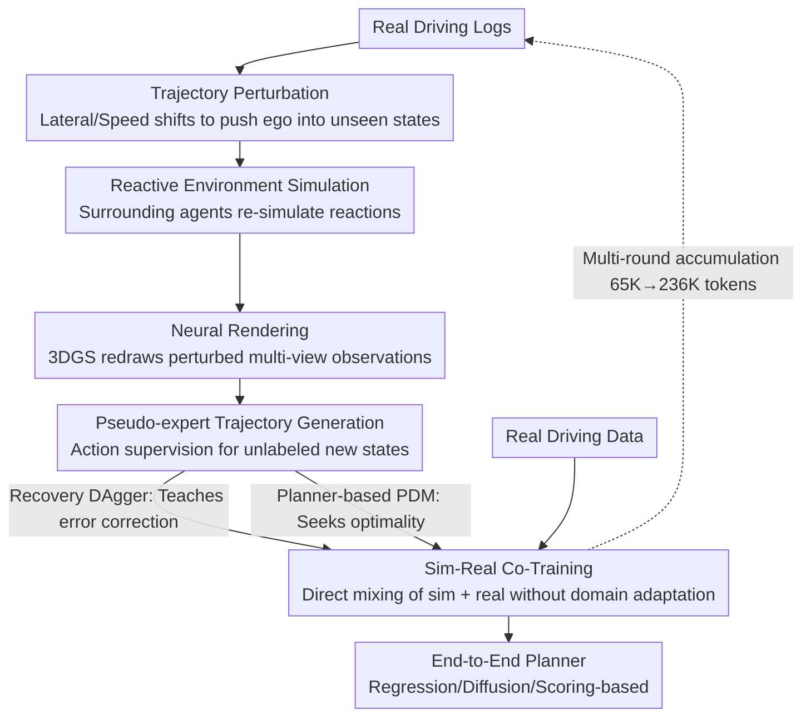

# SimScale: Learning to Drive via Real-World Simulation at Scale

**Conference**: CVPR 2026 (Oral)  
**arXiv**: [2511.23369](https://arxiv.org/abs/2511.23369)  
**Code**: [OpenDriveLab/SimScale](https://github.com/OpenDriveLab/SimScale)  
**Authors**: Haochen Tian, Tianyu Li, Haochen Liu, Jiazhi Yang et al. (CASIA, OpenDriveLab@HKU, Xiaomi EV)  
**Area**: Autonomous Driving  
**Keywords**: Simulation Data, End-to-End Planning, Sim-to-Real, Data Scaling, Pseudo-expert Trajectories, Neural Rendering, co-training

## TL;DR
The authors propose SimScale, a framework that generates large-scale, high-fidelity simulation data by applying trajectory perturbation to existing driving logs, followed by reactive environment simulation and neural rendering. Combined with pseudo-expert trajectory supervision and a sim-real co-training strategy, the end-to-end planner achieves significant improvements on NAVSIM v2 (+8.6 EPDMS on navhard), with performance scaling smoothly with the volume of simulated data.

## Background & Motivation

Fully autonomous driving requires learning reasonable decision-making across a wide range of scenarios, including safety-critical and out-of-distribution (OOD) cases. However:

- **Data Distribution Bias**: Real-world data collected by human experts is dominated by routine driving; safety-critical scenarios (emergency braking, hazardous avoidance) and OOD cases are severely underrepresented.
- **Demonstration Bias**: Imitation learning (IL) policies are exposed only to states within the expert distribution, preventing them from learning how to recover from deviated states.
- **Limitations of Prior Work**:
    - Traditional simulators (CARLA/MetaDrive): Lack photorealism, leading to a significant sim-to-real gap.
    - Neural rendering (NeRF/3DGS): Professional quality but lacks scene interactivity (non-reactive environments).
    - Pure trajectory perturbation: Generates new states but lacks corresponding high-quality sensor observations.

**Mechanism**: The framework perturbs ego trajectories in existing real driving logs to create new states, simulates responses from other agents to maintain environment reactivity, utilizes neural rendering for high-fidelity multi-view images, and generates pseudo-expert trajectories for supervision, thereby synthesizing massive training data in a scalable manner.

## Method

### Overall Architecture

SimScale addresses a specific problem: IL policies only encounter states within the expert distribution and fail to correct themselves once they deviate. Real logs lack safety-critical scenarios, and collecting such data is costly. The core idea is to move "data augmentation" into simulation without falling into the sim-to-real gap of traditional simulators. It processes **existing real logs** through four steps, allowing each frame of real data to propagate into numerous supervised samples.

The pipeline operates as follows: First, perturb the ego trajectory in a real log to "push" the vehicle into unencountered deviated states. Since these states disrupt interaction consistency, the environment's agents (vehicles, pedestrians) are simulated reactively. As the states and scene change, original camera frames become obsolete, so neural rendering is used to redraw distorted multi-view observations. Finally, pseudo-expert trajectories are generated as labels for these new states. These "sensor-observation + action-label" sim samples are then mixed with real data for co-training. The process accumulates over rounds, scaling the data volume.

### Key Designs

**1. Trajectory Perturbation: Actively Pushing Ego into Unseen State Spaces**

The blind spot of IL is that experts never demonstrate "what to do after making a mistake," meaning training data naturally lacks off-policy states. SimScale applies lateral offsets and velocity changes to the original ego trajectory within a time window $[T, T+H]$, forcing the vehicle out of the normal route into states not captured in original logs. This is the starting point: creating "non-expert states" to teach the model how to recover.

**2. Reactive Environment Simulation: Dynamic Scene Response**

Once the ego trajectory deviates, the original trajectories of other agents become inconsistent—they were recorded based on the original ego behavior. Directly reusing them leads to physical impossibilities like clipping or collisions. SimScale uses a reactive simulation engine (based on MTGS, etc.) to re-calculate the reactions of surrounding vehicles and pedestrians, ensuring interaction consistency. This distinguishes it from "high-fidelity but static playback" solutions like standard NeRF/3DGS.

**3. Neural Rendering: Realistic Multi-view Observations for New States**

With changed states and environments, the end-to-end model requires camera images corresponding to the new poses. SimScale utilizes 3D Gaussian Splatting (3DGS) to re-render multi-view observations based on the perturbed ego pose and reactive environment state. This high-fidelity rendering is the physical reason the sim-real gap is minimized, removing the need for auxiliary domain adaptation.

**4. Pseudo-expert Trajectory Generation: Supervision for Unlabeled States**

Perturbed states lack expert actions. The paper compares two routes: **Recovery-based** plans a trajectory from the deviated state back to the normal route at $T+H$ (DAgger philosophy), specifically teaching "how to recover." **Planner-based** uses a rule-based planner (PDM) to re-plan an optimal trajectory in the simulation. While planner-based actions are more optimal, the recovery-based approach provides better diversity for error correction.

**5. Sim-Real Co-Training: Direct Mixing without Domain Adaptation**

Simulation and real data are mixed for joint training without domain randomization or adaptation techniques, as neural rendering minimizes the visual gap. This strategy is compatible with various end-to-end planners: regression-based (LTF/Transfuser), diffusion-based (DiffusionDrive), and scoring-based (GTRS-Dense). Notably, scoring-based models support a "rewards only" mode where simulation data provides reward signals rather than IL labels, bypassing the quality ceiling of pseudo-experts.

### Key Experimental Results

Evaluation is conducted on the NAVSIM v2 benchmark, including the `navhard` (safety-critical) and `navtest` (standard) splits.

**Table 1: Model Zoo Main Results (EPDMS Metric)**

| Model | Backbone | Co-Train Mode | navhard EPDMS | navhard Gain | navtest EPDMS | navtest Gain |
|---|---|---|---|---|---|---|
| LTF | ResNet34 | w/ pseudo-expert | 30.3 | **+6.9** | 84.4 | **+2.9** |
| DiffusionDrive | ResNet34 | w/ pseudo-expert | 32.6 | **+5.1** | 85.9 | **+1.7** |
| GTRS-Dense | ResNet34 | w/ pseudo-expert | 46.1 | **+7.8** | 84.0 | **+1.7** |
| GTRS-Dense | ResNet34 | rewards only | 46.9 | **+8.6** | 84.6 | **+2.3** |
| GTRS-Dense | V2-99 | w/ pseudo-expert | 47.7 | **+5.8** | 84.5 | **+0.5** |
| GTRS-Dense | V2-99 | rewards only | 48.0 | **+6.1** | 84.8 | **+0.8** |

**Key Findings**:
- All strategy types benefit from simulation data, with `navhard` showing the most significant gains (+5.1 to +8.6).
- GTRS-Dense + rewards only achieves the highest gain (+8.6), suggesting scoring-based strategies can leverage sim data via reward signals without requiring explicit pseudo-labels.
- Consistent improvements on `navtest` (+0.5 to +2.9) indicate enhanced generalization.

**Table 2: Scaling Analysis — Sim Data Volume vs. Performance**

| Sim Rounds | Sim Token Count | GTRS navhard (pseudo-expert) | GTRS navhard (rewards only) | LTF navhard |
|---|---|---|---|---|
| 0 (Real Only) | 0 | 38.3 | 38.3 | 23.4 |
| Round 1 | ~65K | 42.5 | 43.1 | 27.8 |
| Round 3 | ~166K | 44.8 | 45.6 | 29.5 |
| Round 5 | ~236K | 46.1 | 46.9 | 30.3 |

**Key Findings**:
- Performance scales smoothly with sim data volume without clear saturation.
- Different architectures show different scaling behaviors: scoring-based scales best, followed by diffusion-based.

## Highlights & Insights

- **CVPR 2026 Oral**: High recognition for the scalable data pipeline.
- **Closed-loop Simulation-Training**: A complete pipeline from perturbation to rendering and training.
- **Exploratory Pseudo-experts**: Recovery-based pseudo-experts teach error correction more effectively than pure optimal planners in specific scenarios, emphasizing diversity over optimality.
- **Scaling via Multimodal Modeling**: Diffusion and scoring-based planners better utilize scaled sim data because they model trajectory distributions rather than single-point estimates.
- **Reward is All You Need**: GTRS-Dense performs best in "rewards only" mode, showing simulation can provide value solely via reward signals for scoring planners.
- **Controllable Sim-Real Gap**: Neural rendering is realistic enough that simple co-training suffices without complex domain adaptation.

## Limitations & Future Work

- **Infrastructure Dependency**: Requires high-quality 3DGS neural rendering and reactive simulation engines, involving high pre-processing costs.
- **Sim Data Scale**: 5 rounds of simulation generate several terabytes of sensor data, posing significant storage and I/O challenges.
- **Log-Bound Diversity**: Perturbations generate variations within the neighborhood of existing scenes; it cannot create entirely new environmental types (e.g., generating snow if the logs only contain clear weather).
- **Evaluation Scope**: Primarily validated on NAVSIM v2; testing on other benchmarks like nuPlan or CARLA closed-loop is needed.
- **Pseudo-expert Ceiling**: The quality of the rule-based planner (PDM) limits the potential of the pseudo-labels.

## Related Work & Insights

- **End-to-End Planning**: Methods like UniAD and VAD are limited by the scarcity of safety-critical data in human logs.
- **Driving Simulation**: SimScale bridges the gap between traditional simulators (CARLA) and static neural rendering by adding reactivity and labels.
- **Data Scaling**: Unlike DAgger which requires online interaction, SimScale focuses on offline simulation scaling to reduce real-world collection costs.

## Rating

- Novelty: 4/5
- Experimental Thoroughness: 5/5
- Writing Quality: 4/5
- Value: 5/5

<!-- RELATED:START -->

## Related Papers

- [\[CVPR 2026\] Unposed-to-3D: Learning Simulation-Ready Vehicles from Real-World Images](unposed-to-3d_learning_simulation-ready_vehicles_from_real-world_images.md)
- [\[CVPR 2026\] V2U4Real: A Real-world Large-scale Dataset for Vehicle-to-UAV Cooperative Perception](v2u4real_a_real-world_large-scale_dataset_for_vehicle-to-uav_cooperative_percept.md)
- [\[CVPR 2026\] Learning to Drive is a Free Gift: Large-Scale Label-Free Autonomy Pretraining from Unposed In-The-Wild Videos](learning_to_drive_is_a_free_gift_large-scale_label-free_autonomy_pretraining_fro.md)
- [\[CVPR 2026\] WorldLens: Full-Spectrum Evaluations of Driving World Models in Real World](worldlens_full-spectrum_evaluations_of_driving_world_models_in_real_world.md)
- [\[CVPR 2026\] Real-World On-Vehicle Evaluation of Embedding-Based Anomaly Detection](real-world_on-vehicle_evaluation_of_embedding-based_anomaly_detection.md)

<!-- RELATED:END -->
