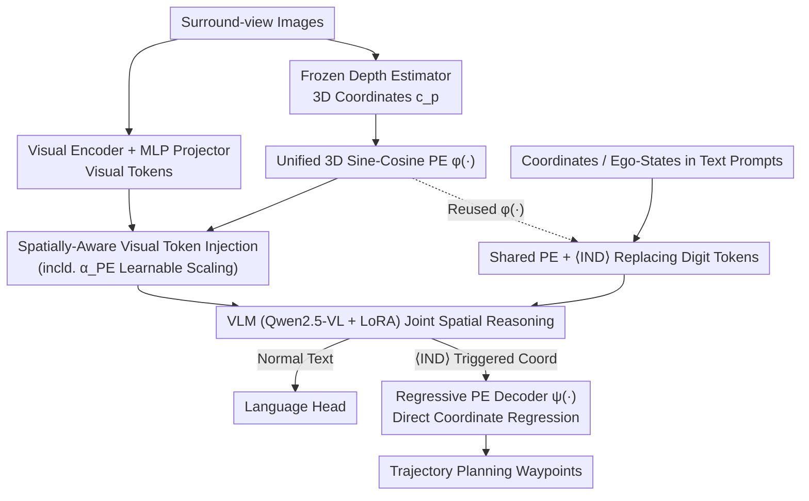

# SpaceDrive: Infusing Spatial Awareness into VLM-based Autonomous Driving

**Conference**: CVPR 2026  
**Paper**: [CVF Open Access](https://openaccess.thecvf.com/content/CVPR2026/html/Li_SpaceDrive_Infusing_Spatial_Awareness_into_VLM-based_Autonomous_Driving_CVPR_2026_paper.html)  
**Code**: https://github.com/zhenghao2519/SpaceDrive  
**Area**: Autonomous Driving / Multi-modal VLM  
**Keywords**: VLM End-to-End Driving, 3D Position Encoding, Spatial Awareness, Trajectory Regression, Closed-loop Planning

## TL;DR
SpaceDrive replaces the conventional practice in VLM-based end-to-end driving—generating coordinates digit-by-digit as text—with a unified 3D Position Encoding (PE). The same sine-cosine PE is superimposed on visual tokens, used to replace coordinate tokens in text, and used to encode ego-states. Finally, a regressive PE decoder outputs trajectory coordinates directly. It achieves SOTA among VLM methods in nuScenes open-loop benchmarks and a second-best score of 78.02 in Bench2Drive closed-loop testing.

## Background & Motivation
**Background**: End-to-end autonomous driving (E2E AD) using VLMs has gained significant traction recently. By reformulating perception, prediction, and planning as natural language tasks, these models leverage the general visual understanding and reasoning capabilities from large-scale VLM pre-training to handle complex dynamic scenarios, offering better generalization than traditional modular stacks (e.g., UniAD, VAD).

**Limitations of Prior Work**: However, VLMs perform poorly on 3D tasks such as geometric measurement and distance estimation, which are fundamental requirements for physical world interaction. The authors attribute this to two reasons: ① **Lack of 3D pre-training**: Models must infer 3D properties solely from 2D knowledge. When presented with 3D coordinate strings, they fail to associate them with corresponding objects or 2D semantics, leading to vague or incorrect scene descriptions. ② **Numeric digits treated as classifications**: Language models process numerical values as digit-by-digit classifications, ignoring the inherent proximity of numbers (e.g., 3.81 is close to 3.82) and incorrectly treating all digit positions with equal importance, resulting in inaccurate continuous trajectory prediction.

**Key Challenge**: Existing VLM planners either insert **task-specific embeddings** (relying on specialized 3D fine-tuning that binds representations to specific tasks/domains, compromising VLM generality) or treat waypoints as **digit token sequences** for direct generation (inheriting numerical modeling deficiencies). Neither approach achieves a spatial representation that is both "general" and "precise."

**Key Insight**: The authors observe an overlooked point: Transformers are inherently adept at processing **positional relationships** between tokens, which can be interpreted as **spatial relationships** between semantic features. Consequently, extending this capability to 3D spatial perception is a logical progression.

**Core Idea**: Utilize a **unified 3D Position Encoding** as a "universal interface" for coordinates to replace text-based digit tokens and task-specific embeddings. The same PE enhances visual tokens and serves as VLM coordinate input/output, allowing the model to perform joint semantic-spatial reasoning on a shared spatial representation, followed by regression rather than classification to produce coordinates.

## Method

### Overall Architecture
The goal of SpaceDrive is to transform "3D coordinates" from a sequence of digit tokens into a **spatial representation** that the VLM can directly index and regress, without compromising VLM generality. The entire pipeline revolves around a shared position encoder $\phi(\cdot)$, which is reused in three places: enhancing visual features, replacing text coordinates, and encoding ego-states, thereby ensuring the perception and reasoning stages speak the same "spatial language."

Specifically, surround-view images are first aligned to the language space via a visual encoder and MLP projector to obtain visual tokens. The same images are fed into a frozen depth estimator to obtain dense absolute depth, which is back-projected into 3D coordinates $c_p$ for each patch. These are then encoded into 3D PE via $\phi(\cdot)$ and **added element-wise to corresponding visual tokens**, resulting in "spatially-aware visual tokens." Any substrings in the text prompt representing coordinates are encoded by the same $\phi(\cdot)$, **replacing the original digit tokens**, with a special identifier $\langle \text{IND} \rangle$ placed before each PE to avoid confusion with regular tokens. Historical ego-states are also encoded using the same $\phi(\cdot)$. The VLM (Qwen2.5-VL-7B + LoRA) performs reasoning on these unified PEs; regular text is decoded via the language head, while coordinate outputs are triggered by $\langle \text{IND} \rangle$ and processed by a **regressive PE decoder** $\psi(\cdot)$ to directly output 3D coordinates for trajectory planning.

### Key Designs

**1. Unified 3D Sine-Cosine Position Encoding: Treating Coordinates as "Positions" not "Digits"**

This serves as the foundation, addressing the issues of digit classification and 3D-semantic misalignment. Instead of forcing the VLM to generate coordinates as text, each 3D coordinate $c_p=(x,y,z)$ is mapped to a fixed-width vector using **sine-cosine encoding expanded across three dimensions**: $\phi(c_p)=[\phi_x(x),\phi_y(y),\phi_z(z)]\in\mathbb{R}^{dim}$, where each dimension $\phi_a(p_a)$ takes the standard 1D form of $\sin\!\big(p_a/20000^{2i/d_a}\big)$ and $\cos\!\big(p_a/20000^{2i/d_a}\big)$, with the encoding width split equally among axes ($d_x=d_y=\lceil dim/3\rceil$, $d_z=dim-d_x-d_y$). Sine-cosine is chosen over learnable MLPs or RoPE for its **translation invariance**, which helps attention layers recover relative spatial relationships between tokens. RoPE was avoided to prevent confusion with existing RoPE in the VLM (ablation shows RoPE encoders perform worst). Crucially, $\phi(\cdot)$ is a **task-agnostic general representation** reused in three locations to enforce consistency between perception and reasoning.

**2. Spatially-Aware Visual Token Injection: Explicitly Mapping 3D Geometry to 2D Semantics**

This addresses the weak association between 3D coordinates and 2D semantics. A frozen depth estimator (UniDepthV2-ViT-L) produces dense absolute depth. For each patch, the **minimum depth** within its image region is extracted (to highlight foreground) and back-projected to metric 3D coordinates $c_p$ using camera calibration matrices. Unlike prior methods that hide learnable 3D cues inside the projector (resulting in implicit geometry), the authors **explicitly add $\phi(c_p)$ to the visual tokens $h_p$** after the projector. Since text coordinates use the same $\phi(\cdot)$, the model can "index visual semantics directly by coordinate." To prevent the token norm from deviating from the VLM pre-training distribution, a **learnable normalization coefficient $\alpha_{PE}$** is introduced: $\tilde h_p = h_p + \alpha_{PE}\,\phi(c_p)$. Learnability for $\alpha_{PE}$ is essential—ablation studies show that fixed values cause attention scores to be ignored due to small PE norms, leading to convergence difficulties.

**3. Shared PE for Text Coordinates and Ego-States: Seamless Communication via ⟨IND⟩**

This targets the non-transferability of task-specific embeddings. During text tokenization, coordinate substrings are identified, and the numerical vector $c_r$ is encoded via the **same $\phi(\cdot)$** to replace those digit tokens, preceded by an $\langle \text{IND} \rangle$ identifier to prevent semantic confusion. For BEV coordinates (e.g., trajectory waypoints), the $z$-component of the PE is set to 0. Ego-states are no longer compressed into single vector embeddings; instead, historical ego-waypoints $\{\phi(c^{ego}_\tau)\}$ are encoded with the same $\phi(\cdot)$ and fed as explicit spatio-temporal conditions. Ablation shows that adding PE solely to text coordinates yields minimal benefit, but **unified PE for both visual and text coordinates provides significant gains**, proving that shared representation is key.

**4. Regressive PE Decoder: Direct Coordinate Regression instead of Digit Generation**

This addresses the inaccuracy of digit-by-digit trajectory generation. In the output stage, the language head is extended $W_{lang}\to W'_{lang}$ to include $\langle \text{IND} \rangle$ in the vocabulary. When the model outputs $\langle \text{IND} \rangle$, it is **retained in the language context**, while the subsequent output state $e_{j+1}$ is routed to a PE decoder $\psi(\cdot)$ to regress metric coordinates $\hat c=\psi(e_{j+1})\in\mathbb{R}^3$ (ignoring $z$ for BEV trajectories). $\psi(\cdot)$ is a **fully learnable MLP** rather than an analytical inverse, as sine-cosine phase/frequency aliasing across dimensions makes analytical inversion difficult. Regression is performed **waypoint-by-waypoint** (each conditioned on the shared spatial token) rather than decoding the entire trajectory from a single embedding, which proved superior in ablation. This ensures precise BEV waypoints while maintaining autoregressive continuity for surrounding text.

### Loss & Training
The training objective combines language modeling loss and coordinate regression loss: $L = L_{LM} + L_{reg}(\hat c, c)$, where the former applies to all text output and the latter to all coordinate output. **Huber loss** is used for $L_{reg}$. The base VLM is Qwen2.5-VL-7B, fine-tuned using LoRA (rank 16). The visual encoder and projector are frozen, and the depth estimator is not fine-tuned. Training lasts 6 epochs for nuScenes (open-loop) and 12 epochs for Bench2Drive (closed-loop) on 8×A100 GPUs.

## Key Experimental Results

### Main Results
In nuScenes open-loop (predicting 6 waypoints over 3s), SpaceDrive+ (with ego-state input) achieved SOTA across all metrics for VLM methods:

| Method | Ego Status | L2 Avg.(m)↓ | Collision Avg.(%)↓ | Intersection Avg.(%)↓ |
|------|:---:|:---:|:---:|:---:|
| EMMA | - | 0.32 | - | - |
| ORION | ✓ | 0.34 | 0.37 | - |
| OmniDrive-Q++ (Same codebase) | ✓ | 0.33 | 0.30 | 3.00 |
| **SpaceDrive+ (Ours)** | ✓ | **0.32** | **0.23** | **1.27** |
| SpaceDrive (No ego, Ours) | - | 1.80 | 1.88 | 4.21 |

SpaceDrive without ego-status outperformed its codebase counterpart OmniDrive across all metrics, indicating that explicit 3D spatial injection is effective independently of ego priors.

In Bench2Drive closed-loop (220 short routes, 44 interactive scenes), SpaceDrive+ achieved the second-highest performance among VLMs:

| Method | Driving Score↑ | Success Rate(%)↑ |
|------|:---:|:---:|
| OmniDrive (Same codebase, text planning) | <10 SR | <10 |
| ORION | 77.74 | 54.62 |
| **SpaceDrive+ (Ours)** | **78.02** | **55.11** |
| SimLingo (w/ massive Action Dreaming) | 85.07 | 67.27 |

The contrast with OmniDrive is particularly telling: while OmniDrive performs well open-loop, its closed-loop success rate is <10% as trajectories collapse to near-straight lines with jitter. This confirms that pure natural language trajectory generation fits data priors but fails to learn controllable driving. Note: SimLingo uses extra Action Dreaming data augmentation, making it not directly comparable.

### Ablation Study
Position encoding injection location (Open-loop, without ego to prevent overfitting):

| Configuration | Avg. L2↓ | Avg. Col.↓ | Avg. Int.↓ | Explanation |
|------|:---:|:---:|:---:|:---:|
| No features added (Exp.1) | 2.51 | 4.53 | 6.77 | Baseline |
| Visual token PE $\phi(c_p)$ only (Exp.2) | 1.88 | 2.45 | 2.36 | −0.63 L2, largest gain |
| Text coordinate PE $\phi(c_r)$ only (Exp.3) | 2.42 | 5.06 | 8.94 | Minor gain (missing semantics) |
| Visual + Text PE (Exp.4) | 1.80 | 1.88 | 4.21 | Unified representation is key |

Encoder/Decoder and Normalization ablation:

| Dimension | Best Configuration | Performance Drop Analysis |
|------|---------|------|
| Encoder $\phi$ | Sine-Cosine (L2 1.80) | MLP 1.96 / RoPE 1.93 (Confuses with VLM RoPE) |
| Decoder $\psi$ | Coordinate-wise MLP (L2 1.80) | Sine-Cosine inverse 1.87 / Task-specific single decode 1.93 |
| $\alpha_{PE}$ | Learnable (L2 1.80 @init 0.1) | Fixed values cause semantic instability |

### Key Findings
- Injecting PE into visual tokens (Exp.2 vs 1) provides the largest single-step contribution by explicitly mapping 3D geometry to 2D image features. **Shared representation** (unified visual + text PE) is essential for unlocking maximum performance.
- $\alpha_{PE}$ must be learnable: the PE norm modulates its importance in attention; fixed values that are too small lead to vanishing attention scores and semantic failure.
- Strong adaptability: Performance is consistent across LLaVA and Qwen-VL backbones. Without ego-states, trajectory mode collapse can be mitigated using lightweight CoT prompting to maintain waypoint diversity.

## Highlights & Insights
- **"Positional as Spatial" View**: By repurposing the Transformer's inherent capacity to handle token positions as 3D spatial relationships between semantics, the model uses a single $\phi(\cdot)$ in three locations for a self-consistent unified interface.
- **Regression vs. Classification**: The research correctly identifies the flaws in digit-by-digit classification (ignoring numerical proximity) and bypasses them using $\langle \text{IND} \rangle$ triggers and MLP regression while preserving autoregressive continuity for text. 
- **Efficiency without BEV**: The model does not rely on dense BEV features, demonstrating that unified PE is sufficient for 3D spatial modeling in VLMs, which is computationally advantageous.

## Limitations & Future Work
- Closed-loop performance is second-best, trailing SimLingo (85.07) and traditional stacks like HiP-AD (86.77). While attributed to data augmentation in other models, it shows that spatial encoding alone has not yet equaled the strongest pipelines.
- Heavy reliance on a **frozen external depth estimator**; depth errors propagate directly into 3D coordinates. The robustness of the patch-based "minimum depth" strategy in heavy occlusion or long-range scenarios remains to be fully explored.
- The use of sine-cosine encoding necessitates MLP-based approximate regression, leading to inherent coordinate fidelity loss. BEV scenarios discard $z$, potentially limiting performance in scenarios with significant elevation changes.

## Related Work & Insights
- **vs. OmniDrive / ORION**: These rely on task-specific 3D fine-tuning and task-specific embeddings. SpaceDrive uses task-agnostic unified PE and waypoint-by-waypoint regression, offering better transferability and representation consistency.
- **vs. Digit Token Methods (DriveLM, etc.)**: These generate waypoints as text, inheriting numerical modeling flaws. SpaceDrive uses a regression head, avoiding the straight-line collapse seen in pure-text planners during closed-loop testing.
- **vs. Spatial VLMs (SpatialVLM, etc.)**: Rather than relying on massive synthetic spatial VQA data, SpaceDrive "plugs" spatial awareness into existing VLMs using a lightweight, reusable PE interface.

## Rating
- Novelty: ⭐⭐⭐⭐ (Clever repurposition of PE as a unified interface)
- Experimental Thoroughness: ⭐⭐⭐⭐ (Solid open/closed-loop evaluation and multi-dimensional ablation)
- Writing Quality: ⭐⭐⭐⭐ (Logical flow and clear graphical representation)
- Value: ⭐⭐⭐⭐ (Provides a backbone-agnostic spatial encoding paradigm for VLMs)

<!-- RELATED:START -->

## Related Papers

- [\[CVPR 2026\] Spatial Retrieval Augmented Autonomous Driving](spatial_retrieval_augmented_autonomous_driving.md)
- [\[CVPR 2026\] Percept-WAM: Perception-Enhanced World-Awareness-Action Model for Robust End-to-End Autonomous Driving](percept-wam_perception-enhanced_world-awareness-action_model_for_robust_end-to-e.md)
- [\[CVPR 2026\] DrivePI: Spatial-aware 4D MLLM for Unified Autonomous Driving Understanding, Perception, Prediction and Planning](drivepi_spatial-aware_4d_mllm_for_unified_autonomous_driving_understanding_perce.md)
- [\[ICLR 2026\] DriveAgent-R1: Advancing VLM-based Autonomous Driving with Active Perception and Hybrid Thinking](../../ICLR2026/autonomous_driving/driveagent-r1_advancing_vlm-based_autonomous_driving_with_active_perception_and_.md)
- [\[ICCV 2025\] CoDa-4DGS: Dynamic Gaussian Splatting with Context and Deformation Awareness for Autonomous Driving](../../ICCV2025/autonomous_driving/coda-4dgs_dynamic_gaussian_splatting_with_context_and_deformation_awareness_for_.md)

<!-- RELATED:END -->
