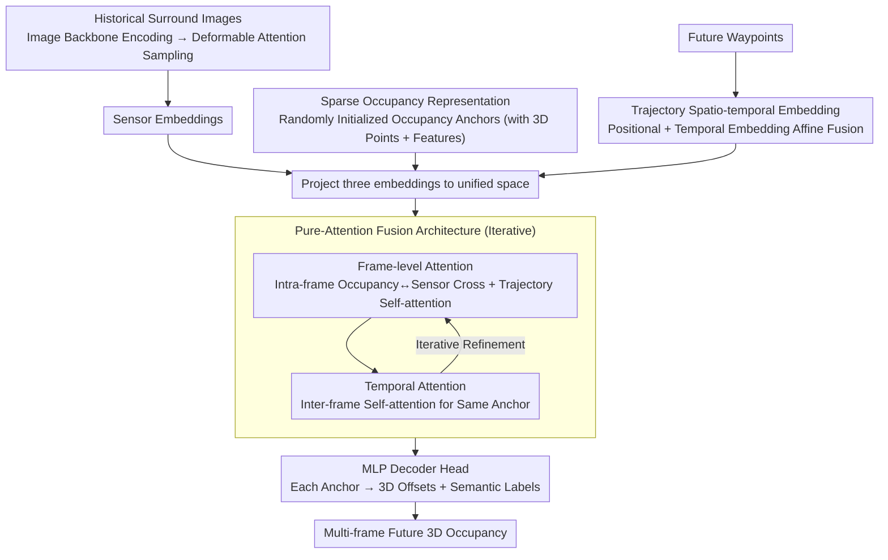

# SparseWorld-TC: Trajectory-Conditioned Sparse Occupancy World Model

**Conference**: CVPR 2026  
**arXiv**: [2511.22039](https://arxiv.org/abs/2511.22039)  
**Code**: [GitHub](https://github.com/MrPicklesGG/SparseWorld)  
**Area**: Autonomous Driving / World Models  
**Keywords**: 4D Occupancy Prediction, World Models, Sparse Representation, Trajectory Conditioning, Pure-Attention Architecture

## TL;DR

Ours proposes SparseWorld-TC, a pure-attention sparse occupancy world model that bypasses VAE discretization and BEV intermediate representations. It end-to-end predicts trajectory-conditioned multi-frame future occupancy directly from raw image features, significantly outperforming existing methods on nuScenes.

## Background & Motivation

Occupancy world models understand environmental dynamics by predicting future 3D scene occupancy, which is crucial for autonomous driving. Existing methods mainly suffer from two limitations:

1.  **VAE Discretization Bottleneck**: Methods like OccWorld and OccLLaMA use VQ-VAE to encode continuous 3D scene data into discrete tokens from a finite vocabulary. This discretization limits representation capacity and loses fine-grained information.
2.  **BEV Intermediate Representation Constraints**: Most methods rely on dense BEV feature maps for spatio-temporal modeling, which introduces explicit geometric constraints and limits flexible interaction across different feature scales.

Inspired by the success of pure-attention architectures like GPT and VGGT in language and 3D vision, the authors explore: Can a fully attention-based feed-forward architecture capture spatio-temporal dependencies directly from raw image features through sparse occupancy representations?

## Method

### Overall Architecture

The objective of this paper is straightforward: given historical surround-view images and a future trajectory, predict the 3D occupancy field for multiple subsequent frames without using VAE discretization or dense BEV intermediate representations. The entire pipeline is a single feed-forward pass: an image backbone encodes historical frames into features, from which deformable attention samples "sensor embeddings." Simultaneously, the model maintains a set of randomly initialized "occupancy anchors" and "trajectory embeddings" encoded from future waypoints. These three types of embeddings are projected into a unified space and fused through alternating frame-level attention (interaction within the same frame among occupancy, sensors, and trajectory) and temporal attention (cross-frame interaction of the same anchor) over several iterations. Finally, an MLP head decodes 3D offsets and semantic labels for each point within every anchor to produce multi-frame future occupancy. This architecture contains no convolutions or voxel grids, relying entirely on attention to extract spatio-temporal dependencies.

### Key Designs

**1. Sparse Occupancy Representation: Bypassing BEV Resolution and VAE Discretization with "Denoising Anchors"**

BEV flattens the scene into fixed-resolution feature maps, which restricts flexible interaction across scales; VQ-VAE squeezes continuous 3D scenes into a finite vocabulary, inherently losing fine-grained details. Ours adopts a different container: the scene is represented by a set of anchors, each consisting of randomly initialized 3D points and an associated feature vector. This vector is decoded via MLP into 3D offsets and semantic labels for each point within the anchor, effectively "denoising" random points into a consistent occupancy field. Since the representation is a set of points rather than a grid, resolution is not locked by a grid, and no codebook quantization is required. Density can be increased by adding anchors, and long-range prediction is achieved by reusing the same anchors across frames, keeping the representation fully sparse and flexible.

**2. Trajectory Spatio-temporal Embedding: Enabling the Model to Answer "What will be seen along this path?"**

Future occupancy is inherently multi-modal; the model must be conditioned on "planned movement" to provide deterministic predictions. Trajectories are explicitly encoded as conditional signals. Each waypoint encoding is split into two parts: a Positional Embedding maps the $16$-dimensional homogeneous transformation matrix into features via MLP to characterize "where the car is and its orientation"; a Temporal Embedding uses sinusoidal positional encoding to characterize "which future time step this is." These are fused into a spatio-temporal embedding via affine transformation (inspired by MLN). This design allows non-equidistant waypoints—by feeding the corresponding timestamp into the temporal embedding, the model adapts to arbitrary future trajectories and intervals rather than treating the trajectory as a fixed-step sequence.

**3. Pure-Attention Fusion Architecture: Emergent Spatio-temporal Dependencies in a Shared Space**

Once occupancy, sensor, and trajectory embeddings are projected into a unified space, explicit geometric priors are no longer needed for alignment—a key advantage of abandoning BEV. Fusion is performed by interleaving two types of attention: Frame-level Attention performs cross-attention between occupancy and sensors (anchors searching for evidence in image features) and self-attention for trajectories (incorporating conditional signals); Temporal Attention performs self-attention across different frames of the same anchor (capturing motion and scene evolution). Through iterative refinement across multiple layers, standard attention extracts long-range spatio-temporal dependencies without specialized geometric modules.

### Loss & Training

Alignment between predicted points and Ground Truth (GT) occupancy voxel centers is supervised by Chamfer Distance loss, while semantic labels are supervised by Focal classification loss. A key training technique is the **Random Set Strategy**: during each step, a prediction horizon $L \in \{2,\dots,T\}$ is randomly selected to calculate the loss, rather than using a fixed length. This ensures the model encounters various prediction spans, allowing it to output variable-length futures during deployment. In ablation studies, this improved average mIoU by approximately 5 points ($20.36 \rightarrow 25.60$) compared to fixed-frame training.

## Key Experimental Results

### Main Results (Occ3D-nuScenes, Camera Input)

| Method | 1s mIoU | 2s mIoU | 3s mIoU | Avg mIoU | Avg IoU |
|------|---------|---------|---------|----------|---------|
| COME | 26.56 | 21.73 | 18.49 | 22.26 | 44.07 |
| Ours-Small | 27.95 | 25.51 | 23.35 | 25.60 | 49.02 |
| Ours-Large | 28.64 | 26.28 | 24.36 | 26.42 | 49.21 |
| Ours-Large* (DINOv3) | 32.76 | 29.62 | 27.28 | 29.89 | 53.52 |

### Long-term Prediction (8s)

| Method | Input | Avg mIoU | Avg IoU |
|------|------|----------|---------|
| COME | Occ GT | 19.07 | 29.96 |
| Ours-Large | Camera | 22.33 | 45.35 |

### Ablation Study

| Configuration | Avg mIoU | Avg IoU | Description |
|------|----------|---------|------|
| w/o Trajectory | 15.44 | 32.19 | Trajectory conditioning is crucial |
| Predicted Trajectory | 21.57 | 44.76 | Predicted trajectory remains effective |
| GT Trajectory | 25.60 | 49.02 | Precise trajectory yields continuous Gain |
| Fixed Frame Training | 20.36 | 43.25 | Random Set Strategy is superior |

### Key Findings

- Ours outperforms the DOME method (which uses GT occupancy inputs) using only camera inputs (mIoU 29.89 vs 27.10).
- Long-term prediction performance decay is far lower than existing methods; the 8s prediction IoU still reaches 39.97.
- The Small version is 2.6x faster than the Large version with minimal performance gap, achieving a balance between efficiency and accuracy.

## Highlights & Insights

- The first pure-attention occupancy world model to completely bypass VAE and BEV, with a simple yet powerful design philosophy.
- The flexibility of sparse representation allows the model to scale to different anchor counts and long-term predictions.
- Significant advantage in long-term prediction: performance barely decays after 3 seconds, whereas existing methods drop sharply.
- Directly leverages large-scale vision foundation models (e.g., DINOv3) to boost performance.

## Limitations & Future Work

- Sparse representations may lag behind dense methods in recovering extremely fine-grained scene details.
- Computational cost increases with the number of anchors; the Large version achieves only 3.58 FPS.
- The "multi-modal" nature of long-term prediction makes single-GT evaluation limited.
- Joint training with downstream planning modules has not yet been explored.

## Related Work & Insights

- **vs OccWorld/OccLLaMA**: These use VAE discretization + autoregressive generation, limited by codebook capacity; ours is end-to-end without discretization.
- **vs DOME/COME**: These use diffusion models + BEV + continuous VAE; ours is a feed-forward single-pass inference, which is more efficient.
- **vs VGGT**: Ours adopts the pure-attention architecture concept but is specifically designed for 4D occupancy prediction.

## Rating

- Novelty: ⭐⭐⭐⭐⭐ First pure-attention sparse occupancy world model; a completely new paradigm.
- Experimental Thoroughness: ⭐⭐⭐⭐ Covers short/long-term prediction, ablation, and visualization with sufficient baselines.
- Writing Quality: ⭐⭐⭐⭐ Clear framework, concise formulas, and well-articulated motivation.
- Value: ⭐⭐⭐⭐⭐ Provides a new sparse attention paradigm for occupancy world models with high practical potential.

<!-- RELATED:START -->

## Related Papers

- [\[CVPR 2026\] Think Before You Drive: World Model-Inspired Multimodal Grounding](think_before_you_drive_world_model-inspired_multimodal_grounding.md)
- [\[CVPR 2026\] GenieDrive: Towards Physics-Aware Driving World Model with 4D Occupancy Guided Video Generation](geniedrive_towards_physics-aware_driving_world_model_with_4d_occupancy_guided_vi.md)
- [\[CVPR 2026\] Generalizing Visual Geometry Priors to Sparse Gaussian Occupancy Prediction](generalizing_visual_geometry_priors_to_sparse_gaussian_occupancy_prediction.md)
- [\[ICCV 2025\] LangTraj: Diffusion Model and Dataset for Language-Conditioned Trajectory Simulation](../../ICCV2025/autonomous_driving/langtraj_diffusion_model_and_dataset_for_language-conditioned_trajectory_simulat.md)
- [\[CVPR 2026\] GEM: Generating LiDAR World Model via Deformable Mamba](gem_generating_lidar_world_model_via_deformable_mamba.md)

<!-- RELATED:END -->
