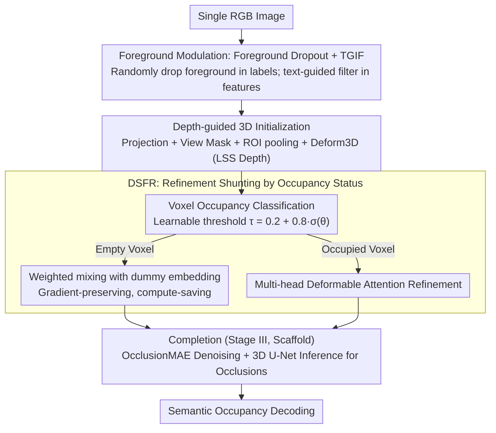

# Sparsity-Aware Voxel Attention and Foreground Modulation for 3D Semantic Scene Completion

**Conference**: CVPR 2026  
**arXiv**: [2604.05780](https://arxiv.org/abs/2604.05780)  
**Code**: [https://github.com/xyandtyh/VoxSAMNet](https://github.com/xyandtyh/VoxSAMNet)  
**Area**: Autonomous Driving / Semantic Scene Completion  
**Keywords**: Semantic Scene Completion, Voxel Sparsity, Foreground Modulation, Deformable Attention, Long-tail Distribution

## TL;DR

VoxSAMNet is proposed, a monocular semantic scene completion framework that explicitly models voxel sparsity and semantic imbalance. It utilizes a Dummy Shortcut to skip empty voxels and combines Foreground Dropout with a Text-Guided Image Filter to mitigate long-tail overfitting, achieving a SOTA mIoU of 18.19% on SemanticKITTI (outperforming existing monocular and stereo methods).

## Background & Motivation

**Background**: Monocular Semantic Scene Completion (SSC) aims to reconstruct a complete 3D semantic scene from a single RGB image, serving as a critical perception task for autonomous driving and robotics. Methods have evolved from MonoScene's 3D U-Net to BEVFormer's deformable attention, and subsequently to VoxFormer's depth-guided voxel queries.

**Limitations of Prior Work**: 3D scenes exhibit a severe dual imbalance: (1) **Spatial Imbalance**—Over 93% of voxels in SemanticKITTI are empty, with only 7% being occupied. Existing methods treat empty and occupied voxels indiscriminately, wasting significant computation on uninformative regions. (2) **Semantic Imbalance**—Among occupied voxels, foreground categories (e.g., pedestrians, cyclists) are extremely sparse, forming a long-tail distribution where models easily overfit to frequent classes. Furthermore, methods like BEVFormer suffer from feature blurring when projecting voxels onto the 2D image plane, as multiple voxels along the same line of sight project to the same location.

**Key Challenge**: The current uniform processing paradigm cannot distinguish "informative" from "non-informative" voxels. Redundant computation on empty voxels is inefficient and dilutes the learning signals for occupied voxels. Meanwhile, the long-tail distribution leads to severe under-representation of rare foreground categories.

**Goal**: (1) How to efficiently concentrate computational resources on occupied voxels? (2) How to mitigate long-tail overfitting for rare foreground classes?

**Key Insight**: Explicitly differentiate between empty and occupied voxels using distinct processing paths, while leveraging cross-modal text-vision guidance to enhance foreground representations.

**Core Idea**: Use a shared dummy node shortcut to skip empty voxels and deformable attention to refine occupied voxels to address sparsity; employ Foreground Dropout and TGIF to resolve long-tail imbalance.

## Method

### Overall Architecture

VoxSAMNet addresses a fundamental inefficiency in monocular SSC: models spend most computational power on empty voxels that should not stay in attention, while repeatedly overfitting to sparse foreground classes. The pipeline follows a trajectory of "lifting 2D features cleanly to 3D, shunting refinement based on occupancy state, and finally performing completion and denoising." Given a single RGB image, it first performs **text-guided 3D initialization**—where TGIF suppresses reverberations of dropped categories at the 2D feature level, and features are lifted to 3D voxel space via depth-guided projection. Subsequently, it enters **Dummy Shortcut Feature Refinement**, where a voxel classifier determines the occupancy of each voxel: empty voxels take the dummy shortcut, while occupied voxels are refined using deformable attention. Finally, **MAE-style denoising + 3D U-Net completion** is used to infer missing content in occluded areas by adding noise to visible voxels, ensuring overall completeness and global consistency before decoding semantic occupancy. The flowchart below illustrates the three stages:

### Key Designs

**1. Foreground Dropout + Text-Guided Image Filter (TGIF): Dual-pronged regularization and enhancement for long-tail issues**

This is the semantic modulation component in the first stage (text-guided 3D initialization). Foreground categories (pedestrians, cyclists, etc.) are extremely rare in occupied voxels, forming a long-tail distribution where models easily overfit to frequent classes. Foreground Dropout leverages the regularization concept of standard Dropout but acts on semantic labels: during training, ground truth labels for certain foreground classes are randomly replaced with empty voxel labels with probability $p$, forcing the model not to memorize specific categories. However, label dropout alone is insufficient—residual semantic responses of suppressed categories remain in 2D features. TGIF is then introduced: it constructs text prompts based on the **retained** categories (e.g., "road, building, terrain"). After encoding by a language encoder, these prompts are fused with image features via self-attention and cross-attention to selectively enhance responses of retained classes and suppress interference from dropped categories:

$$\mathbf{f}_T = \text{TGIF}(\mathbf{f}, T)$$

The two components are synergistic—one creates perturbations at the label end to prevent overfitting, while the other solidifies the effect by using linguistic prompts as a switch to modulate image features.

**2. Depth-guided 3D Feature Initialization: Mitigating projection blur with monocular depth priors**

Modulated 2D features must be lifted into 3D voxels, a step that determines the starting quality of subsequent refinement. Methods like BEVFormer project voxels onto the 2D image plane, where multiple voxels along the same line of sight project to the same pixel, causing blurred and indistinguishable features. This framework adopts a different lifting approach: each 3D voxel center $P=(x,y,z)^\top$ is first projected onto the image plane $\tilde{u} = K[R|t]P$ via camera intrinsics and extrinsics. A view mask filters out invalid voxels outside the frame. Valid voxels then undergo ROI pooling to extract features from 2D maps, combined with the depth volume $D_p$ generated via LSS from DepthNet for 3D deformable attention refinement:

$$F^{3D}_T(P) = \text{Deform3D}(\text{RoI}(\mathbf{f}_T, \text{box}_P), D_p)$$

Introducing dense monocular depth priors imposes a constraint on "how far away" each voxel is during the 2D→3D lifting process, thereby distinguishing features that would otherwise be compressed along the line of sight and reducing projection blur.

**3. Dummy Shortcut for Feature Refinement (DSFR): Shunting compute to the 7% informative voxels**

After obtaining initial 3D voxels, the model enters the second stage of refinement. Since over 93% of voxels in SemanticKITTI are empty, existing methods waste computation and dilute learning signals by treating all voxels equally. DSFR first uses a 3D convolution stacked with a $1\times1\times1$ convolution and a sigmoid to predict an occupancy probability map $P_\text{occu}$. A learnable threshold $\tau = 0.2 + 0.8 \cdot \sigma(\theta)$ divides voxels into an occupied set $M_o$ and an empty set $M_e$. Crucially, empty voxels are not hard-discarded—which would break gradient flow—but are instead weighted and mixed with a learnable dummy embedding $\mathbf{Em}$ based on occupancy probability:

$$F(P) \leftarrow F(P) \odot P_\text{occu} + \mathbf{Em} \odot P_\text{emp}$$

Occupied voxels undergo multi-head deformable attention: predicting sampling offsets and weights to aggregate 2D features sampled near the projected positions. Consequently, expensive attention refinement only occurs on approximately 7% of voxels. Empty voxels maintain representational consistency and gradient continuity via a global shared dummy node, while the learnable threshold allows the "occupied/empty" boundary to adapt during training, offering more flexibility than a fixed threshold. The refined voxels are then passed to the third stage for OcclusionMAE denoising and 3D U-Net inference (following standard completion paradigms) to decode semantic occupancy.

### Loss & Training

The total loss consists of two parts:

- SSC Loss: $\mathcal{L}_{ssc} = \mathcal{L}_{sem} + \mathcal{L}_{geo} + \mathcal{L}_{ce} + \mathcal{L}_{depth}$ (Semantic affinity loss + Geometric loss + Cross-entropy + Depth loss)
- Occupancy Loss: $\mathcal{L}_{occ} = \mathcal{L}_p + \mathcal{L}_r + \mathcal{L}_s$ (BCE terms for precision/recall/specificity)
- Total: $\mathcal{L}_{total} = \mathcal{L}_{ssc} + \mathcal{L}_{occ}$

## Key Experimental Results

### Main Results

SemanticKITTI Hidden Test Set (Single-frame methods):

| Method | Year | IoU↑ | mIoU↑ |
|------|------|------|-------|
| MonoScene | CVPR2023 | 34.16 | 11.08 |
| CGFormer | NeurIPS2024 | 44.41 | 16.63 |
| VisHall3D | ICCV2025 | 46.50 | 17.46 |
| DISC | ICCV2025 | 45.32 | 17.35 |
| **VoxSAMNet** | **CVPR2026** | **47.88** | **18.19** |

Ours outperforms stereo/multi-view methods: ScanSSC (17.40), VLScene (17.52).
Ours outperforms temporal methods: FlowScene (17.70). It is second only to SOAP (19.09), which utilizes extensive temporal information.

SSCBench-KITTI-360 Test Set (Best among single-frame methods): IoU 47.22, mIoU 20.23 (outperforming VLScene's 19.10).

### Ablation Study

Contribution of components: Both DSFR and TGIF contribute significant improvements independently. The learnable threshold for occupancy classification performs better than a fixed threshold.

### Key Findings

- Statistics showing over 93% of voxels are empty directly support the necessity of sparsity-aware design.
- Improvements are modest for frequent classes like cars but significant for long-tail classes such as bicycle (+4.4) and motorcycle (+3.9).
- The dummy shortcut in DSFR maintains gradient flow continuity through probabilistic weighted mixing rather than hard switching.
- As a single-frame monocular method, VoxSAMNet surpasses many stereo and multi-view approaches, proving the effectiveness of sparsity-aware and semantically-guided design.
- SOTA performance on KITTI-360 validates generalization across datasets.

## Highlights & Insights

- **Design driven by the "93% empty voxels" observation**: A simple yet powerful starting point that ensures the entire framework addresses the core challenge.
- **Elegant Dummy Shortcut design**: Instead of simply skipping empty voxels (breaking gradient flow), it uses weight-mixing with a shared dummy embedding to maintain representational continuity.
- **Synergy between Foreground Dropout and TGIF**: A novel dual-pronged approach addressing long-tail issues at both the label and feature levels.
- **Cross-modal Text-Vision Guidance**: Introduces ideas from CLIP/GroundingDINO into SSC, modulating image features via linguistic prompts.

 ## Limitations & Future Work

- Improvements for some extreme long-tail classes (e.g., motorcyclist at only 0.5 mIoU) remain limited.
- TGIF prompts are simple concatenations of class names and lack spatial relationship descriptions.
- The range for the learnable threshold [0.2, 1.0] is manually set; its adaptability to different scenes warrants further investigation.
- Temporal information is not utilized; a gap remains compared to temporal methods like SOAP (19.09).
- The dummy embedding is a single globally shared vector; spatially-conditioned dummy representations could be explored.

## Related Work & Insights

- **MonoScene**: Foundational work in SSC; VoxSAMNet inherits its scene-class affinity loss.
- **BEVFormer**: Introduced deformable attention but treated empty/occupied voxels uniformly; VoxSAMNet improves upon this.
- **VoxFormer / CGFormer**: Depth-guided voxel query methods, but lack explicit sparsity awareness.
- **CLIP / GroundingDINO**: The cross-modal alignment ideology inspired the design of TGIF.
- The concept of Foreground Dropout may be equally effective for other long-tail 3D perception tasks, such as 3D detection.

## Rating

- **Novelty**: ⭐⭐⭐⭐ The Dummy Shortcut and TGIF designs are novel; the "sparsity-aware + semantic guidance" framework provides a clear perspective.
- **Experimental Thoroughness**: ⭐⭐⭐⭐ Comprehensive comparisons on two standard benchmarks, including comparisons with stereo and temporal methods.
- **Writing Quality**: ⭐⭐⭐⭐ Clear motivation; the 93% empty voxel statistics are persuasive; module descriptions are lucid.
- **Value**: ⭐⭐⭐⭐ A monocular method outperforming stereo methods is a significant contribution; sparsity-aware design has practical implications for resource-constrained autonomous driving deployment.

<!-- RELATED:START -->

## Related Papers

- [\[CVPR 2026\] OccuFly: A 3D Vision Benchmark for Semantic Scene Completion from the Aerial Perspective](occufly_a_3d_vision_benchmark_for_semantic_scene_completion_from_the_aerial_pers.md)
- [\[AAAI 2026\] Towards 3D Object-Centric Feature Learning for Semantic Scene Completion](../../AAAI2026/autonomous_driving/towards_3d_object-centric_feature_learning_for_semantic_scene_completion.md)
- [\[AAAI 2026\] Unleashing Semantic and Geometric Priors for 3D Scene Completion](../../AAAI2026/autonomous_driving/unleashing_semantic_and_geometric_priors_for_3d_scene_completion.md)
- [\[CVPR 2026\] Probabilistic Discrepancy Learning for Roadside LiDAR Scene Completion](probabilistic_discrepancy_learning_for_roadside_lidar_scene_completion.md)
- [\[AAAI 2026\] HD2-SSC: High-Dimension High-Density Semantic Scene Completion for Autonomous Driving](../../AAAI2026/autonomous_driving/hd2-ssc_high-dimension_high-density_semantic_scene_completion_for_autonomous_dri.md)

<!-- RELATED:END -->
