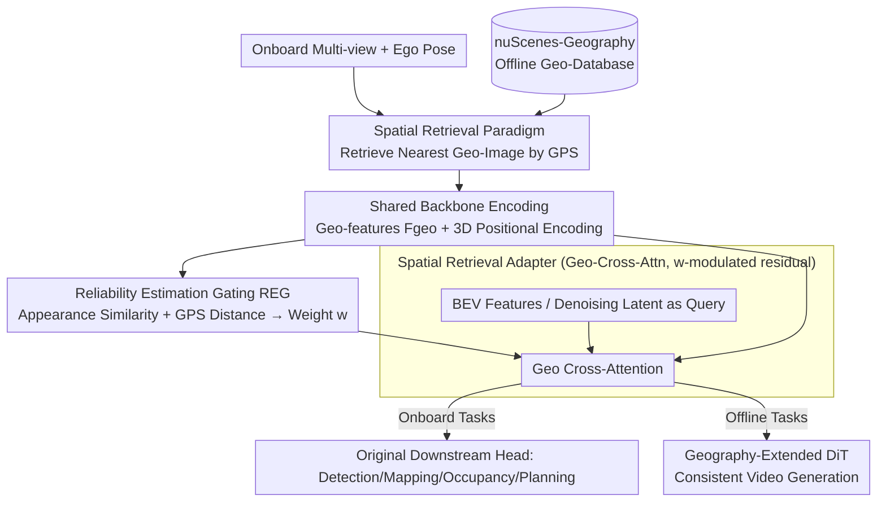

# Spatial Retrieval Augmented Autonomous Driving

**Conference**: CVPR 2026  
**Paper**: [CVF Open Access](https://openaccess.thecvf.com/content/CVPR2026/html/Jia_Spatial_Retrieval_Augmented_Autonomous_Driving_CVPR_2026_paper.html)  
**Code**: https://github.com/SpatialRetrievalAD  
**Area**: Autonomous Driving / BEV Perception / World Models  
**Keywords**: Spatial Retrieval, Geographic Images, Plug-and-Play, nuScenes-Geography, Reliability Gating

## TL;DR
This paper proposes a "spatial retrieval" paradigm that utilizes offline cached geographic street-view images as an additional input modality fed into autonomous driving models. A plug-and-play cross-attention adapter (with reliability gating) is used to complete the background structures that onboard sensors cannot see due to occlusion, low light, rain, or fog. The effectiveness of this approach is validated across multiple online tasks, including mapping, occupancy prediction, planning, and world models.

## Background & Motivation

**Background**: Modern autonomous driving (AD) perception heavily relies on onboard sensors—cameras, LiDAR, IMU—to acquire environmental information online. End-to-end, multi-sensor fusion, and temporal modeling methods are all built upon "drive-time online perception."

**Limitations of Prior Work**: Online perception is inherently constrained by **limited perception range and line-of-sight occlusion**. Once encountering occlusions, restricted field-of-view, overexposure/low light, rain, snow, or fog, online mapping and occupancy prediction severely degrade, which subsequently drags down planning. Furthermore, autonomous driving world models are prone to "hallucinating" non-existent scenes when the ego-vehicle trajectory deviates significantly from the recorded logs, making closed-loop evaluation or reinforcement learning environments unreliable.

**Key Challenge**: Onboard sensors capture "at this moment, from this perspective" information, lacking **long-term, location-bound priors**. When visibility conditions degrade, the model has no external reference to anchor the background geometry.

**Goal**: To enable AD models to possess a "recall" capability similar to human drivers—when the current visual input is insufficient, recalling what this road looked like beforehand to complete a wider context beyond the immediate range of onboard sensors.

**Key Insight**: Geographic images (Google Maps street view/satellite maps, or an autonomous driving company's own offline cache) naturally possess latitude and longitude coordinates and are **offline, globally available, and unaffected by real-time driving perturbations**. They provide rich background cues from perspectives other than the ego-car, without requiring new sensors or human annotation.

**Core Idea**: Replace "relying solely on online sensors" with "retrieving offline geographic images by GPS coordinates $\rightarrow$ injecting them plug-and-play into existing models," providing a stable background prior for AD tasks.

## Method

### Overall Architecture
The method centers on three components: ① **Retrieval**—retrieves the most relevant geographic images from the offline geographic database $D_{geo}$ using the ego-vehicle pose $P_t$ at each timestamp; ② **Fusion**—injects geographic features into the BEV representation of existing models (or the denoising latent of a world model DiT) using a plug-and-play cross-attention adapter, keeping all downstream heads, training objectives, and network architectures unchanged; ③ **Robustness**—uses a Reliability Estimation Gating (REG) mechanism to automatically suppress the contribution of geographic features to near zero when retrieval is missing or misaligned. Meanwhile, to facilitate research on this paradigm, the authors construct the nuScenes-Geography dataset (extending nuScenes with aligned geographic images).

Retrieval is defined as $\text{RetrievedGeoData}_t = \mathcal{R}(I_t, I_{geo}, P_t, P_{geo})$: to simplify, this paper only retrieves the **nearest neighbor** geographic image for each camera and timestamp. If the 3D distance exceeds a threshold, the API returns NONE. For offline tasks like world models, since the entire target trajectory is known, multiple geographic images at the start/end frame locations can be **pre-fetched** along the trajectory to serve as a globally consistent "spatial scaffold."

### Key Designs

**1. Spatial Retrieval Paradigm: Treating Offline Geographic Images as an Additional Input Modality**

To address the fundamental pain point of onboard online perception—"inability to see background under occlusion/low-light"—this paper does not modify the perception backbone. Instead, it introduces a completely new type of input: offline geographic images. Its key characteristic is being **orthogonal** to onboard sensors: street view/satellite maps are cached offline, globally available, and do not degrade due to rain, backlight, or occlusion during driving. Moreover, they come with latitude and longitude metadata that can be aligned with the ego-vehicle pose. The retrieval function fetches the nearest neighbor geographic image for online tasks at each step, and pre-fetches multiple images along the known trajectory for world models. Compared to HD maps, geographic images do not require centimeter-level annotation and maintenance, and contain rich visual details beyond geometry, such as vegetation, building facades, and road textures. These details are precisely what is needed for tasks like occupancy prediction and world models that require "how the background looks." The authors emphasize that this is **a complement to, rather than a replacement for, HD maps**.

**2. Spatial Retrieval Adapter: Plug-and-Play Injection into BEV via Geo-Cross-Attention**

The challenge is "how to use this new modality without changing existing models." The authors design a model-agnostic adapter: geographic images are first encoded with the **same backbone** as the onboard camera to obtain $F_{geo}$, and then use a PETR-style 3D positional encoding $F^{pos}_{geo}$ to represent the relative spatial relationship between the geographic tile and the current ego-vehicle position. Fusion is conducted via a single cross-attention, using the standard BEV feature $F_{BEV}$ as the query, and the geographic features plus positional encoding as key/value. It is then modulated by the reliability weight $w$ to perform a residual update:

$$\mathbf{F}_{\text{BEV}}' = \mathbf{F}_{\text{BEV}} + w \cdot \text{CrossAttn}(\mathbf{F}_{\text{BEV}}, \mathbf{F}_{\text{geo}} + \mathbf{F}^{\text{pos}}_{\text{geo}}, \mathbf{F}_{\text{geo}})$$

The enhanced $F_{BEV}'$ is directly fed back to the original downstream head. This residual + gating design keeps the training objectives and network structure **completely unchanged**, and can thus be directly integrated into various BEV tasks such as MapTR, FBOcc, BEVDet, and VAD, achieving true "plug-and-play."

**3. Geography-Extended DiT: Injecting Consistent Scaffolding along Trajectories for World Models**

World models usually run on servers for data generation, closed-loop evaluation, or RL environments. The pain point is that they easily hallucinate when the ego-car trajectory deviates from the recorded logs, and long-horizon scenes tend to drift. Since the entire future trajectory is known during offline generation, the authors pre-fetch geographic images of the start and end frames along the path, and **insert an extra geographic cross-attention layer** after the original attention layer in the widely used DiT blocks:

$$\mathbf{F}' = \mathbf{F} + w \cdot \text{CrossAttn}(\mathbf{F}, \mathbf{F}_{\text{geo}}+\mathbf{F}^{\text{pos}}_{\text{geo}}, \mathbf{F}_{\text{geo}})$$

where $F$ is the denoising latent, and $F_{geo}$ represents the geographic features corresponding to the start/end frames of this generation segment. Consequently, as the model generates each future position, it maintains a continuous geographic context as a structural scaffold, thereby maintaining long-term, globally consistent scene generation and reducing hallucinations.

**4. Adaptive Fusion with Reliability Estimation Gating: Making the Model Immune to Mismatched Retrieval**

A practical challenge for geographic retrieval is **missing or mismatched** data—outdated maps (road changes due to construction but cash not updated) or GPS/localization errors resulting in mismatches between retrieved street views and onboard images. If accepted unconditionally, incorrect priors will pollute the model instead. To prevent this, the authors design the Reliability Estimation Gating (REG), which outputs a reliability score $w \in [0,1]$:

$$w = \sigma(\text{MLP}([\text{ZNCC}(\mathbf{F}_{\text{onboard}}, \mathbf{F}_{\text{geo}}), d_{\text{GPS}}]))$$

where ZNCC is the zero-mean normalized cross-correlation between onboard and geographic features (measuring appearance similarity), $d_{GPS}$ is the distance between the street view location and the ego-vehicle position, and $\sigma$ is the sigmoid function. During training, it is supervised with binary labels (0 for mismatch/missing, 1 for valid; negative samples are sourced from 1,800 manually annotated mismatch cases). At inference, this learned gating automatically downweights unreliable geographic features. When retrieval is missing or mismatched, $w \to 0$ in the aforementioned residual formulations, causing the residual update to vanish. The model then gracefully degrades back to the pure onboard baseline, ensuring that it is not misled by bad priors.

### A Complete Example: How the nuScenes-Geography Dataset was Created
To make this paradigm researchable, the authors extend nuScenes into nuScenes-Geography. The key lies in **efficiently and geometrically correctly** aligning geographic images: ① They compute the latitude and longitude of each frame using the nuScenes map origin + ego-vehicle pose, and query the Google Maps API; ② Since the sampling frequency of street views is much lower than the nuScenes keyframe rate, multiple frames correspond to the same street-view location. Thus, each unique street view is **downloaded only once**, and 18 perspective views covering $360^\circ$ (with fixed $0^\circ$ pitch) are extracted to be stored as equirectangular panoramas; ③ For each onboard camera at each frame, the authors instantiate a **virtual camera** (with intrinsic parameters identical to the nuScenes camera, and extrinsic parameters derived from the latitude/longitude offset between the ego-vehicle and the street-view capture point) to re-project and synthesize a street-view image geometrically aligned with that frame. This "download once, re-project-on-demand" pipeline **saves over 70% storage** compared to downloading and cropping street views frame-by-frame, while ensuring a one-to-one geometric correspondence between onboard frames and synthesized street views. The dataset coverage is high (e.g., in a certain split, approximately 94.32% is available, 4.93% is mismatched, and 0.75% is missing).

## Key Experimental Results

Evaluation is conducted across five tasks on nuScenes-Geography (detection, online mapping, occupancy prediction, end-to-end planning, generative world models), focusing on three validations: augmenting static scene understanding, improving planning robustness, and enhancing spatial consistency in world models.

### Main Results

**Online Mapping (ResNet50, reproduced)**—Geographic priors bring the most significant improvement:

| Method | Epoch | mAP↑ | Gain |
|------|-------|------|------|
| MapTR | 24 | 50.3 | — |
| MapTR+Geo | 24 | 61.2 | +10.9 |
| MapTR | 110 | 59.3 | — |
| MapTR+Geo | 110 | 72.7 | +13.4 |
| MapTRv2 | 110 | 68.7 | — |
| MapTRv2+Geo | 110 | 78.2 | +9.5 |

**Occupancy Prediction (Occ3D-nuScenes)**—Overall mIoU slightly improves, with more noticeable benefits for static terrain categories:

| Method | Overall mIoU↑ | driveable | terrain |
|------|---------------|-----------|---------|
| FBOcc | 39.11 | 80.07 | 55.13 |
| FBOcc+Geo | 39.74 (+0.63) | 82.47 (+2.4) | 57.7 (+2.57) |

**Generative World Models**—Both FVD and FID drop simultaneously, proving that geographic priors suppress scene drift:

| Method | FVD↓ | FID↓ |
|------|------|------|
| UVG (UniMLVG) | 36.10 | 5.82 |
| UVG+Geo | 29.97 (+6.13) | 5.60 (+0.22) |
| MDD (MagicDriveDit) | 84.43 | 18.38 |
| MDD+Geo | 81.52 (+2.91) | 18.10 (+0.28) |

**End-to-End Planning (VAD)**—L2 trajectory accuracy is comparable, but safety improves, particularly in nighttime subsets where the average collision rate drops from 0.55% to 0.48%.

**Object Detection**—The improvement is virtually negligible (BEVDet+Geo NDS +0.02, mAP -0.16; BEVFormer+Geo NDS +0.10), as geographic images primarily replenish background information, offering limited help for foreground objects.

### Ablation Study
(Static mIoU for occupancy / FVD for world models, FlashOcc + UniMLVG)

| Configuration | Static mIoU↑ | FVD↓ | Description |
|------|-----------|------|------|
| w/o Geo Images | 46.66 | 35.42 | Without geographic images |
| w Geo Images | 47.86 | 29.97 | With geographic images, both metrics significantly improve |
| w/o 3DPE | 46.22 | 32.82 | Without 3D positional encoding |
| w/o REG | 47.65 | 30.95 | Without reliability gating |
| Full (3DPE+REG) | 47.86 | 29.97 | Full model |

### Key Findings
- **Geographic images contribute the most**: Disabling them causes static mIoU to drop from 47.86 to 46.66, and FVD to increase from 29.97 to 35.42, which are the main sources of gains.
- **3D Positional Encoding is critical**: Removing it causes FVD to rise from 29.97 to 32.82, indicating that features alone are insufficient; the spatial relations of the "geographic images in the ego-vehicle coordinate system" must be encoded.
- **Strong task dependency**: Tasks involving background/static structures (mapping, occupancy, world models) benefit heavily; foreground-driven detection shows almost no improvement—consistent with the intuition that "geographic priors only supplement the background."
- **Value of REG lies in robustness**: Removing it leads to only minor degradations (as the dataset itself possesses high coverage and few mismatch samples). However, it prevents the model from being misled by bad priors during missing/mismatched scenarios, acting as a crucial safety valve for practical deployment.

## Highlights & Insights
- **Reframing "offline maps" as a sensing modality**: Instead of building stronger online perception, the authors introduce an orthogonal, cheap, and disturbance-resistant input. This reframing is clever—no matter how bad the weather gets, cached street views do not deteriorate.
- **Gated residual enables zero-risk integration of "new modality"**: The residual formulation modulated by $w$ ensures that when retrieval fails, the model smoothly degrades back to the original baseline. This "addable yet removable" design is key to plug-and-play capability and can be transferred to any integration scenario with "unreliable external priors."
- **Data engineering is also a core contribution**: The combination of equirectangular panoramas and virtual camera re-projection reduces the storage of frame-by-frame street view downloads by over 70% while guaranteeing geometric alignment, lowering the threshold for replicating this paradigm.
- **Honest reporting of negative results**: The authors honestly reported that detection barely improved and planning L2 distance remained flat. Instead of embellishing, they pointed out that "separating foreground/background and using geographic images to assist detection" is a promising future direction.

## Limitations & Future Work
- **Simplistic retrieval**: The retrieval method is extremely naive, only fetching the single nearest neighbor image. The authors acknowledge that more advanced retrieval (such as fetching multiple neighboring images to form a global context) is left for future work.
- **Gains heavily biased toward background tasks**: Improvements in foreground object detection are negligible, and planning gains are only noticeable in nighttime safety, with L2 accuracy unchanged.
- **Dependence on external map quality and localization accuracy**: Outdated maps or GPS errors introduce mismatches. Although mitigated by REG, training this gating still required manually annotating 1,800 mismatched negative samples, and the cost of scaling this annotation to new cities is not discussed.
- **Only validated on nuScenes-Geography**: The paper does not fully cover whether it generalizes to other datasets/real-world road networks, or the latency overhead of online real-time retrieval.
- **Future directions**: Upgrade retrieval to learned top-k neighborhood aggregation, leverage reliability scores from gating to perform active mapping updates, or explicitly model foreground/background separation so that detection can also benefit.

## Related Work & Insights
- **vs HD Maps**: HD maps provide centimeter-level geometry, but annotated maintenance is expensive and only encodes predefined information (e.g., lane topology). Geographic images are easy to collect and contain rich visual details beyond geometry (e.g., vegetation, facades, road textures). This work positions itself as a **complement to, rather than a replacement for, HD maps**.
- **vs Existing Retrieval Methods in AD**: Previously, retrieval was mainly used for visual place recognition, rule understanding (LLMs), localization, trajectory sampling, or using historical traversal data for visual odometry/neural map priors/historical LiDAR detection—all of which are **task-specific** uses. In contrast, this paper's spatial retrieval fetches position-aligned geographic images as a **general complementary perception input** that can be reused across five different tasks.
- **vs Bench2Drive-R**: The idea of pre-fetching geographic images along the trajectory for world models is inspired by Bench2Drive-R, but this paper unifies it into a cross-attention adapter with REG gating and extends it to onboard perception tasks.

## Rating
- Novelty: ⭐⭐⭐⭐ The reframing of offline geographic images as a new input modality is clear and practical, though the individual components (cross-attention adapter, PETR PE, gated residual) represent combinations of mature methodologies.
- Experimental Thoroughness: ⭐⭐⭐⭐ Covers five tasks + multiple baselines + ablations, with honest reporting of negative results; however, it is limited to a single dataset (nuScenes-Geography).
- Writing Quality: ⭐⭐⭐⭐ Vivid motivation ("human drivers recalling roads"), clear diagrams, and detailed explanation of the data engineering process.
- Value: ⭐⭐⭐⭐ Proposing a new paradigm + open-sourcing data/baselines has immediate value for the mapping/occupancy/world model communities, while foreground task gains remain limited.

<!-- RELATED:START -->

## Related Papers

- [\[CVPR 2026\] RAG-TP: A General Framework for Vehicle Trajectory Prediction via Retrieval-Augmented Generation](rag-tp_a_general_framework_for_vehicle_trajectory_prediction_via_retrieval-augme.md)
- [\[CVPR 2026\] SpaceDrive: Infusing Spatial Awareness into VLM-based Autonomous Driving](spacedrive_infusing_spatial_awareness_into_vlm-based_autonomous_driving.md)
- [\[CVPR 2026\] SearchAD: Large-Scale Rare Image Retrieval Dataset for Autonomous Driving](searchad_large-scale_rare_image_retrieval_dataset_for_autonomous_driving.md)
- [\[CVPR 2026\] KnowVal: A Knowledge-Augmented and Value-Guided Autonomous Driving System](knowval_a_knowledge-augmented_and_value-guided_autonomous_driving_system.md)
- [\[AAAI 2026\] RAST: A Retrieval Augmented Spatio-Temporal Framework for Traffic Prediction](../../AAAI2026/autonomous_driving/rast_a_retrieval_augmented_spatio-temporal_framework_for_traffic_prediction.md)

<!-- RELATED:END -->
