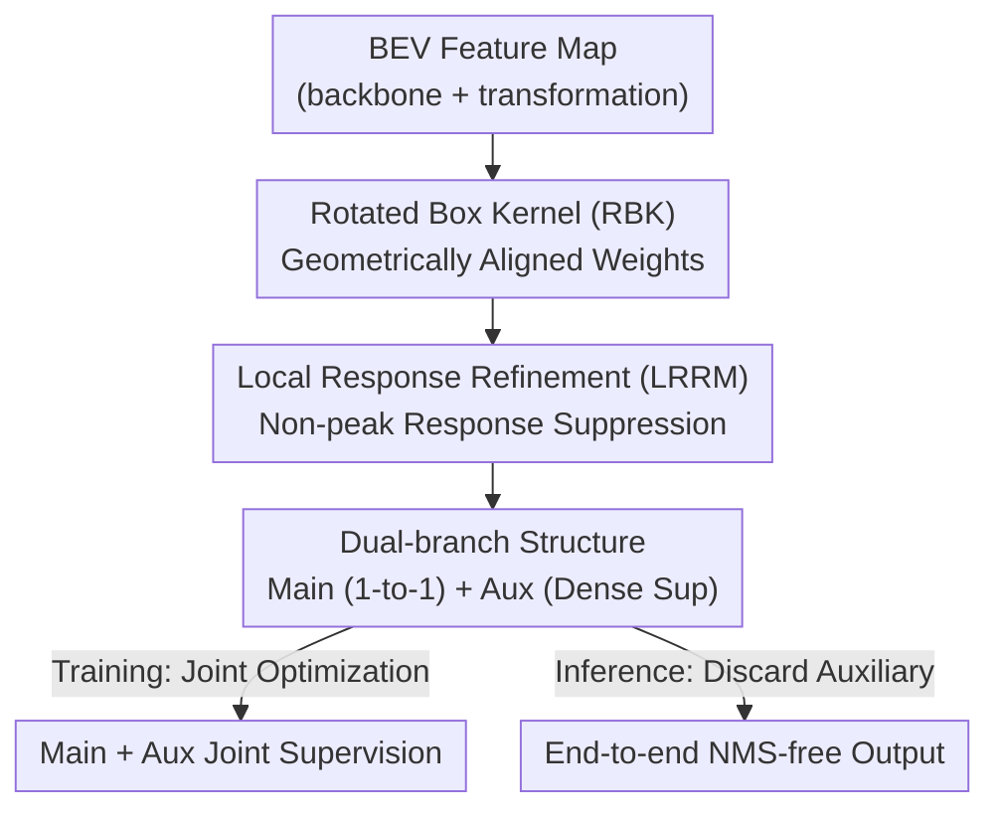

# Spe-BEVHead: Rethinking the Detection Head Design for Bird's-Eye-View Object Detection

**Conference**: CVPR 2026  
**Paper**: [CVF Open Access](https://openaccess.thecvf.com/content/CVPR2026/html/Zhang_Spe-BEVHead_Rethinking_the_Detection_Head_Design_for_Birds-Eye-View_Object_Detection_CVPR_2026_paper.html)  
**Code**: To be confirmed  
**Area**: Autonomous Driving / 3D Object Detection  
**Keywords**: BEV Detection, Detection Head, Rotated Box Kernel, End-to-End Detection, Dual-branch  

## TL;DR
To address the issues of "geometric mismatch in Gaussian kernels / performance collapse after removing NMS / sparse supervision signals" caused by the long-standing use of 2D center-based detection heads in autonomous driving BEV 3D detection, this paper proposes Spe-BEVHead. This plug-and-play detection head employs a Rotated Box Kernel (RBK), a Local Response Refinement Module (LRRM), and a dual-branch structure. It achieves performance gains on nuScenes by simply replacing the head and maintains competitiveness in end-to-end (NMS-free) settings.

## Background & Motivation
**Background**: Bird's-Eye-View (BEV) detection has become the mainstream paradigm for 3D object detection in autonomous driving because it unifies multi-camera features into a top-down plane, which is naturally suitable for multi-sensor fusion and 360° scene understanding. Recent progress has primarily focused on "how to better lift/aggregate multi-view image features into high-quality BEV representations," such as more accurate depth estimation, faster view transformation, and more effective pooling.

**Limitations of Prior Work**: Almost all LSS (Lift-Splat-Shoot) type detectors focus heavily on BEV feature construction but **directly adopt center-based detection heads from 2D detection** (the CenterNet style) without any tailored optimization for BEV tasks. The authors point out three inherent defects: (i) geometric mismatch between the Gaussian kernel used for classification and the actual BEV targets; (ii) significant performance degradation in end-to-end settings when NMS is removed; and (iii) overly sparse supervision signals.

**Key Challenge**: The relationship between "target size ↔ feature resolution" differs significantly between 2D and BEV planes. In 2D images, targets are often large, and Gaussian kernels are generally contained within the ground truth (GT) boxes. However, BEV is geometrically bound to the physical world where targets are extremely small (in FastBEV, a car occupies fewer than 20 pixels on a 128×128 BEV map). Adopting 2D Gaussian radius calculations yields kernels that are too large, incorrectly penalizing background pixels and leading to erroneous supervision. Furthermore, BEV targets have fixed sizes and rarely overlap, a "favorable property" not present in 2D that remains unexploited.

**Goal**: To **redesign the detection head** without modifying the backbone or feature transformation modules to resolve the three aforementioned defects while maintaining a "one-to-one matching, end-to-end NMS-free" paradigm.

**Key Insight**: The authors anatomize why each module of center-based heads is "unsuitable" for BEV and propose targeted modifications based on BEV-specific geometric and distributional properties (small targets, fixed sizes, minimal overlap, multiple attributes).

**Core Idea**: Replace isotropic Gaussian kernels with geometrically aligned Rotated Box Kernels; use a local non-maximum suppression module to make convolutional responses sufficiently "sharp" to eliminate NMS; and employ a primary/auxiliary dual-branch structure to densify supervision during training while retaining only the primary branch during inference to ensure end-to-end efficiency.

## Method

### Overall Architecture
The general pipeline of BEV detection networks is: multi-view images → image backbone for feature extraction → view transformation (Transformer-based or LSS-based) into BEV representation → detection head for bounding box output. This paper only modifies the detection head in the final step. Spe-BEVHead adopts a **dual-branch** structure: the main branch uses strict one-to-one matching for final inference, while the auxiliary branch introduces more positive samples during training for dense regression supervision and is discarded during inference. Both branches integrate two BEV-specific components: the Rotated Box Kernel (RBK) for generating geometrically aligned classification weights, and the Local Response Refinement Module (LRRM) to sharpen convolutional responses and suppress non-peak values, supporting NMS-free end-to-end inference.

### Key Designs

**1. Rotated Box Kernel (RBK): Aligning Classification Weights with BEV Geometry**

Addressing the "Gaussian kernel boundary violation" issue, the authors replace the isotropic Gaussian kernel with a **rotated elliptical decay kernel**. For each GT box projected onto the BEV plane (center $k=(k_x, k_y)$, size $(w, l)$, yaw angle $\theta$, class $c$), pixel coordinates are first transformed into the box's local coordinate system: $[x_\ell, y_\ell]^\top = R(\theta)\,[x-k_x, y-k_y]^\top$. Then, the normalized elliptical distance is calculated as $d(x,y)=\sqrt{(2x_\ell/w)^2+(2y_\ell/l)^2}$. For pixels inside the box ($d\le 1$), the heatmap value is set as $H_{xyc}\leftarrow\max(H_{xyc},\,K\cdot\mathrm{clip}(1-\gamma d^2, v_{\min}, 1))$, while pixels outside ($d>1$) are set to 0. Here, $K=1$ is the center value, $v_{\min}=0.1$ is the boundary value, and $\gamma=1-v_{\min}$ controls the decay rate. This kernel **explicitly encodes the orientation and aspect ratio of the target**, restricting weights strictly within the box and decaying from the center, preventing the misclassification of background pixels as "near-center negative samples."

**2. Local Response Refinement Module (LRRM): Sharpening Responses for True NMS-free Detection**

To address the issue where "end-to-end" heads still require NMS, the authors note that although center-based heads employ one-to-one matching, the convolutional responses are often not sharp or discriminative enough. LRRM leverages the favorable properties of BEV—rarely overlapping targets and few categories—to **safely suppress non-peak responses locally** without misidentifying adjacent targets. The core is the Adaptive Mean Attenuation (AMA) operator: if the center pixel $F(x,y)$ is the maximum within its $k\times k$ neighborhood $N_k(x,y)$, it is retained; otherwise, the neighborhood mean is subtracted: $F'(x,y)=F(x,y)-\frac{1}{k^2}\sum_{(i,j)\in N_k}F(i,j)$, attenuating non-peak responses. LRRM consists of several convolution, non-linear, and AMA layers.

**3. Main/Auxiliary Dual-branch Structure: Densifying Supervision without Breaking One-to-One Matching**

To address "sparse supervision signals," the authors split the head into two branches. BEV regression requires predicting many attributes (center offset, height, yaw $(\sin\theta, \cos\theta)$, 3D size $(w, l, h)$, velocity $v$), but center-based heads only regress at the single center pixel. The **main branch** uses strict one-to-one matching for both classification and regression (passing through LRRM before classification) to ensure an end-to-end paradigm. The **auxiliary branch** relaxes strict one-to-one matching for regression, participating with a $3 \times 3$ neighborhood (center + 8 neighbors) to increase supervision density. However, the auxiliary branch **retains one-to-one matching for classification** to avoid label ambiguity. The auxiliary classification loss is weighted by the RBK. During inference, the auxiliary branch is discarded, incurring no additional cost.

### Loss & Training
The total loss is the sum of classification and regression losses for both branches: $L=\lambda_{cls}L^{cls}_M+\lambda_{reg}L^{reg}_M+\lambda_{cls}L^{cls}_A+\lambda_{reg}L^{reg}_A$, typically with $\lambda_{cls}=4\lambda_{reg}$, using L1 loss for regression. The main branch uses focal loss for classification. In the auxiliary branch, the negative sample term of the focal loss is multiplied by the RBK weight $(1-H_{xyc})^\beta$ to soften the penalty for near-center negative samples. Training uses AdamW, learning rate 2e-4, batch size 64, ResNet-50 backbone, image size 256×704, over 20 epochs with CBGS.

## Key Experimental Results

### Main Results
The dataset used is nuScenes (1000 driving scenes, 6 cameras + LiDAR). Evaluation follows the nuScenes protocol: mAP, NDS, and five error metrics (mATE/mASE/mAOE/mAVE/mAAE). Spe-BEVHead replaces the original heads of various LSS baselines:

| Baseline Model | Frames / BEV Size | NDS↑ | mAP↑ | mATE↓ |
| :--- | :--- | :--- | :--- | :--- |
| FastBEV | 1 / 128² | 38.4 | 29.5 | 74.9 |
| + Spe-BEVHead (Ours) | 1 / 128² | **40.1** (+1.7) | **30.6** (+1.1) | **69.7** (−5.2) |
| BEVDet4D | 2 / 128² | 44.4 | 31.5 | 69.2 |
| + Spe-BEVHead (Ours) | 2 / 128² | **45.3** | **32.6** | 69.1 |
| BEVStereo4D | 2 / 128² | 49.5 | 38.1 | 58.9 |
| + Spe-BEVHead (Ours) | 2 / 128² | **49.9** | 37.6 | 58.2 |
| GeoBEV4D (Prev. SOTA) | 2 / 256² | 54.0 | 42.9 | 55.0 |
| + Spe-BEVHead (Ours) | 2 / 256² | **54.6** | 42.7 | 54.8 |

Replacing the head generally brings improvements in main metrics (NDS / mAP / mATE), most notably in FastBEV (+1.7 NDS). Integrated into GeoBEV, it sets a new SOTA (54.6 NDS).

### End-to-End (NMS-free) Results
Evaluated by taking the top 150 predictions with scores > 0.1:

| Model | Post-processing | NDS↑ | mAP↑ |
| :--- | :--- | :--- | :--- |
| FastBEV | None | 34.5 | 21.9 |
| FastBEV | NMS | 38.4 | 29.5 |
| + Spe-BEVHead (Ours) | None | **37.9** | **26.2** |
| + Spe-BEVHead (Ours) | Pooling | **39.9** | 28.3 |

FastBEV drops 7.6 mAP / 3.9 NDS without post-processing. Spe-BEVHead remains reliable even **completely without post-processing** (+3.4 NDS / +7.6 mAP over the center-based head on FastBEV).

### Ablation Study
| Configuration (DB / RBK / LRRM) | NDS↑ | mAP↑ | Description |
| :--- | :--- | :--- | :--- |
| Baseline | 34.5 | 21.9 | Center-based head |
| + DB | 36.6 | 26.0 | Dual-branch: +2.1 NDS / +4.1 mAP |
| + DB + RBK | 37.3 | 26.0 | Rotated Box Kernel: +0.7 NDS |
| + DB + RBK + LRRM | 37.9 | 26.2 | LRRM: +0.6 NDS / +0.2 mAP |

### Key Findings
- **The Dual-branch structure contributes the most** (+2.1 NDS), indicating that "sparse supervision" is the primary bottleneck in end-to-end settings.
- RBK and LRRM provide additional gains of 0.6–0.7 NDS each.
- In RBK, quadratic decay with a boundary value of 0.1 is optimal; larger boundary values (0.3/0.5) lead to performance drops as edges are treated as too strongly positive.
- The method is a **plug-and-play replacement**, yielding gains across various LSS baselines, proving that the detection head is a long-overlooked area for improvement.

## Highlights & Insights
- **Revisiting the "Overlooked Detection Head"**: While the industry focuses on BEV feature construction, the authors identify the 2D-legacy detection head as a bottleneck, offering a clever entry point.
- **Turning BEV "Constraints" into "Dividends"**: While 2D overlapping targets make local suppression difficult, the fixed-size, non-overlapping nature of BEV targets makes modules like LRRM safe and effective.
- **Transferable Dual-branch Logic**: The idea of using an auxiliary branch for dense supervision and discarding it during inference is a "zero-inference-cost" trick applicable to other sparse supervision tasks.

## Limitations & Future Work
- Experiments are validated only on nuScenes; cross-validation on other datasets like Waymo or Argoverse is missing.
- Gains rely heavily on the assumption of "minimal overlap and fixed size" of BEV targets; the robustness of LRRM in extremely crowded scenes requires further investigation.
- The modifications are specific to LSS-based (center-based) heads; the applicability to Transformer/DETR-based BEV architectures is not explored.

## Related Work & Insights
- **vs. Center-based Heads (CenterNet)**: They use isotropic kernels and single-pixel regression; the proposed method uses aligned RBK, dual-branch dense supervision, and LRRM response sharpening.
- **vs. Transformer BEV (BEVFormer)**: Transformers are naturally end-to-end but computationally heavy; Spe-BEVHead achieves end-to-end capability within an efficient LSS + CNN framework.
- **vs. 2D End-to-End Detection (YOLOv10/OneNet)**: These rely on dual-label assignment or unique one-to-one matching; Spe-BEVHead adopts "dense supervision + redundancy suppression" but tailors the suppression (LRRM) to BEV properties.

## Rating
- **Novelty**: ⭐⭐⭐⭐ Components are BEV-specific adaptations of effective concepts.
- **Experimental Thoroughness**: ⭐⭐⭐⭐ Strong baseline comparisons and ablations, though limited to one dataset.
- **Writing Quality**: ⭐⭐⭐⭐ Clear logic linking defects to proposed components.
- **Value**: ⭐⭐⭐⭐ Engineering value for efficient BEV deployment and NMS removal.

<!-- RELATED:START -->

1. **CenterNet**: Objects as Points, arXiv 2019.
2. **FastBEV**: A Fast and Strong Bird's-Eye-View Perception Baseline, arXiv 2023.
3. **BEVDet**: High-Performance Multi-Camera 3D Object Detection in Bird-Eye-View, arXiv 2021.

<!-- RELATED:END -->

## Related Papers

- [\[CVPR 2026\] BEV-SLD: Self-Supervised Scene Landmark Detection for Global Localization with LiDAR Bird's-Eye View Images](bev-sld_self-supervised_scene_landmark_detection_for_global_localization_with_li.md)
- [\[CVPR 2026\] BEV-CAR: Enhancing Monocular Bird's Eye View Segmentation with Context-Aware Rasterization](bev-car_enhancing_monocular_birds_eye_view_segmentation_with_context-aware_raste.md)
- [\[CVPR 2026\] CycleBEV: Regularizing View Transformation Networks via View Cycle Consistency for Bird's-Eye-View Semantic Segmentation](cyclebev_regularizing_view_transformation_networks_via_view_cycle_consistency_fo.md)
- [\[CVPR 2026\] A Prediction-as-Perception Framework for 3D Object Detection](a_prediction-as-perception_framework_for_3d_object_detection.md)
- [\[CVPR 2026\] SToRe3D: Sparse Token Relevance in ViTs for Efficient Multi-View 3D Object Detection](store3d_sparse_token_relevance_in_vits_for_efficient_multi-view_3d_object_detect.md)

<!-- RELATED:END -->
