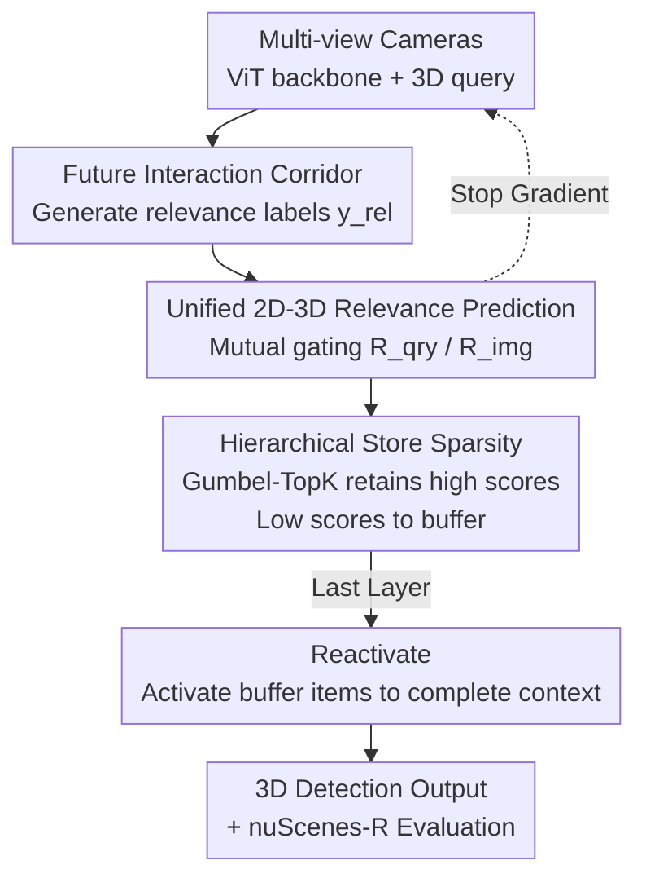

# SToRe3D: Sparse Token Relevance in ViTs for Efficient Multi-View 3D Object Detection

**Conference**: CVPR2026  
**arXiv**: [2605.14110](https://arxiv.org/abs/2605.14110)  
**Code**: To be confirmed  
**Area**: Autonomous Driving / Multi-View 3D Detection  
**Keywords**: Multi-View 3D Detection, ViT Sparsification, Token/Query Pruning, Planning Relevance, nuScenes

## TL;DR
SToRe3D introduces a "planning-aligned" joint sparsity framework for ViT-based multi-view 3D detectors. It utilizes a lightweight relevance head to simultaneously score 2D image tokens and 3D object queries. Low-relevance items are stored in a buffer rather than discarded and are reactivated in the final layer. This achieve up to 3× inference speedup with negligible precision loss, particularly maintaining near-zero loss for "planning-critical agents."

## Background & Motivation
**Background**: Dominant camera-based multi-view 3D detectors in autonomous driving (e.g., DETR3D, PETR, StreamPETR, BEVFormer, Sparse4D) rely on ViT backbones and DETR-style decoders. ViTs perform self-attention on long token sequences from multiple cameras, while decoders use a large number of 3D queries to retrieve features across views. Both exhibit $\mathcal{O}(N^2)$ complexity relative to the number of tokens/queries, posing challenges for real-time deployment.

**Limitations of Prior Work**: In urban scenarios, the vast majority of tokens belong to the background (sky, roads, buildings), and most candidate agents are irrelevant to the ego-vehicle's short-term planning (e.g., distant, parked, or non-interacting objects). However, existing detectors allocate equal computation to all tokens and candidate objects, resulting in waste and misalignment between perception and downstream planning objectives. Current efficiency methods focus on only "one side": ViT token pruning methods (e.g., DynamicViT, ToMe, SViT) only trim 2D image tokens based on 2D saliency, while DETR sparsification (e.g., Sparse-DETR, Focus-DETR) only targets encoder tokens or decoder queries. ToC3D, specifically designed for multi-view 3D, only compresses backbone tokens and depends on history query merge–unmerge operations, which are unavailable for the first frame and incur extra overhead for re-grouping at each layer.

**Key Challenge**: Real-time deployment requires reducing computation, but deciding "what to prune" should not rely solely on 2D pixel saliency; safety-critical agents for planning must be preserved. Existing methods neither jointly sparsify 2D tokens and 3D queries end-to-end nor utilize "planning relevance" as a supervisory signal. Furthermore, benchmark datasets like nuScenes weight all annotated agents equally, allowing errors from distant, non-interacting targets to dominate metrics instead of focusing on critical agents.

**Goal**: (1) Jointly sparsify tokens and queries end-to-end within a single architecture; (2) Align the sparsity budget with planning, focusing computation on agents requiring imminent reaction; (3) Maintain stable training and preserve critical precision under aggressive sparsity; (4) Provide an evaluation protocol specifically targeting planning-critical agents.

**Key Insight**: Analysis using a fixed pre-trained motion planning network reveals that planning performance saturates with only 10–20 agents (averaging ~3 truly relevant agents per frame). This suggests that most perception computation is redundant, provided "relevance" is correctly defined and supervised.

**Core Idea**: A "future interaction corridor" defines agent planning relevance for supervision. A unified 2D–3D relevance function routes tokens and queries. Low-relevance items are not hard-pruned but stored in a buffer and reactivated at the final layer to prevent irreversible precision collapse.

## Method

### Overall Architecture
SToRe3D is built upon a temporal multi-view 3D detector (e.g., StreamPETR). $V$ synchronous camera views generate tokens $\mathbf{X}_t$ via a ViT backbone. 3D queries $\mathbf{Q}_t$, anchored at 3D positions, retrieve features from multi-scale FPN features using a DETR3D-style deformable decoder, with top-$K$ queries propagated across frames into temporal memory. SToRe3D integrates a "relevance head + hierarchical storage" into this backbone: each stage scores every token and query using a lightweight relevance head. High-scoring items proceed to deeper layers, while low-scoring items are written to a buffer (rather than discarded) and reactivated in the final layer of the backbone/decoder using updated context. Relevance is supervised by two criteria: planning alignment $r^{\text{plan}}$ (preserving agents requiring ego-vehicle reaction) and detection alignment $r^{\text{det}}$ (preserving all foreground agents and rejecting background clutter). This framework is the first to jointly sparsify tokens/queries across both the ViT backbone and DETR decoder axes.

### Key Designs

**1. Future Interaction Corridor: Translating "Planning-Critical" into Supervisable Geometric Labels**

Addressing the lack of planning-relevance supervision in existing 2D-saliency-based sparsity methods, this design formalizes "planning-critical" agents (e.g., lead vehicles, crossing pedestrians). It defines a swept corridor on the BEV: for the ego-vehicle and agent $i$, the union convex hull of oriented boxes $\mathcal{B}(\tau)$ over a future window $\tau\in[0,H]$ forms a swept set $\mathcal{S}_i(H)=\mathrm{conv}\big(\bigcup_{\tau\in[0,H]}\mathcal{B}_i(\tau)\big)$. An agent is considered relevant if the minimum distance between its swept polygon and the ego-vehicle's swept polygon is within a margin $d_{\min}$:

$$y_i^{\mathrm{rel}}=\mathbb{1}\big(\mathrm{dist}(\mathcal{S}_i(H),\mathcal{S}_{\mathrm{ego}}(H))\le d_{\min}\big).$$

With $H=5s$ and $d_{\min}$ set to the 10th percentile of ego-agent distances in nuScenes (~1.2m), there are ~3 relevant agents on average per frame (max ~30). These labels supervise the relevance head and define the "relevant" criteria for the nuScenes-R benchmark.

**2. Unified 2D–3D Relevance Prediction: Reciprocal Context for Queries and Tokens**

To resolve the mismatch between independent 2D token saliency and 3D query scores, mutual gating binds both modalities. For query $\mathbf{q}_j$, a context vector $\mathbf{c}^{\mathrm{qry}}_j=\mathrm{CrossAttn}_{\text{def}}(\mathbf{q}_j,\mathbf{X}_t)\oplus\mathbf{e}_t$ is computed from token context and ego-embeddings $\mathbf{e}_t$. A small MLP predicts the query relevance score $r^{\mathrm{qry}}_j=\sigma(\mathbf{u}^\top\phi([\mathbf{q}_j\|\mathbf{c}^{\mathrm{qry}}_j]))$; the ego-term allows relevance to depend on relative motion. Token relevance scores are aggregated from the attention of top-$K$ highly relevant queries:

$$r^{\mathrm{img}}_i=\tfrac{1}{K}\sum_{j\in\mathcal{K}^{\mathrm{qry}}}A_{j\rightarrow i},$$

meaning token relevance represents "regions supported by high-relevance 3D queries." Query scores are supervised by $y^{\mathrm{rel}}$, while token scores are indirectly supervised via cross-attention, naturally aligning 2D computation with the 3D objects targeted by planning.

**3. Hierarchical Store–Reactivate Sparsity: Caching instead of Discarding**

To overcome the flaws of hard-pruning or merge–unmerge (e.g., first-frame issues, grouping overhead, collapse under extreme sparsity), each stage splits tokens/queries into an "active set" that proceeds and an "inactive set" held in a buffer. Differentiable TopK via Gumbel-softmax retains a ratio $\rho_\ell\in(0,1]$ of items: $\mathcal{K}_\ell=\mathrm{TopK}(\mathbf{r}_\ell,\lfloor\rho_\ell N_\ell\rfloor)$. Filtered items are buffered: $\mathbf{S}^{\mathrm{img}}_\ell\leftarrow\mathbf{X}_\ell[\overline{\mathcal{K}}^{\mathrm{img}}_\ell]$, $\mathbf{S}^{\mathrm{qry}}_\ell\leftarrow\mathbf{Q}_\ell[\overline{\mathcal{K}}^{\mathrm{qry}}_\ell]$. Retention ratios decrease with depth. In the final backbone/decoder layer, buffered items are reactivated using updated context to restore global information. This path allows early pruning errors to be corrected, preventing irreversible loss with minimal overhead.

**4. Dual-criteria Relevance + nuScenes-R Evaluation: Aligning Training and Evaluation with Planning**

The framework supports two variants: planning alignment $r^{\text{plan}}$ (supervised by corridor labels) and detection alignment $r^{\text{det}}$ (supervised by standard foreground/background labels). For evaluation, nuScenes-R is proposed, adding metrics calculated only on planning-critical agents: relevant-motion (RM, filtered by future corridor, denoted NDS-RM) and relevant-area (RA, filtered by a fixed ego-proximity zone, denoted mAP-RA/NDS-RA).

### Loss & Training
The end-to-end multi-task objective is: $\mathcal{L}=\mathcal{L}_{\text{det}}+\lambda_{\text{rel}}\mathcal{L}^{\text{qry}}_{\text{rel}}+\lambda_{\text{aux}}\mathcal{L}_{\text{aux}}$. Here $\mathcal{L}_{\text{det}}$ includes focal classification, L1 box regression, and Hungarian matching; $\mathcal{L}^{\text{qry}}_{\text{rel}}$ is a Gaussian focal loss between $r^{\text{qry}}$ and $y^{\text{rel}}$. **Mechanism**: To prevent the relevance head from interfering with feature learning, gradients are stopped (stop-gradient) at the query/token inputs. The backbone uses EVA-02 initialized ViT-B/L, input size $320 \times 800$, 6-layer decoder with 900 queries. Sparsity budgets linearly increase from dense to the target ratio during the 24-epoch training.

## Key Experimental Results

### Main Results
Evaluated on nuScenes validation set, compared against dense StreamPETR and token-only ToC3D:

| Method | Backbone × Res-Sparsity | mAP↑ | mAP-RA↑ | NDS↑ | NDS-RM↑ | FPS↑ |
|------|------------------|------|---------|------|---------|------|
| StreamPETR | ViT-B×800 | 0.497 | 0.627 | 0.584 | 0.443 | 6.1 |
| ToC3D-Fast | ViT-B×800-1/2 | 0.460 | 0.615 | 0.562 | 0.431 | 6.6 |
| **Ours-1/2** | ViT-B×800-1/2 | 0.493 | 0.627 | 0.581 | 0.441 | **8.2** |
| **Ours-1/3** | ViT-B×800-1/3 | 0.489 | 0.623 | 0.578 | 0.435 | **10.6** |
| **Ours-1/10** | ViT-B×800-1/10 | 0.479 | 0.612 | 0.571 | 0.430 | **17.7** |
| StreamPETR | ViT-L×800 | 0.521 | 0.641 | 0.608 | 0.485 | 2.2 |
| **Ours-1/10** | ViT-L×800-1/10 | 0.521 | 0.641 | 0.607 | 0.478 | **5.2** |

Ours-1/10 (ViT-B) achieves real-time detection (~18 FPS). On ViT-L, Ours-1/10 improves FPS from 2.2 to 5.2 (2.4×) with virtually no drop in mAP/NDS, and maintains high NDS-RM, proving computation is saved on non-essential targets.

### Ablation Study
Comparison of different sparsity strategies at defined Total Kept Ratios (TKR) (ViT-L):

| Strategy | TKR | NDS↑ | mAP↑ | FPS↑ |
|----------|-----|------|------|------|
| StreamPETR (Dense) | 1 | 0.614 | 0.533 | 2.15 |
| + Random | 0.5 | 0.567 | 0.465 | 2.45 |
| + DynamicViT | 0.5 | 0.597 | 0.505 | 2.47 |
| **+ SToRe3D-1/2** | 0.5 | **0.618** | **0.533** | **2.70** |
| **+ SToRe3D-1/10** | 0.1 | 0.607 | 0.521 | **5.21** |

### Key Findings
- **Joint Token+Query Pruning is Superior**: Pruning both (I&O) outperforms pruning only queries or only tokens, as it reduces latency in both the backbone and decoder.
- **Store–Reactivate is Crucial**: Replacing the buffer with hard-pruning causes mAP to drop from 0.521 to 0.495, highlighting the importance of the retrieval path.
- **Minimal Overhead**: Ours-1/2 (ViT-B) requires only ~20 MB (2.1%) extra runtime memory while reducing GFLOPs by 28%.
- **Redundancy in Planning**: Planning performance remains stable with very few agents, validating the "budget allocation via relevance" approach.

## Highlights & Insights
- **Planning Relevance as Differentiable Supervision**: Using future swept polygons to supervise "where to spend computation" closes the loop between perception training and planning evaluation.
- **"Filter-and-Store" Paradigm**: Replacing prune/merge with store-reactivate turns pruning into "temporary caching," allowing the model to recover from early stage errors.
- **Mutual Gating for Token/Query Alignment**: Aggregating token relevance from high-relevance 3D query attention ensures 2D computation naturally follows planning objectives.

## Limitations & Future Work
- **Reliance on Privileged Information**: Swept corridors and NDS-RM indices utilize ground-truth future trajectories, which are unavailable during real-time inference.
- **Hyperparameter Sensitivity**: Corridor parameters ($H, d_{\min}$) are tuned for nuScenes and may require adjustment for different environments.
- **Open-loop and Camera-only**: The method has not been tested in closed-loop settings or fused with LiDAR data. Extreme sparsity (beyond 1/10) also limits supervisory signals per batch.

## Related Work & Insights
Compared to **ToC3D**, SToRe3D jointly sparsifies tokens and queries, works on the first frame, and avoids grouping overhead, leading to better accuracy-latency trade-offs. Unlike **DynamicViT** or **ToMe**, which assume 2D saliency, SToRe3D aligns budgets with 3D planning. It is the first to implement query+key sparsity across both the ViT backbone and DETR decoder axes.

## Rating
- **Novelty**: ⭐⭐⭐⭐⭐ First to jointly sparsify ViT+DETR axes using planning relevance; innovative store-reactivate paradigm.
- **Experimental Thoroughness**: ⭐⭐⭐⭐ Strong comparisons on nuScenes, but lacks multi-dataset or LiDAR fusion results.
- **Writing Quality**: ⭐⭐⭐⭐ Clear motivation and methodology; self-consistent logic.
- **Value**: ⭐⭐⭐⭐⭐ Enables real-time (~18 FPS) multi-view 3D detection with large ViT backbones without losing critical safety precision.

<!-- RELATED:START -->

## Related Papers

- [\[ECCV 2024\] OPEN: Object-wise Position Embedding for Multi-view 3D Object Detection](../../ECCV2024/autonomous_driving/open_object-wise_position_embedding_for_multi-view_3d_object_detection.md)
- [\[CVPR 2026\] CoIn3D: Revisiting Configuration-Invariant Multi-Camera 3D Object Detection](coin3d_revisiting_configuration-invariant_multi-camera_3d_object_detection.md)
- [\[ICCV 2025\] EVT: Efficient View Transformation for Multi-Modal 3D Object Detection](../../ICCV2025/autonomous_driving/evt_efficient_view_transformation_for_multi-modal_3d_object_detection.md)
- [\[AAAI 2026\] FQ-PETR: Fully Quantized Position Embedding Transformation for Multi-View 3D Object Detection](../../AAAI2026/autonomous_driving/fq-petr_fully_quantized_position_embedding_transformation_fo.md)
- [\[CVPR 2026\] CCF: Complementary Collaborative Fusion for Domain Generalized Multi-Modal 3D Object Detection](ccf_complementary_collaborative_fusion_for_domain_generalized_multi-modal_3d_obj.md)

<!-- RELATED:END -->
