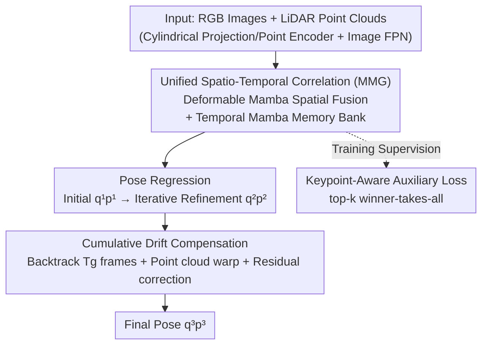

# StreamVLO: Streaming Visual-LiDAR Odometry with Cumulative Drift Compensation

**Conference**: CVPR 2026  
**Paper**: [CVF Open Access](https://openaccess.thecvf.com/content/CVPR2026/html/Liu_StreamVLO_Streaming_Visual-LiDAR_Odometry_with_Cumulative_Drift_Compensation_CVPR_2026_paper.html)  
**Code**: None  
**Area**: Autonomous Driving / Visual-LiDAR Odometry  
**Keywords**: Visual-LiDAR Odometry, Cumulative Drift Compensation, Mamba Temporal Modeling, Streaming Estimation, Multi-modal Fusion

## TL;DR
StreamVLO unifies the spatial fusion of vision and LiDAR with multi-frame temporal modeling into a Mamba-based MMG module. It utilizes a differentiable "Cumulative Drift Compensation" (CDC) to backtrack historical frames and learn residual corrections online. Without relying on mapping or loop closure, it significantly reduces long-range drift, achieving a 19%/22% reduction in $t_{rel}/r_{rel}$ on KITTI and an 18%/16% reduction in ATE/RPE on Argoverse, with a single-frame inference latency of only 74 ms.

## Background & Motivation

**Background**: Odometry estimates relative poses from consecutive frames and serves as a fundamental module for autonomous driving and SLAM. Recently, multi-modal methods have become mainstream, leveraging the complementary nature of visual texture and LiDAR geometry to handle structural mismatches, single-sensor degradation, and dynamic environments.

**Limitations of Prior Work**: Existing odometry frameworks are almost exclusively "pairwise" inputs—processing only the source and target frames while discarding older historical observations. This leads to two specific issues: first, it loses the temporal motion priors inherent in multi-frame sequences; second, small errors in frame-by-frame estimation accumulate along the trajectory, forming long-range "cumulative drift." Traditional SLAM relies on global optimization and loop closure detection to eliminate drift, but these require explicit mapping, are computationally heavy, and do not scale well with arbitrary sequence lengths.

**Key Challenge**: There is a structural disconnect between "local accuracy of pairwise estimation" and the "global consistency of long-range trajectories." Pairwise processing cannot perceive trajectory bias, while global optimization sacrifices real-time performance and streaming usability. Furthermore, splitting spatial fusion and temporal modeling into independent modules (pairwise spatial correlation followed by separate temporal aggregation) prevents a truly unified representation of multi-modal multi-frame information.

**Goal**: (1) Integrate heterogeneous vision/LiDAR features and multi-frame temporal information into a unified representation; (2) Compensate for cumulative drift online under a streaming, causal, and differentiable setting without mapping or loop closure; (3) Maintain real-time performance (KITTI LiDAR 10 Hz requires <100 ms).

**Key Insight**: The authors observe that the State Space Model (Mamba) is efficient for long-sequence temporal interaction and is modality-agnostic. They use it simultaneously for spatial deformable fusion and temporal memory. Additionally, they introduce a differentiable compensation step that "looks back at historical frames to calculate residuals against accumulated poses," allowing drift correction to be learned end-to-end rather than via post-hoc global bundle adjustment.

**Core Idea**: Use a unified Mamba (MMG) representation to handle "multi-modal space + multi-frame time" simultaneously, and use differentiable cumulative drift compensation to feed "pose errors of the entire history" back into the current frame's pose refinement.

## Method

### Overall Architecture
StreamVLO is a streaming front-end. For each arriving frame, LiDAR point clouds are cylindrically projected into pseudo-images and processed by a point encoder to obtain point features $F_P$, while RGB images pass through a convolutional feature pyramid to obtain image features $F_I$. These enter the **Unified Spatio-Temporal Correlation** module—using Deformable Mamba to sample and fuse visual features into LiDAR features, and Temporal Mamba to aggregate historical frames via a memory bank. This yields a unified scene representation and regresses the initial pose $(\mathbf{q}^{(1)},\mathbf{p}^{(1)})$ and iteratively refined pose $(\mathbf{q}^{(2)},\mathbf{p}^{(2)})$. Next, the **Cumulative Drift Compensation** (CDC) accumulates poses from the recent $T_g$ frames, warps the source point cloud from time $T_t-T_g$ to the current frame, and uses a PWC structure to calculate residuals $(\Delta\mathbf{q}^{(2)},\Delta\mathbf{p}^{(2)})$ for the final pose $(\mathbf{q}^{(3)},\mathbf{p}^{(3)})$. During training, a **Keypoint-Aware Auxiliary Loss** guides feature learning toward static regions.

### Key Designs

**1. Unified Spatio-Temporal Correlation (MMG): Multi-modal space and multi-frame time in one Mamba**

To address the disconnect where spatial and temporal modeling are separate and history is lost, the authors design the modality-agnostic MMG block—consisting of MaxPooling, Mamba, and gMLP. gMLP encodes sequences from different sources into a unified feature space, Mamba establishes long-range temporal interactions within the sequence, and MaxPooling compresses the sequence into a compact unified representation. Two branches extend from this: **Deformable Mamba** handles spatial fusion by borrowing the deformable sampling from Deformable DETR, using LiDAR features $F_P$ as queries to project points onto the image plane. It samples visual features $F_{sample}$ with adaptive offsets and fuses them via MMG:

$$\mathbf{F}_{fused} = \text{MaxPool}\big(\text{Mamba}(G_f(\mathbf{F}_{sample}\oplus\mathbf{F}_P))\big)$$

Subsequently, a cross-frame cost volume generates ego-motion features $E_{ego}$. **Temporal Mamba** handles temporal modeling by maintaining an implicit Memory Feature Bank (MFB) and an explicit Memory Pose Bank (MPB) for historical quaternions $\mathcal{Q}$ and translations $\mathcal{P}$ with a window $T_h$. Appending current features to the bank and passing them through MMG yields updated $\hat{\mathbf{E}}_{ego}$, $\mathbf{Q}_{enc}$, and $\mathbf{P}_{enc}$. This is effective because deformable sampling maintains local adaptive receptive fields efficiently, while Mamba's near-linear complexity selective SSM allows history up to $T_h{=}30$ frames to be aggregated causally without memory explosion—something pairwise + attention schemes cannot achieve.

**2. Cumulative Drift Compensation (CDC): Differentiable injection of historical errors**

This is the core design addressing cumulative drift. After obtaining the frame-by-frame refined pose $(\mathbf{q}^{(2)},\mathbf{p}^{(2)})$, CDC accumulates the poses of the recent $T_g$ frames:

$$(\mathbf{q}_t^{cumul},\mathbf{p}_t^{cumul}) = (\mathbf{q}_t^{(2)},\mathbf{p}_t^{(2)})\circ(\mathbf{q}_{t-1}^{(2)},\mathbf{p}_{t-1}^{(2)})\circ\cdots\circ(\mathbf{q}_{t-T_g+1}^{(2)},\mathbf{p}_{t-T_g+1}^{(2)})$$

where $\circ$ denotes quaternion pose composition. This cumulative pose warps the point cloud from $T_t-T_g$ to the current frame $T_t$. A Pyramid-Warping-Cost volume (PWC) structure calculates the residual $(\Delta\mathbf{q}^{(2)},\Delta\mathbf{p}^{(2)})$ between the warped and target point clouds, resulting in the final corrected pose $(\mathbf{q}^{(3)},\mathbf{p}^{(3)})$: $\mathbf{q}^{(3)}=\Delta\mathbf{q}^{(2)}\ast\mathbf{q}^{(2)}$. This is more effective than frame-by-frame correction because warping allows the model to **look back at earlier observations**, "amplifying" and penalizing errors accumulated over a sequence of frames. This essentially replaces traditional global BA/loop closure with learnable residuals without requiring a map.

**3. Keypoint-Aware Auxiliary Loss: Pinning feature learning to static regions**

Since StreamVLO regresses pose based on features, features on dynamic objects inject motion noise. This loss predicts a pose $(\mathbf{q}^{key}, \mathbf{p}^{key})$ for each query using the cost volume $E=\{e_i\}_{i=1}^N$ and uses a winner-takes-all strategy to select only the top-$k$ ($k{=}100$) queries with the smallest error relative to GT:

$$\mathcal{L}^{aux}=\frac{1}{K}\sum_{k=1}^{K}\mathcal{L}^{(k)}$$

Visualizations show these selected points fall on static structures like buildings and poles. By back-propagating gradients only for the "most reliable" queries, the network spontaneously learns to focus on stable references, contributing a 12% improvement in ablation.

### Loss & Training
Total loss consists of three parts: (1) **Regression Loss** supervising the initial, refined, and compensated stages using learnable uncertainty $\mathcal{L}=\|\hat{\mathbf{p}}-\mathbf{p}\|\exp(-k_t)+k_t+\|\hat{\mathbf{q}}-\mathbf{q}\|_2\exp(-k_q)+k_q$, weighted as $\mathcal{L}^{reg}=\alpha^1\mathcal{L}^{(1)}+\alpha^2\mathcal{L}^{(2)}+\alpha^3\mathcal{L}^{(3)}$; (2) **Keypoint-Aware Auxiliary Loss** $\mathcal{L}^{aux}$; (3) **Collective Average Loss** inspired by MOTR, averaging over $T_s{=3}$ frame sub-clips $\mathcal{L}_{total}=\frac{1}{T_s}\sum_t(\mathcal{L}^{reg}_t+\alpha^4\mathcal{L}^{aux}_t)$. Hyperparams: $T_h{=}30, T_g{=}20, T_c{=}60$ frame segments, Adam optimizer, initial lr 0.001, batch 8.

## Key Experimental Results

### Main Results
Averages on KITTI 07–10 (trained on 00–06), where $t_{rel}$ is translation RMSE (%) and $r_{rel}$ is rotation RMSE (°/100m):

| Method | Type | $t_{rel}$ | $r_{rel}$ |
|------|------|-----------|-----------|
| EfficientLO [74] | LiDAR | 0.86 | 0.41 |
| DSLO [87] | LiDAR | 0.94 | 0.44 |
| DVLO [48] (Prev. SOTA) | Visual-LiDAR | — | — |
| **StreamVLO** | **Visual-LiDAR** | **0.59** | **0.29** |

Compared to the previous SOTA DVLO, translation error decreases by **19%** and rotation error by **22%**. On Argoverse (ATE/RPE in meters):

| Method | ATE↓ | RPE↓ |
|------|------|------|
| DSLO [87] | 0.111 | 0.027 |
| DVLO [48] | 0.103 | 0.026 |
| DVLO4D [55] | 0.089 | 0.025 |
| **StreamVLO** | **0.073** | **0.021** |

ATE and RPE decreased by 18% and 16% respectively compared to DSLO. Latency is 74 ms (4090 GPU), outperforming DVLO (99 ms) and attention schemes (171 ms).

### Ablation Study
KITTI 07–10 average:

| Configuration | $t_{rel}$ | $r_{rel}$ | Description |
|------|-----------|-----------|------|
| w/o Unified MMG | 0.70 | 0.38 | Removed unified correlation; largest drop |
| w/o Compensation | 0.70 | 0.36 | Removed CDC; drift uncontrolled |
| w/o Auxiliary Loss | 0.67 | 0.38 | Removed keypoint loss |
| **StreamVLO (Full)** | **0.59** | **0.29** | Full model |

### Key Findings
- **Unified MMG is the biggest contributor**: Removing it causes $t_{rel}$ to drop from 0.59 to 0.70, proving that unifying spatial fusion and temporal modeling is a primary performance driver.
- **Deformable Mamba is a sweet spot for efficiency**: Compared to standard attention (0.80@171ms) and Deformable DETR (0.65@76ms), Deformable Mamba achieves the best accuracy near the lowest latency.
- **CDC is critical for complex motion**: StreamVLO achieves 0.77 vs DVLO 1.47 in high dynamic scenes, with better generalization across datasets.
- **Auxiliary loss selects static points**: Top-$k$ queries fall almost entirely on static structures, contributing 12% to performance.

## Highlights & Insights
- **Replace global optimization with differentiable residuals**: CDC converts "Global BA + loop closure" into an end-to-end learnable residual module. This "error correction as a forward module" concept is transferable to other sequence estimation tasks.
- **Mamba utility**: A single MMG block handles both spatial fusion and temporal memory. Its near-linear complexity is key to processing 30 frames of history within 74 ms.
- **Winner-takes-all static selection**: No semantic labels are needed; merely optimizing the top-$k$ queries with minimal error allows the network to focus on stable references automatically.

## Limitations & Future Work
- **Hyperparameter dependency**: $T_h{=}30$ and $T_g{=}20$ were tuned for specific datasets; their sensitivity in different motion patterns or frame rates is less clear.
- **Front-end only**: CDC backtracks only within the $T_g$ window. For drifts spanning thousands of frames, it still lacks the true loop closure capability of full SLAM.
- **Improvement direction**: Adapting $T_g$ dynamically based on the scene (e.g., lengthening the window during high rotation) or introducing lightweight loop candidates could further reduce long-sequence drift.

## Related Work & Insights
- **vs DVLO [48]**: Both use cost volumes and refinement, but DVLO is pairwise and clustering-based. StreamVLO employs streaming multi-frame processing with Deformable Mamba and CDC, reducing error significantly while lowering latency.
- **vs DSLO/EfficientLO**: These lack visual texture and long temporal sequence; StreamVLO's long-term memory allows it to outperform them.
- **vs Autonomous Driving Memory (Sparse4D/VideoBEV)**: Borrowed the dual-bank (explicit/implicit) memory idea but applied it to pose and feature memory in Visual-LiDAR Odometry for the first time.

## Rating
- Novelty: ⭐⭐⭐⭐ First to use Deformable/Temporal Mamba for unified fusion; CDC as a differentiable drift module is highly innovative.
- Experimental Thoroughness: ⭐⭐⭐⭐⭐ SOTA on two datasets, comprehensive ablation, and multi-dimensional validation (latency, generalization, etc.).
- Writing Quality: ⭐⭐⭐⭐ Clear logic and diagrams; math is dense but well-structured.
- Value: ⭐⭐⭐⭐ Real-time (74ms) and low-drift without mapping; direct utility for autonomous driving localization.

<!-- RELATED:START -->

## Related Papers

- [\[ECCV 2024\] DVLO: Deep Visual-LiDAR Odometry with Local-to-Global Feature Fusion and Bi-directional Structure Alignment](../../ECCV2024/autonomous_driving/dvlo_deep_visual-lidar_odometry_with_local-to-global_feature_fusion_and_bi-direc.md)
- [\[CVPR 2025\] ZeroVO: Visual Odometry with Minimal Assumptions](../../CVPR2025/autonomous_driving/zerovo_visual_odometry_with_minimal_assumptions.md)
- [\[CVPR 2026\] SHARP: Short-Window Streaming for Accurate and Robust Prediction in Motion Forecasting](sharp_short-window_streaming_for_accurate_and_robust_prediction_in_motion_foreca.md)
- [\[CVPR 2026\] Generalizing Visual Geometry Priors to Sparse Gaussian Occupancy Prediction](generalizing_visual_geometry_priors_to_sparse_gaussian_occupancy_prediction.md)
- [\[CVPR 2026\] STRNet: Visual Navigation with Spatio-Temporal Representation through Dynamic Graph Aggregation](strnet_visual_navigation_with_spatio-temporal_representation_through_dynamic_gra.md)

<!-- RELATED:END -->
## Related Papers

- [\[CVPR 2025\] ZeroVO: Visual Odometry with Minimal Assumptions](../../CVPR2025/autonomous_driving/zerovo_visual_odometry_with_minimal_assumptions.md)
- [\[CVPR 2026\] SHARP: Short-Window Streaming for Accurate and Robust Prediction in Motion Forecasting](sharp_short-window_streaming_for_accurate_and_robust_prediction_in_motion_foreca.md)
- [\[CVPR 2026\] DVGT: Driving Visual Geometry Transformer](dvgt_driving_visual_geometry_transformer.md)
- [\[ECCV 2024\] DVLO: Deep Visual-LiDAR Odometry with Local-to-Global Feature Fusion and Bi-directional Structure Alignment](../../ECCV2024/autonomous_driving/dvlo_deep_visual-lidar_odometry_with_local-to-global_feature_fusion_and_bi-direc.md)
- [\[CVPR 2026\] Generalizing Visual Geometry Priors to Sparse Gaussian Occupancy Prediction](generalizing_visual_geometry_priors_to_sparse_gaussian_occupancy_prediction.md)

<!-- RELATED:END -->
