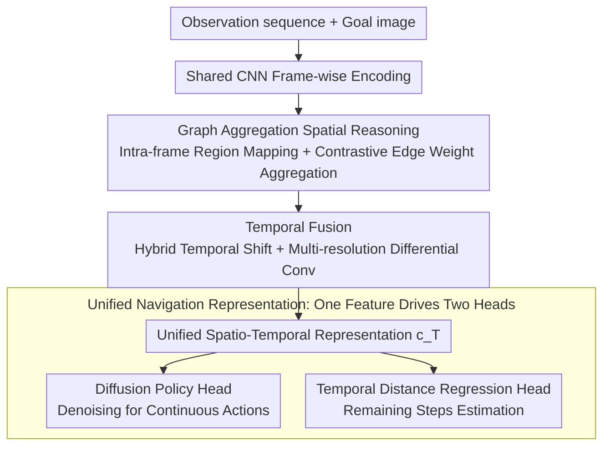

# STRNet: Visual Navigation with Spatio-Temporal Representation through Dynamic Graph Aggregation

**Conference**: CVPR 2026  
**arXiv**: [2604.02829](https://arxiv.org/abs/2604.02829)  
**Code**: [https://github.com/hren20/STRNet](https://github.com/hren20/STRNet)  
**Area**: Autonomous Driving / Embodied AI  
**Keywords**: Visual Navigation, Spatio-Temporal Representation, Graph Neural Networks, Diffusion Policy, Goal-conditioned Control

## TL;DR

STRNet proposes a unified spatio-temporal representation framework for visual navigation. By utilizing a graph reasoning module to model intra-frame spatial topology and combining hybrid temporal shifts with multi-resolution differential convolutions for temporal dynamics, it significantly improves the success rate of goal-conditioned navigation (a 70% increase over NoMaD).

## Background & Motivation

In visual navigation, existing methods invest heavily in improving decision-making modules (policy heads, behavior cloning, instruction following). However, visual encoders are often merely ImageNet-pretrained CNNs with simple temporal pooling. This coarse-grained feature representation blurs critical geometric and motion cues before they reach the decision layer.

**Core Problem**: Pooling/average attention smoothes out subtle optical flow signals that distinguish "approaching a goal" from "lateral movement"; permutation-invariant self-attention ignores the topological relationships between doorways, corridors, and obstacles.

## Method

### Overall Architecture

STRNet aims to address a long-neglected aspect: while navigation research primarily focuses on policy heads, visual encoders remain in a rudimentary state of "ImageNet CNN + temporal pooling," where geometric and motion cues are flattened before entering the decision layer. The core idea is to strengthen the encoder itself—a shared CNN extracts features frame-by-frame, followed by a graph aggregation module that reconstructs the spatial topology between regions **within a single frame**. Then, a temporal fusion module (hybrid temporal shifts + multi-resolution differential convolution) injects motion information **between frames**. This spatio-temporal representation is finally fed into two lightweight heads: a diffusion policy head for generating continuous control actions and a temporal distance regression head to estimate the distance to the goal. No policies are redesigned in the entire pipeline; it simply clarifies the "feature" layer from a blurred state.

### Key Designs

**1. Graph Aggregation Spatial Reasoning: Preserving Scene Topology in Single-Frame Features**

Permutation-invariant self-attention treats doors, corridors, and obstacles as unordered tokens, losing the spatial relationships of "where this passage leads" or "what that wall blocks." STRNet treats each frame's features as a graph: nodes correspond to image regions, edge weights are learned via visual contrast between regions, and graph aggregation propagates information across nodes for spatial reasoning. Compared to attention that flattens features into tokens, the graph structure possesses an inductive bias for adjacency and connectivity, which is better suited for representing navigable layouts. Consequently, structural elements like doorways and corridors can be distinguished in the representation rather than being blurred together.

**2. Hybrid Temporal Shift + Multi-resolution Differential Convolution: Recovering Motion Cues for "Free"**

Distinguishing between "approaching the goal" and "translating laterally" relies on subtle optical flow signals, which temporal average pooling tends to erase, while full attention is computationally heavy. STRNet combines two lightweight operators: hybrid temporal shift displaces a portion of channels along the temporal axis, allowing adjacent frame information to be integrated into the current frame with **zero additional parameters**; multi-resolution differential convolution computes inter-frame differences across multiple time scales, capturing both rapid motion and slow drifts. Their combination yields a compact yet motion-rich temporal representation, avoiding the dilemma between coarse pooling and expensive attention.

**3. Unified Navigation Representation: Powering Both Action Generation and Progress Estimation**

The fused spatio-temporal representation is not task-specific but simultaneously drives the diffusion policy head and the temporal distance regression head: the former generates continuous action sequences, while the latter estimates the remaining steps to the goal. Sharing the same representation between these heads does more than just save parameters—distance estimation forces the representation to explicitly encode "proximity to the goal," providing a goal-aware signal that constrains the policy, preventing it from taking detours when near the destination. The t-SNE analysis in the paper confirms this: STRNet's embeddings are naturally stratified by distance to the goal, whereas average pooling baselines mix near and far samples together.

### Loss & Training

Diffusion policy loss (denoising objective) + MSE loss for temporal distance regression, trained end-to-end on navigation datasets.

## Key Experimental Results

### Main Results

| Method | 2D-3D-S Success Rate | CitySim Success Rate | GRScenes Success Rate |
|------|---------------|---------------|----------------|
| NoMaD | Baseline | Baseline | Baseline |
| NaviBridger | +Slight Improvement | +Slight Improvement | +Slight Improvement |
| **Ours** | **+70%** | **Significant Gain** | **Significant Gain** |

Consistently significant improvements across three datasets, effective in both indoor and outdoor environments.

### Ablation Study

| Configuration | Avg. Success Rate | Description |
|------|-----------|------|
| CNN + Temp. Pooling (NoMaD) | Baseline | Blurred features |
| + Graph Spatial Reasoning | Gain | Enhanced spatial structure awareness |
| + Temporal Fusion | Further Gain | Motion information injection |
| Full STRNet | Optimal | Spatio-temporal synergy |

### Key Findings

- t-SNE visualization shows STRNet's feature embeddings are clearly stratified by distance to the goal, whereas NoMaD's embeddings are clustered together.
- Graph spatial reasoning and temporal fusion contribute equally; both are essential.
- Improvements in representation quality directly translate to navigation success rates—high-quality features are a prerequisite for effective navigation.

## Highlights & Insights

- **Focus on the neglected encoder**: While many studies focus on policy design, encoder quality is the foundation. STRNet proves that superior features are more critical than complex policies.
- **Adaptability of graph reasoning**: Graph structures naturally match the spatial topology requirements in navigation, being more efficient and possessing more inductive bias than the full attention used in Transformers.
- **Lightweight temporal modeling**: Temporal shift and differential convolution add virtually zero computational overhead, providing "free" temporal information injection.

## Limitations & Future Work

- The graph structure is predefined (based on an image grid) rather than dynamically learned.
- Currently only tested on goal-image navigation, without extension to language-guided navigation.
- The inference latency of the diffusion policy may affect real-time performance.

## Related Work & Insights

- **vs NoMaD**: NoMaD uses average pooling for temporal fusion, whereas STRNet utilizes graph reasoning and hybrid shifts.
- **vs ViNT**: ViNT uses topological memory for long-range planning, while STRNet focuses on the quality of base representations.
- **vs NaviBridger**: NaviBridger improves the diffusion policy, whereas STRNet improves representation encoding.

## Rating

- Novelty: ⭐⭐⭐⭐ Graph reasoning for navigation representation is a valuable new direction.
- Experimental Thoroughness: ⭐⭐⭐⭐ Three datasets + visualization analysis.
- Writing Quality: ⭐⭐⭐⭐ Clear motivation, logical comparisons.
- Value: ⭐⭐⭐⭐ Provides practical guidance for the visual navigation community.

<!-- RELATED:START -->

## Related Papers

- [\[CVPR 2026\] CLiViS: Unleashing Cognitive Map through Linguistic-Visual Synergy for Embodied Visual Reasoning](clivis_unleashing_cognitive_map_through_linguistic-visual_synergy_for_embodied_v.md)
- [\[CVPR 2026\] Spatial-Aware VLA Pretraining through Visual-Physical Alignment from Human Videos](spatial-aware_vla_pretraining_through_visual-physical_alignment_from_human_video.md)
- [\[CVPR 2026\] HiF-VLA: Hindsight, Insight and Foresight through Motion Representation for Vision-Language-Action Models](hif-vla_hindsight_insight_and_foresight_through_motion_representation_for_vision.md)
- [\[NeurIPS 2025\] EgoThinker: Unveiling Egocentric Reasoning with Spatio-Temporal CoT](../../NeurIPS2025/robotics/egothinker_unveiling_egocentric_reasoning_with_spatiotempora.md)
- [\[CVPR 2026\] Semantic Audio-Visual Navigation in Continuous Environments](semantic_audio-visual_navigation_in_continuous_environments.md)

<!-- RELATED:END -->
