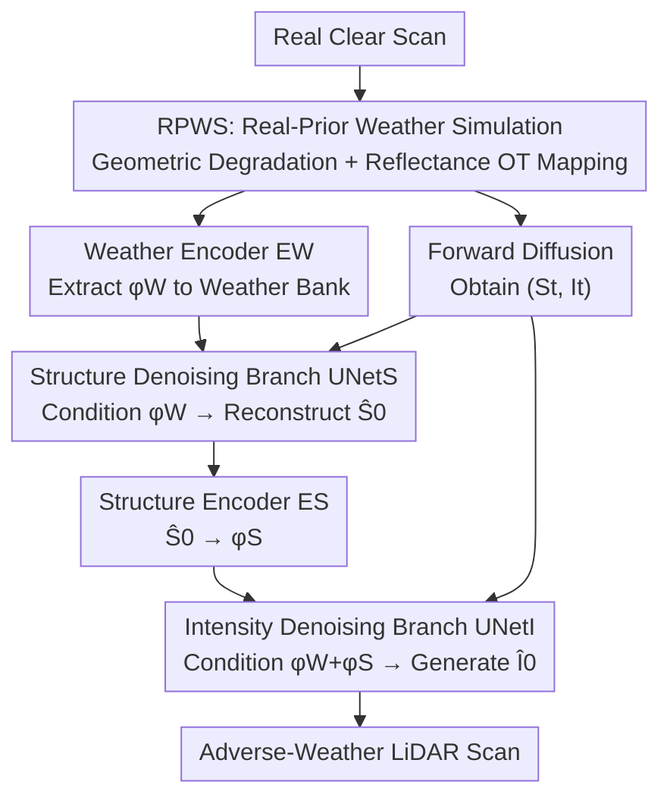

# Structure-to-Intensity Diffusion for Adverse-Weather LiDAR Generation

**Conference**: CVPR 2026  
**Paper**: [CVF Open Access](https://openaccess.thecvf.com/content/CVPR2026/html/Ni_Structure-to-Intensity_Diffusion_for_Adverse-Weather_LiDAR_Generation_CVPR_2026_paper.html)  
**Code**: None  
**Area**: Autonomous Driving / LiDAR Generation / Diffusion Models  
**Keywords**: Adverse Weather, LiDAR Point Cloud Generation, Diffusion Models, Causal Decomposition, Data Augmentation

## TL;DR
SiD explicitly decomposes the denoising process of adverse-weather LiDAR generation into two branches at each step: "reconstruct geometric structure first, then denoise reflectance intensity conditioned on the structure." Combined with the RPWS module that synthesizes degraded data using real sensor statistics, SiD significantly reduces multiple distribution metrics for fog, rain, and snow point cloud generation compared to previous SOTA models of similar scale.

## Background & Motivation

**Background**: Diffusion models have become the mainstream for LiDAR point cloud generation. Models like LiDARGen, R2DM, LiDM, and Text2LiDAR perform denoising in range image or range–reflectance space to produce high-fidelity, semantically consistent point clouds. However, they almost all rely on a "clear weather assumption" and do not handle degradation under adverse weather.

**Limitations of Prior Work**: Real adverse-weather LiDAR data is extremely difficult to collect due to the high cost of data acquisition in fog, rain, and snow. To supplement data, one approach is physical simulation (e.g., FSRL, LSS, and LiSA using optical models like Beer–Lambert or Mie scattering), which is interpretable but uses simplified assumptions for specific weather types, failing to cover real-world diversity. Another approach is learning-based (e.g., WeatherGen), which combines simulation with diffusion for higher fidelity but **models geometry and reflectance intensity jointly within a single network**.

**Key Challenge**: The mechanisms by which weather damages geometry and reflectance are fundamentally different. Geometry is primarily corrupted by "distance attenuation + structural occlusion," while reflectance intensity is affected by material, incident angle, and atmospheric attenuation, resulting in weaker and noisier signals. Joint modeling $P(S, I \mid c)$ is difficult to optimize with limited real-world supervision: more stable geometric cues dominate the training, while weaker reflectance signals are underfit, leading to physically inconsistent generated intensity maps (as shown in Fig.1(a) of the paper).

**Key Insight**: The authors revisit the physical essence of LiDAR imaging to re-examine the causal relationship between the two. Reflectance intensity is essentially the radiative response after the laser hits a geometric surface; thus, it **strongly depends on geometry**. Conversely, inferring geometry from intensity under adverse weather is ill-posed. This **asymmetrical dependence** can serve as an inductive bias to simplify generative modeling.

**Core Idea**: Instead of directly learning the joint distribution of geometry and intensity, the method employs causal decomposition $P(S, I \mid c) = P(S \mid c)\,P(I \mid S, c)$. This redefines the task as a conditional generation problem—"generating reflectance conditioned on geometry"—where at each diffusion step, the structure is denoised first, followed by the intensity denoising conditioned on the recovered structure.

## Method

### Overall Architecture
SiD addresses two issues: data scarcity and the inefficiency of joint geometry/reflectance learning. It consists of two modules: First, **RPWS** "adds" weather degradation based on real statistics to a large number of clear-weather scans to create physically plausible adverse-weather training samples, encoding each sample into a weather vector stored in a weather bank. Second, the **SiD Dual-Branch Diffusion** reconstructs geometry $\hat S_0$ first at each denoising step, encoding it as $\phi_S$ to condition the intensity branch, following the $S \to I$ dependency. The input is a two-channel range-view image $x \in \mathbb{R}^{2 \times H \times W}$ (one channel for geometric depth $S$, one for reflectance intensity $I$).

### Key Designs

**1. RPWS: "Coloring" clear scans with weather using real sensor statistics instead of manual physical models**

The limitation of simulators is that they either use simplified physical assumptions or target only a single weather type, resulting in data that does not match real distributions. RPWS takes a different approach: given a clear scan and a randomly selected adverse-weather scan from the training set, it **estimates degradation statistics directly from this pair and transfers them** without introducing learnable parameters. It handles two geometric degradation mechanisms: distance attenuation and structural occlusion. By discretizing distance into bins, it calculates the attenuation rate $P_{dec}(x) = \frac{N_{adver}(r(x))}{\max(N_{adver}(r(x)),\, N_{clear}(r(x)))}$ for a clear-weather point $x$. This is combined with a spatial visibility mask $S(x) \in [0,1]$ derived from the adverse range-view. Point survival is sampled via $z(x) \sim \mathrm{Bernoulli}\big(P_{dec}(x) \cdot S(x)\big)$. For reflectance, an optimal transport mapping $T^*$ is learned to map clear intensity distributions to adverse ones by minimizing the Wasserstein distance $T^* = \arg\min_T D\big(P_{clear} \circ T^{-1},\, P_{adver}\big)$.

**2. Structure-to-Intensity Causal Decomposition: Splitting the joint distribution into "Structure then Intensity"**

This implements the core motivation. Joint modeling $P(S,I\mid c)$ is difficult because the two modalities have different degradation behaviors. Using the asymmetric causality of LiDAR imaging $P(S, I \mid c) = P(S \mid c)\,P(I \mid S, c)$, the transition distribution at each time step of the reverse diffusion process is written as:

$$p_\theta(S_{t-1}, I_{t-1} \mid S_t, I_t, c) = p_\theta(S_{t-1} \mid S_t, c)\cdot p_\theta(I_{t-1} \mid I_t, \hat S_0, c)$$

Critically, the intensity branch is conditioned on the deterministic denoising estimate $\hat S_0$ rather than the noisy $S_t$. Since reflectance is primarily a function of geometry, $\hat S_0$ is closer to clean geometry, providing a more stable and physically meaningful condition while maintaining the Markovian property of the diffusion chain.

**3. Dual-Branch Denoising Architecture + Weather Embedding Bank**

The framework includes: structure denoising branch $\text{UNet}_S$, intensity denoising branch $\text{UNet}_I$, weather encoder $E_W$, and structure encoder $E_S$. The structure branch predicts noise $\hat\epsilon^S_\theta = \text{UNet}_S(S_t, t, \phi_W)$ to reconstruct $\hat S_0 = \frac{S_t - \sqrt{1-\bar\alpha_t}\,\hat\epsilon^S_\theta}{\sqrt{\bar\alpha_t}}$. $\hat S_0$ is then encoded into a geometric context $\phi_S = E_S(\hat S_0)$, which conditions the intensity branch $\hat\epsilon^I_\theta = \text{UNet}_I(I_t, t, \phi_W + \phi_S)$. To ensure the $S \to I$ dependency, **gradients for $S_t / \hat S_0$ are detached** in the intensity branch. Conditions are injected via AdaGN: $\text{AdaGN}(h, \phi) = \text{GN}(h) \odot (1+\gamma) + \beta$.

### Loss & Training
The denoising loss is the sum of both branches using Min-SNR time weighting $w(t)$:

$$L = \mathbb{E}_{t,\epsilon}\big[w(t)\|\epsilon_S - \hat\epsilon^S_\theta\|_2^2 + w(t)\|\epsilon_I - \hat\epsilon^I_\theta\|_2^2\big]$$

A two-stage training strategy is adopted: first learning general weather priors on RPWS-augmented data, then fine-tuning on real STF data.

## Key Experimental Results

Experiments used KITTI-360 (clear) and STF (fog/rain/snow). A new metric, **FMD (Fréchet Minkowski Distance)**, was proposed using a Minkowski UNet trained on real STF adverse-weather data to compute distribution distances.

### Main Results (STF Adverse Weather, lower is better)

| Weather | Method | FMD↓ | FPD↓ | FRD↓ | MMD(×10⁴)↓ | JSD(×10)↓ |
|------|------|------|------|------|------------|-----------|
| Fog | WeatherGen | 3.29 | 314.14 | 1968.90 | 8.08 | 2.66 |
| Fog | **Ours** | **2.11** | **119.29** | **1370.00** | **3.62** | **1.47** |
| Rain | WeatherGen | 4.65 | 86.40 | 1270.60 | 4.15 | 0.93 |
| Rain | **Ours** | **0.42** | **63.81** | **1140.21** | **1.11** | **0.93** |
| Snow | WeatherGen | 3.39 | 59.28 | 1241.70 | 1.71 | 0.77 |
| Snow | **Ours** | **2.28** | **32.38** | **1080.68** | **1.28** | **0.65** |

### Ablation Study (STF Snow test set)

| Aug. | Arc. | FT | FMD↓ | FPD↓ | FRD↓ | Description |
|------|------|----|------|------|------|------|
| MDP | SMG | - | 6.11 | 271.12 | 2231.16 | Original WeatherGen |
| RPWS | SMG | - | 3.94 | 109.42 | 1680.11 | RPWS only |
| RPWS | SiD | - | 3.67 | 91.28 | 1523.65 | SiD backbone added |
| RPWS | SiD | ✓ | **2.28** | **32.38** | **1080.68** | Full Model |

Causal Direction Ablation:

| Direction | FMD↓ | FPD↓ | FRD↓ |
|----------|------|------|------|
| Independent | 4.92 | 55.79 | 1122.67 |
| $I \to S$ | 4.42 | 66.20 | 1177.72 |
| **$S \to I$ (Ours)** | **2.28** | **32.38** | **1080.68** |

### Key Findings
- **Synergy of RPWS and SiD**: Replacing MDP with RPWS reduced FPD from 271 to 109; SiD further reduced it to 91, proving both "real statistical simulation" and "causal decomposition" are beneficial.
- **Causal Direction is Critical**: $S \to I$ was superior to $I \to S$ or independent modeling, confirming that gains come from aligning with LiDAR成像's causal structure.
- **Data Efficiency**: SiD maintains strong performance with only 10% of real data, whereas WeatherGen degrades faster under limited supervision.

## Highlights & Insights
- **Embedding Physical Causality in Diffusion**: The $P(S,I\mid c)=P(S\mid c)P(I\mid S,c)$ decomposition prevents the stronger geometric cues from suppressing the weaker reflectance signals.
- **$\hat S_0$ Conditioning**: Using deterministic denoising estimates instead of $S_t$ provides a more stable physical condition while preserving the diffusion chain's properties.
- **Gradient Detachment**: Detaching gradients from the intensity branch to the geometry branch cleanly separates the information flow from the learning direction.
- **Zero-parameter RPWS**: Transferring degradation distributions from real paired data via Optimal Transport is more realistic than manual physical equations.

## Limitations & Future Work
- Geometric degradation in RPWS currently ignores random noise from scattering or partial reflections.
- Weather types are limited to discrete fog/rain/snow labels; continuous intensity changes or mixed weather were not explored.
- FMD reliability relies on the STF-trained feature extractor; its cross-dataset generalization needs further validation.
- Sequential sampling in the dual-branch architecture increases inference latency.

## Related Work & Insights
- **vs WeatherGen**: WeatherGen uses MDP simulation and joint modeling. SiD uses statistics-driven RPWS and structure-intensity causal decomposition, achieving better "decoupling + real priors."
- **vs Physical Simulation**: Unlike Beer–Lambert-based models that use simplified assumptions, RPWS transfers real data distributions, resulting in higher realism.
- **vs Clear-Weather Models**: SiD achieves SOTA performance on KITTI-360, proving that the decoupling strategy does not sacrifice clear-weather fidelity.

## Rating
- Novelty: ⭐⭐⭐⭐ Explicitly decomposing the reverse diffusion process based on LiDAR causality is novel and physically grounded.
- Experimental Thoroughness: ⭐⭐⭐⭐ Extensive主表 and multi-dimensional ablations, though limited to two datasets.
- Writing Quality: ⭐⭐⭐⭐ Logical motivation and clear description of causal decomposition.
- Value: ⭐⭐⭐⭐ High practical value for autonomous driving perception by enabling scalable and data-efficient generation of adverse-weather data.

<!-- RELATED:START -->

## Related Papers

- [\[CVPR 2026\] HG-Lane: High-Fidelity Generation of Lane Scenes under Adverse Weather and Lighting Conditions without Re-annotation](hg-lane_high-fidelity_generation_of_lane_scenes_under_adverse_weather_and_lighti.md)
- [\[CVPR 2026\] Hybrid Robust Collaborative Perception with LiDAR-4D Radar Fusion under Adverse Weather Conditions](hybrid_robust_collaborative_perception_with_lidar-4d_radar_fusion_under_adverse_.md)
- [\[CVPR 2026\] Points-to-3D: Structure-Aware 3D Generation with Point Cloud Priors](points-to-3d_structure-aware_3d_generation_with_point_cloud_priors.md)
- [\[CVPR 2026\] A Self-Conditioned Representation Guided Diffusion Model for Realistic Text-to-LiDAR Scene Generation](a_self-conditioned_representation_guided_diffusion_model_for_realistic_text-to-l.md)
- [\[ECCV 2024\] Rethinking Data Augmentation for Robust LiDAR Semantic Segmentation in Adverse Weather](../../ECCV2024/autonomous_driving/rethinking_data_augmentation_for_robust_lidar_semantic_segmentation_in_adverse_w.md)

<!-- RELATED:END -->
