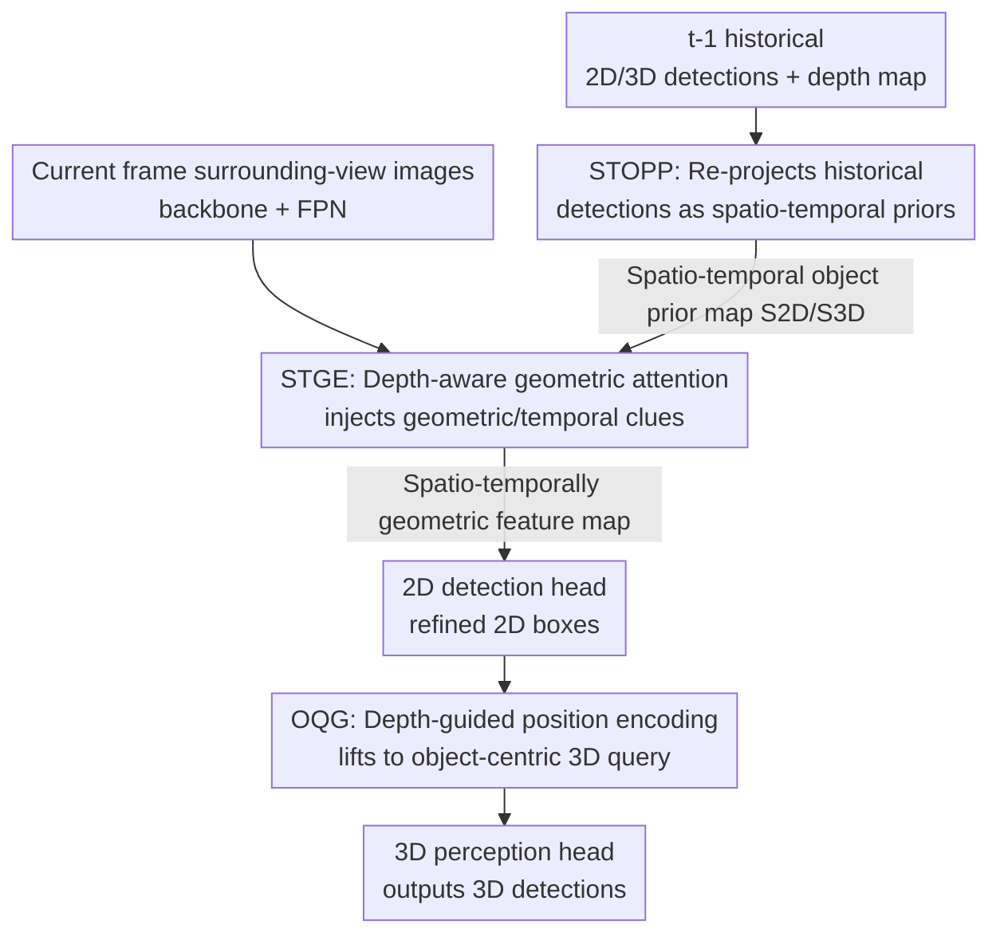

# STUR3D: Spatio-Temporal Unified Representation Learning for 3D Object Detection

**Conference**: CVPR 2026  
**Paper**: [CVF Open Access](https://openaccess.thecvf.com/content/CVPR2026/html/Fan_STUR3D_Spatio-Temporal_Unified_Representation_Learning_for_3D_Object_Detection_CVPR_2026_paper.html)  
**Code**: https://github.com/snowindog/STUR3D  
**Area**: Autonomous Driving / 3D Vision  
**Keywords**: surrounding-view 3D object detection, spatio-temporal alignment, 2D-to-3D, historical prior propagation, depth geometric encoding

## TL;DR
STUR3D addresses the spatio-temporal inconsistency in camera-based surrounding-view 3D detection caused by over-reliance on current 2D clues and neglect of historical 3D information. It explicitly re-projects the 2D/3D detection results of the previous frame back to the current image plane as spatio-temporal priors, injects these priors into the 2D detection head using depth-aware geometric attention, and finally lifts the refined 2D bounding boxes to 3D queries using position embeddings with pseudo-depth, achieving state-of-the-art performance of 57.9% mAP / 64.6% NDS on the nuScenes test set.

## Background & Motivation
**Background**: Camera-based surrounding-view 3D object detection is a core task in autonomous driving perception. It aims to localize surrounding vehicles and pedestrians and estimate their 3D size, orientation, and velocity in the world coordinate system using only six cameras without relying on expensive LiDAR. Mainstream solutions follow the query paradigm of DETR3D, initializing a set of 3D queries and propagating them back-and-forth across frames to accumulate temporal context (e.g., StreamPETR). Recently, **2D-to-3D pipelines** (such as MV2D, Far3D, QAF2D, DVPE) have emerged, which first localize objects using mature 2D detectors and then lift the 2D results into 3D queries as reliable priors.

**Limitations of Prior Work**: These 2D-to-3D methods share a common bias: they assign high confidence to 3D queries initialized by current 2D information, while treating historical propagated 3D clues as secondary references. This leads to two specific issues. From a **spatial** perspective, 2D features do not explicitly model 3D geometric quantities like depth, scale, and orientation. 3D queries generated solely from 2D representations lack geometric grounding, leading to significant localization errors after lifting; furthermore, 2D clues continue to dominate the subsequent query refinement stage, magnifying errors. From a **temporal** perspective, these methods fail to fully utilize the temporal dynamics encoded in historical 3D detections. When an object is occluded, the model cannot maintain attention on the target using accumulated 3D clues, leading to object omission and temporal inconsistency.

**Key Challenge**: There exists a **cross-dimensional and cross-frame gap** between 2D and 3D representations. 2D features are strong in appearance semantics but lack geometry, whereas historical 3D features excel in geometry and temporal continuity but are marginalized by existing pipelines. The lack of explicit alignment between the two hurts both spatial localization and temporal robustness.

**Goal**: Establish spatio-temporal alignment between 2D and 3D, decomposed into three sub-problems: (1) how to explicitly transform reliable historical 2D/3D detections into usable priors for the current frame; (2) how to enable the 2D detection head to directly learn geometric representations required for 3D localization, rather than routing 3D clues through the 2D head across frames; (3) how to lift the refined 2D boxes into geometrically grounded 3D queries.

**Key Insight**: The key observation of the authors is that detection results validated in past frames are geometrically reliable and semantically stable. Rather than using implicit feature propagation or global fusion, it is better to **explicitly reuse** these historical detections by re-projecting them back onto the current image plane. This suppresses background noise, focuses on consistent foreground areas, and "remembers" objects during occlusion based on historical evidence.

**Core Idea**: Employ a unified spatio-temporal pipeline of "explicit re-projection of historical 2D/3D detections $\to$ injecting geometric depth into the 2D head $\to$ object-centric lifting to 3D queries", replacing the old "2D-dominant, secondary-historical-3D" pipeline, to align heterogeneous 2D and 3D spatio-temporal representations.

## Method

### Overall Architecture
STUR3D is an end-to-end surrounding-view 3D detection framework. At frame $t$, the inputs include: surrounding-view images of the current frame (with features extracted via backbone + FPN neck), and the depth map, 2D detections, and 3D detections from frame $t{-}1$ as prior information. The framework feeds these into three core modules before the 3D perception head:

1. **STOPP (Spatio-Temporal Object Prior Propagator)**: Takes historical 2D/3D detections to perform 2D-to-2D and 3D-to-2D temporal propagation. It re-projects historical boxes onto the current image plane to generate structured "spatio-temporal object prior maps", achieving spatial alignment of 2D and 3D temporal info.
2. **STGE (Spatio-Temporal Geometry Encoder)**: Fuses the spatio-temporal priors generated by STOPP with current image features under depth guidance. It injects geometric/temporal clues via depth-aware geometric attention to filter out unreliable foreground hypotheses, outputting spatio-temporal geometric feature maps for 2D detection.
3. **OQG (Object-centric Query Generator)**: Lifts refined 2D boxes into object-centric 3D queries via depth-guided position encodings, injecting pseudo-depth clues to enhance geometric grounding before sending them to the 3D decoder.

The entire pipeline elevates "historical 3D information" from a marginalized role to the main driver of current 2D detection and 3D query generation, thereby simultaneously mitigating spatial misalignment and temporal omissions.

### Key Designs

**1. STOPP — Explicitly Re-projecting Historical Detections to Construct Spatio-Temporal Object Priors**

To address the pain point where "historical 3D clues are marginalized and occlusion causes omissions", STOPP avoids relying on implicit feature propagation and instead **explicitly re-projects** high-confidence detection results from the previous frame to the current frame. It defines historical priors as high-confidence 2D detections $D^{2D}_{t-1}=\{(B^{2D}_{i,t-1}, c_{i,t-1}, f^{2D}_{i,t-1})\}$ and 3D detections $D^{3D}_{t-1}=\{(B^{3D}_{j,t-1}, c_{j,t-1}, f^{3D}_{j,t-1})\}$, where the box feature $f$ is extracted by RoIAlign, and the 3D boxes are first projected onto the image plane via a geometric projection operator $\Pi(\cdot)$.

The module employs two parallel branches for **temporal geometric alignment and projection**: it aligns historical boxes with the current frame using the ego-motion matrix $T_{t-1\to t}$. The 3D branch directly transforms and re-projects 3D boxes to the current multi-view images: $B^{3D|2D}_{j,t}=\Pi(K_t, T_{t-1\to t}\cdot B^{3D}_{j,t-1})$; the 2D branch samples the depth $d_{i,t-1}$ of the previous frame at the box center $(\bar u_i,\bar v_i)$, constructs a pseudo 3D center, and projects it back to the current frame: $B^{2D}_{i,t}=\Pi(K_t, T_{t-1\to t}\cdot K_{t-1}^{-1}\cdot[\bar u_i,\bar v_i,1]d_{i,t-1})$. Projected boxes exceeding the field of view are discarded. Finally, **prior map generation** is performed: the box features are concatenated with category embeddings and passed through an MLP to obtain object embeddings $e_o=\mathrm{MLP}(f_{o,t-1}\oplus\mathrm{CatEnc}(c_{o,t-1}))$, and then object spatial masks $M_o$ inject the embeddings into corresponding regions, with normalization aggregated across objects:

$$S_t=\frac{\sum_{o=1}^{O} e_o\otimes M_o}{\max\left(1,\ \sum_{o=1}^{O} M_o\right)}$$

The same process is applied to 2D and 3D box features respectively, producing two prior maps $S^{2D}_t$ and $S^{3D}_t$. This has threefold benefits: suppressing background noise to focus on foregrounds, alleviating occlusions using temporal clues, and eliminating discrepancies between 2D and 3D detections to achieve cross-modal alignment. Moreover, because it is an explicit re-projection rather than an implicit fusion, the geometric and temporal information of the historical 3D is preserved "intact" to participate in the current frame.

**2. STGE — Depth-Aware Geometric Attention, Enabling the 2D Head to Directly Yield 3D-Needed Representations**

Upon obtaining the prior maps, STGE addresses the pain point where "there is a representation gap between the 2D and 3D feature spaces, forcing past 3D clues to route through the 2D head across frames". It first employs a lightweight DepthNet (`residual + convolutional blocks`) to predict pixel-wise depth regression and probabilistic depth distribution, supervised by LiDAR depth signals during training and running purely on vision during inference. Inspired by the Deformer series, utilizing the observation that "each pixel has a unique 2D coordinate, and the depth value encodes the relative distance to other pixels", it constructs image plane priors and depth distance priors to synthesize a geometric prior $X$ (with shape $H_fW_f\times H_fW_f$), injecting it into features using **geometric attention**:

$$\mathrm{GeoAtten}(F,X)=\big(\mathrm{Softmax}(QK^\top)\odot\beta X\big)V$$

Where $\beta\in(0,1)$ is a learnable decay rate controlling the influence intensity of the geometric prior. The current image features $F_t$ and the combined priors $S^{2D}_t+S^{3D}_t$ are first separately convolved, then passed through Image-GeoAtten and Prior-GeoAtten to obtain $F'_t$ and $S_t$. Subsequently, an **Adaptive Threshold Gate (ATG)** is utilized to generate spatial masks emphasizing high-confidence foreground areas, yielding the final spatio-temporal geometric feature maps:

$$F_{sp,t}=F'_t+F'_t\odot\sigma\big(\mathrm{ATG}((S_t-\gamma)\tau)\big)+S_t$$

ATG utilizes two learnable parameters $\gamma$ (threshold offset) and $\tau$ (mask smoothness). ⚠️ Note: The parenthesis pairing in Equation (13) of the original paper is slightly ambiguous; the original text is followed here. The key significance of STGE is: it enables the 2D detector to **directly distill and provide feature representations actually consumed by the 3D head**, including those 3D clues that previously had to be routed across frames through the 2D head, thereby narrowing the 2D-3D representation gap; meanwhile, the depth values enhance the clarity of object boundaries, guiding the 2D detector to localize more precisely.

**3. OQG — Object-centric + Pseudo-depth, Lifting Geometrically Well-grounded 3D Queries**

After the spatio-temporal geometric feature maps of STGE are fed into the 2D detection head to obtain refined 2D boxes, OQG is responsible for lifting them into 3D queries, addressing the limitation of "lifting queries solely based on 2D appearance features, leaving the 3D queries lacking geometric grounding". For each detection box, a feature embedding $e^{2d}_t$ is first obtained via RoIAlign + MLP, and then a coarse position encoding $Pe'\in\mathbb{R}^{3\times M}$ is generated using the inverse camera intrinsic $K_t^{-1}$. Meanwhile, the depth value under the box center is retrieved from the depth map and concatenated with the center coordinates to construct a **pseudo 3D point**, which is transformed via $K_t^{-1}$ to obtain the object-centric 3D position $Po\in\mathbb{R}^{3\times M}$. Both are fed into a linear layer to compute an offset, which is then superimposed to yield the refined position encoding:

$$Pe=\mathrm{Linear}(\mathrm{concat}(Pe', Po))+Pe'$$

Its contributions are twofold: first, reliable 2D detections provide correction clues for the pseudo-point cloud (eliminating its inherent bias); second, it generates refined 3D points via position encoding, suppressing error propagation into the 3D detection pipeline. In essence, OQG bridges 2D perception and 3D inference explicitly, giving 3D queries self-contained geometric grounding rather than relying entirely on appearance guesswork.

### Loss & Training
Depth is supervised by projecting LiDAR points onto the camera views to form sparse depth maps (downsampled by 16×). DepthNet is trained using a masked regression loss on valid pixels; inference is purely vision-based. Backbones used include ResNet50/ResNet101/V2-99, trained with AdamW + cosine annealing, a learning rate of $4\times10^{-4}$ , batch size of 8 on 4 A6000 GPUs; 90 epochs on the val set, and 60 epochs on the test set. No CBGS, TTA, or future frames are used. Top-128 2D detections and top-256 3D detections are kept per frame; $\beta, \gamma, \tau$ are all initialized to 0.5.

## Key Experimental Results

### Main Results
Evaluated on nuScenes, reporting mAP and NDS (as well as mATE/mASE/mAOE/mAVE/mAAE). On the test set, STUR3D with a V2-99 backbone and 640×1600 input achieves a new SOTA, outperforming the baseline StreamPETR by +2.8% mAP / +1.0% NDS, and the prior SOTA method DVPE by +0.6% mAP / +0.2% NDS:

| Dataset | Backbone / Resolution | Method | mAP↑ | NDS↑ |
|--------|------------------|------|------|------|
| nuScenes test | V2-99 / 640×1600 | StreamPETR (Baseline) | 55.0 | 63.6 |
| nuScenes test | V2-99 / 640×1600 | DVPE (Prev. SOTA) | 57.2 | 64.4 |
| nuScenes test | V2-99 / 640×1600 | RayDN | 56.5 | 64.5 |
| nuScenes test | V2-99 / 640×1600 | **STUR3D** | **57.9** | **64.6** |

Consistent improvements are observed across different backbones on the val set: ResNet50/704×256 (pre-trained on nuImages) achieves 48.6% mAP / 57.9% NDS, outperforming OPEN by +1.6% mAP / +1.4% NDS, and the baseline StreamPETR by +3.7% mAP / +2.9% NDS; ResNet101/1408×512 achieves 53.1% mAP / 61.3% NDS, outperforming Sparse4Dv2 by +1.0% mAP / +0.5% NDS.

### Ablation Study
Component ablation (V2-99 backbone, 320×800 input, retrained for 24 epochs; baseline without any module a = 48.2/57.1):

| Config | STOPP | STGE | OQG | mAP↑ | NDS↑ | Description |
|------|:---:|:---:|:---:|------|------|------|
| a | - | - | - | 48.2 | 57.1 | Baseline |
| b | ✓ | - | - | 48.9 | 58.1 | +STOPP, steady representation from temporal priors |
| c | - | ✓ | - | 48.7 | 58.0 | +STGE, geometric consistency |
| d | - | - | ✓ | 50.2 | 59.2 | +OQG, object-centric query yields the largest gain |
| e | ✓ | - | ✓ | 52.1 | 60.5 | Spatio-temporal + geometric prior synergy |
| f | - | ✓ | ✓ | 51.7 | 60.2 | Depth-guided geometry |
| g | ✓ | ✓ | ✓ | **53.0** | **61.2** | Full model, outperforming baseline by +4.8 mAP / +4.1 NDS |

Comparison of depth encoding methods (Table 6): STGE consistently outperforms Linear / MLP encoding on all metrics; with LiDAR supervision, NDS gets an additional +1.0%; even without any LiDAR supervision, camera-only setup reaches 52.7% mAP / 60.2% NDS:

| Depth Encoding | LiDAR Supervision | mAP↑ | NDS↑ |
|----------|:---:|------|------|
| Linear | - | 52.5 | 59.8 |
| MLP | - | 51.7 | 60.1 |
| STGE | - | 52.7 | 60.2 |
| STGE | ✓ | **53.0** | **61.2** |

### Key Findings
- **OQG yields the largest single-module gain** (d: +2.0% mAP / +2.1% NDS), indicating that object-centric query generation with depth priors is most critical for 3D initialization; all three modules stacked together push the baseline from 48.2 to 53.0 mAP.
- **STOPP is plug-and-play**: when integrated into DVPE, it brings +0.3% mAP/NDS; integrated into OPEN, it improves it to 52.4% mAP / 60.7% NDS, proving that spatio-temporal prior propagation is a transferable module.
- **Reasonable historical frame cache size is sufficient** (Table 5): removing either 2D or 3D detection priors causes a notable drop in performance (B/C), indicating 2D and 3D priors should be used jointly; increasing cached frames from 1 to 2 (F) keeps accuracy stagnant, and increasing to 4 (G) yields no gain due to accumulated temporal noise.
- **Excellent accuracy-efficiency trade-off**: STUR3D achieves 53.0% mAP / 61.2% NDS at 7.8 FPS, which is ~2× faster and more accurate than QAF2D; although OPEN has the highest throughput (10.3 FPS), STUR3D achieves the best mAP with competitive NDS.
- **Robust to occlusion**: visualizations demonstrate that STUR3D can recover heavily occluded objects missed by both the baseline and QAF2D, thanks to the spatio-temporal propagation structure leveraging historical frames to maintain temporal consistency.

## Highlights & Insights
- **Treating "historical detections" as explicit priors rather than implicit features**: The core cleverness is to directly re-project high-confidence 2D/3D boxes from the previous frame back onto the current image plane to encode spatial prior masks, instead of propagating abstract features. This makes historical geometric information directly "tangible" and maintain attention via historical evidence even during occlusions. This explicit re-projection idea can be transferred to any temporal detection/tracking tasks.
- **Learnable decay $\beta X$ in geometric attention**: Injecting depth distance/image plane priors $X$ into attention as a multiplicative term ($\mathrm{Softmax}(QK^\top)\odot\beta X$) and learning how strongly to apply the geometric prior through a scalar $\beta$ is more flexible than hardcoded geometric biases.
- **Enabling the 2D head to "directly output features consumed by the 3D head"**: The design philosophy of STGE is highly inspiring. Rather than routing 3D clues across frames via the 2D head, it makes the 2D head directly distill 3D localization representations guided by depth, narrowing the 2D-3D representation gap at the source.
- **Plug-and-play capability of STOPP**: Integrating it as an independent module into OPEN/DVPE yields consistent performance gains, showing that "spatio-temporal object prior propagation" is a well-decoupled and reusable component.

## Limitations & Future Work
- **Limitations admitted by the authors**: The scalability and efficiency of the geometric attention mechanism still have room for improvement (as the geometric prior $X$ is a large $H_fW_f\times H_fW_f$ matrix with high computational cost), which is prioritized for future work.
- **Reliance on historical frame quality**: The approach relies heavily on the assumption that "previous frame high-confidence detections are reliable". If previous detections are faulty (e.g., due to sudden object appearances or rapid motion), re-projection priors might introduce misleading clues. The risk of accumulated temporal noise is also verified by the performance drop when caching more than 2 frames.
- **Two sides of depth supervision**: LiDAR supervision in the training phase is still required to achieve optimal accuracy (providing a ~1% higher NDS than unsupervised settings). Although inference is purely vision-based, the threshold for training data acquisition is not completely eliminated.
- **Future improvement directions**: Exploring lightweight geometric prior approximations (like low-rank/sparse attention) to reduce the overhead of $X$; or introducing uncertainty estimation to weigh historical priors, mitigating negative propagation from faulty historical predictions.

## Related Work & Insights
- **vs StreamPETR (Baseline, object-centric temporal fusion)**: StreamPETR propagates historical 3D decoder embeddings as context, which is an implicit feature propagation. STUR3D explicitly re-projects historical 2D/3D detections into spatial priors to make geometric information visible, showing a +2.8% mAP / +1.0% NDS improvement on the test set.
- **vs MV2D / Far3D / QAF2D (2D-to-3D priors)**: These approaches lift 2D detections to initialize 3D queries, but are biased towards 2D features while marginalizing historical 3D ones, leaving queries without geometric grounding and prone to occlusion omissions. STUR3D explicitly aligns 2D/3D spatio-temporal representations via STOPP+STGE, injecting pseudo-depth inside OQG to reinforce geometry. It is significantly more stable in occluded scenarios and is ~2× faster than QAF2D.
- **vs DVPE (Former SOTA, 2D RoI object-centric temporal modeling)**: DVPE incorporates 2D RoI features into temporal modeling. STUR3D not only uses 2D, but explicitly projects historical 3D back to the 2D plane for cross-modal consistency constraints, yielding +0.6% mAP / +0.2% NDS on the test set. Furthermore, STOPP can be directly plugged into DVPE for additional gains.
- **vs OPEN (High-throughput method)**: OPEN achieves higher throughput (10.3 vs 7.8 FPS), but STUR3D secures the best mAP with competitive NDS. Porting STOPP into OPEN also enhances its performance, demonstrating a superior accuracy-efficiency trade-off.

## Rating
- Novelty: ⭐⭐⭐⭐ The idea of "explicitly re-projecting historical 2D/3D detections as spatio-temporal priors" is clear and targeted, though all three modules are built upon prior works in 2D-to-3D and geometric encoding, representing a solid combinatorial innovation.
- Experimental Thoroughness: ⭐⭐⭐⭐⭐ Comprehensively covers multiple backbones and resolutions on nuScenes val/test sets, with multi-dimensional ablation studies covering components, depth encoding, historical frames, plug-and-play capability, and runtime efficiency.
- Writing Quality: ⭐⭐⭐⭐ Clear motivation, well-defined module responsibilities, and good coordination between text and figures; some minor ambiguity in parentheses pairing in a few formulas (e.g., ATG Eq. 13).
- Value: ⭐⭐⭐⭐ Reaches SOTA on camera-only surrounding-view 3D detection while maintaining 7.8 FPS, with the plug-and-play STOPP presenting practical reference value for autonomous driving perception.

<!-- RELATED:START -->

## Related Papers

- [\[CVPR 2026\] STRNet: Visual Navigation with Spatio-Temporal Representation through Dynamic Graph Aggregation](strnet_visual_navigation_with_spatio-temporal_representation_through_dynamic_gra.md)
- [\[CVPR 2026\] TACO: Task-Aware Contrastive Learning for Joint LiDAR Localization and 3D Object Detection](taco_task-aware_contrastive_learning_for_joint_lidar_localization_and_3d_object_.md)
- [\[AAAI 2026\] Rethinking the Spatio-Temporal Alignment of End-to-End 3D Perception](../../AAAI2026/autonomous_driving/rethinking_the_spatio-temporal_alignment_of_end-to-end_3d_perception.md)
- [\[ECCV 2024\] Equivariant Spatio-Temporal Self-Supervision for LiDAR Object Detection](../../ECCV2024/autonomous_driving/equivariant_spatio-temporal_self-supervision_for_lidar_object_detection.md)
- [\[ICLR 2026\] UniSplat: Unified Spatio-Temporal Fusion via 3D Latent Scaffolds for Dynamic Driving Scene Reconstruction](../../ICLR2026/autonomous_driving/unisplat_unified_spatio-temporal_fusion_via_3d_latent_scaffolds_for_dynamic_driv.md)

<!-- RELATED:END -->
