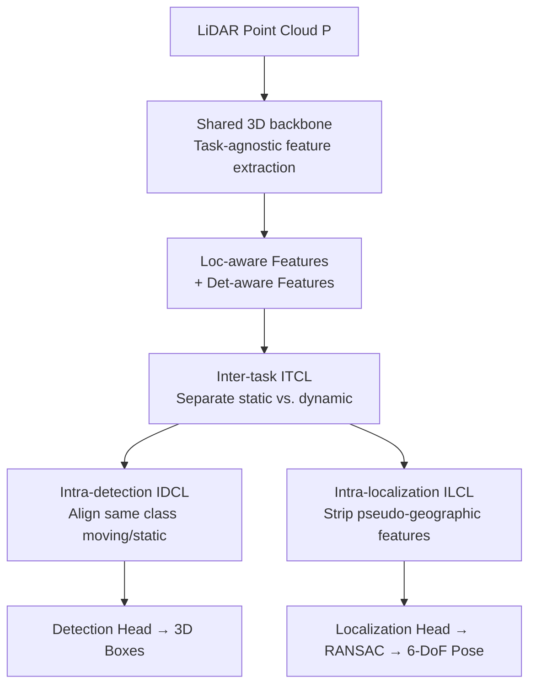

# TACO: Task-Aware Contrastive Learning for Joint LiDAR Localization and 3D Object Detection

**Conference**: CVPR 2026  
**Paper**: [CVF Open Access](https://openaccess.thecvf.com/content/CVPR2026/html/Xing_TACO_Task-Aware_Contrastive_Learning_for_Joint_LiDAR_Localization_and_3D_CVPR_2026_paper.html)  
**Code**: https://github.com/xmuxly/OxfoLD  
**Area**: Autonomous Driving / 3D Vision  
**Keywords**: LiDAR Localization, 3D Object Detection, Multi-task Learning, Contrastive Learning, Feature Decoupling

## TL;DR
TACO utilizes a single shared backbone to simultaneously perform LiDAR localization and 3D object detection. Through three contrastive learning modules, it explicitly decouples and mutually complements "static geographic features" and "dynamic object features." On the self-constructed OxfoLD dataset, it reduces localization error from a 0.95m baseline to 0.72m, while achieving detection accuracy superior to single-task models.

## Background & Motivation
**Background**: Self-localization and 3D object detection are two core tasks in autonomous driving. LiDAR localization follows three main routes: retrieval, matching, and regression. Recent APR and SCR regression methods use CNNs to directly estimate 6-DoF poses. 3D detection is dominated by center-based and anchor-based methods. Traditional systems treat these as two independent pipelines, optimized with separate networks and metrics.

**Limitations of Prior Work**: Independent pipelines lead to significant computational redundancy (the same point cloud frame is voxelized and processed for features twice). Moreover, knowledge cannot be transferred between tasks. Although distillation and pruning can compress models, they usually come at the cost of performance drops and fail to exploit task synergy at the representation level.

**Key Challenge**: Directly applying Multi-Task Learning (MTL) with shared features is ineffective because the semantic and geometric preferences of localization and detection conflict. Detectors focus on **local, fine-grained, and dynamic** object features (cars, pedestrians), while localizers require **global, stable, and static** geographic structures (roads, buildings). Features useful for one task act as noise for the other. Naive feature sharing leads to degraded performance in real-world scenes where static and dynamic elements coexist. Crucially, SCR-style localization relies on a "static scene assumption," where moving objects contaminate static structures and introduce localization noise.

**Key Insight**: The authors observe that the two tasks actually possess **complementary clues**. Static geographic cues can help the detector prune false positives (e.g., not mistaking a curb for a car), while dynamic object cues can help the localizer identify and remove dynamic disturbances. Since the conflict stems from "feature entanglement," the solution is not to share entangled features but to **explicitly decouple** task-specific features and implement bidirectional supervision.

**Core Idea**: Use contrastive learning on top of a shared backbone to pull apart static geographic features and dynamic object features (decoupling) while allowing features from both tasks to "mutual teach." This simultaneously improves localization robustness and detection accuracy within a unified network.

## Method

### Overall Architecture
The input is a single frame of large-scale outdoor LiDAR point cloud $P=\{p_i\}_{i=1}^N$. The outputs are 3D detection boxes $B=\{b_j\}$ (7-DoF) and the vehicle's 6-DoF global pose $p$. TACO splits the workflow into two stages: First, a shared 3D backbone extracts task-agnostic features (eliminating redundant voxelization and computation). Then, on the BEV feature map, three contrastive learning modules "separate and align" task-specific features. Finally, features are fed into detection and localization heads, respectively; localization results undergo a RANSAC stage for robust pose refinement.

Specifically, the **TAFE (Task-Agnostic Feature Extraction)** stage reuses a 3D backbone to extract global contextual features. The **TFCL (Task-aware Feature Contrastive Learning)** stage is the core, deriving Loc-aware and Det-aware feature branches from the shared features. Three contrastive modules—ITCL, IDCL, and ILCL—handle "inter-task conflict," "intra-detection conflict," and "intra-localization conflict," respectively.

### Key Designs

**1. ITCL Inter-task Contrastive Learning: Spatially separating static and dynamic features**

This design directly addresses the conflict between task preferences. When detection and localization share a backbone, static structures and dynamic objects are mixed in the BEV features, causing localization to be disturbed by moving objects and detection to mistake static structures (like curbs) for targets. ITCL explicitly defines static geographic features $G_g=\{f_{(i,j)g}\}$ and dynamic object features $M_o=\{f_{(i,j)o}\}$. $G_g$ is sorted by L2 norm to select the top-$N$ most salient features $F_g$, while object features $F_o$ are extracted using GT priors. The cosine similarity between each pair $(f_g^n, f_o^m)$ is calculated and **minimized**:

$$L_{ITCL} = \frac{1}{B}\sum_{b=1}^{B}\frac{\sum_{n=1}^{N}\sum_{m=1}^{M} \mathrm{sim}(f_g^n, f_o^m)}{N\cdot M}$$

By forcing static and dynamic features apart in the representation space, localization focuses solely on geographic structures, and detection avoids learning static correlations.

**2. IDCL Intra-detection Contrastive Learning: Aligning same-class objects across motion states**

Conflict also exists within the detection task: the point cloud appearance of the same category (e.g., cars) differs significantly between "moving" and "stationary" states. IDCL uses inter-frame matching to calculate velocity, categorizing objects as dynamic $F_{do}$ or static $F_{so}$ using a $0.5\,\text{m/s}$ threshold. It uses a symmetric contrastive loss to pull features of the same category together and push different categories apart:

$$L_{ds} = -\log\frac{\sum_{s_{so}^i\in S_{so}} \exp(\mathrm{sim}(f_{do}, s_{so}^i)/\tau)}{\sum_{f\in F_{so}} \exp(\mathrm{sim}(f_{do}, f)/\tau)}$$

This ensures the detector learns category representations that are consistent across motion states, improving robustness for both parked cars and moving pedestrians.

**3. ILCL Intra-localization Contrastive Learning: Stripping "pseudo-geographic features"**

A trap in localization is "pseudo-geographic features" $F_{pg}$—features of objects that are temporarily stationary but inherently dynamic (like roadside parked cars). These are activated similarly to geographic structures, misleading the localizer. ILCL contrasts true stable geographic features $F_{geo}$ (top-$K$ by L2 norm in $F_g$) against pseudo-geographic features $F_{pg}$ (geometric features corresponding to static object GT boxes), minimizing their cosine similarity:

$$L_{ILCL} = \frac{1}{B}\sum_{b=1}^{B}\Big[\frac{1}{UV}\sum_{i=1}^{U}\sum_{j=1}^{V} s_{ij}^b\Big]$$

This pushes "pseudo-geographic" features away from the localization feature space, ensuring the localization head relies only on long-term invariant structures.

### Loss & Training
The total loss is a weighted sum of detection, localization, and the three contrastive losses:

$$L = \lambda_1 L_{det} + \lambda_2 L_{loc} + \lambda_3 L_{ITCL} + \lambda_4 L_{ILCL} + \lambda_5 L_{IDCL}$$

Implementation uses PyTorch and Spconv, with the Adam optimizer, an initial learning rate of 0.01, and weight decay of $10^{-4}$. The model is trained for 100 epochs with a batch size of 100. The BEV grid covers $[-60, 60]\text{m}$ (x, y) and $[-2, 6]\text{m}$ (z) with a $0.2\text{m}$ voxel size.

## Key Experimental Results

To support joint training, the authors constructed the **OxfoLD dataset** by adding 3D bounding box annotations (Car/Pedestrian/Cyclist) to the Oxford RobotCar multi-traversal localization data. It includes 315k annotated frames across 8 traversals.

### Main Results: Localization and Detection
Localization comparison on the OxfoLD test set (Mean translation error in meters / Mean rotation error in degrees):

| Method | Type | Mean Translation Error | Mean Rotation Error |
|------|------|------|------|
| HypLiLoc (CVPR'23) | APR | 3.89m | 1.27° |
| DiffLoc (CVPR'24) | APR | 1.86m | 0.87° |
| SGLoc (CVPR'23) | SCR | 1.53m | 1.60° |
| LiSA (CVPR'24, Baseline) | SCR | 0.95m | 1.14° |
| LightLoc (CVPR'25) | SCR | 0.83m | 1.12° |
| **TACO (Ours)** | — | **0.72m** | **0.85°** |

Compared to the LiSA baseline, translation and rotation errors are reduced by **24.21% and 25.44%**, respectively. In detection, TACO achieved Vehicle AP@0.5 = 81.60% on OxfoLD.

### Ablation Study (OxfoLD Test Set)
| Configuration | Translation Error | Vehicle AP@0.5 | Description |
|------|---------|---------------|------|
| Baseline LiSA | 0.95m, 1.14° | – | Localization-only SCR |
| + DET Head | 0.89m, 1.06° | 72.54% | Detection provides implicit spatial cues |
| + ITCL | 0.82m, 0.99° | 75.32% | Inter-task decoupling benefits both tasks |
| + IDCL | 0.85m, 0.93° | 77.45% | Motion alignment primarily improves detection |
| + ILCL | 0.76m, 0.89° | 76.21% | Stripping pseudo-geo primarily improves localization |
| **Full (TACO)** | **0.72m, 0.85°** | **81.60%** | All three modules enabled |

### Key Findings
- **Joint training provides inherent gains**: Compared to single-task training, the joint model performs better in both tasks, proving the synergy between tasks is exploitable.
- **Clear division of labor**: ITCL improves both ends, IDCL focuses on detection accuracy, and ILCL focuses on reducing localization error.
- **Superiority over general MTL**: TACO significantly outperforms architectures like Cross-stitch or LiDARFormer, demonstrating that explicit decoupling is superior to simple feature sharing.

## Highlights & Insights
- **Diagnosing task conflict as "feature entanglement"**: Rather than accepting that MTL sharing degrades performance, the authors pinpointed the mutual contamination of static and dynamic features.
- **Clean three-layered contrastive structure**: Inter-task (ITCL), intra-detection motion (IDCL), and intra-localization pseudo-geography (ILCL) address specific conflict sources.
- **The "Pseudo-geographic feature" concept**: Formalizing the failure mode where parked cars are mistaken for permanent landmarks into an optimizable objective is a major "aha" moment.

## Limitations & Future Work
- **Annotation dependency**: The method relies heavily on multi-traversal LiDAR scans and detailed 3D box labels.
- **Threshold sensitivity**: The $v>0.5\,\text{m/s}$ threshold for dynamic/static classification might misclassify slow-moving objects. The reliance on L2 norm for top-$N$ feature selection may also be sensitive to hyperparameters.
- **Cross-dataset evaluation**: Localization on nuScenes/KITTI-360 was conducted using pseudo-relocalization pairs as they lack true multi-traversal overlap, so those results should be interpreted with caution.

## Related Work & Insights
- **vs. LiSA (CVPR'24)**: TACO adds joint detection and triple contrastive modules to LiSA's backbone, which assumes a static scene, reducing localization error by 24%.
- **vs. LiDARFormer / Cross-stitch**: These rely on shared backbones without addressing feature preference conflicts. TACO's explicit decoupling leads to comprehensive leads in both performance and efficiency.
- **vs. LidarMTL**: While previous works joint-trained "semantically similar" tasks like detection and segmentation, TACO tackles tasks with **opposing inherent preferences**.

## Rating
- Novelty: ⭐⭐⭐⭐ First unified contrastive framework for LiDAR localization + 3D detection.
- Experimental Thoroughness: ⭐⭐⭐⭐ Multi-dataset validation and modular ablation, though some hyperparameter analysis is missing.
- Writing Quality: ⭐⭐⭐⭐ Clear motivation and well-explained module functions.
- Value: ⭐⭐⭐⭐ Efficient unified perception approach and the contribution of the OxfoLD dataset.

<!-- RELATED:START -->

## Related Papers

- [\[CVPR 2026\] BEV-SLD: Self-Supervised Scene Landmark Detection for Global Localization with LiDAR Bird's-Eye View Images](bev-sld_self-supervised_scene_landmark_detection_for_global_localization_with_li.md)
- [\[CVPR 2026\] RaGS: Unleashing 3D Gaussian Splatting from 4D Radar and Monocular Cue for 3D Object Detection](rags_unleashing_3d_gaussian_splatting_from_4d_radar_and_monocular_cue_for_3d_obj.md)
- [\[CVPR 2026\] R4Det: 4D Radar-Camera Fusion for High-Performance 3D Object Detection](r4det_4d_radar-camera_fusion_for_high-performance_3d_object_detection.md)
- [\[CVPR 2026\] L3DR: 3D-aware LiDAR Diffusion and Rectification](l3dr_3d-aware_lidar_diffusion_and_rectification.md)
- [\[CVPR 2026\] A Prediction-as-Perception Framework for 3D Object Detection](a_prediction-as-perception_framework_for_3d_object_detection.md)

<!-- RELATED:END -->
