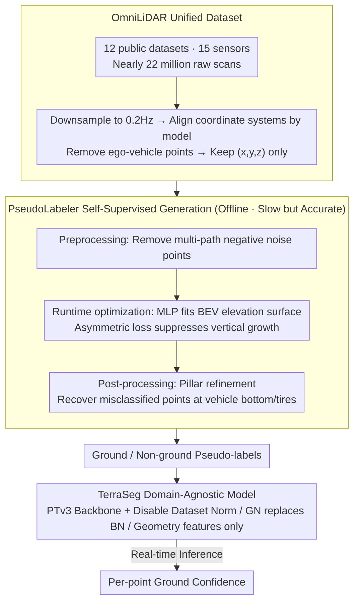

# TerraSeg: Self-Supervised Ground Segmentation for Any LiDAR

**Conference**: CVPR 2026  
**arXiv**: [2603.27344](https://arxiv.org/abs/2603.27344)  
**Code**: Available (Apache 2.0)  
**Area**: Autonomous Driving / 3D Point Cloud Segmentation  
**Keywords**: Ground segmentation, self-supervised learning, cross-sensor generalization, LiDAR perception, pseudo-label

## TL;DR

This paper proposes TerraSeg, the first self-supervised domain-agnostic LiDAR ground segmentation model. By constructing a unified large-scale OmniLiDAR dataset (12 public benchmarks, 15 sensors, nearly 22 million scans) and an innovative PseudoLabeler self-supervised pseudo-label generation module, it achieves SOTA results on nuScenes, SemanticKITTI, and Waymo without using any manual annotations.

## Background & Motivation

**Background**: LiDAR ground segmentation is a fundamental task in autonomous driving perception stacks, used for object discovery, free space estimation, and localization mapping. Existing methods are divided into two categories—manual geometric methods (e.g., RANSAC, PatchWork++) and supervised learning methods (e.g., GndNet).

**Limitations of Prior Work**: Manual methods, while fast and requiring no annotation, rely on simple terrain assumptions (e.g., global planes) and sensor-specific parameter tuning. Transitioning to new environments or sensors requires re-tuning, leading to poor generalization. Supervised learning methods generalize better but depend on expensive point-wise manual annotations, making them poorly scalable.

**Key Challenge**: Rapid and annotation-free manual methods lack generalization, while generalizable learning methods require expensive annotations—the ideal solution should combine annotation-free training, zero-shot cross-sensor generalization, and real-time execution.

**Goal**: (1) Training a high-quality ground segmentation model entirely without manual annotations; (2) enabling a single model to generalize across different sensors, scenes, and weather conditions.

**Key Insight**: Inspired by the success of large-scale pre-training in NLP and CV, this work pursues a single-task domain-agnostic route rather than a multi-task general system—training in a self-supervised manner on highly diverse geometric data to achieve zero-shot cross-domain transfer.

**Core Idea**: Aggregate nearly 22 million scans from 12 datasets and 15 sensors to build OmniLiDAR, and train a domain-agnostic ground segmentation model based on Point Transformer v3 using self-supervised pseudo-labels from a PseudoLabeler.

## Method

### Overall Architecture

TerraSeg addresses the contradiction where ground segmentation must be both annotation-free and sensor-agnostic, while prior methods could only achieve one. The solution involves shifting "generalization" to data and priors rather than manual labels. The pipeline consists of three stages: first, normalizing raw scans from 12 public driving datasets into a unified format (OmniLiDAR); second, using an annotation-free geometric optimization module (PseudoLabeler) to calculate frame-by-frame ground/non-ground pseudo-labels; and finally, using these pseudo-labels to train a domain-agnostic TerraSeg model that "forgets sensor identity." The model inputs raw 3D point cloud coordinates and outputs a ground confidence score for each point. Notably, the PseudoLabeler is slow but accurate and is only used offline, while the trained TerraSeg model performs real-time inference.

### Key Designs

**1. OmniLiDAR Unified Dataset: Pursuing geometric generalization through extreme sensor diversity**

Individual datasets often have specific sensor types, terrains, and weather conditions, leading models to memorize sensor artifacts as ground features. TerraSeg counters this by aggregating 12 public datasets (nuScenes, SemanticKITTI, Waymo, Argoverse 2, etc.) covering 15 LiDAR models and 22 million scans. Three standardization steps are performed: downsampling sequences to 0.2Hz to ensure frame diversity; aligning coordinate systems so that $z=0$ approximates the ground and the $x$-axis points forward; and removing ego-vehicle points. After normalization, only $(x,y,z)$ coordinates and metadata labels remain, stripping away sensor-specific fingerprints and forcing the model to learn universal geometric patterns.

**2. PseudoLabeler Self-Supervised Pseudo-Label Generation: Ground segmentation as annotation-free elevation fitting**

To achieve annotation-free training, the PseudoLabeler utilizes the geometric prior that the ground is the lowest continuous surface in a scene. Segmentation is converted into a bird's-eye view (BEV) elevation map estimation task, using an MLP $g_\theta: \mathbb{R}^2 \to \mathbb{R}$ to fit the ground height at horizontal position $(x,y)$. The vertical residual $\Delta d_i = z_i - g_\theta(x_i, y_i)$ determines the label. To prevent objects from pulling the elevation surface upward, an asymmetric loss is used:

$$
\ell(\Delta d_i) = \begin{cases} \Delta d_i^2, & \Delta d_i < 0 \ (\text{below surface}) \\ \mathrm{Huber}(\Delta d_i), & \Delta d_i \ge 0 \ (\text{above surface}) \end{cases}
$$

Points below the surface are penalized quadratically to ensure the surface fits the true floor, while points above use a saturated Huber loss to avoid being distorted by vehicles or pedestrians. This frame-wise optimization is supported by a three-stage pipeline: preprocessing to remove negative noise from multi-path reflections, runtime optimization using AdamW and EMA early stopping, and pillar refinement to recover points incorrectly classified as ground (e.g., tires).

**3. TerraSeg Domain-Agnostic Model Design: Actively depriving the model of sensor identity**

To prevent the model from memorizing sensor artifacts, TerraSeg restricts input information. Using Point Transformer v3 as the backbone, it implements three domain-agnostic modifications: disabling dataset-specific normalization, replacing Batch Normalization with Group Normalization (since batch statistics are unstable across mixed sensors), and using only 3D geometric features as input (constant 1, normalized height, and normalized horizontal distance). The model cannot identify the specific LiDAR model, and as a result, must rely on cross-domain invariant spatial relationships. The paper provides Base (accuracy-focused) and Small (speed-focused) variants.

### Loss & Training

The training loss combines Binary Cross-Entropy and Symmetric Lovász-Softmax loss: $\mathcal{L} = \mathcal{L}_{BCE} + \lambda \mathcal{L}_{Lovász}$ ($\lambda=1.0$). BCE uses dynamic positive weights tracked via EMA to handle class imbalance. The AdamW optimizer is used (lr=2e-3, weight decay=5e-3) with linear warm-up and cosine decay. Voxel resolution is 0.05, and effective batch size is 256.

## Key Experimental Results

### Main Results

Results on the nuScenes validation set (trained without manual annotations):

| Method | Annotation | Ground IoU | Non-Ground IoU | mIoU | Throughput (Hz) |
|------|------|-----------|---------------|------|-----------|
| RANSAC | None | 89.14 | 83.97 | 86.55 | 255.0 |
| PatchWork++ | None | 86.19 | 81.42 | 83.80 | 30.0 |
| TRAVEL | None | 89.76 | 87.16 | 88.46 | 365.7 |
| GndNet | **Yes** | 82.54 | 78.72 | 80.62 | 484.3 |
| **TerraSeg-B** | **None** | **93.50** | **91.45** | **92.47** | 28.0 |
| **TerraSeg-S** | **None** | 92.40 | 90.49 | 91.45 | 49.8 |
| Supervised Upper Bound | Yes | 95.96 | 94.65 | 95.31 | 28.0 |

### Ablation Study

Ablation of PseudoLabeler components (nuScenes):

| Configuration | Effect |
|------|------|
| No Preprocessing | Negative noise causes elevation map to sink, causing ground over-segmentation |
| No Post-processing | Bottom of vehicles/tires misclassified as ground |
| Full PseudoLabeler | mIoU 90.63 (reaching 92.47 when training TerraSeg) |

### Key Findings

- **Self-supervised performance exceeds supervised baselines**: TerraSeg-B (92.47 mIoU) significantly outperforms the supervised GndNet (80.62).
- **Close to supervised upper bound**: The gap between self-supervised and fully supervised versions (95.31) is only ~3%.
- **Cross-dataset consistency**: Achieves SOTA on nuScenes, SemanticKITTI, and Waymo simultaneously.
- **Real-time inference**: TerraSeg-S reaches ~50Hz while TerraSeg-B reaches ~28Hz.
- **Student superior to teacher**: The TerraSeg model (92.47 mIoU) outperforms its pseudo-label source (90.63), demonstrating powerful denoising and generalization capabilities.

## Highlights & Insights

- **Large-scale aggregation strategy**: Aggregating 12 datasets and 15 sensors into OmniLiDAR is a significant engineering contribution.
- **Clever self-supervised design**: Converting ground segmentation into a proxy task of elevation map estimation utilizes simple geometric priors for annotation-free training.
- **"Student superior to teacher" phenomenon**: Diverse data mixed with neural network generalization effectively filters noise in pseudo-labels.
- **Highly practical**: Requires no manual labels, supports any LiDAR sensor, runs in real-time, and is open-source.

## Limitations & Future Work

- Currently processes single-frame point clouds; temporal information remains unused.
- Pseudo-label quality may degrade in extreme scenarios (e.g., steep slopes, dense vegetation).
- Provides only binary classification; does not provide semantic levels (e.g., traversability).
- Future work could extend to semantic ground segmentation (differentiating road, grass, dirt, etc.).

## Related Work & Insights

- The concentric zone polar grid idea from PatchWork++ can be integrated with learning-based methods.
- Chodosh et al.’s self-supervised runtime optimization is a direct predecessor to the PseudoLabeler, which this work improves significantly.
- The use of Point Transformer v3 validates its status as a versatile backbone for point cloud tasks.

## Rating

- **Novelty**: ⭐⭐⭐⭐ — The OmniLiDAR dataset and self-supervised domain-agnostic training paradigm are pioneering.
- **Experimental Thoroughness**: ⭐⭐⭐⭐⭐ — Extensive validation across three major benchmarks with detailed ablations.
- **Writing Quality**: ⭐⭐⭐⭐ — Clear structure and well-defined relationships between core components.
- **Value**: ⭐⭐⭐⭐⭐ — Extremely high practical value, solving annotation and generalization bottlenecks in autonomous driving.

<!-- RELATED:START -->

## Related Papers

- [\[CVPR 2026\] BEV-SLD: Self-Supervised Scene Landmark Detection for Global Localization with LiDAR Bird's-Eye View Images](bev-sld_self-supervised_scene_landmark_detection_for_global_localization_with_li.md)
- [\[CVPR 2026\] Test-Time Training for LiDAR Semantic Segmentation under Corruption via Geometric Inlier Discrimination](test-time_training_for_lidar_semantic_segmentation_under_corruption_via_geometri.md)
- [\[CVPR 2026\] HorizonForge: Driving Scene Editing with Any Trajectories and Any Vehicles](horizonforge_driving_scene_editing_with_any_trajectories_and_any_vehicles.md)
- [\[CVPR 2025\] PSA-SSL: Pose and Size-aware Self-Supervised Learning on LiDAR Point Clouds](../../CVPR2025/autonomous_driving/psa-ssl_pose_and_size-aware_self-supervised_learning_on_lidar_point_clouds.md)
- [\[CVPR 2025\] Exploring Scene Affinity for Semi-Supervised LiDAR Semantic Segmentation](../../CVPR2025/autonomous_driving/exploring_scene_affinity_for_semi-supervised_lidar_semantic_segmentation.md)

<!-- RELATED:END -->
