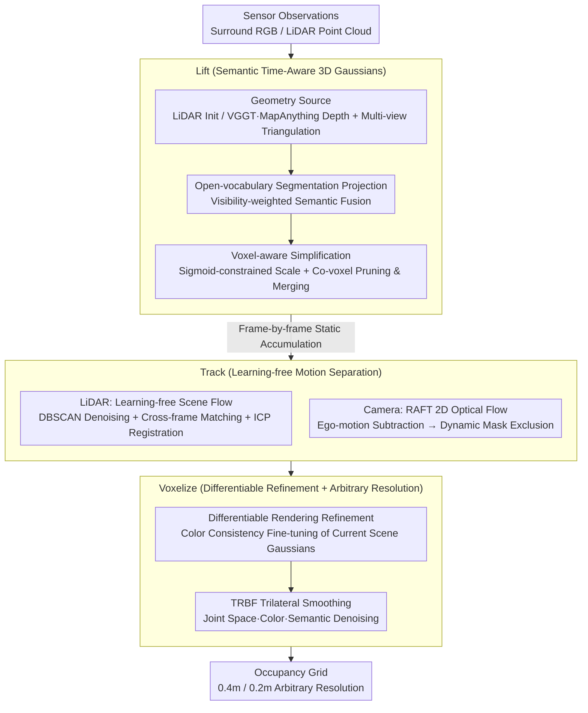

# TT-Occ: Test-Time 3D Occupancy Prediction

**Conference**: CVPR2026  
**arXiv**: [2503.08485](https://arxiv.org/abs/2503.08485)  
**Code**: [Xian-Bei/TT-Occ](https://github.com/Xian-Bei/TT-Occ)  
**Area**: Autonomous Driving / 3D Occupancy Prediction  
**Keywords**: 3D occupancy prediction, test-time, 3D Gaussian Splatting, vision foundation models, self-supervised, open-vocabulary

## TL;DR

Proposes TT-Occ, a pre-training-free test-time 3D occupancy prediction framework that incrementally constructs, optimizes, and voxelizes time-aware 3D Gaussians by integrating Vision Foundation Models (VFMs) at inference time, outperforming all self-supervised methods requiring extensive training on Occ3D-nuScenes and nuCraft.

## Background & Motivation

**Importance of 3D Occupancy Prediction**: 3D occupancy prediction requires accurate identification of regions occupied by specific object classes and free space, which is critical for collision-free trajectory planning and reliable navigation in autonomous driving.

**High Annotation Cost of Supervised Methods**: Existing fully supervised solutions rely heavily on frame-by-frame dense 3D annotations, which are prohibitively expensive in dynamic driving scenarios (covering an 80m range per frame).

**Large Training Overhead of Self-supervised Methods**: Although self-supervised methods reduce annotation costs, the training overhead remains massive—for instance, SelfOcc requires 2 days of training on 8 GPUs (approx. 384 GPU hours) for Occ3D-nuScenes at 0.4m resolution.

**Poor Generalization**: Once trained, adapting to finer resolutions (e.g., 0.2m on nuCraft) or new object categories requires substantial retraining, leading to a lack of flexibility.

**The Rise of VFMs Changing the Landscape**: 3D vision foundation models like VGGT and MapAnything provide reliable multi-view geometry, while REX-Omni supports open-vocabulary semantic reasoning. These capabilities can be obtained directly at test-time without task-specific training.

**Core Problem**: Since geometry and semantic information no longer need to be acquired through network learning, is training an occupancy prediction model still necessary? This paper answers in the negative through TT-Occ.

## Method

### Overall Architecture

TT-Occ answers a counter-intuitive question: Since geometry is provided by 3D foundation models (VGGT/MapAnything) and semantics by open-vocabulary segmentation models, is it still necessary to train a dedicated occupancy decoder? The answer is no—the system executes a "Lift-Track-Voxelize" pipeline on-the-fly during inference. It lifts per-frame sensor observations into semantic time-aware 3D Gaussians, accumulates them frame-by-frame into a scene, and rasterizes them into occupancy grids without any task-related training weights. The framework offers two variants: TT-OccLiDAR using LiDAR as the geometry source, and TT-OccCamera utilizing multi-view cameras. Both share the same pipeline, branching only at "geometry acquisition" and "dynamic object handling" based on modality.

### Key Designs

**1. Lift: Lifting per-frame geometry and semantics into semantic 3D Gaussians**

Occupancy prediction lacks reliable point-wise geometry and categories, both of which are readily available in the VFM era. The key is how to align them into a single 3D representation. Geometrically, the LiDAR version initializes Gaussian centers directly with sparse laser points, inheriting metric coordinates. The Camera version estimates dense depth from surround RGB using VGGT/MapAnything and resolves monocular scale ambiguity via multi-view triangulation. Semantically, open-vocabulary segmentation (OpenSeeD/GroundingSAM2/REX-Omni) is run on $M$ views. Each Gaussian center $\boldsymbol{\mu}_i$ is projected back to views to sample semantics, which are then fused via visibility-weighted averaging to obtain the class distribution:

$$\mathbf{m}_i = \frac{1}{M}\sum_{m=1}^{M}\mathbb{I}_m(\boldsymbol{\mu}_i)\text{Proj}(\boldsymbol{\mu}_i;\mathbf{K}_m,\mathbf{E}_m)$$

$\mathbb{I}_m$ denotes visibility in the $m$-th camera to avoid incorrect semantics from occluded views. To manage the massive redundancy of direct splatting, "voxel-aware simplification" is applied: scale parameters use sigmoid (rather than exponential) constraints to prevent infinite expansion, and duplicate Gaussians within the same voxel are pruned while merging semantic probabilities. This step replaces "learning a semantic-geometry encoder" with "projection + fusion", outsourcing learning to VFMs.

**2. Track: Separating dynamic/static Gaussians without learning to eliminate ghosting**

While frame-by-frame accumulation works for static scenes, fast-moving objects (vehicles, pedestrians) are only partially observed at any time. Merging them into static accumulation causes "ghosting" trails during online optimization. Both variants avoid learnable motion networks, using existing geometric tools instead. The LiDAR version employs learning-free scene flow: laser points are associated with instances via segmentation masks, denoised with DBSCAN, matched across frames based on spatial position and shape similarity, and finally registered via ICP to calculate 3D motion flow per cluster. Moving Gaussians are maintained separately to avoid polluting the static background. The Camera version, lacking reliable 3D motion, uses RAFT for 2D optical flow, subtracts ego-motion flow, and thresholds the residual into a dynamic mask. Gaussians within the mask are excluded from static accumulation. This compromise "marks and discards" rather than reconstructing dynamic regions in the Camera version to avoid magnifying depth noise.

**3. Voxelize: Differentiable refinement + trilateral smoothing + arbitrary resolution output**

Accumulated Gaussians remain noisy and must be converted to discrete occupancy grids. First, test-time differentiable refinement is performed: Gaussians are projected back to images via differentiable rendering, and parameters are fine-tuned using color consistency (optimizing current scene geometry rather than learning cross-scene weights). Optionally, a Trilateral Radial Basis Function (TRBF) smoothing module is applied. It extends bilateral filtering from "space + color" to a "space + color + semantic" triad. The affinity between Gaussians $(i,j)$ is the product of three kernels:

$$\mathcal{K}(i,j) = \mathcal{K}_{\boldsymbol{\mu}}(i,j)\cdot\mathcal{K}_{\mathbf{c}}(i,j)\cdot\mathcal{K}_{\mathbf{m}}(i,j)$$

Only Gaussians that are spatially close, color-similar, and semantically consistent smooth each other, suppressing noise without blurring boundaries. Finally, semantic probabilities are aggregated into the target grid based on spatial proximity. Since aggregation occurs over continuous Gaussians rather than a fixed-resolution decoder head, the same system can voxelize to any user-specified resolution (0.4m or 0.2m), enabling zero-cost migration to the nuCraft high-resolution setting.

### Loss & Training

The only optimization signal in the pipeline is the color consistency loss during the voxelization stage: 3D Gaussians are projected back to image planes via differentiable rendering, constraining the rendered color to match observations to refine current scene Gaussian parameters. Sky regions are masked out to prevent infinite background interference. This loss acts only on the current scene's Gaussians and does not generate transferable weights, remaining a "test-time optimization" rather than "training."

## Key Experimental Results

### Main Results

**Occ3D-nuScenes (0.4m resolution)**:

| Method | Input | Pre-training | mIoU |
|---|---|---|---|
| SelfOcc (CVPR'24) | C | ~384 GPU hrs | 10.54 |
| GaussianTR (CVPR'25) | C | Yes | 11.70 |
| VEON-LiDAR (ECCV'24) | C&L | Yes | 15.14 |
| **TT-OccCamera** | **C** | **None** | **16.70** |
| RenderOcc (ICRA'24) | C | Yes (Sparse 3D GT) | 23.93 |
| **TT-OccLiDAR** | **C&L** | **None** | **27.41** |
| BEVFormer (ECCV'22) | C | Yes (Dense 3D GT) | 26.88 |

**nuCraft High-resolution (0.2m resolution)**:

| Method | Pre-training Time | mIoU |
|---|---|---|
| SelfOcc† | 384 hrs | 2.22 |
| TT-OccCamera | 0 | 5.95 |
| TT-OccLiDAR | 0 | 10.92 |

### Ablation Study

| Config | TT-OccLiDAR mIoU | TT-OccCamera mIoU |
|---|---|---|
| A: Baseline (Single frame splatting) | 7.3 | 4.2 |
| B: + Covariance-aware Voxelization | 18.3 (+11.0) | 8.5 (+4.3) |
| C: + History Inheritance (No Track) | 23.5 (+5.2) | 14.1 (+5.6) |
| D: + Dynamic Gaussian Tracking | 25.6 (+2.1) | 14.1 (+0.0) |

### Key Findings

1. **Zero-training Outperforms Trained Methods**: TT-OccLiDAR (27.41 mIoU) surpasses RenderOcc (23.93) which uses sparse 3D GT training. TT-OccCamera (16.70) beats VEON-LiDAR (15.14) trained with LiDAR supervision.
2. **Strong Resolution Adaptability**: Under the nuCraft high-resolution setting, SelfOcc drops from 10.54 to 2.22, whereas TT-Occ adapts without retraining.
3. **RayIoU Validates Geometry Quality**: TT-OccCamera improves RayIoU@4 by 30.8% over SelfOcc; TT-OccLiDAR improves it by 115%.
4. **Modular VFM Design**: REX-Omni provides the strongest semantics; MapAnything depth is superior to VGGT (due to metric scale); the framework allows plug-and-play updates for VFMs.
5. **Dynamic Tracking Eliminates Ghosting**: Without tracking, dynamic class (bus, ped) IoU drops severely; tracking restores performance significantly.
6. **Memory Efficiency**: Peak GPU memory is 5.6GB for the LiDAR version and 9.9GB for the Camera version, both under 10GB.

## Highlights & Insights

- **Paradigm Innovation**: First to prove that test-time VFM integration can entirely replace dense occupancy decoders, shifting 3D occupancy from a "training paradigm" to an "inference paradigm."
- **Extreme Flexibility**: Supports arbitrary voxel resolution, open-vocabulary queries, and plug-and-play VFM components.
- **Zero Training Cost**: Completely eliminates hundreds of GPU hours of pre-training, enabling direct inference on validation sets.
- **Time-aware Gaussians**: Achieves online incremental scene reconstruction via the Lift-Track-Voxelize pipeline, using motion separation to eliminate ghosting artifacts.
- **TRBF Smoothing**: Extends bilateral filtering into a trilateral kernel that jointly considers space, color, and semantics for adaptive denoising.

## Limitations & Future Work

- **Dependence on VFM Quality**: Performance upper bounds are limited by VFM capabilities; mIoU drops to 21.3 when GroundingSAM2 semantics are weak.
- **Limited Dynamic Handling in Camera Version**: The vision-only version cannot accumulate dynamic objects like the LiDAR version, only exclude dynamic regions.
- **Inference Speed**: Semantic segmentation (OpenSeeD) accounts for 28.5%~77.9% of runtime; the Camera version requires additional depth estimation and triangulation steps.
- **Poor Performance in Distant Camera Regions**: Geometry accuracy for distant scenes in the vision-only version is limited by occlusion and depth resolution compared to LiDAR.
- **Open-vocabulary Prompt Sensitivity**: Semantic segmentation depends on prompt quality; while standard benchmarks use predefined label sets, prompt design impacts results in real open-world scenarios.

## Related Work & Insights

- **Supervised Occupancy Prediction**: BEVFormer, CTF-Occ, RenderOcc — rely on dense/sparse 3D labels.
- **Self-supervised Occupancy Prediction**: SelfOcc (SDF + MVS), OccNeRF (Photo-consistency), GaussianOcc/GaussianTR (3DGS representation), LangOcc/VEON (Open-vocabulary).
- **3D Reconstruction in Driving**: OmniRe, Street Gaussians, DrivingGaussian, HUGS — rely on external priors (HD maps, GT boxes) for offline scene-by-scene reconstruction, whereas TT-Occ performs online inference from raw sensor streams.

## Rating

- Novelty: ⭐⭐⭐⭐⭐ — First training-free test-time 3D occupancy framework; a paradigm shift.
- Experimental Thoroughness: ⭐⭐⭐⭐ — Comprehensive evaluation across two datasets, two modalities, and multiple VFM combinations.
- Writing Quality: ⭐⭐⭐⭐ — Clear structure; the Lift-Track-Voxelize framework is intuitive.
- Value: ⭐⭐⭐⭐⭐ — Suggests that training occupancy models may no longer be necessary in the VFM era, significantly impacting perception paradigms.

<!-- RELATED:START -->

## Related Papers

- [\[CVPR 2026\] Gau-Occ: Geometry-Completed Gaussians for Multi-Modal 3D Occupancy Prediction](gau-occ_geometry-completed_gaussians_for_multi-modal_3d_occupancy_prediction.md)
- [\[ICCV 2025\] SA-Occ: Satellite-Assisted 3D Occupancy Prediction in Real World](../../ICCV2025/autonomous_driving/sa-occ_satellite-assisted_3d_occupancy_prediction_in_real_world.md)
- [\[CVPR 2026\] ProOOD: Prototype-Guided Out-of-Distribution 3D Occupancy Prediction](proood_prototype-guided_out-of-distribution_3d_occupancy_prediction.md)
- [\[CVPR 2026\] Dr.Occ: Depth- and Region-Guided 3D Occupancy from Surround-View Cameras for Autonomous Driving](drocc_depth_region_guided_3d_occupancy.md)
- [\[CVPR 2026\] Test-Time Training for LiDAR Semantic Segmentation under Corruption via Geometric Inlier Discrimination](test-time_training_for_lidar_semantic_segmentation_under_corruption_via_geometri.md)

<!-- RELATED:END -->
