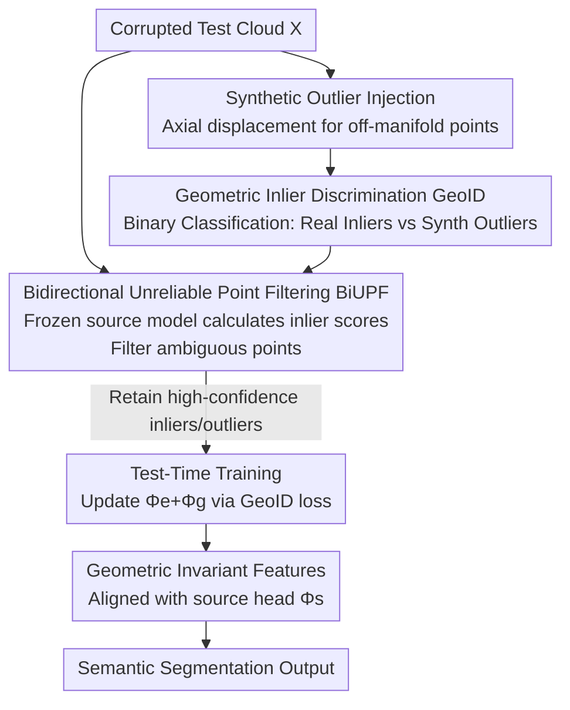

# Test-Time Training for LiDAR Semantic Segmentation under Corruption via Geometric Inlier Discrimination

**Conference**: CVPR 2026  
**Paper**: [CVF Open Access](https://openaccess.thecvf.com/content/CVPR2026/html/Kim_Test-Time_Training_for_LiDAR_Semantic_Segmentation_under_Corruption_via_Geometric_CVPR_2026_paper.html)  
**Code**: https://github.com/hskim617/GeoID  
**Area**: Autonomous Driving / 3D Vision  
**Keywords**: LiDAR Semantic Segmentation, Test-Time Training, Corruption Robustness, Self-Supervised Learning, Geometric Inlier Discrimination

## TL;DR
This paper proposes GeoID, a test-time training framework for robust LiDAR semantic segmentation under corruption. By injecting "off-manifold" synthetic noise points into point clouds, the model is tasked with a self-supervised objective of distinguishing between "geometrically consistent real inliers" and "manually displaced synthetic outliers" to adapt to the target domain. Combined with Bidirectional Unreliable Point Filtering (BiUPF) to remove ambiguous regions, GeoID improves mIoU from 42.33/51.25 to 46.96/56.73 on SemanticKITTI-C / nuScenes-C, consistently outperforming existing TTA baselines.

## Background & Motivation
**Background**: LiDAR Semantic Segmentation (LSS), which assigns semantic labels to each point in a point cloud, is central to autonomous driving and robotic perception. Supervised LSS achieves high accuracy when the "test distribution = training distribution," but real-world deployments involve sensor failures and weather changes (fog, snow, wet ground, crosstalk, missing beams, etc.) that severely distort point clouds and degrade model performance.

**Limitations of Prior Work**: To adapt to such distribution shifts online without supervision, Test-Time Adaptation (TTA/TTT) is the mainstream approach. However, existing routes have shortcomings: directly applying 2D image-domain entropy minimization (TENT) or BN statistic updates (DUA) to 3D point clouds is "nearly useless." LiDAR-specific methods like GIPSO and HGL rely on self-training with pseudo-labels, which are inaccurate under **severe corruption**, causing the adaptation to diverge due to noisy labels.

**Key Challenge**: While corruption alters point cloud **density and appearance**, the **underlying 3D geometric structure** of the environment (roads as planes, buildings as vertical surfaces, vehicles with fixed shapes) remains largely invariant across domains. Existing methods either rely on error-prone semantic pseudo-labels or geometry-agnostic statistics, failing to capture this "preserved signal under corruption."

**Goal**: Design an **online, source-free** self-supervised objective that does not rely on semantic pseudo-labels, enabling the model to stably adapt using only unlabeled target-domain data while remaining robust to various corruptions.

**Key Insight**: The authors observe that since geometric consistency is preserved across domains, the model should learn to "identify which points follow the real scene manifold and which deviate from it." This capability can be trained via a completely self-supervised proxy task: manually generating a set of "off-manifold" points that violate geometric patterns and training the model to distinguish them from real points.

**Core Idea**: Use **Geometric Inlier Discrimination (GeoID)** as a self-supervised task to replace error-prone semantic pseudo-labels for test-time training. By injecting synthetic outliers generated via axial displacement, the encoder is trained to separate "geometrically consistent inliers" from "manually displaced outliers," thereby reconstructing a geometric-consistent feature space compatible with the source segmentation head under corruption.

## Method

### Overall Architecture
Given a model $F$ pre-trained on the source domain $D_{src}$ (shared encoder $\Phi_e$ + segmentation head $\Phi_s$), the goal is to adapt the model to the corrupted target distribution $P_{tgt}$ using only unlabeled test samples, without any semantic supervision.

The framework consists of **pre-deployment** and **test-time** phases. Pre-deployment (Source): Besides the segmentation head, an additional GeoID head $\Phi_g$ is attached. The encoder is **jointly trained** on segmentation and "inlier/outlier discrimination" to ensure it is both semantically discriminative and sensitive to geometric plausibility, providing a good initialization for TTT. Test-time: For each incoming frame, the **frozen source model** computes inlier scores to filter ambiguous points via BiUPF, retaining only high-confidence inliers and outliers. Only the GeoID loss is used to online update the encoder $\Phi_e$ and GeoID head $\Phi_g$ (the segmentation head $\Phi_s$ remains frozen). This aligns target-domain geometric structures with the source-domain feature space.

### Key Designs

**1. Geometric Inlier Discrimination (GeoID): A Self-Supervised Signal Invariant to Corruption**

This is the core of the paper, addressing the unreliability of semantic pseudo-labels. It constructs a binary classification task without labels: let the original point cloud be $X=\{p_i\}_{i=1}^N$, where $p_i=(x_i, r_i)$ contains coordinates $x_i$ and intensity $r_i$. Synthetic outliers are created by applying displacement along a randomly selected axis: $\tilde{x}_i = x_i + e_a u$, where $u \sim U([-\delta, \delta])$ and $e_a$ is a unit vector for x, y, or z. Intensities for synthetic points are copied from the nearest real point. The augmented set $\hat{X}=X \cup \tilde{X}$ ($2N$ points) is used, with real points labeled $z_i=1$ and synthetic points $z_i=0$. The GeoID head outputs an inlier score $c(\hat{p}_i)=\sigma(\Phi_g(\Phi_e(\hat{p}_i)))$, trained via binary cross-entropy $L_{geo}$.

Why does this work? The authors provide a theoretical explanation: for a fixed real distribution $P$ and synthetic outlier distribution $Q$, the Bayes optimal discriminator is $c^*(x) = \frac{P(x)}{P(x)+Q(x)}$. Assuming real points form coherent geometric structures while synthetic points fall off-manifold, consistent points satisfy $P(x) \gg Q(x)$ (hence $c^* \approx 1$), and off-manifold points satisfy the opposite. Thus, the optimal solution naturally becomes a "geometric consistency indicator" without explicit surface modeling. Crucially, synthetic points are designed to **violate geometry**, not to mimic specific corruptions. As corruption artifacts (fog, noise) may appear in both real and synthetic points but don't align with the "real/synth" labels, optimization naturally favors the true signal—geometric consistency.

**2. Bidirectional Unreliable Point Filtering (BiUPF): Removing Geometric Ambiguity**

GeoID assumes "real = inlier" and "synthetic = outlier," but this can be violated: corruption can make real measurements look like artifacts (should be outliers), and a displaced synthetic point might coincidentally land on a geometric surface (looks like an inlier). These "unreliable label" regions generate harmful gradients.

BiUPF uses the **frozen source model** $\Phi_e^{src}, \Phi_g^{src}$ to compute an inlier score $c_{src}(p)$ as a reliability metric. It performs bidirectional filtering: real points are kept only if $I_{in}=\{i: c_{src}(p_i) \ge \tau_r\}$, and synthetic points only if $I_{out}=\{j: c_{src}(\tilde{p}_j) \le 1-\tau_r\}$. The reliable set is $I = I_{in} \cup I_{out}$. Test-time GeoID loss $L_{test}$ is computed only on $I$. This restricts adaptation to "points clearly following geometry" and "points clearly violating it," reinforcing GeoID as a robust inlier indicator. Ablations show BiUPF is critical; without it, performance on "beam missing" or "cross sensor" corruptions can drop below the pre-adaptation baseline.

### Loss & Training
**Joint training** in the source domain uses both segmentation and GeoID losses: $L_{train} = L_{seg} + L_{geo}$, where synthetic points are ignored for $L_{seg}$ via an ignore mask. **At test time**, only $L_{test}$ (binary cross-entropy on BiUPF set $I$) is used to update $\Phi_e$ and $\Phi_g$, while $\Phi_s$ is frozen. Implementation uses $B=2$ independent synthetic sets per test sample as a mini-batch, optimized via Adam with a learning rate of 0.001. MinkowskiNet is the primary backbone (with Cylinder3D also validated).

## Key Experimental Results

### Main Results
Performance comparison (mIoU %) across eight corruption types (averaged over three severity levels):

| Dataset | Metric | Source-only | Best Baseline | GeoID (Ours) |
|--------|------|-------------|----------|-------------|
| SemanticKITTI-C | Mean mIoU | 42.33 | 43.58 (TTT) | **46.96** |
| nuScenes-C | Mean mIoU | 51.25 | 51.71 (DUA) | **56.73** |

On SemanticKITTI-C, GeoID leads significantly in most categories: Crosstalk improved from 24.46 to 40.82, Fog from 33.20 to 40.14, and Snow from 32.04 to 40.63. 2D methods (TENT, DUA) and LiDAR pseudo-label methods (GIPSO, HGL) often performed worse than source-only under certain corruptions, confirming the failure of self-training under severe shift. Using Cylinder3D, GeoID still achieved the best result (55.46), showing architecture-agnosticism.

### Ablation Study
Analysis of GeoID and BiUPF on SemanticKITTI-C (moderate severity):

| Configuration | Fog | Snow | Crosstalk | Beam Missing | Cross Sensor |
|------|-----|------|-----------|--------------|--------------|
| Pre-adapt. | 38.3 | 33.7 | 25.5 | 51.7 | 50.9 |
| Adapt. (w/o BiUPF) | 42.5 (+4.2) | 39.8 (+6.1) | 43.1 (+17.6) | 50.5 (−1.2) | 48.2 (−2.7) |
| Adapt. (w/ BiUPF) | 42.6 (+4.3) | 40.7 (+7.0) | 40.9 (+15.4) | 52.7 (+1.0) | 51.3 (+0.4) |

The full model (GeoID+BiUPF) improved performance by 4.0% on average. Removing BiUPF caused negative gains on "beam missing" and "cross sensor" corruptions, proving that filtering unreliable points is essential for stable adaptation.

### Key Findings
- **BiUPF is a Stabilizer**: While GeoID alone can cause harmful updates under specific corruptions, BiUPF corrects these negative gains, enabling safe online adaptation.
- **Geometric Signals Outperform Corruption Cues**: Synthetic noise is designed to break geometry rather than mimic corruption, ensuring the self-supervised signal aligns with cross-corruption geometric consistency.
- **Sparse Adaptation for Real-Time Use**: Updating every 30 frames (stride-30) on an A6000 reaches >12 FPS with only a 2.31% drop, still 2.41% better than source-only.
- **Continual Adaptation**: The model effectively handles a continuous stream of varying corruptions, yielding a 4.37% average improvement.

## Highlights & Insights
- **Geometric Invariance via Binary Classification**: The most ingenious part is not modeling "what a surface looks like" but letting the Bayes optimal discriminator converge into an inlier indicator. A simple real/fake classification implicitly learns "on-manifold vs. off-manifold" without explicit priors.
- **The Philosophy of Synthetic Noise**: Deliberately designing noise to violate geometry rather than mimic corruption ensures the signal is invariant across corruptions. This "one-size-fits-all" approach for eight corruption types is a significant insight for TTA.
- **Symmetry in Bidirectional Filtering**: Filtering both "noisy-looking real points" and "clean-looking synthetic points" using a frozen source model provides a robust reliability screen applicable to any TTA task involving synthetic samples.

## Limitations & Future Work
- The method relies on the assumption that "geometric-consistent semantics are preserved across domains." Its efficacy may weaken in extreme scenarios where geometric structure itself is decimated.
- Hyperparameters like axial displacement $\delta$ and filtering threshold $\tau_r$ are required; while sensitivity analysis is provided, stable ranges might vary between sensors.
- Test-time backpropagation adds computational overhead. Although stride-based updates help, it remains more expensive than purely forward-pass BN methods. Results on nuScenes-C Crosstalk were slightly behind DUA (30.84 vs. 32.90), suggesting it is not globally optimal for all noise types.

## Related Work & Insights
- **vs. TTT (Rotation Prediction)**: While both use proxy tasks, rotation prediction is shown to be less effective for LSS (43.58 on KITTI-C). GeoID’s geometric signal is inherently better suited for LiDAR point cloud structures.
- **vs. GIPSO / HGL (Pseudo-labeling)**: These methods depend on semantic predictions. GeoID bypasses this vulnerability by using a completely self-supervised real/synthetic point discrimination task.
- **vs. TENT / DUA (2D BN/Entropy methods)**: Entropy minimization is largely ineffective for sparse, irregular 3D point clouds. This work demonstrates the value of tailoring proxy tasks to specific data modalities.

## Rating
- Novelty: ⭐⭐⭐⭐ Translates "geometric invariance" into a self-supervised classification task with solid Bayes interpretation.
- Experimental Thoroughness: ⭐⭐⭐⭐ Comprehensive testing on two benchmarks, dual backbones, and various adaptation settings.
- Writing Quality: ⭐⭐⭐⭐ Clear theoretical intuition and interpretation of diverse corruption types.
- Value: ⭐⭐⭐⭐ Directly addresses safety-critical autonomous driving robustness with a simple, reproducible method.

<!-- RELATED:START -->

## Related Papers

- [\[CVPR 2026\] TT-Occ: Test-Time 3D Occupancy Prediction](test-time_3d_occupancy_prediction.md)
- [\[ICLR 2026\] Adaptive Augmentation-Aware Latent Learning for Robust LiDAR Semantic Segmentation](../../ICLR2026/autonomous_driving/adaptive_augmentation-aware_latent_learning_for_robust_lidar_semantic_segmentati.md)
- [\[CVPR 2026\] Learning Geometric and Photometric Features from Panoramic LiDAR Scans for Outdoor Place Categorization](learning_geometric_and_photometric_features_from_p.md)
- [\[ICCV 2025\] Adaptive Dual Uncertainty Optimization: Boosting Monocular 3D Object Detection under Test-Time Shifts](../../ICCV2025/autonomous_driving/adaptive_dual_uncertainty_optimization_boosting_monocular_3d_object_detection_un.md)
- [\[CVPR 2026\] SG-NLF: Spectral-Geometric Neural Fields for Pose-Free LiDAR View Synthesis](sgnlf_spectralgeometric_neural_fields_for_posefre.md)

<!-- RELATED:END -->
