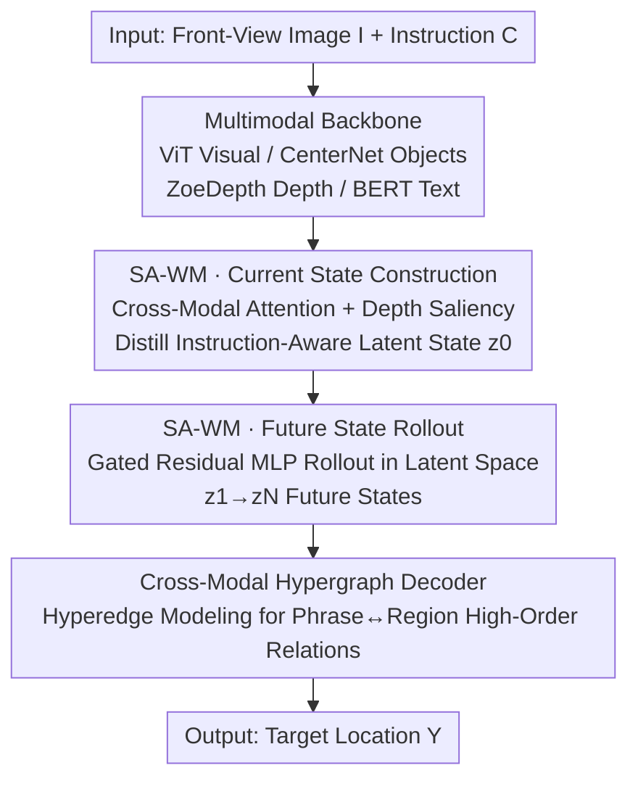

# Think Before You Drive: World Model-Inspired Multimodal Grounding

**Conference**: CVPR 2026  
**Paper**: [CVF Open Access](https://openaccess.thecvf.com/content/CVPR2026/html/Liao_Think_Before_You_Drive_World_Model-Inspired_Multimodal_Grounding_CVPR_2026_paper.html)  
**Code**: None  
**Area**: Autonomous Driving / Visual Grounding / World Models  
**Keywords**: Autonomous Driving, Visual Grounding, World Models, Depth Prior, Hypergraph

## TL;DR
ThinkDeeper introduces "world models" into autonomous driving visual grounding. It first distills the current scene and instruction into an instruction-aware latent state $z_0$, rolls out future latent states $z_1,\dots,z_N$ in the latent space, and finally fuses these forward-looking states using a cross-modal hypergraph decoder for localization. Alongside, the authors release the DrivePilot dataset automatically annotated with RAG and CoT, achieving SOTA on six benchmarks with a 38ms/39ms inference time that meets real-time in-vehicle requirements.

## Background & Motivation
**Background**: Visual Grounding (VG) in autonomous driving enables vehicles to understand natural language instructions like "merge behind the white SUV after the crosswalk" and ground the target object with a bounding box. Existing approaches follow two directions: traditional VG (one-stage or two-stage detection and matching) focusing on efficiency, and recent trends leveraging large vision-language models (VLMs) like Qwen2-VL and MiniGPT-v2 for semantic reasoning.

**Limitations of Prior Work**: Traditional VG methods are designed for high-resolution, controlled datasets, and frequently lose key visual cues when encountering real-world road scenes characterized by low light, motion blur, and rapid environmental variations. More critically, they generally lack 3D spatial awareness, failing to distinguish whether "the cyclist ahead" refers to an immediate hazard needing avoidance or a random cyclist in the distant background. While large VLMs offer strong semantic performance, they suffer from massive data requirements, high computational costs, and high latency, rendering them impractical for real-time in-vehicle deployment.

**Key Challenge**: Autonomous driving VG simultaneously demands **spatial awareness, robustness to ambiguity, and real-time efficiency**. Existing methods often sacrifice either robustness (traditional VG) or efficiency (large VLMs), failing to satisfy all three requirements. Furthermore, these methods purely focus on the "current frame" and lack forward-looking reasoning regarding "how the scene will evolve"—even though many instructions (e.g., "avoid the cyclist ahead," "merge behind the SUV after the crosswalk") are inherently about future spat-temporal states.

**Goal**: To design a VG model that possesses 3D spatial awareness and robustness to ambiguous instructions while remaining lightweight enough for real-time in-vehicle execution.

**Key Insight**: The authors draw inspiration from the concept of World Models, where an agent "imagines" future states and evaluates candidate actions in its mind before proposing a decision. Applying this to VG, the proposed model predicts how the scene will evolve over several future steps *before* making grounding decisions, thereby resolving ambiguity from a look-ahead perspective. Concurrently, monocular depth is introduced as a 3D prior, enabling a vision-only pipeline to sort entities by proximity and relevance, mimicking human spatial perception.

**Core Idea**: Replacing direct localization based purely on the current frame with a paradigm where "a world model first rolls out future states in the latent space before performing localization," while employing a hypergraph decoder to capture high-order relationships between textual phrases and spatial regions.

## Method

### Overall Architecture
The task ThinkDeeper addresses is: given a front-view image $I$ and a natural language instruction $C$, localize the target region referred to by the instruction. It completely abandons the traditional paradigm of "candidate proposal generation followed by ranking." The entire pipeline runs sequentially in three components: **(i) Multimodal Backbone** encodes the image and instruction into rich representations; **(ii) Spatial-Aware World Model (SA-WM)**, the core module, distills the current scene into a compact latent state $z_0$ that filters out background clutter, and then iteratively rolls out a sequence of future latent states $z_1,\dots,z_N$; **(iii) Cross-Modal Hypergraph Decoder** fuses these forward-looking states with multimodal features to localize the target that best matches the instruction.

### Key Designs

**1. Spatial-Aware World Model - Current State Construction: Distilling the Scene into an Instruction-Aware Latent State using Depth Priors**

This step addresses the limitation where "the model cannot distinguish which regions are relevant to the instruction and which are background clutter, lacking 3D distance awareness." The first phase of SA-WM constructs a compact latent state $z_0$ to represent the current scene. Given visual feature maps $F_v$ and the depth map $F_d$, a set of bidirectional cross-modal attention layers projects visual and text modalities into a unified semantic space, obtaining text-to-visual and visual-to-text affinity propagation matrices $A_t, A_v$ and fused vectors $O_t, O_v$ (Equations 1-3). The key lies in the saliency scoring mechanism: for each visual patch $k$, a fine-grained saliency score $s_k$ is computed, incorporating a **prior $P(k)$ derived from the depth map** to bias attention toward "physically plausible regions" (Equation 4, ⚠️ refer to the original paper for actual formulas):

$$s_k = \frac{\sigma^2 \cdot \vec{a}^T P(k)}{\exp\!\big( (1-\textstyle\sum_j F_v(k,j)^T O_v(k,j))^2 / 2\mu \big)}$$

Regions with low text-visual affinity or inconsistent depth geometry receive low saliency scores and are suppressed. Saliency maps across layers are collected into $S$ and processed via Region Pooling to obtain an aggregated map $\tilde{S}$, which then gates the object vectors $F_o$: $z_0 = \phi_{\text{MLPs}}(F_o \odot \tilde{S} + F_o)$. The resulting latent state highlights "instruction-relevant objects, geometry, and intentional cues" while suppressing irrelevant elements like roadside buildings. This depth prior is crucial for giving vision-only models a sense of "close-and-large, far-and-small, sorted-by-distance" spatial perception—removing it drops performance by 6.3% in the ablation study.

**2. Future States Rollout: Imagining the Future in the Latent Space to Realize "Think Before Grounding"**

Relying solely on the current frame is insufficient, as many instructions require predicting scene evolution. Departing from $z_0$, the second phase employs a **gated residual MLP** to implement a recursive transition $f_\theta$ in the latent space: $z_{k+1} = f_\theta(\{z_k\}_{k=1}^{N-1}, O_t)$, progressively rolling out a sequence of future latent states $Z_v=\{z_1,\dots,z_N\}$, where $O_t$ serves as the linguistic conditioning and encodes geometric constraints. Crucially, the prediction occurs in the **latent space rather than the pixel space**—instead of generating future image frames, it captures "forward-looking saliency, geometry-aware attention, and intentional cues" most useful for final localization. This embodies the essence of the World Model paradigm: rolling out imaginary states in "mind" prior to decision-making. The value of this design is most prominent in the ablation: removing the future rollout (relying on static $z_0$ only) leads to a drastic drop of 11.7%, demonstrating that static reasoning is insufficient for resolving spatial ambiguities in dynamic scenes, and forward-looking reasoning is indispensable.

**3. Cross-Modal Hypergraph Decoder: Capturing High-Order Phrase-Region Relations with Hyperedges**

While conventional graphs (GCNs) can only model pairwise relationships, instructions like "white SUV + after the crosswalk + multiple similar vehicles" involve high-level joint dependencies among phrases and multiple spatial regions. The decoder constructs a hypergraph $G=(V,E)$, where nodes $V = Z_v \cup X_t$ consist of $N$ visual nodes (future latent states) and $L$ textual nodes. For each visual node $z_i$, the top-$k$ textual nodes are selected based on the visual-text affinity $A_{ij} = (\vec{a}^T[W_v z_i \| W_t x_j])$ to construct a hyperedge $E_j$, with the hyperedge feature being the average of its constituent text nodes (Eq. 5). The hyperedge weights $h_{ij}$ are calculated via LeakyReLU attention (Eq. 6), followed by message passing between nodes using hypergraph convolution (Eq. 7):

$$X^{(l+1)} = \phi\big(D_v^{-1/2} H W_e D_e^{-1} H^T D_v^{-1/2} X^{(l)} \Theta_g^l\big)$$

The output is split into visual and textual node features, and finally goes through multi-layer dynamic attention (MLD) to produce the probability distribution over visual nodes $P(Y|\tilde{X})$ to complete the localization. Replacing the hypergraph with a standard GCN in the ablation study leads to an 8.9% drop ($-6.85$ IoU), confirming that high-order relationship modeling outperforms pairwise updates.

**4. DrivePilot Dataset: An Autonomous Driving VG Benchmark via Automated RAG + CoT Annotation**

Existing AD VG datasets lack detailed semantic annotations, making it difficult to support complex relational reasoning. The authors construct the DrivePilot dataset based on nuScenes, covering urban scenes in Singapore and Boston across diverse weathers and day/night cycles. The annotation is powered by a three-step pipeline: **Step-1 In-Context RAG**: A knowledge base is constructed from 1,200 curated nuScenes samples. For each new scene, the top-$k$ similar scenarios are retrieved based on cosine similarity to serve as in-context cues (e.g., historical vehicle behaviors under similar weather) to guide Qwen2-VL in generating context-aware structural annotations, thereby suppressing hallucinations. **Step-2 CoT Prompting**: Zero-shot Chain-of-Thought (CoT) prompts are used to lead Qwen2-VL through progressive reasoning (first understanding the overall scene and spatial relationships, then analyzing instruction keywords and intent, and finally considering road conditions, traffic density, and behaviors of various agents), synthesized into coherent semantic annotations over $h$ iterations. **Step-3 Human Cross-Verification**: 13 domain experts (AV safety engineers, licensed driving instructors, and graduate students) verify each sample for alignment with sensor ground truths and local traffic regulations, triggering re-annotation upon mismatch. Ultimately, each data instance contains an instruction with an average of 14.72 words, paired front-view + BEV images, LLM annotations across 14 semantic dimensions (weather, traffic light states, emotional context, etc.), and precise target bounding boxes.

## Key Experimental Results

### Main Results
Across six benchmarks (Talk2Car, MoCAD, DrivePilot, plus RefCOCO/+/g), evaluated using the IoU@0.5 metric, ThinkDeeper consistently outperforms the state-of-the-art:

| Dataset / Setting | Metric | ThinkDeeper | Best Baseline | Gain |
|--------|------|------|----------|------|
| Talk2Car (test) | IoU@0.5 | 76.64 | UNINEXT 70.87 | +7.9% |
| DrivePilot (test) | IoU@0.5 | 75.76 | CAVG | +2.7% |
| MoCAD | IoU@0.5 | — | — | Error ↓ $\ge$ 3.8% |
| Corner-case Set | IoU@0.5 | — | UNINEXT | +7.2% |
| Long-text Set | IoU@0.5 | 74.08 | VLTVG 68.80 | +5.28 (absolute) |
| RefCOCO/+/g | IoU@0.5 | SOTA | — | +2.9%/3.0%/3.5% |

Notably, large VLMs (such as MiniGPT-v2, LLaVA-NeXT, and Qwen2.5-VL) fall behind the SOTA by 15–25 points on these localization tasks, primarily due to the lack of inductive biases for high-precision grounding and direct usage of 3D depth cues for disambiguation. Even when using only 50% of the training data, ThinkDeeper still beats most baselines trained on full datasets across most test sets.

### Efficiency Comparison (Talk2Car, A40 GPU)

| Method | Backbone | Parameters | Inference Time | IoU@0.5 |
|------|------|--------|---------|---------|
| VLTVG | ResNet-101 | 152.18M | 55ms | 69.72 |
| CAVG | ViT | 172.78M | 69ms | 74.50 |
| **ThinkDeeper** | ViT | **135.81M** | **39ms** | **78.93** |

It features fewer parameters, achieves the fastest inference (39ms), and secures the highest accuracy, satisfying the computational constraints of L3 autonomous driving (20-30 TOPS). (Note: There is a discrepancy where the text mentions 78.64 while the table lists 78.93; ⚠️ please refer to the original paper.)

### Ablation Study (DrivePilot)

| Configuration | IoU@0.5 | Note |
|------|---------|------|
| E Full Model | 77.27 | Reference baseline |
| A w/o Depth Prior | 72.33 | Without depth prior in Vision Encoder, drops by 6.3% |
| B w/o Future Rollout | 68.27 | With static $z_0$ only, drops dramatically by 11.7% |
| C w/o Entire SA-WM | 62.70 | Catastrophic collapse ($-14.57$) |
| D Hypergraph $\rightarrow$ GCN | 70.42 | Replaced with pairwise graph convolution, drops by 8.9% ($-6.85$) |

### Key Findings
- **SA-WM is Critical**: Removing it entirely results in a catastrophic drop of 14.57 points, proving that "distilling the current instruction-aware state + rolling out future states" provides indispensable intermediate representations for robust localization.
- **Future Rollout > Depth Prior > Hypergraph**: Among the three main contributions, removing the future rollout causes the most severe drop (11.7%), demonstrating that the forward-looking reasoning of "think before grounding" is of higher value than simply adding depth or altering graph structures.
- **Large VLMs Unsuited for Fine Grounding**: General-purpose VLMs lag behind significantly on VG, corroborating the necessity of customizing a lightweight, spatially aware world model for real-time AD localization.
- **Data Efficiency**: Even under 50%/75% data regimes, the model beats most baselines trained on 100% data, displaying notable stability on corner cases.

## Highlights & Insights
- **Porting "World Models" from Planning/Simulation to VG is Highly Novel**: The authors are explicitly the first to introduce world models into AD visual grounding. The core brilliance lies in "predicting in the latent space rather than the pixel space"—by-passing expensive pixel-level future frame generation (which is unnecessary) and only rolling out latent states valuable for localization. This retains forward-looking capabilities while securing real-time execution.
- **Engineering Intuition of Depth Saliency Gating**: Using monocular depth (ZoeDepth) to derive a spatial prior $P(k)$ that gates attention grants the vision-only pipeline a 3D sorting capability with almost zero extra cost. This is a highly transferable trick for any vision-only task requiring region filtering by physical distance.
- **Hypergraphs vs. Standard Graphs**: When an instruction binds to multiple spatial regions simultaneously, hyperedges naturally group "one phrase to a set of regions" as single relationships, mirroring multi-agent traffic semantics far better than pairwise GCNs. This offers a reusable perspective for high-order relationship modeling.
- **RAG + CoT + Human Three-Stage Annotation Pipeline**: Suppressing hallucinations via retrieval-augmented generation, improving semantic depth with CoT, and validating with 13 domain experts aligned with traffic laws serves as a highly reproducible paradigm for constructing high-quality AD VG datasets at low cost.

## Limitations & Future Work
- **Dependence on External Expert Networks**: The pipeline sequentially chains multiple pre-trained expert networks like CenterNet and ZoeDepth. When depth estimation or object detection fails under extreme weather, errors cascade to the SA-WM.
- **Setting of Future Rollout Steps $N$**: The model rolls out future states with a fixed number of steps. However, how far ahead one needs to gaze should ideally be adaptive to different scenarios; a static $N$ might waste compute in static scenes and under-predict in highly dynamic ones.
- **Lack of Ground-Truth Supervision for "Future"**: The future latent states lack explicit ground-truth supervision of future frames, relying entirely on end-to-end backpropagation from localization loss. The paper does not thoroughly investigate whether "imagination" actually aligns with physical evolution or merely acts as a shortcut feature beneficial for grounding.
- **Reliability of the OCR Formula**: The saliency scoring formula (Equation 4) is relatively complex; readers are advised to crosscheck with the original paper text.

## Related Work & Insights
- **vs. Traditional VG (VLTVG / TransVG / UNINEXT)**: Traditional approaches only assess the current frame and lack 3D spatial awareness and forward-looking reasoning. In contrast, the proposed method leverages SA-WM with depth priors and future rollouts, outperforming them by 7–12 points on corner-case and long-text sets.
- **vs. Large VLMs (Qwen2.5-VL / MiniGPT-v2 / LLaVA-NeXT)**: While large VLMs possess strong semantics, their localization accuracy is poor and latency is high. The proposed method achieves far higher accuracy with a mere 135.81M parameters and 39ms latency, demonstrating that AD VG benefits more from tailormade, lightweight spatial inductive biases rather than brute-force scaling.
- **vs. World Models in AD (Drive-WM / DriveDreamer / Vista)**: These world models typically target end-to-end planning, driving simulation, or representation learning (mostly generating future outcomes at the pixel/video level). The proposed method is the first to employ world models for VG and performs the rollouts strictly in the latent space, offering a unique application scenario.

## Rating
- Novelty: ⭐⭐⭐⭐⭐ Explores the debut of world models in AD visual grounding; the integration of "latent-space future rollout + hypergraph decoding" is highly original.
- Experimental Thoroughness: ⭐⭐⭐⭐⭐ Broadly evaluated on six benchmarks + dedicated corner-case/long-text splits + efficiency/data-efficiency/ablation/hyperparameter analyses.
- Writing Quality: ⭐⭐⭐⭐ Clear motivation and rich illustrations; minor discrepancies exist in certain figures (78.64 vs 78.93) and the OCR-derived formula.
- Value: ⭐⭐⭐⭐⭐ Balances precision with a real-time run rate of 39ms alongside the release of the high-quality DrivePilot dataset, presenting high practical value for in-vehicle VG deployment.

<!-- RELATED:START -->

## Related Papers

- [\[CVPR 2026\] Look Before You Fuse: 2D-Guided Cross-Modal Alignment for Robust 3D Detection](look_before_you_fuse_2d-guided_cross-modal_alignment_for_robust_3d_detection.md)
- [\[AAAI 2026\] Drive As You Like: Strategy-Level Motion Planning Based on A Multi-Head Diffusion Model](../../AAAI2026/autonomous_driving/drive_as_you_like_strategy-level_motion_planning_based_on_a_multi-head_diffusion.md)
- [\[CVPR 2026\] SparseWorld-TC: Trajectory-Conditioned Sparse Occupancy World Model](sparseworld_tc_trajectory_conditioned_sparse_occupancy_world_model.md)
- [\[CVPR 2026\] Drive My Way: Preference Alignment of Vision-Language-Action Model for Personalized Driving](drive_my_way_preference_alignment_of_vision-language-action_model_for_personaliz.md)
- [\[CVPR 2026\] SimScale: Learning to Drive via Real-World Simulation at Scale](simscale_learning_to_drive_via_real-world_simulation_at_scale.md)

<!-- RELATED:END -->
