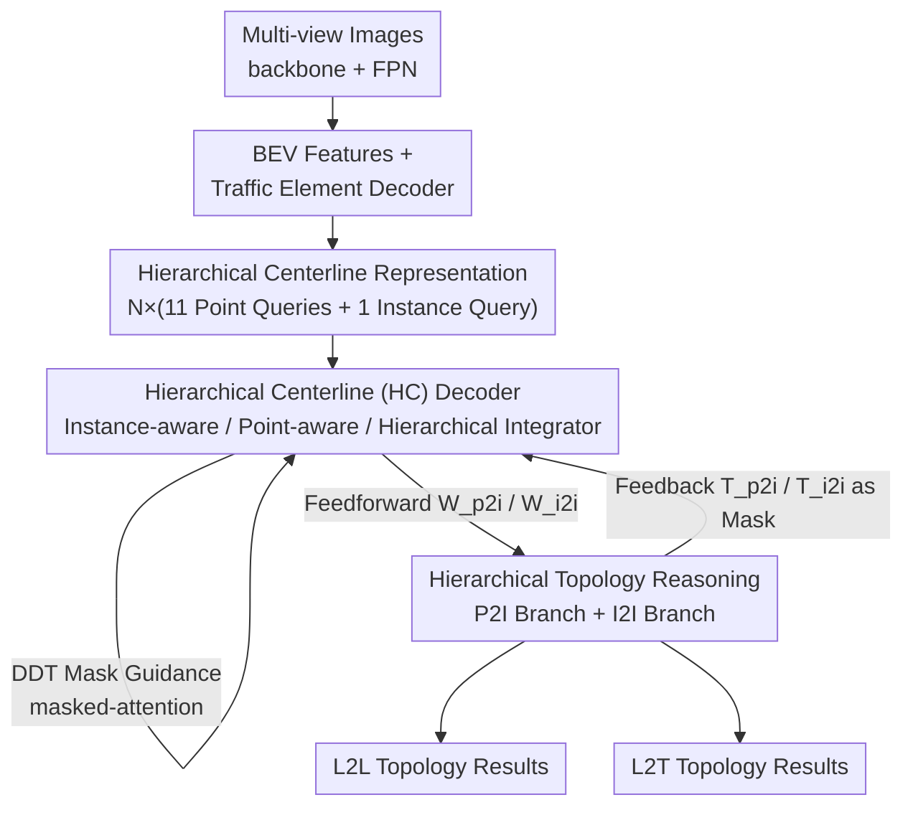

# TopoHR: Hierarchical Centerline Representation for Cyclic Topology Reasoning in Driving Scenes with Point-to-Instance Relations

**Conference**: CVPR 2026  
**arXiv**: [2604.24119](https://arxiv.org/abs/2604.24119)  
**Code**: https://github.com/Yifeng-Bai/TopoHR.git (Available)  
**Area**: Autonomous Driving / Lane Topology Reasoning  
**Keywords**: Centerline detection, Topology reasoning, Point-to-instance relation, Cyclic interaction, OpenLane-V2

## TL;DR
TopoHR transforms "centerline detection" and "topology reasoning" from a serial cascade into a **cyclic mutual enhancement** structure. By introducing a "point query + instance query" hierarchical centerline representation, it enables topology reasoning to utilize both fine-grained Point-to-Instance (P2I) and global Instance-to-Instance (I2I) relations. This achieves significant improvements on OpenLane-V2 metrics (subset_A +5.4 TOP$_{ll}$, subset_B +7.9 TOP$_{ll}$).

## Background & Motivation

**Background**: Lane topology reasoning is fundamental for high-level autonomous driving decisions (lane changes, path planning). It addresses questions like "which centerline's end connects to which centerline's start" and "which lane is governed by which traffic element (traffic lights/signs)." Mainstream approaches (TopoNet, TopoMLP, TopoLogic, etc.) use a **serial pipeline**: a transformer detector first detects centerlines (outputting instance-level queries), followed by an independent topology reasoning module (typically several MLP layers) to judge pair-wise connections between instance queries.

**Limitations of Prior Work**: This serial design faces two structural issues. First, detection and reasoning are **optimized separately**, leading to inconsistent feature representations—the reasoning module passively accepts instance queries from the detector, while the detector remains unaware of the topology, preventing mutual error correction. Second, reasoning is performed only at the **instance level** with simple MLPs, failing to capture complex spatial dependencies in urban road networks. Furthermore, existing methods almost entirely **ignore Point-to-Instance (P2I) relations**—since a centerline is essentially a sequence of points, the fine-grained relationship of whether a "specific endpoint" of one line connects to "another line as a whole" is obscured by instance-level MLPs.

**Key Challenge**: Centerlines are "invisible virtual objects" (no actual visible pixels on the road), making detection inherently difficult. Additionally, topological relations are **hierarchical**—the connection between two centerlines $\mathcal{C}_i$ and $\mathcal{C}_j$ exists not only as "instance vs. instance" but also as "points of $\mathcal{C}_i$ vs. the instance of $\mathcal{C}_j$." The serial + instance-level MLP paradigm loses both the synergy between detection/reasoning and this hierarchical structure.

**Goal**: (1) Enable the detector and topology reasoning module to feed signals to each other for collaborative evolution; (2) Introduce a centerline representation capable of expressing both point-level and instance-level features to model P2I and I2I relations simultaneously.

**Core Idea**: Replace the serial cascade with a **cyclic interaction structure**—where the detector feed-forwards attention weights to the reasoning module, which in turn feeds back topological relations as masks to the detector. Simultaneously, use a **hierarchical representation** of "point queries + instance queries" to perform topology reasoning across P2I and I2I granularities.

## Method

### Overall Architecture
TopoHR takes multi-view camera images as input, extracting features via a shared backbone (ResNet-50 + FPN), with one branch for BEV transformation and another using a decoder for traffic element detection. The core consists of three components: the **Hierarchical Centerline (HC) Decoder**, the **Hierarchical L2L Topology Module** (centerline-to-centerline), and the **Hierarchical L2T Topology Module** (centerline-to-traffic element). The key shift is that the HC Decoder and L2L module are not serial but form a **cyclic iteration block**—attention weights $\mathbf{W}_{\text{p2i}}$ and $\mathbf{W}_{\text{i2i}}$ from the decoder are fed forward to the topology module, while the predicted relations $\mathbf{T}_{\text{p2i}}$ and $\mathbf{T}_{\text{i2i}}$ are fed back as attention masks to the decoder, enhancing both through layer-by-layer iteration.

The entire centerline is modeled as a **hierarchical query** $\mathbf{Q}_{\text{hcl}}\in\mathbb{R}^{N(P+1)\times C}$: for $N$ centerlines, each has $P$ point queries ($P{=}11$) + 1 instance query. Inside the HC Decoder, three modules collaboratively update these queries: an instance-aware module for global semantics, a point-aware module for local geometry, and a hierarchical integrator to fuse both levels.

### Key Designs

**1. Cyclic Mutual Enhancement: Ending Independent Optimization**

To address the disconnect caused by serial cascades, TopoHR establishes a **bidirectional information flow** between the HC Decoder and the L2L module. Forward: P2I weights $\mathbf{W}_{\text{p2i}}\in\mathbb{R}^{NP\times N}$ from the Integrator Attention and I2I weights $\mathbf{W}_{\text{i2i}}\in\mathbb{R}^{N\times N}$ from the Topo-Aware Attention are sent to the topology module. Backward: Inferred relations $\mathbf{T}_{\text{p2i}}$ and $\mathbf{T}_{\text{i2i}}$ are converted into attention masks $\mathbf{M}_{\text{i2i}}$ and $\mathbf{M}_{\text{p2i}}$ via a 3-layer MLP relation encoder and fed back to the decoder. This creates an iterative loop where the detector "knows" the inferred topology from the previous layer to adjust features, while the reasoning module receives more accurate attention priors. This is the first work to establish such a "mutual enhancement cycle" between detection and reasoning—unlike TopoLogic, which only injects geometric priors **unidirectionally**.

**2. Hierarchical Centerline Representation and HC Decoder: Capturing Point and Line Features**

Existing methods compress each centerline into a single vector via instance queries, losing point-level geometry. TopoHR introduces $NP$ point queries to express local geometry alongside global semantics. The HC Decoder updates these via: (a) **Instance-aware module** using masked-attention (constrained by DDT masks to focus on centerline areas) + topo-aware attention (guided by I2I masks); (b) **Point-aware module** using line-aware attention (constrained by P2P masks $\mathbf{M}_{\text{p2p}}\in\mathbb{R}^{NP\times NP}$ to prevent cross-instance leakage) + cross-attention; (c) **Hierarchical Integrator** for dual-level fusion: point queries act as $\mathbf{Q}$, while instance queries act as $\mathbf{K}/\mathbf{V}$ in cross-attention with P2I relation masks $\mathbf{M}_{\text{p2i}}$:

$$\mathbf{\hat{Q}}_{\text{pts}} = \text{softmax}(\mathbf{Q}\mathbf{K}^{T}+\mathbf{M}_{\text{p2i}})\mathbf{V}$$

Updated point queries are then aggregated back to instance queries $\mathbf{\hat{Q}}_{\text{ins}}$ using learnable coefficients $\mathbf{W}_{\text{agg}}\in\mathbb{R}^{P}$: $\mathbf{\hat{Q}}_{\text{ins}}=\sum_{p=1}^{P}\mathbf{\hat{Q}}_{\text{pts}}[:,p,:]\,\text{softmax}(\mathbf{W}_{\text{agg}})_p$. This ensures local details and global context propagate across layers.

**3. Discrete Distance Transform (DDT) Mask: Spatial Signals for "Invisible" Lines**

Since centerlines lack unique pixel features, binary segmentation is difficult to converge. TopoHR adopts **distance transform**: for each BEV pixel $\mathbf{b}$, the Euclidean distance to the nearest centerline point is calculated, clipped within half the lane width $L_{\text{width}}/2$, normalized to $[0,1]$, and **uniformly discretized into 6 bins** to create the DDT mask $\texttt{DDT}(\mathbf{b})$. Compared to binary segmentation, DDT encodes spatial proximity; compared to continuous distance transform, discretization is more efficient and stable. This mask is used for masked-attention in the instance-aware module and for supervision. Experiments show that switching from binary/continuous DT to DDT improves DET$_l$ from 32.6/32.0 to 34.6.

**4. Hierarchical Topology Reasoning: Assessing Point-to-Instance Connections**

The core insight is that topology is inherently hierarchical. The topology module employs two branches: the I2I branch uses dual MLPs to encode instance queries followed by an inner product and I2I attention weight encoding:

$$\mathbf{T}_{\text{i2i}} = \mathbf{Q}^{\text{sim1}}_{\text{ins}}(\mathbf{Q}^{\text{sim2}}_{\text{ins}})^{\top} + \operatorname{MLP}(\mathbf{W}_{\text{i2i}})$$

The P2I branch calculates similarity between point queries and instance queries, averaged over the point dimension:

$$\mathbf{T}_{\text{p2i}} = \mathbf{Q}^{\text{sim}}_{\text{pts}}(\mathbf{Q}^{\text{sim3}}_{\text{ins}})^{\top} + \operatorname{MLP}(\mathbf{W}_{\text{p2i}})$$

Final topology results are derived from both $\mathbf{T}_{\text{i2i}}$ and $\mathbf{T}_{\text{p2i}}$, utilizing both explicit feature correlations and implicit dependencies from the cyclic structure.

### Loss & Training
The total loss is $\mathcal{L}=\mathcal{L}_{\text{det}}+\mathcal{L}_{\text{seg}}+\mathcal{L}_{\text{topo}}$. $\mathcal{L}_{\text{det}}$ includes focal loss and $\ell_1$ loss for vectorized regression; $\mathcal{L}_{\text{seg}}$ uses dice + cross-entropy supervised by DDT masks.

**Adaptive Topology Loss (ATL)**: To address the imbalance where negative samples (no connection) far outnumber positive ones, ATL uses dynamic weighting based on reparameterized cross-entropy. Negative sample weights are exponentially scaled by $e^{\lambda_{\text{neg}} x_i}$ ($x_i$ is the predicted probability), while positive weights $\lambda_{\text{pos}}$ are fixed. This heavily penalizes high-confidence false positives to suppress them adaptively. Optimal configuration is $\lambda_{\text{neg}}{=}5, \lambda_{\text{pos}}{=}400$.

Training uses 8×4090 (8×A100 for TopoHR-L), batch 8, 24 epochs (48 for TopoHR-L), AdamW, initial LR $3\times10^{-4}$. Images are resized to 1024×775 with a 200×100 BEV grid and 200 hierarchical queries. Inference reaches 12.6 FPS on an RTX 4090.

## Key Experimental Results

### Main Results
Evaluated on the OpenLane-V2 benchmark. Metrics: DET$_l$ (centerline Fréchet distance), DET$_t$ (traffic element IoU), TOP$_{ll}$ (centerline topology), TOP$_{lt}$ (lane-traffic topology), OLS (comprehensive).

| Dataset | Metric | TopoHR-L(48ep) | Prev. SOTA | Gain |
|--------|------|------|----------|------|
| subset_A | DET$_l$ | 37.6 | 34.7 (TopoFormer) | +2.9 |
| subset_A | TOP$_{ll}$ | 34.6 | 31.2 (SEPT) | +3.4 |
| subset_A | TOP$_{lt}$ | 35.6 | 32.2 (RelTopo) | +3.4 |
| subset_A | OLS | 50.8 | 48.9 (RelTopo) | +1.9 |
| subset_B | DET$_l$ | 43.6 | 34.8 (TopoFormer) | +8.8 |
| subset_B | TOP$_{ll}$ | 39.7 | 31.8 (RelTopo) | +7.9 |
| subset_B | OLS | 53.4 | 49.7 (RelTopo) | +3.7 |

Note: The gains in subset_B are particularly high due to fewer viewpoints, where the hierarchical representation and cyclic structure compensate for limited visual information.

### Ablation Study
Performed on subset_A, 200 queries, 24 epochs; baseline is TopoLogic without GNN.

| Configuration (Table 3) | DET$_l$ | TOP$_{ll}$ | Note |
|------|---------|------|------|
| Instance queries only (Ins) | 26.8 | 23.1 | Baseline |
| Ins+Pts | 19.6 | 24.9 | Adding pts without constraints degrades detection |
| +P2P Constraints | 20.1 | 25.1 | Prevents cross-instance leakage |
| +Hierarchical Integrator | 32.2 | 26.3 | **Key jump**: DET$_l$ 20→32 |
| +Seg(Binary GT) | 32.6 | 29.8 | With segmentation supervision |
| +Seg(DDT) | **34.6** | **30.6** | DDT is optimal |

| Configuration (Table 4) | DET$_l$ | TOP$_{ll}$ | TOP$_{lt}$ |
|------|---------|------|------|
| Ins query, no cycle | 34.8 | 31.0 | 31.1 |
| +I2I Feedforward/Feedback | 35.6 | 31.5 | 32.9 |
| +I2I & P2I (Full Cycle) | **36.1** | **31.8** | **34.6** |

### Key Findings
- **Hierarchical Integrator is crucial**: Simply adding point queries causes DET$_l$ to crash (26.8 to 19.6) as unconstrained point features disrupt detection. The integrator correctly fuses the two levels, boosting DET$_l$ to 32.2.
- **DDT superior to alternatives**: DDT provides discretized spatial proximity supervision for "invisible" centerlines, outperforming binary masks by 2.0 DET$_l$.
- **P2I primarily aids TOP$_{lt}$**: Adding P2I jumped TOP$_{lt}$ from 32.9 to 34.6 (+1.7 relative to I2I cycle), confirming point-to-instance relations are vital for heterogeneous "lane-traffic" topology.
- **ATL significantly improves TOP$_{lt}$**: ATL provides a +2.3 gain over focal loss by adaptively penalizing false positives.
- **Manageable overhead**: Point queries and DDT segmentation only increase parameters by **13.8%**.

## Highlights & Insights
- **Shifting from "Master-Slave" to Symbiosis**: The cyclic mutual enhancement is a fundamental paradigm shift—topology results now refine detection features via attention masks. This bidirectional closed-loop can be extended to other "perception-relation" tasks like scene graphs or HOI.
- **Hierarchical Nature of Topology**: The observation that connections occur between points and instances (P2I) fills the gap left by instance-level MLPs, specifically saving TOP$_{lt}$ performance.
- **DDT for Virtual Objects**: Using discrete distance transforms to create soft labels for objects without explicit boundaries is a clever trick applicable to drivable area boundaries or logic dividers.

## Limitations & Future Work
- **Slow Convergence of TopoHR-L**: On complex datasets, large models require up to 48 epochs to show benefits, increasing training costs.
- **Unexplored ATL Hyperparameters**: The authors noted they primarily validated the "penalize false positives" concept without a systematic grid search for $\lambda_{\text{neg}}/\lambda_{\text{pos}}$.
- **Static Traffic Element Detection**: DET$_t$ remained largely unchanged as the focus was on the centerline side; traffic element perception itself was not the focus.
- **Inference Complexity**: While 12.6 FPS is acceptable, the cyclic feedback MLPs and masked-attention layers make it heavier than pure MLP-based reasoning methods.

## Related Work & Insights
- **vs. TopoNet / TopoMLP**: These use serial "detection-then-reasoning" with instance-level MLPs; TopoHR uses a cyclic loop and P2I/I2I reasoning.
- **vs. TopoLogic**: TopoLogic uses unidirectional geometric injection; TopoHR uses a full bidirectional cycle and hierarchical queries with DDT supervision.
- **vs. RelTopo / TopoPoint**: They rely on increasing query counts (e.g., 300); TopoHR achieves better results with only 200 queries due to structural improvements.
- **vs. TopoMask**: TopoMask performs instance segmentation; TopoHR uses DDT as auxiliary supervision within a transformer framework to avoid the difficulties of segmenting invisible lines.

## Rating
- Novelty: ⭐⭐⭐⭐⭐ Cyclic enhancement and P2I topology are substantial breakthroughs.
- Experimental Thoroughness: ⭐⭐⭐⭐☆ Extensive ablations, though lacks more backbones or cross-dataset generalization.
- Writing Quality: ⭐⭐⭐⭐☆ Clear motivation and logic, though some summaries and formulas need careful cross-referencing.
- Value: ⭐⭐⭐⭐⭐ Strong SOTA performance on OpenLane-V2 and open-source code provide high practical value for online mapping.

<!-- RELATED:START -->

## Related Papers

- [\[AAAI 2026\] Fine-Grained Representation for Lane Topology Reasoning](../../AAAI2026/autonomous_driving/fine-grained_representation_for_lane_topology_reasoning.md)
- [\[CVPR 2026\] ColaVLA: Leveraging Cognitive Latent Reasoning for Hierarchical Parallel Trajectory Planning in Autonomous Driving](colavla_leveraging_cognitive_latent_reasoning_for_hierarchical_parallel_trajecto.md)
- [\[CVPR 2026\] ReScene4D: Temporally Consistent Semantic Instance Segmentation of Evolving Indoor 3D Scenes](rescene4d_temporally_consistent_semantic_instance_segmentation_of_evolving_indoo.md)
- [\[CVPR 2026\] An Instance-Centric Panoptic Occupancy Prediction Benchmark for Autonomous Driving](an_instance-centric_panoptic_occupancy_prediction_benchmark_for_autonomous_drivi.md)
- [\[CVPR 2026\] SGDrive: Scene-to-Goal Hierarchical World Cognition for Autonomous Driving](sgdrive_scene-to-goal_hierarchical_world_cognition_for_autonomous_driving.md)

<!-- RELATED:END -->
