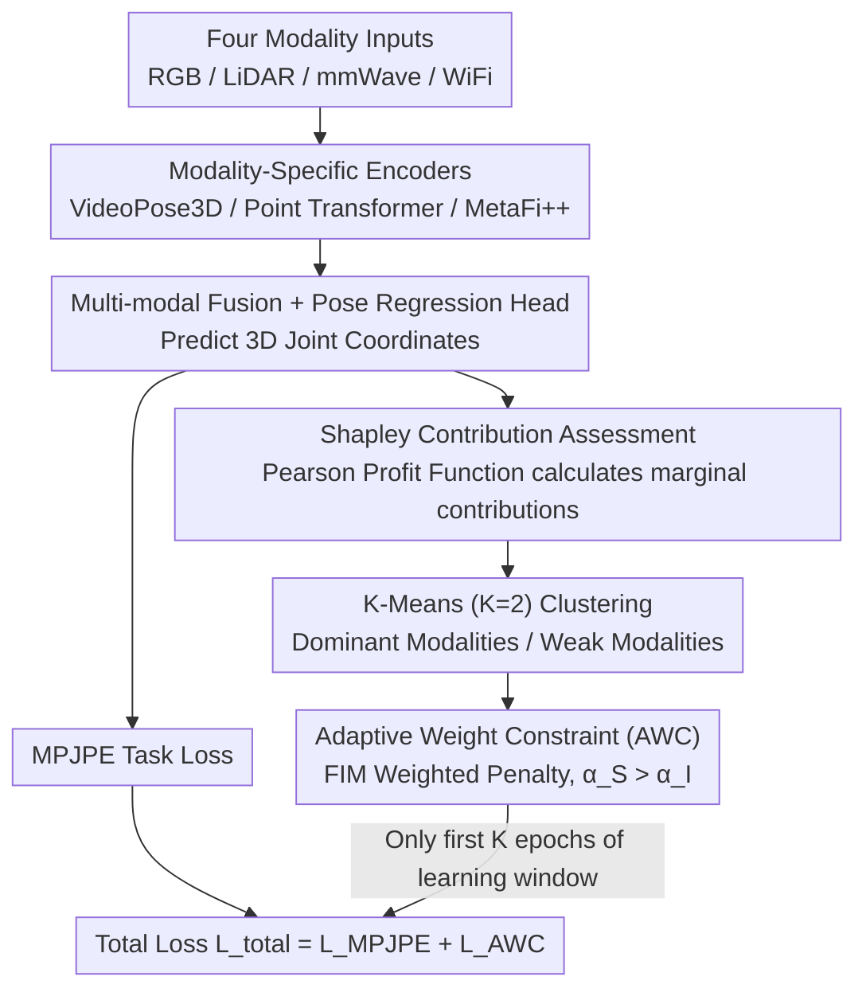

# Towards Balanced Multi-Modal Learning in 3D Human Pose Estimation

**Conference**: CVPR2026  
**arXiv**: [2501.05264](https://arxiv.org/abs/2501.05264)  
**Code**: [MICLAB-BUPT/AWC](https://github.com/MICLAB-BUPT/AWC)  
**Area**: Autonomous Driving  
**Keywords**: 3D human pose estimation, multi-modal learning, modality imbalance, Shapley value, Fisher Information Matrix

## TL;DR

Proposes Shapley value-based modality contribution assessment and Fisher Information Matrix (FIM) weighted Adaptive Weight Constraint (AWC) regularization to address modality imbalance in multi-modal (RGB/LiDAR/mmWave/WiFi) 3D human pose estimation, achieving balanced optimization without additional learnable parameters.

## Background & Motivation

### Background

3D Human Pose Estimation (3D HPE) is a critical task in computer vision, widely used in human-computer interaction, action assessment, and rehabilitation monitoring. Traditional methods primarily rely on RGB images but face limitations in occluded and privacy-sensitive scenarios. Consequently, multi-modal approaches integrating non-intrusive sensors (LiDAR, mmWave radar, WiFi) have become a significant trend.

### Design Motivation

Multi-modal joint training suffers from **modality imbalance**: dominant modalities (e.g., RGB, LiDAR) converge rapidly during early training, suppressing the optimization of weaker modalities (mmWave, WiFi). Existing balance methods have three major flaws:

**Poor task adaptability**: Methods like G-Blending and OGM-GE are designed based on cross-entropy loss or explicit category membership, making them suitable only for classification tasks and difficult to migrate directly to regression tasks.

**Additional parameters**: Methods like MMPareto require auxiliary uni-modal heads, increasing model complexity.

**Neglecting weak modality overfitting**: They only adjust the gradients of dominant modalities without considering the risk of weak modalities overfitting to noisy signals.

The authors' key observation: in regression tasks, the prediction standard deviation of weak modalities (mmWave, WiFi) tends toward zero (prediction collapse to constant values). Using MSE/MAE as the Shapley profit function leads to misleading assessments—constant predictions are incorrectly judged as high contribution.

## Method

### Overall Architecture

The model uses modality-specific encoders to extract features (VideoPose3D for RGB, Point Transformer for LiDAR/mmWave, and MetaFi++ for WiFi). After multi-modal fusion, a pose regression head predicts 3D joint coordinates. Two components are integrated to address "modality imbalance": a Shapley modality contribution assessment module, which uses Shapley values + Pearson correlation to quantify each modality's contribution and identify strengths/weaknesses; and an Adaptive Weight Constraint (AWC) regularization, which uses the Fisher Information Matrix to weight parameter importance, balancing the learning speed of each modality within the "learning window" of early training.

### Key Designs

**1. Shapley Contribution Assessment for Regression: Replacing Profit Function with Pearson**

Directly applying modality contribution assessment from classification tasks fails in regression. For feature concatenation fusion, the final prediction can be decomposed into the sum of predictions from each modality $\hat{y} = \hat{y}^R + \hat{y}^L + \hat{y}^M + \hat{y}^W$. In classification, the logits of weak modalities are close to a uniform distribution, so adding or subtracting them has minimal impact on softmax, allowing cross-entropy to serve as the profit function. However, the authors observed that in regression, predictions from weak modalities (mmWave, WiFi) collapse into near-constants (standard deviation approaching zero). Using MSE evaluation at this point biases towards modalities with large outputs, misidentifying constant predictions as high contributions. The solution is to use the Pearson correlation coefficient as the profit function:

$$s(y, \hat{y}) = \sum_{i=1}^{j \times 3} \rho(y_i, \hat{y}_i), \quad \rho(y_i, \hat{y}_i) = \frac{\text{cov}(y_i, \hat{y}_i)}{\sigma_{y_i} \cdot \sigma_{\hat{y}_i}}$$

Pearson correlation measures the linear correlation between predictions and ground truth rather than numerical distance, making it naturally immune to constant bias and scale differences. When a weak modality yields constant predictions, its correlation coefficient is near zero, accurately reflecting its lack of information. Features of missing modalities are zero-filled, and Shapley values are calculated by traversing all combinations of modality subsets to determine marginal contributions.

**2. Adaptive Weight Constraint (AWC): Using Fisher Information Matrix to "Brake" Dominant Modalities**

Knowing which modalities are dominant is insufficient; one must also suppress the rapid convergence of dominant modalities while preventing weak modalities from overfitting to noise. AWC first performs K-Means ($K=2$) clustering on the Shapley scores of the four modalities, designating the high-score cluster as the dominant modality set $\mathcal{M}_\mathcal{S}$ and the low-score cluster as the weak modality set $\mathcal{M}_\mathcal{I}$. Different regularization coefficients $\alpha_\mathcal{S}$ and $\alpha_\mathcal{I}$ are assigned. The regularization term uses the diagonal of the Fisher Information Matrix (FIM) to weight the penalty on parameter deviation:

$$\mathcal{L}_{AWC} = \sum_{m \in \mathcal{M}} \left[\alpha_\mathcal{S} \cdot \mathbf{1}_{\{m \in \mathcal{M}_\mathcal{S}\}} + \alpha_\mathcal{I} \cdot \mathbf{1}_{\{m \in \mathcal{M}_\mathcal{I}\}}\right] \cdot \mathcal{L}_W^m, \quad \mathcal{L}_W^m = \sum_i \frac{[\mathcal{I}_\mathcal{D}]_{ii} (\theta_{t,i}^m - \theta_{0,i}^{m,*})^2}{2}$$

The ingenuity lies in the fact that the FIM diagonal $[\mathcal{I}]_{ii}$ (mean of squared gradients) inherently measures the empirical importance of parameters. During the early stages of dominant modality training, gradients are large, leading to high FIM values and heavier penalties on parameter shifts, which naturally slows them down. For weak modalities, gradients and FIM values are small, resulting in lighter penalties and protected learning. By setting $\alpha_\mathcal{S} > \alpha_\mathcal{I}$, the method simultaneously "suppresses the dominant and protects the weak" without introducing any additional learnable parameters.

### Loss & Training

- **Total Loss**: $\mathcal{L}_{total} = \mathcal{L}_{MPJPE} + \mathcal{L}_{AWC}$ (only within the learning window).
- **Learning Window**: AWC regularization is applied during the first $K$ epochs, after which only the task loss is used. This is based on the "critical learning period" theory, suggesting that most task-relevant information is acquired early in training.
- **FIM Update Frequency**: Re-calculated at the start of each epoch.
- **Training Setup**: Adam optimizer, lr=1e-3, batch=192, 50 epochs, lr decays by 10x at the 30th epoch.

## Key Experimental Results

### Main Results: Comparison with Existing Balance Methods (MM-Fi Dataset)

| Method | Fusion Strategy | P1 MPJPE↓ | P1 PA-MPJPE↓ | P3 MPJPE↓ | P3 PA-MPJPE↓ |
|------|----------|-----------|-------------|-----------|-------------|
| MM-Fi baseline | - | 72.90 | 47.70 | 89.80 | 63.20 |
| Concatenation | concat | 53.87 | 35.09 | 48.17 | 32.18 |
| + G-Blending | concat | 58.40 | 37.20 | 53.13 | 33.28 |
| + OGM-GE | concat | 55.51 | 35.92 | 51.68 | 32.84 |
| + AGM | concat | 55.80 | 38.10 | 53.88 | 36.30 |
| + Modality-level | concat | 53.24 | 34.81 | 53.98 | 31.85 |
| **+ Ours** | **concat** | **51.16** | **34.46** | **47.55** | **31.79** |
| Attention | attn | 53.35 | 35.20 | 49.97 | 32.33 |
| **+ Ours** | **attn** | **51.29** | **34.65** | **49.08** | **32.10** |

Key Findings: (1) Ours reduces P1 MPJPE by 2.71mm under concat fusion; (2) G-Blending and AGM perform worse than the baseline, indicating that balance strategies for classification can be counterproductive when migrated to regression; (3) The method is effective across all protocols and fusion strategies.

### Ablation Study: AWC Hyperparameter Sensitivity (Protocol 1, Concat)

| $\alpha_\mathcal{S}$ | $\alpha_\mathcal{I}$ | MPJPE↓ | PA-MPJPE↓ |
|------|------|--------|-----------|
| - (baseline) | - | 53.87 | 35.09 |
| 0 | 10k | 52.92 (-0.95) | 34.94 (-0.15) |
| 10k | 0 | 52.09 (-1.78) | 34.81 (-0.28) |
| 10k | 10k | 51.88 (-1.99) | 34.84 (-0.25) |
| **20k** | **10k** | **51.16 (-2.71)** | **34.46 (-0.63)** |
| 20k | 20k | 51.69 (-2.18) | 34.84 (-0.25) |
| 30k | 20k | 51.34 (-2.53) | 34.56 (-0.53) |

Key Findings: (1) The optimal configuration is $\alpha_\mathcal{S}=20k, \alpha_\mathcal{I}=10k$, meaning the regularization strength for dominant modalities is twice that for weak modalities; (2) Constraining only dominant modalities ($\alpha_\mathcal{I}=0$) is less effective than constraining both, suggesting weak modalities also need moderate protection against overfitting; (3) A learning window of $K=20$ (40% of total epochs) is optimal.

### Modality Fusion Analysis

| Modality Combination | MPJPE↓ | PA-MPJPE↓ |
|---------|--------|-----------|
| RGB only | 63.61 | 35.75 |
| LiDAR only | 66.95 | 45.70 |
| mmWave only | 102.89 | 52.21 |
| WiFi only | 166.92 | 97.39 |
| R+L | 52.93 | 34.96 |
| R+L+M+W (Four Modalities) | 53.87 | 35.09 |

**Key Findings**: Four-modality fusion (53.87) is actually worse than RGB+LiDAR dual-modality fusion (52.93), providing direct evidence of modality competition—weak modalities not only failed to provide gains but interfered with the learning of dominant ones.

### Computational Overhead

The overhead for Shapley contribution assessment is extremely low: it accounts for only 0.41%–0.93% of training time under Concat/MLP fusion and approximately 3.5%–5.4% under Attention fusion, which is not a bottleneck.

## Highlights & Insights

1. **Key Insight into Shapley Values for Regression**: The collapse of weak modality predictions into constants (standard deviation ≈ 0) in regression causes MSE/MAE to misjudge their contributions. Pearson correlation is a more reasonable profit function—a finding valuable for all regression-based multi-modal tasks.
2. **FIM as Adaptive Regularization Weight**: FIM naturally captures modality differences in parameter importance—large gradients in dominant modalities lead to high FIM, heavy penalties, and deceleration; small gradients in weak modalities lead to low FIM, light penalties, and protection, eliminating the need for manually designed tuning strategies per modality.
3. **Zero Extra Parameters**: Unlike methods such as MMPareto that require auxiliary uni-modal heads, AWC is based entirely on the statistics of existing parameters (mean squared gradients), making it elegant and lightweight.
4. **Direct Evidence of Modality Competition**: The fact that four-modality MPJPE is worse than dual-modality is strong empirical evidence that "more is not always better" in multi-modal learning.

## Limitations & Future Work

1. **Validated only on MM-Fi**: Lacks validation of generalization across more datasets and scenarios.
2. **Fixed Modality Count**: Scalability for a larger number of modalities is not verified; Shapley value calculation complexity grows factorially with the number of modalities, which may require approximation algorithms for more than 5-6 modalities.
3. **Manual Tuning of Learning Window K**: While $K=20$ is optimal for 50 epochs, an adaptive $K$ selection mechanism for different tasks/data scales is missing.
4. **Hard Partition via K-Means**: Simple binary clustering (dominant/weak) is relatively coarse; finer-grained or continuous grouping might be superior.
5. **Improvement Space for Weak Modalities**: While the current method mitigates the suppression of weak modalities, it does not explicitly enhance their representation power at the feature extraction level.

## Related Work & Insights

- **Modality Imbalance Theory**: OGM-GE (CVPR 2022) and G-Blending (ICLR 2020) pioneered the revelation of multi-modal competition but were limited to classification tasks.
- **Shapley Values in Multi-Modal Learning**: SHAPE (IJCAI 2022) first introduced Shapley values to evaluate modality contribution; this work extends it to regression scenarios.
- **Fisher Information and Continual Learning**: The design of AWC regularization is inspired by EWC (Elastic Weight Consolidation), which uses FIM to protect important parameters in continual learning. This paper reverses the concept—using FIM to constrain the excessively fast learning of dominant modalities.
- **Insight**: The approach of replacing MSE with Pearson correlation can be generalized to other regression-based multi-modal tasks (e.g., depth estimation, optical flow). FIM adaptive regularization can serve as a plug-and-play module.

## Rating

| Dimension | Score (1-10) | Explanation |
|------|------------|------|
| Novelty | 7 | Regression adaptation of Shapley+Pearson and FIM adaptive regularization are novel, but core components are based on existing theories. |
| Experimental Thoroughness | 6 | Single dataset (MM-Fi), though ablation is comprehensive. |
| Writing Quality | 7 | Analytical depth is good, motivation is clear, and formulas are complete. |
| Value | 7 | No extra parameters and plug-and-play capability offer general reference value for multi-modal regression tasks. |
| **Total Score** | **7** | Method is ingeniously designed, but generalization validation is insufficient. |

<!-- RELATED:START -->

## Related Papers

- [\[CVPR 2026\] EMDUL: Expanding mmWave Datasets for Human Pose Estimation with Unlabeled Data and LiDAR Datasets](expanding_mmwave_datasets_for_human_pose_estimation_with_unlabeled_data_and_lida.md)
- [\[CVPR 2026\] LA-Pose: Latent Action Pretraining Meets Pose Estimation](la-pose_latent_action_pretraining_meets_pose_estimation.md)
- [\[CVPR 2026\] VIRD: View-Invariant Representation through Dual-Axis Transformation for Cross-View Pose Estimation](vird_view-invariant_representation_through_dual-axis_transformation_for_cross-vi.md)
- [\[CVPR 2026\] PTC-Depth: Pose-Refined Monocular Depth Estimation with Temporal Consistency](ptc-depth_pose-refined_monocular_depth_estimation_with_temporal_consistency.md)
- [\[CVPR 2026\] Gau-Occ: Geometry-Completed Gaussians for Multi-Modal 3D Occupancy Prediction](gau-occ_geometry-completed_gaussians_for_multi-modal_3d_occupancy_prediction.md)

<!-- RELATED:END -->
