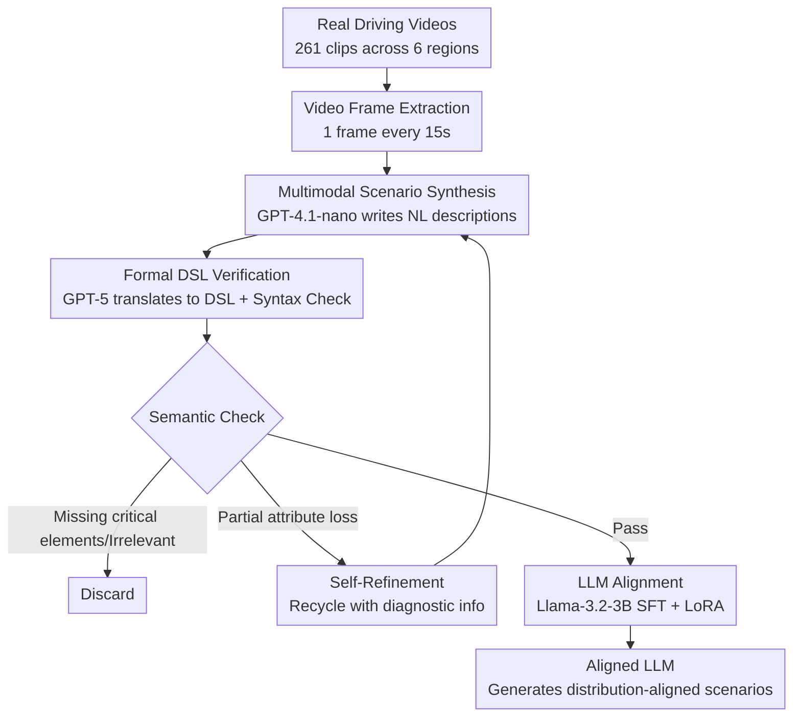

# TrafficAlign: Aligning Large Language Models for Traffic Scenario Generation

**Conference**: CVPR 2026  
**Paper**: [CVF Open Access](https://openaccess.thecvf.com/content/CVPR2026/html/Tu_TrafficAlign_Aligning_Large_Language_Models_for_Traffic_Scenario_Generation_CVPR_2026_paper.html)  
**Code**: https://github.com/TrafficComposer/TrafficAlign  
**Area**: Autonomous Driving / LLM Alignment  
**Keywords**: Traffic scenario generation, LLM alignment, autonomous driving testing, domain-specific language, data synthesis

## TL;DR
TrafficAlign automatically synthesizes traffic scenario descriptions from real-world driving videos, performs semantic verification and self-refinement using a Domain-Specific Language (DSL), and fine-tunes (aligns) an LLM with this data. This enables the LLM to generate scenarios reflecting the actual traffic distribution of specific geographical regions. It induces 10.8% more collisions than the Prev. SOTA across three autonomous driving models, and fine-tuning these models with the generated scenarios reduces collision rates by 36.1%.

## Background & Motivation
**Background**: Simulation testing is the primary means of verifying the safety of autonomous driving models. The critical bottleneck is the ability to generate realistic and challenging traffic scenarios. Recent works have utilized LLMs to automatically generate scenarios, as they can understand natural language and write simulation scripts, eliminating the cost of manual rule engineering.

**Limitations of Prior Work**: Most existing LLM-based methods still require humans to write natural language scenario descriptions (e.g., TARGET and ScenicNL rely on manually written traffic manuals or accident reports), which is labor-intensive for large-scale testing. ChatScene is the only method to bypass manual descriptions by prompting LLMs to generate scenarios based purely on internal knowledge. However, general LLM knowledge lacks fine-grained, location-specific understanding. Consequently, generated scenarios are often homogenized and fail to align with real-world traffic distributions, especially in specific geographic areas like major cities, small towns, or mountainous regions.

**Key Challenge**: LLMs possess powerful language generation and scripting capabilities but **lack priors of the real-world traffic distribution** in target regions. Distributional information cannot be obtained through prompting alone, while collecting pure real-world data remains scarce and expensive. The essence of the problem is the distributional gap between "universal LLM knowledge" and "local real-world observations."

**Goal**: (1) Capture real-world traffic distributions of target regions from large-scale, accessible sources without relying on manual descriptions; (2) ensure the semantic quality of automatically synthesized data; (3) inject this distribution into LLMs to generate scenarios aligned with real-world distributions.

**Key Insight**: Massive first-person driving videos are available on platforms like YouTube for various geographic regions at near-zero cost, serving as an excellent proxy for real traffic distributions. Following the "synthetic data + verification/filtering" paradigm (e.g., Self-Instruct, Evol-Instruct) in LLM alignment, these videos can be converted into scenario descriptions and, after rigorous verification, used to fine-tune the LLM.

**Core Idea**: An automated pipeline consisting of "real-world driving videos → multimodal LLM synthesis for scenario descriptions → formal DSL verification + self-refinement → SFT alignment." This aligns target regional traffic distributions into the LLM, replacing reliance on manual descriptions or purely internal LLM knowledge.

## Method

### Overall Architecture
TrafficAlign is a fully automated pipeline that takes a set of real-world driving videos from a target region as input and outputs an aligned LLM capable of generating scenarios matching that region's distribution. It follows three serial steps: **Data Synthesis** (video frame extraction → multimodal LLM generating NL descriptions), **Data Verification** (translating NL descriptions to DSL → syntax check + semantic check → recycling incomplete scenarios for self-refinement, discarding irrelevant ones), and **LLM Alignment** (Supervised Fine-Tuning using verified descriptions). A loop exists between verification and synthesis: scenarios that are semantically incomplete but salvageable are sent back to the synthesizer with diagnostic information, while irrelevant frames (e.g., titles, intros) are discarded.

### Key Designs

**1. Multimodal LLM Synthesis from Video Frames: Turning Zero-Cost Videos into Distribution Proxies**

Previous methods either relied on human-written descriptions (labor-intensive) or LLM internal imagination (detached from reality). TrafficAlign utilizes real-world driving videos as source material because they are abundantly available online and inherently carry the traffic distribution of the target area. Frames are sampled uniformly at $\text{fps}=1/15$ (one frame every 15 seconds) to ensure diversity and avoid near-duplicate frames. The authors collected 261 POV scenic driving videos covering six diverse regions (Los Angeles, New York, Yosemite, Yellowstone, Pennsylvania towns, and Switzerland). For each frame, a multimodal LLM (default: GPT-4.1-nano) generates a structured natural language scenario description.

To ensure stability, a composite prompt was designed combining role-playing, step-by-step instructions, Chain-of-Thought, and Few-Shot strategies. The LLM is required to describe the scenario across three levels: **Road Network & Environment** (urban/rural, road types like intersections, lane count, weather, time), **Context Details** (traffic density, roadside environment, emergency vehicles/construction), and **Actors** (positions and behaviors of the ego vehicle and surrounding NPCs).

**2. Formal DSL Representation + Two-layer Verification: Translating NL to Symbolic Language for Reliability**

Automatic synthesis inevitably produces "dirty" data: descriptions with missing semantics due to LLM hallucinations and invalid frames from intros/titles. Judging the quality of descriptions directly in natural language is difficult and unreliable due to its unstructured and ambiguous nature. The key design is to **translate each NL description into a formal representation using a Domain-Specific Language (DSL)** (translated via GPT-5). The DSL uses precise symbolic slots like road network, environment, and actors, enabling systematic analysis.

Verification occurs at two levels. **Syntax Check**: The DSL follows context-free grammar; if out-of-vocabulary (OOV) symbols are detected, the error info is sent back to the LLM for correction. **Semantic Check**: The system checks for the presence of mandatory attributes in the valid DSL. If **multiple** critical elements (e.g., both time and weather) are missing, the frame is judged irrelevant and discarded. If only **partial** attributes are missing (e.g., an actor's behavior is unclear), it is marked for "self-refinement."

**3. Lightweight Self-Refinement Loop: Salvaging Incomplete Scenarios with Diagnosis**

Discarding all incomplete scenarios would waste usable data and potentially bias the target distribution. TrafficAlign closes the "Synthesis ↔ Verification" loop with a self-refinement step. When a scenario is valid but incomplete, diagnostic information identifying the missing attributes is **appended to the original prompt** to re-synthesize the description. This selective repair maximizes the retention of the original regional distribution while filtering out noise.

**4. SFT + LoRA Alignment: Injecting Real Distributions into the Generator LLM**

The final step is to align the verified real-world distribution into the generator LLM (default: Llama-3.2-3B-Instruct). Standard Supervised Fine-Tuning (SFT) is used with a next-token cross-entropy objective. Crucially, **the loss is calculated only on the assistant's response**, masking the user and system tokens so the model learns to generate scenario descriptions rather than fitting the prompt style. To minimize costs, LoRA (Low-Rank Adaptation) is used, adding adapters to attention and MLP layers. Training is efficient, requiring only 60 steps with a learning rate of 2e−4.

### Mechanism Example
Example - Los Angeles (LA): A frame of an urban arterial is extracted from an LA driving video → GPT-4.1-nano writes an NL description ("3-lane urban road, sunny, residential, moderate traffic...") → GPT-5 translates to DSL: `environment{time: daytime, weather: clear, lane_number: 3...}` and `actors{ego: go_forward...}`. Syntax check confirms compliance. Semantic check verifies all fields. If an actor is missing a behavior field, it returns to the synthesizer with a "missing behavior" diagnostic. The finalized LA scenario is used for SFT Llama-3.2-3B. During evaluation, generated NL descriptions are converted to Scenic scripts using the TrafficComposer algorithm for simulation in CARLA/SafeBench.

## Key Experimental Results

### Main Results
The authors used the SafeBench platform with three RL driving models (PPO, SAC, TD3) to evaluate the "capability of generated scenarios to induce failures." Metrics include Collision Rate (CR ↑) and Overall Score (OS ↓).

| Method | CR ↑ | OS ↓ | Description |
|------|------|------|------|
| Learning-to-collide (Adversarial) | 0.584 | 0.619 | Perturbs NPC trajectories |
| AdvSim (Adversarial) | 0.586 | 0.620 | Perturbs initial configurations |
| Carla Scenario Gen. (Rule-based) | 0.676 | 0.573 | Pre-defined traffic rules |
| Adv. Trajectory Optim. (Rule-based)| 0.627 | 0.596 | Physical rule constraints |
| ChatScene (Prev. SOTA) | 0.825 | 0.481 | LLM internal knowledge |
| **TrafficAlign (New York)** | **0.923** | **0.319** | Ours, aligned by region |
| **TrafficAlign (Yellowstone)** | 0.909 | 0.310 | Ours |
| **TrafficAlign (Los Angeles)** | 0.933 | 0.405 | Ours |

TrafficAlign instances consistently outperformed all baselines: CR is 2.7%–10.8% higher than the strongest baseline, and OS decreases by 5.0%–35.6%, indicating more challenging and failure-prone scenarios.

### Ablation Study
To verify the necessity of alignment, the authors compared it against variations that only "prompt" five SOTA LLMs (results for LA).

| Configuration | CR ↑ | OS ↓ | Description |
|------|------|------|------|
| GPT-5 (No alignment) | 0.889 | 0.435 | Strongest LLM baseline |
| GPT-4o (No alignment) | 0.874 | 0.441 | |
| Claude Sonnet 4 (No alignment) | 0.894 | 0.438 | |
| DeepSeek-V3 (No alignment) | 0.814 | 0.447 | |
| Qwen3 (No alignment) | 0.804 | 0.450 | |
| **TrafficAlign (Aligned)** | **0.933** | **0.405** | Full model |

Even against significantly larger models like GPT-5, the aligned 3B model wins across all 11 metrics. This demonstrates that "aligning regional distributions" is more critical than "scaling up model size" for this task.

### Key Findings
- **Alignment is the Decisive Factor**: The aligned 3B model outperforms the unaligned GPT-5, proving that the Gain comes from regional distribution injection rather than model size or prompt engineering.
- **Dual Effectiveness**: The same scenarios expose more defects (10.8% higher CR) and fix them when used for fine-tuning (36.1% lower CR), proving they are "real and safety-critical" rather than random noise.
- **Distributional Support via Visualization**: UMAP visualizations show TrafficAlign scenarios heavily overlap with real-world clusters, while GPT-4o/Claude/Qwen3 form clusters deviated from reality.
- **Regional Variation**: Distributions for mountainous areas (Yellowstone) and big cities (LA) are distinct, justifying the need for localized alignment.

## Highlights & Insights
- **DSL as a "Verification Proxy"**: Using a context-free grammar DSL to validate unstructured NL is ingenious. This "NL → Symbolic → Check" paradigm is transferable to any task requiring LLM synthetic data quality control.
- **Self-Refinement Against Bias**: Distinguishing between "discarding irrelevant data" and "refining incomplete data" prevents the filtering process itself from warping the target distribution.
- **Small Model + Alignment > Big Model + Prompt**: A 3B Llama model beats GPT-5, demonstrating that local distribution knowledge through alignment is more valuable than general model parameters for niche domains.
- **Zero-Cost Data Loop**: By using YouTube videos, the entire pipeline is scalable to any new region without manual labeling.

## Limitations & Future Work
- **Uniform Sampling misses long-tail events**: 15s intervals might miss rare but critical traffic events; future work could explore event-triggered sampling.
- **Single-frame temporal loss**: Relying on single frames limits the understanding of dynamic behaviors; future versions could use video snippets.
- **Coupling with ChatScene protocol**: Evaluations are tied to specific ChatScene parameters (40 initial scenarios, 50 mutation rounds), which may limit cross-platform comparison.
- **Dependency on Commercial APIs**: The synthesis and translation rely on GPT-4/5, which introduces costs and potential biases from proprietary models.

## Related Work & Insights
- **Vs. ChatScene**: ChatScene relies on prompt engineering and internal knowledge, leading to homogenization. TrafficAlign adds video synthesis, DSL verification, and SFT alignment to capture reality.
- **Vs. TARGET / ScenicNL**: These rely on manual manuals or crash reports, making them hard to scale. TrafficAlign is fully automated.
- **Vs. Scenario Reconstruction (STRIVE, SLEDGE)**: These work at the BEV/trajectory level using generative models, while TrafficAlign works at the NL/DSL level for full 3D simulation.

## Rating
- Novelty: ⭐⭐⭐⭐ The combination of video-based synthesis and DSL-based alignment is a coherent and novel contribution.
- Experimental Thoroughness: ⭐⭐⭐⭐⭐ Comprehensive testing across six regions, multiple models, and specialized ablation studies.
- Writing Quality: ⭐⭐⭐⭐ Clear motivation and architecture, though some DSL grammar details are relegated to supplementary material.
- Value: ⭐⭐⭐⭐ Proven utility for both safety testing and model improvement, with significant insights into LLM data alignment.

<!-- RELATED:START -->

## Related Papers

- [\[ACL 2025\] Embracing Large Language Models in Traffic Flow Forecasting](../../ACL2025/autonomous_driving/embracing_large_language_models_in_traffic_flow_forecasting.md)
- [\[ECCV 2024\] Navigation Instruction Generation with BEV Perception and Large Language Models](../../ECCV2024/autonomous_driving/navigation_instruction_generation_with_bev_perception_and_large_language_models.md)
- [\[CVPR 2026\] Unifying Language-Action Understanding and Generation for Autonomous Driving](unifying_language-action_understanding_and_generation_for_autonomous_driving.md)
- [\[AAAI 2026\] TimeBill: Time-Budgeted Inference for Large Language Models](../../AAAI2026/autonomous_driving/timebill_time-budgeted_inference_for_large_language_models.md)
- [\[CVPR 2026\] VGGDrive: Empowering Vision-Language Models with Cross-View Geometric Grounding for Autonomous Driving](vggdrive_empowering_vision-language_models_with_cross-view_geometric_grounding_f.md)

<!-- RELATED:END -->
