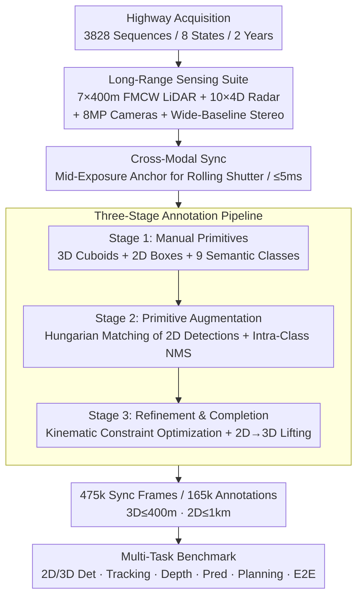

# TruckDrive: Long-Range Autonomous Highway Driving Dataset

**Conference**: CVPR 2026  
**Paper**: [CVF Open Access](https://openaccess.thecvf.com/content/CVPR2026/html/Ghilotti_TruckDrive_Long-Range_Autonomous_Highway_Driving_Dataset_CVPR_2026_paper.html)  
**Code**: light.princeton.edu/TruckDrive (dataset homepage + devkit, not GitHub code)  
**Area**: Autonomous Driving / Multimodal Perception Dataset  
**Keywords**: Long-Range Perception, Highway Autonomous Driving, Heavy-Duty Trucks, FMCW LiDAR, Multimodal Benchmark

## TL;DR
TruckDrive is the first large-scale multimodal dataset designed for long-range perception in heavy-duty truck highway scenarios—using 7-channel 400m FMCW LiDAR + 10-channel 4D radar + 8MP surround cameras to collect 475k synchronized frames (165k human annotations). It extends 3D annotations to 400m and 2D annotations to 1km, empirically demonstrating that existing SOTAs collapse beyond 150m (3D task performance drops by 31%–99%), exposing a systemic gap where architectures trained on urban datasets fail to transfer to long-range highway scenarios.

## Background & Motivation
**Background**: Over the past decade, progress in autonomous driving has been driven almost entirely by datasets—benchmarks like KITTI, Cityscapes, nuScenes, Waymo, and Argoverse defined the paradigms for perception, prediction, and planning. However, these datasets overwhelmingly focus on urban, low-speed scenarios, with annotation ranges typically limited to 70–100m in front of the ego vehicle.

**Limitations of Prior Work**: Urban short-range perception is sufficient for passenger cars, as low speeds translate limited spatial range into adequate temporal preview windows (5–10s planning window). However, this does not hold for heavy-duty trucks on highways: a fully loaded truck traveling at 120 km/h requires 150–200m to brake to a stop, equivalent to a 4.5–6s forward-looking demand. An 80m perception range offers only a 2.4s preview, and 100m offers only 3.0s—time that is entirely consumed by sensing and planning latencies, reducing the safety margin for braking execution to negative values and making strategic maneuvers like lane changes/merging completely infeasible. In other words, the short-range bias of urban datasets causes models across the entire field to be "nearsighted".

**Key Challenge**: Long-range perception itself is a non-trivial engineering challenge. The computation and memory of BEV and dense voxel representations scale quadratically with distance, and the signal-to-noise ratio of distant objects drops sharply due to sensor resolution and atmospheric attenuation. Moreover, long-range supervision signals are inherently sparse, with more severe calibration drifts and temporal uncertainties. At the same time, urban short-range benchmarks have saturated (with declining submissions and flatlining performance gains); continuing to climb leaderboards within 100m does not help solve highway safety for heavy trucks.

**Goal**: Rather than proposing a new model, the goal is to **build a dataset and benchmark that forces long-range issues to the forefront**—expanding the effective perception range by 5 times compared to urban benchmarks, covering highway scenarios, long sequences, and heavy-truck-specific driving patterns, and systematically quantifying how much and where existing methods fall short at long range.

**Key Insight**: The authors argue that the bottleneck of long-range capability is first and foremost "the lack of appropriate data"—neither 400m ground-truth annotations nor raw sensor streams designed for long range exist. By addressing both sensing and annotation, the implicit challenge of "long-range generalization" can be made explicit, providing the community with a target that is benchmarkable and optimizable.

**Core Idea**: Develop a multimodal sensing suite specifically built for long range (long-range FMCW LiDAR + 4D radar + high-resolution/telephoto cameras) coupled with a three-stage hybrid manual-automated annotation pipeline to build a highway benchmark covering 400m 3D / 1km 2D, using it as a "stress testbed" to expose long-range failures in existing architectures.

## Method

### Overall Architecture
The "method" of TruckDrive is a dataset production pipeline: **Collection Domain Design $\rightarrow$ Long-Range Sensing Suite $\rightarrow$ Cross-Modal Synchronization $\rightarrow$ Three-Stage Annotation (Manual Primitives $\rightarrow$ Primitive Augmentation $\rightarrow$ Refinement & Completion) $\rightarrow$ Multi-Task Benchmark Evaluation**. The overall logic is: first, use specialized sensing hardware to capture "far-reaching and highly accurate" raw signals (475k synchronized frames, collected over 2 years across 8 states); second, use a hybrid annotation pipeline to scale expensive manual annotations into dense 400m 3D / 1km 2D ground truths via geometric projection + kinematic constraints; finally, train and evaluate SOTA models on 8 driving tasks using these ground truths to quantify their collapse at long range.

The diagram below shows the main flow from data acquisition to the benchmark, where "Long-Range Sensing Suite", "Cross-Modal Synchronization", and "Three-Stage Annotation" are the actual core contributions of this work:

### Key Designs

**1. Long-Range Multimodal Sensing Suite: Setting the perception range to 400m / 1km with the right hardware**

The root cause of urban datasets being "nearsighted" lies in hardware: standard 64-channel LiDAR points become too sparse to form objects beyond 200m, and low-resolution wide-FOV cameras render distant objects sub-pixel. TruckDrive completely redesigns the sensor configuration: 7-channel AEVA Aeries II 4D **FMCW LiDAR** (measuring up to 400m and outputting instant radial velocity per point) + 3-channel Ouster short-range LiDAR (for blind-spot coverage) + 10-channel Continental ARS540 **4D radar** + 11–15 channels of 8MP RCCB cameras (9 short-to-medium range + 1–3 telephoto stereo), totaling 37 heterogeneous sensors, over double the second-most abundant dataset (18 sensors). The key advantage of FMCW is that each point provides instantaneous radial velocity $v_r$, directly solved from the Doppler phase shift $\Delta\phi$:

$$v_r = \Delta\phi \cdot \frac{\lambda}{4\pi}\cos\theta$$

where $\lambda$ is the wavelength and $\theta$ is the angle of incidence. This allows distant moving objects to be immediately identified as dynamic or static without requiring multi-frame association, and lays the groundwork for "using FMCW to filter dynamic points and construct dense depth ground truths". The 8MP cameras guarantee that objects 1km away remain resolvable (which would otherwise be sub-pixels in urban baselines), enabling 2D annotations up to 1km. For ego-pose, a post-processing kinematics (PPK) pipeline with 2-channel GNSS + 4-channel IMU provides global poses, with failed frames backfilled via LiDAR SLAM, ensuring the high-precision localization needed for 400m annotations.

**2. Cross-Modal Synchronization: Using mid-exposure timing as anchor to eliminate rolling shutter systematic offsets**

In high-speed scenarios, synchronization errors are amplified by velocity—at 130 km/h, a 5ms error results in an 18cm displacement, which is catastrophic for 400m annotations. The challenge is that 8MP cameras use a **rolling shutter`** (readout line-by-line); aligning other modalities to the start of exposure introduces systematic temporal offsets across different image rows. TruckDrive defines the reference timestamp at the **mid-exposure time of the image** and aligns the LiDAR to this anchor:

$$t_{ref} = t^{start}_{img} + \tfrac{1}{2}T_{readout}, \qquad |t_{LiDAR} - t_{ref}| \le 5\,\text{ms}$$

where the typical readout time $T_{readout}$ is 54ms. All sensor groups are triggered to a unified clock, with intra-group lag under 5ms, and cross-modal triggering is temporally aligned to achieve near-simultaneous acquisition. This seemingly minor engineering detail secures the quality of the "cross-modal synchronized timestamps" across 475k frames, establishing a reliable ground truth for long-range high-speed operations.

**3. Three-Stage Annotation Pipeline: Scaling sparse human inputs into dense 400m ground truths via geometric projection + kinematic constraints**

Frame-by-frame manual 3D bounding box labeling over a 400m range is cost-prohibitive. This is resolved via a three-stage "manual seed + automated scale-up" pipeline:

- **Stage 1 (Manual Primitives)**: Human annotators only label 3D cuboids and 2D bounding boxes (including occlusion/truncation attributes) on 2000+ curated sequences containing complex interactions/edge cases. Over 85 fine-grained categories are annotated and merged into 9 major classes (traffic signs, passenger cars, road obstacles, pedestrians, semi-trucks, two-wheelers, emergency vehicles, vehicles of different sizes, etc.). 3D boxes are iteratively projected back to camera views to minimize offsets and eliminate "ghost" boxes.
- **Stage 2 (Primitive Augmentation)**: The initial 3D cuboids are projected onto all camera views and bipartite-matched with the 2D detector outputs using the **Hungarian algorithm** (with IoU as the cost matrix). Unmatched 2D detections fallback to geometric projection or pre-existing 2D labels, and intra-class NMS is applied to retain high-confidence detections, outputting matched 3D detections + 2D-only candidates.
- **Stage 3 (Refinement & Completion)**: Matched 3D annotations are transformed to the global coordinate frame, and **kinematic constraint optimization** is performed on the trajectories to enforce physically plausible motions and suppress yaw jitter. The optimization objective combines center position, orientation, size, and smoothness:

$$\min_{\{s^k_t, d^k_t\}}\sum_{t\in T_k}\big(\lambda_o L^o_t + \lambda_\psi L^\psi_t + \lambda_d L^d_t + \lambda_{smooth} L^{sm}_t\big)$$

where each term uses a Huber robust loss $\rho(\cdot)$ to measure center position, orientation difference, and dimension residuals. The smoothness term $L^{sm}_t = \|\Delta v^k_t\|^2_2 + \|\Delta^2\psi^k_t\|^2_2$ constrains the first-order difference of velocity and second-order difference of yaw. The process conforms to a **unicycle motion model** constraint (with state $s^k_t=(x,y,\psi,v,\omega)$). Missing frames are initialized via linear/spherical interpolation (linear for position, slerp for orientation) and jointly refined. Meanwhile, 2D-only candidates from Stage 2 are **lifted into 3D**: eight corners of each 3D hypothesis are projected to obtain an axis-aligned 2D box $\hat b_c(p)$. Only camera views with IoU $\ge$ 0.3 relative to Stage 2 detections are kept, and the projected boxes are optimized to fit the detections:

$$\sum_{c\in C}\big[\lambda_{iou}(1-\text{IoU}(\hat b_c(p), b_c)) + \lambda_g(z_{min}(p)-z_g)^2\big]$$

where $z_g$ is the local ground elevation given by the cumulative LiDAR map (constraining objects to rest on the ground). Finally, trajectories are associated with an offline tracker and merged with the smoothed ground-truth boxes to form the final annotation set. This pipeline is the core mechanism that scales "sparse manual seeds" into "165k dense 400m labels", enabling low-cost scaling of the dataset.

### Loss & Training
This is a dataset paper and does not propose a unified training objective. The kinematic optimization (four-term weighted sum + unicycle constraint) and 2D-to-3D lifting optimization (IoU + ground constraint) in Stage 3 are internal optimization goals of the annotation pipeline, where hyperparameters $\lambda_o,\lambda_\psi,\lambda_d,\lambda_{smooth},\lambda_{iou},\lambda_g$ control term weights, and the robust loss scale is $\delta_\rho$. For benchmark evaluations, a standard 140k training / 25k validation split is used. All models under test are trained from scratch on TruckDrive, following standard metrics and protocols for each task.

## Key Experimental Results

The core of the experiments is not "how good our method is" but "how poorly existing SOTAs perform at long range". All models are trained on TruckDrive and evaluated across distance bins: Short Range (SR, 0–50m), Medium Range (MR, 50–150m), Long Range (LR, 150–250m), and Ultra-Long Range (UR, 250m+).

### Main Results

**2D Object Detection (mAP, distance-binned)**—While 8MP high resolution allows 2D detectors to still function at 1km, performance collapses entirely at ultra-long range:

| Method | mAP | SR (0–50m) | MR (50–150m) | LR (150–250m) | UR (250m+) |
|------|-----|-----------|-------------|--------------|-----------|
| DETR | 12.7% | 41.2% | 24.7% | 8.9% | 1.0% |
| ViTDet | 27.3% | 58.3% | 51.8% | 33.9% | 3.3% |
| YOLO11x | 28.9% | 36.3% | 29.4% | 8.2% | 2.0% |
| DINO | 37.8% | 63.9% | 54.6% | 43.2% | **15.3%** |

**3D Object Detection (mAP)**—Camera-only methods (Far3D) drop to near-zero at long range, and fusion methods also suffer severe degradation:

| Method | Modality | Full | SR | MR | LR (150–250m) |
|------|------|------|------|------|------|
| Far3D | C | 14.04% | 35.54% | 11.07% | **0.33%** |
| TransFusion-L | L | 25.24% | 30.12% | 22.25% | 22.25% |
| BEVFusion | L+C | 26.45% | 32.32% | 22.77% | 22.69% |

The relative collapse of the camera-only method's 3D mAP in the LR bin is as high as **99%** (Far3D 35.54% $\rightarrow$ 0.33%), confirming that "urban architectures fail to transfer to long range".

**3D Multi-Object Tracking**—The combination of long sequence duration and high relative velocity causes tracking associations to collapse, yielding an average AMOTA of only around 10%:

| Method | Modality | AMOTA↑ | AMOTP↓ | Recall↑ |
|------|------|--------|--------|---------|
| MUTR3D | Query | 6.1% | 79.0% | 11.4% |
| Immortal Tracker | 3D Box | 12.8% | 77.2% | 20.7% |
| CenterPoint | 3D Box | 13.0% | 76.9% | 21.5% |

**Depth Estimation (distance-binned MAE, in meters)**—The stereo method BridgeDepth degrades severely from 2.53m in SR to 69.10m in UR (an $\sim 8\times$ worsening), indicating that ultra-long-range depth estimation fails entirely:

| Task/Method | SR↓ | MR↓ | LR↓ | UR↓ |
|-----------|-----|-----|-----|-----|
| Surround MapAnything | 5.05 | 16.73 | 39.19 | 121.15 |
| Stereo BridgeDepth | 2.53 | 8.34 | 20.21 | 69.10 |
| Monocular UniDepthv2 (single-view) | 2.66 | 10.63 | 28.37 | 102.58 |

**LiDAR Prediction / Motion Segmentation / E2E Planning**: For LiDAR prediction, LRS4Fusion yields the best fusion results with a 1s CD (Chamfer Distance) of 15.82. For moving object segmentation, 4DMOS achieves an IoU of only 5.6% in the LR bin (vs. 21.6% Overall). For end-to-end planning, UniAD reports an average L2 error of 2.00m (reaching 1.71m at 3 steps). All metrics consistently point to long-range failures.

### Ablation Study

This work does not present a traditional ablation study, but **the distance binning itself serves as the most informative "ablation"**—explicitly dissecting "at what distance models fail":

| Phenomenon | Key Metric | Description |
|------|---------|------|
| 2D Detection LR $\rightarrow$ UR | DINO 43.2% $\rightarrow$ 15.3% | 8MP allows UR detections to function, but performance drops sharply. |
| 3D Detection Camera-only LR | Far3D 0.33% | Camera-only methods yield near-zero 3D performance at long range (relative drop of 99%). |
| Stereo Depth UR vs SR | BridgeDepth 2.53 $\rightarrow$ 69.10m | $3\times$ downsampling reduces distant parallax, causing $\sim 8\times$ MAE degradation. |
| Moving Object Seg. LR | 4DMOS IoU 5.6% | Urban-pretrained models perform poorly under domain shift (83% degradation). |
| BEVFusion 3D LR | Relative drop of 31% | Dense BEV grid enlargement leads to quadratic memory growth or coarsened resolution. |

### Key Findings
- **Monotonic Failure over Distance**: Performance across all tasks drops monotonically as distance increases, showing no exceptions, which indicates a systemic bias in urban-centric architectures rather than individual model quirks.
- **Dense BEV Representation as a Structural Bottleneck**: Expanding the range requires either scaling computationally with larger grids of fixed resolution (quadratic memory growth) or using coarser grids with fixed dimensions (degrading localization and association for small/distant objects). For example, UniAD compresses a 250×250m ROI into a 200×200 BEV grid, which is too coarse to encode useful driving information.
- **Compute Constraints Impose Downsampling Penalties**: Due to hardware constraints, camera-only methods downsample 8MP images by $3\times$, which severely reduces distant parallax. This is the direct cause of the $8\times$ degradation in stereo depth estimation at long range.
- **Ultraconservative Planning Modules**: Planning modules behave conservatively due to the low-speed urban assumption. UniAD exhibits a high L2 error even on near-term time steps on TruckDrive, failing to maintain an adequate safety margin for high-speed highway driving.

## Highlights & Insights
- **Problem-Driven over Model-Driven Formulation**: Instead of chasing marginal architecture improvements, this work designs a dataset to transform the implicit challenge of "long-range generalization" into an explicit, benchmarkable target, which holds greater long-term value for the community.
- **FMCW Point-wise Velocity is an Underestimated Asset**: The instant radial velocity provided by each LiDAR point resolves the dynamic status of distant objects without relying on multi-frame association, while also enabling dynamic point filtering to build dense static maps.
- **Mid-exposure Synchronization for Rolling Shutter Errors**: Explicitly modeling and correcting the systematic temporal offsets from rolling shutter cameras (line-by-line readout) is crucial for the reliability of high-speed, long-range ground truths. This method is directly transferable to any multimodal system with high-resolution rolling shutter cameras.
- **Manual-Seed + Geometric/Kinematic Scaling Annotation Paradigm**: Limiting manual annotation to sparse complex sequences and using Hungarian matching + unicycle motion constraints + 2D-to-3D lifting to scale them up to 400m provides an adaptable template for datasets facing range-dependent scaling costs.

## Limitations & Future Work
- **Acknowledged Limitations**: The wholesale failure of existing methods is itself the core conclusion of the paper; however, the paper does not propose a new architecture to bridge this gap, leaving the solution to the community.
- **Limited Benchmark Breadth**: Only 2–3 SOTA methods are evaluated per task, lacking hyperparameter sensitivity analysis or multi-seed statistical significance. E2E evaluation is limited to UniAD (which required backbone modifications for long-range compatibility), reducing comparability.
- **Transferability Issues from Truck Specifics**: The data is heavily biased toward highways (3244/3828 sequences) and truck perspectives, with low representation of night or adverse weather (367 night frames, ~10% rain/fog), which limits its direct utility for urban/passenger-car scenarios.
- **Future Directions**: The authors point directly toward three paths: efficient long-range representation learning (replacing quadratic dense BEV), sparse/range-aware sensor fusion, and long-sequence temporal reasoning to move away from urban short-range priors.

## Related Work & Insights
- **vs. nuScenes / Waymo / KITTI**: These are urban, low-speed, short-range ($\leq 100\text{m}$) benchmarks that are largely saturated. TruckDrive expands the range by $5\times$ (3D 400m / 2D 1km) at speeds up to 130 km/h and sequences up to 900m, essentially shifting the focus to high-speed, long-range scenarios.
- **vs. Argoverse V2 ($\pm 250\text{m}$) / MAN TruckScenes ($\pm 226\text{m}$)**: Prior long-range benchmarks capped at 220–250m, where 3D annotation density dropped drastically beyond 80m. TruckDrive uses 7 FMCW LiDARs to smoothly maintain 3D ground-truth density up to 400m and adds 4D radar + wide-baseline stereo, serving as the first benchmark intentionally designed for long range.
- **vs. ONCE (Self-supervised) / aiMotive (Highway, 12k frames)**: ONCE aims to minimize annotation reliance, and aiMotive touches on highway driving with small annotation volumes. TruckDrive offers 165k annotated frames + 310k unannotated frames along with full raw streams to support supervised, semi-supervised, and self-supervised paradigm research.

## Rating
- Novelty: ⭐⭐⭐⭐⭐ The first multimodal dataset specifically tailored for long-range high-speed heavy trucks; introduces a neglected yet safety-critical problem domain.
- Experimental Thoroughness: ⭐⭐⭐⭐ Covers 8 driving tasks with highly informative distance-binned evaluations, though the number of methods per task is limited and lacks statistical significance analysis.
- Writing Quality: ⭐⭐⭐⭐⭐ Logical derivation of motivation (braking distance $\rightarrow$ preview time $\rightarrow$ perception range) is rigorous. The three primary designs—sensing, synchronization, and annotation—are presented clearly and reconstructably.
- Value: ⭐⭐⭐⭐⭐ Uncovers structural limitations and system-level gaps in long-range adaptations of urban architectures, providing essential baselines and raw data for range-aware efficient perception with high long-term impact.

<!-- RELATED:START -->

## Related Papers

- [\[CVPR 2026\] WOD-E2E: Waymo Open Dataset for End-to-End Driving in Challenging Long-tail Scenarios](wod-e2e_waymo_open_dataset_for_end-to-end_driving_in_challenging_long-tail_scena.md)
- [\[CVPR 2026\] FoSS: Modeling Long-Range Dependencies and Multimodal Uncertainty in Trajectory Prediction via Fourier–State Space Integration](foss_modeling_long_range_dependencies_and_multimodal_uncertainty_in_trajectory_p.md)
- [\[CVPR 2026\] SearchAD: Large-Scale Rare Image Retrieval Dataset for Autonomous Driving](searchad_large-scale_rare_image_retrieval_dataset_for_autonomous_driving.md)
- [\[CVPR 2026\] Perceiving the Near, Reasoning the Distant: Coherent Long-Horizon Trajectory Prediction for Autonomous Driving](perceiving_the_near_reasoning_the_distant_coherent_long-horizon_trajectory_predi.md)
- [\[ICCV 2025\] Self-Supervised Sparse Sensor Fusion for Long Range Perception](../../ICCV2025/autonomous_driving/self-supervised_sparse_sensor_fusion_for_long_range_perception.md)

<!-- RELATED:END -->
