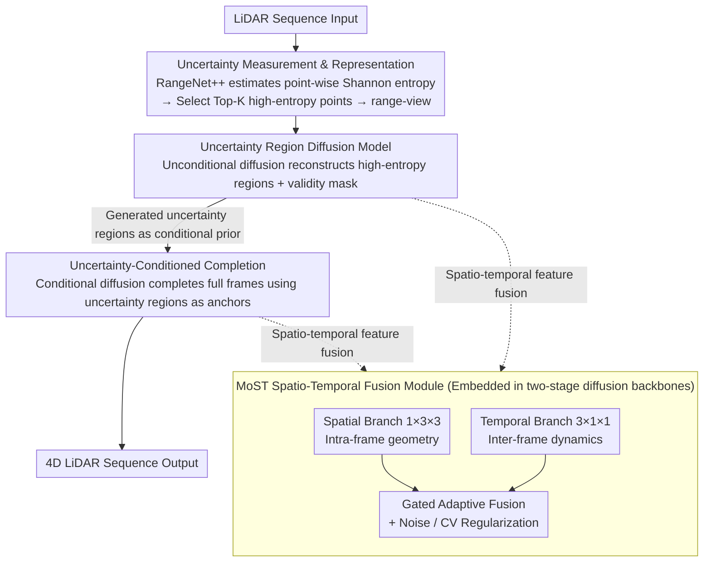

# U4D: Uncertainty-Aware 4D World Modeling from LiDAR Sequences

**Conference**: CVPR 2026  
**arXiv**: [2512.02982](https://arxiv.org/abs/2512.02982)  
**Code**: None  
**Area**: Autonomous Driving  
**Keywords**: LiDAR Generation, Uncertainty Modeling, Diffusion Models, 4D World Model, Spatio-Temporal Consistency

## TL;DR

Ours proposes U4D, the first uncertainty-aware 4D LiDAR world modeling framework. It adopts a "hard-to-easy" two-stage diffusion generation strategy, first reconstructing high-uncertainty regions and then conditionally completing the entire scene. A MoST module is designed to adaptively fuse spatio-temporal features to ensure temporal consistency.

## Background & Motivation

**LiDAR data acquisition bottleneck**: Collecting large-scale, diverse, and annotated LiDAR data is extremely costly and labor-intensive. Generative LiDAR modeling has become a crucial path for data augmentation and pre-training.

**Uniform assumption of existing methods**: Methods like LiDARGen, LiDM, and R2DM treat all spatial regions equally during generation, ignoring the non-uniform distribution of semantic difficulty in real-world scenes.

**Existence of uncertainty regions**: Long-range sparse areas, occluded object boundaries, small-scale structures, and semantically ambiguous regions naturally exhibit high uncertainty in LiDAR observations. Uniform generation leads to geometric artifacts and temporal instability in these areas.

**Human-like cognitive inspiration**: Humans parse ambiguous regions before understanding the global context when perceiving a scene. U4D draws on this idea by first generating uncertainty regions as structural anchors and then completing the rest of the scene.

**Insufficient temporal consistency**: Existing methods mainly focus on spatial reconstruction and lack modeling of temporal coherence between frames, resulting in unnatural object motion in generated sequences.

**Downstream task-driven demand**: Safety-critical applications like autonomous driving require generated data to truly improve the robustness and calibration reliability of perception models, rather than just pursuing visual fidelity.

## Method

### Overall Architecture

U4D adopts a two-stage "hard-to-easy" generation paradigm:

- **Stage 1: Uncertainty Region Modeling** — A pre-trained LiDAR segmentation model (RangeNet++) is used to estimate point-wise uncertainty maps (Shannon entropy). Top-K high-entropy points are selected to form a sparse uncertainty point cloud. After converting to range-view representation, an unconditional diffusion model reconstructs high-fidelity uncertainty regions.
- **Stage 2: Uncertainty-Conditioned Completion** — Using the uncertainty regions generated in the first stage as conditional input, a conditional diffusion model completes the full LiDAR frames, ensuring global structural consistency.
- The two stages share a unified latent scene representation, allowing global context information to refine local uncertainties.
- A **MoST Spatio-Temporal Fusion Module** is embedded within the diffusion backbones of both stages, adaptively fusing features from the spatial branch (intra-frame geometry) and the temporal branch (inter-frame dynamics) via gating to maintain temporal coherence while ensuring single-frame fidelity.

### Key Designs

**1. Uncertainty Measurement and Representation**

- Calculate Shannon entropy for each point: $H(\mathbf{p}) = -\sum_{c=1}^{C} D_c(\mathbf{p}) \log D_c(\mathbf{p})$
- nuScenes retains Top-20% high-entropy points; SemanticKITTI retains Top-5%.
- Sparse uncertainty point clouds are projected into range images $\mathbf{x}_0^u \in \mathbb{R}^{H \times W \times 2}$ (depth + intensity), accompanied by a binary mask $\mathbf{m}^u$.

**2. Uncertainty Region Diffusion Model**

- An unconditional diffusion model $\epsilon_\theta^u$ learns the generation distribution of uncertainty regions in range-view.
- It employs a standard DDPM forward process, reconstructing the spatial validity mask during reverse denoising.

**3. Uncertainty-Conditioned Completion**

- A conditional diffusion model $\epsilon_\theta^c$ learns $p(\mathbf{x}_0 | \mathbf{x}_0^u)$.
- Noisy input $\mathbf{x}_t$ and the uncertainty prior $\mathbf{x}_0^u$ are concatenated along the feature dimension, enabling the network to utilize both global and local cues for denoising.

**4. MoST (Mixture of Spatio-Temporal) Module**

- Intermediate features $\mathbf{F}_i \in \mathbb{R}^{C_i \times L \times H_i \times W_i}$ are decomposed into a spatial branch ($1 \times 3 \times 3$ convolution for intra-frame geometry) and a temporal branch ($3 \times 1 \times 1$ convolution for inter-frame dynamics).
- Outputs from both branches are concatenated and passed through an MLP shared embedding, then adaptively fused via a MoE-style gating mechanism: $(α_i^s, α_i^t) = \text{Softmax}(\mathbf{F}_i^{\text{share}} \cdot \mathbf{W}_i^g + \mathbb{I}(\chi \cdot \sigma(\mathbf{F}_i^{\text{share}} \cdot \mathbf{W}_i^z)))$
- Gaussian noise perturbations are added to the gating during training to avoid deterministic overfitting.
- The spatial branch dominates input/output layers (geometric details), while the temporal branch dominates intermediate layers (motion dynamics).

### Loss & Training

- **Uncertainty stage loss**: $\mathcal{L}_u = \mathbb{E}[\|\epsilon^u - \epsilon_\theta^u(\mathbf{x}_t^u, t)\|_2^2] + \lambda \mathcal{L}_{\text{mask}}(\mathbf{m}^u, \mathbf{m}^p)$, where $\mathcal{L}_{\text{mask}}$ is binary cross-entropy.
- **Conditioned completion loss**: $\mathcal{L}_c = \mathbb{E}[\|\epsilon^c - \epsilon_\theta^c(\mathbf{x}_t, t, \mathbf{x}_0^u)\|_2^2]$
- **Gating regularization**: $\mathcal{L}_{\text{reg},i} = \frac{\text{Var}(\alpha_i^s)}{(\mathbb{E}[\alpha_i^s])^2} + \frac{\text{Var}(\alpha_i^t)}{(\mathbb{E}[\alpha_i^t])^2}$, preventing the gate from excessively favoring a single modality.
- Two stages are trained separately: 1M steps for the first stage, 0.5M steps for the second stage; batch size 8, sequence length 6.
- AdamW optimizer, learning rate $1 \times 10^{-4}$, cosine annealing + 10K steps warmup; EMA decay rate 0.995.
- 4 × NVIDIA RTX 4090, FP16 mixed precision training.

## Key Experimental Results

### Main Results

**Table 1: nuScenes Scene-level Generation Fidelity**

| Method | FRD ↓ | FPD ↓ | JSD ↓ | MMD(×10⁻⁴) ↓ |
|------|-------|-------|-------|---------------|
| LiDARGen (ECCV'22) | 549.18 | 22.80 | 0.04 | 0.76 |
| R2DM (ICRA'24) | 253.80 | 14.35 | **0.03** | **0.48** |
| UniScene (CVPR'25) | - | 976.47 | 0.32 | 13.61 |
| **Ours (U4D)** | **223.96** | **12.90** | **0.03** | 0.53 |

**Table 3: nuScenes Temporal Consistency (TTCE/CTC)**

| Method | TTCE-3 ↓ | TTCE-4 ↓ | CTC-1 ↓ | CTC-3 ↓ |
|------|----------|----------|---------|---------|
| UniScene (CVPR'25) | 2.74 | 3.69 | **0.90** | 3.64 |
| LiDARCrafter (AAAI'26) | 2.65 | 3.56 | 1.12 | 3.02 |
| **Ours (U4D)** | **2.63** | **3.51** | 0.97 | **2.98** |

**Table 4: Downstream Semantic Segmentation mIoU(%)**

| Method | 1% Labels | 10% Labels | 50% Labels |
|------|---------|----------|----------|
| Sup.-only | 58.3 | 71.0 | 75.1 |
| R2DM | 64.1 | 73.0 | 75.9 |
| **Ours (U4D)** | **65.3** | **73.7** | **76.4** |

### Ablation Study

**Uncertainty Region Selection Strategy (Table 6)**

| Strategy | FRD ↓ | FPD ↓ | ECE(%) ↓ |
|------|-------|-------|----------|
| No Uncertainty | 235.91 | 14.03 | 3.98 |
| Random Sampling | 235.23 | 13.21 | 4.35 |
| Confidence Sampling | 228.24 | 13.04 | 3.02 |
| **Entropy Sampling** | **223.96** | **12.90** | **2.72** |

**MoST Fusion Strategy (Table 7)**

| Fusion Method | FRD ↓ | FPD ↓ | JSD ↓ |
|----------|-------|-------|-------|
| Cascade (No Parallel) | 536.23 | 23.34 | 0.63 |
| Additive Fusion | 242.81 | 13.42 | 0.28 |
| Concatenation Fusion | 242.43 | **12.51** | **0.03** |
| **Adaptive Fusion** | **223.96** | 12.90 | **0.03** |

### Key Findings

- Entropy-based uncertainty selection significantly outperforms random selection and unconditional generation, with ECE dropping from 3.98% to 2.72%.
- Adaptive fusion yields a significant FRD improvement (~20 points) over simple addition/concatenation, validating the effectiveness of dynamic gating.
- U4D generated data provides the largest gain (+7.0 mIoU) for downstream segmentation at low annotation ratios (1%), indicating that uncertainty-aware generated data is especially valuable for data-scarce scenarios.
- MoST exhibits different spatio-temporal activation patterns across network depths: spatial-dominant in shallow/deep layers and temporal-dominant in intermediate layers.

## Highlights & Insights

- **Pioneering Uncertainty-Driven LiDAR Generation**: Fed the uncertainty output of perception models back into the generation process, creating a "Perception → Uncertainty → Generation → Perception Enhancement" loop.
- **"Hard-to-Easy" Generation Philosophy**: Conquering semantically ambiguous "hard" regions first and using them as anchors to complete "easy" regions is a strategy with broad applicability.
- **Exquisite MoST Module Design**: Gating mechanism + Noise regularization + Coefficient of variation (CV) regularization provides a triple guarantee for balanced spatio-temporal feature fusion.
- Downstream calibration experiments (ECE metric) prove that generated data can not only improve accuracy but also enhance model confidence calibration.

## Limitations & Future Work

- Inference speed (8.9s/frame) is higher than single-frame methods (R2DM 3.5s); efficiency still needs improvement.
- Uncertainty estimation depends on the quality of the pre-trained segmentation model; biases in the segmentation model may propagate to the generation process.
- Validated only on nuScenes and SemanticKITTI; more sensor configurations and indoor scenes have not been tested.
- The two-stage training pipeline (1.5M steps total) is computationally expensive; an end-to-end solution might be more efficient.
- Information loss in range-view representation for self-occlusion and long-range areas is not fully discussed.

## Related Work & Insights

- **LiDAR Generation**: LiDARGen (ECCV'22 Score-based) → R2DM (ICRA'24 Diffusion) → LiDARCrafter (AAAI'26 Auto-regressive temporal) → U4D (Uncertainty-aware).
- **Uncertainty Modeling**: SalsaNext (Bayesian inference), Calib3D (Depth-aware calibration) — U4D is the first to introduce uncertainty into a generative framework.
- **Spatio-Temporal Modeling**: ViDAR (Image-to-LiDAR prediction), Cascaded spatio-temporal in video diffusion — MoST proposes parallel decomposition + adaptive gating as an alternative to cascade.

## Rating

- Novelty: ⭐⭐⭐⭐ (Uncertainty-driven "hard-to-easy" generation is a fresh perspective)
- Experimental Thoroughness: ⭐⭐⭐⭐ (Dual datasets, multiple metrics, complete ablation, downstream task validation)
- Writing Quality: ⭐⭐⭐⭐ (Clear structure, excellent diagrams, well-articulated motivation)
- Value: ⭐⭐⭐⭐ (The uncertainty+generation paradigm has practical significance for autonomous driving simulation data augmentation)

<!-- RELATED:START -->

## Related Papers

- [\[AAAI 2026\] LiDARCrafter: Dynamic 4D World Modeling from LiDAR Sequences](../../AAAI2026/autonomous_driving/lidarcrafter_dynamic_4d_world_modeling_from_lidar_sequences.md)
- [\[CVPR 2026\] GenieDrive: Towards Physics-Aware Driving World Model with 4D Occupancy Guided Video Generation](geniedrive_towards_physics-aware_driving_world_model_with_4d_occupancy_guided_vi.md)
- [\[CVPR 2026\] FoSS: Modeling Long-Range Dependencies and Multimodal Uncertainty in Trajectory Prediction via Fourier–State Space Integration](foss_modeling_long_range_dependencies_and_multimodal_uncertainty_in_trajectory_p.md)
- [\[CVPR 2026\] Bezier Degradation Modeling for LiDAR-based Human Motion Capture](bezier_degradation_modeling_for_lidar-based_human_motion_capture.md)
- [\[CVPR 2026\] Points-to-3D: Structure-Aware 3D Generation with Point Cloud Priors](points-to-3d_structure-aware_3d_generation_with_point_cloud_priors.md)

<!-- RELATED:END -->
