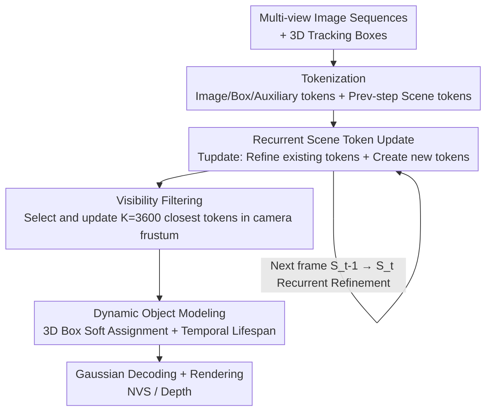

# UFO: Unifying Feed-Forward and Optimization-based Methods for Large Driving Scene Modeling

**Conference**: CVPR 2026  
**Paper**: [CVF Open Access](https://openaccess.thecvf.com/content/CVPR2026/html/Tan_UFO_Unifying_Feed-Forward_and_Optimization-based_Methods_for_Large_Driving_Scene_CVPR_2026_paper.html)  
**Code**: To be confirmed  
**Area**: Autonomous Driving / 3D Vision / Novel View Synthesis  
**Keywords**: 4D Scene Reconstruction, Driving Scene, Recurrent Update, Feed-forward Gaussian, Long Sequence Modeling

## TL;DR
UFO abstracts the "per-scene optimization" iterative process of render-compare-update into a feed-forward Transformer. It maintains a set of "scene tokens" that are progressively refined as new frames arrive, reduces complexity from quadratic to near-linear through visibility filtering, and models dynamic objects via 3D box-guided soft assignment and Gaussian lifespan modeling. It comprehensively outperforms both per-scene optimization and feed-forward baselines on the Waymo dataset for 2s/8s/16s (including 16s zero-shot) long-sequence driving scene reconstruction.

## Background & Motivation
**Background**: Novel view synthesis (NVS) for driving scenes is a crucial infrastructure for closed-loop autonomous driving simulation and end-to-end reinforcement learning. A current mainstream approach consists of two pathways: (1) **per-scene optimization** methods based on NeRF / 3DGS, which optimize scene parameters iteratively using photometric loss, yielding high quality but requiring hours of optimization from scratch for each driving log; (2) **feed-forward** methods (e.g., GS-LRM, STORM), which predict 3D representations from images in a single forward pass using data-driven priors, featuring fast inference and good generalization.

**Limitations of Prior Work**: Applying feed-forward methods to long-range driving scenes suffers from three key issues. First, existing feed-forward architectures utilize **global attention**, which has quadratic complexity in both spatial resolution and temporal length. Consequently, they can only handle heavily downsampled short sequences. Although the position and appearance of a 3D point only depend on a few pixels it projects onto, these methods perform attention over all pixels, wasting computation on irrelevant regions. Second, modeling dynamic objects over long durations requires capturing complex long-range motions, but many methods rely on **restrictive kinematic assumptions like constant velocity**. Third, current feed-forward pipelines execute **one-and-done predictions**: early errors introduced by distant or occluded viewpoints accumulate along long sequences, without any mechanism to go back and correct them once new observations arrive.

**Key Challenge**: Optimization-based methods are scalable and support iterative refinement but are slow and fail to generalize; feed-forward methods are fast and generalize well but make one-and-done predictions and suffer from quadratic complexity. The advantages of the two paradigms are mutually exclusive, whereas long-sequence driving scenes fundamentally require both "fast + generalizable" and "refinable + scalable" capabilities.

**Goal**: To harvest the benefits of both paradigms within a single feed-forward framework—achieving both the speed and generalization of feed-forward methods and the ability of optimization-based methods to "gradually refine and correct errors as observations increase", while reducing the complexity of long sequences to near-linear.

**Key Insight**: The authors' key observation is that the iterative refinement in 3DGS is essentially a render→compare→update loop. Therefore, instead of reconstructing the entire scene all at once, it is better to maintain a 4D representation composed of scene tokens and **progressively refine** them as new frames arrive. This abstracts the entire render-compare-update process into a learned feed-forward Transformer, bypassing explicit rendering and gradient backpropagation. Additionally, the **locality** of 3D-to-pixel correspondence is leveraged to update only a small number of relevant tokens.

**Core Idea**: Replacing "explicit rendering + gradient optimization" with a "feed-forward Transformer that recurrently refines scene tokens," coupled with visibility filtering to achieve near-linear complexity, and 3D bounding box soft assignment plus lifespan modeling to capture dynamic objects.

## Method

### Overall Architecture
Given a sequence of RGB images $\{I_t\}_{t=1}^{T}$ captured by a moving camera along with their corresponding poses $\{P_t\}_{t=1}^{T}$, UFO aims to efficiently reconstruct a 4D scene representation $S$ that supports high-quality NVS and depth estimation. The overall system operates in a **recurrent paradigm** built on three components:

1. **Token-based Scene Representation**: The 4D scene is represented as a compact set of scene tokens $S_t=\{s_t^i\}_{i=1}^{N_t}$, where each token $s_t^i\in\mathbb{R}^{3+D}$ consists of a 3D position $(x,y,z)$ in world coordinates and a $D=768$ dimensional feature vector encoding appearance, geometry, and motion information. These tokens can be decoded into 3D Gaussians for rendering.

2. **Recurrent Scene Update**: For each incoming frame, the update module $T_{\text{update}}$ (a ViT-style Transformer encoder) accomplishes two tasks within a feed-forward pass—**refining** existing tokens based on new visual evidence, and **creating** new tokens to capture previously unobserved content. This mimics the optimization loop of 3DGS but bypasses explicit rendering and gradient computation. To ensure scalability for long sequences, **visibility filtering** is introduced to select and update only the most relevant tokens at each step.

3. **Dynamic Object Modeling**: Off-the-shelf detector-generated 3D boxes and learnable Gaussian lifespan parameters are utilized to model complex object motion without necessitating kinematic assumptions.

The entire pipeline unfolds recurrently across time steps: current images are patched and encoded into image tokens, tracking boxes are encoded into box tokens, and shared auxiliary tokens (sky, camera-specific color transformations) are concatenated and forwarded into $T_{\text{update}}$ alongside the visible scene tokens transformed from the world system to the current camera system. This produces the updated $S_t$, which is finally decoded into 3D Gaussians by the Gaussian decoder and rendered alongside dynamic motion.

### Key Designs

**1. Recurrent Scene Token Update: Abstracting the Render-Compare-Update of Optimization Methods into a Single Forward Pass**

This represents the essence of UFO, addressing the issue that feed-forward methods perform one-and-done predictions and lack error correction. When a new frame $I_t$ with pose $P_t$ arrives, the update module processes the current observation along with the existing scene tokens to derive the new representation:

$$S_t = T_{\text{update}}(I_t, S_{t-1}).$$

This step simultaneously performs two complementary actions: (1) refining the old tokens in $S_{t-1}$ using the new visual evidence from $I_t$; (2) creating new tokens to capture previously unobserved scene content. Unlike optimization methods that must explicitly render and backpropagate gradients, UFO learns to update tokens directly from image features, accelerating inference by orders of magnitude. Its bidirectional nature distinguishes it from streaming reconstruction (e.g., CUT3R, Point3R)—while the latter treats memory as a fixed historical context that cannot be altered once predicted, UFO allows subsequent high-quality perspectives to **correct** early uncertain predictions (e.g., when a distant object is first observed only at low resolution). The ablation study (Tab. 3) shows that this "refinement" capability brings an additional +0.31 dB PSNR compared to merely employing memory, proving that the learned render-compare-update abstraction is the key to performance, rather than the memory itself. Furthermore, prior to each update, the selected scene tokens are transformed from the world coordinate system to the **current camera-centric local coordinate system**. This constrains the token positions and Plücker ray encodings within a compact numerical range, avoiding significant numerical fluctuations in global coordinates during long-distance ego-vehicle travel—a design the authors found crucial for stable long-sequence training.

**2. Visibility Filtering: Leveraging Locality of 3D-to-Pixel Correspondence to Reduce Complexity to Near-Linear**

Directly applying $T_{\text{update}}$ to all tokens is infeasible for long sequences: the number of tokens $N_t$ grows over time, and the Transformer attention scaling is quadratic. The authors observe that not all tokens are equally relevant to each frame—tokens outside the camera frustum or too far from the camera contribute negligibly to the current update. Consequently, for each frame $I_t$, scene tokens falling within the camera frustum are first filtered out, and the $K$ closest tokens to the camera center are kept, forming the visible set $V_{t-1}=\{s_{t-1}^i\}_{i=1}^{K}$. Updates are only performed on this subset:

$$\Delta S_t, V'_{t-1} = T_{\text{update}}(I_t, V_{t-1}),$$

subsequently replacing the visible tokens with their refined versions, appending the newly created tokens, and keeping the rest unchanged:

$$S_t = (S_{t-1}\setminus V_{t-1})\cup V'_{t-1}\cup \Delta S_t.$$

Since only a fixed budget of $K$ tokens (experimentally $K=3600$) is processed at each step, the total complexity scales **linearly** with the sequence length $T$ rather than quadratically. This is the fundamental reason why UFO scales to long sequences with virtually no performance drop at 16s.

**3. Dynamic Object Modeling: 3D Box-Guided Soft Assignment + Temporal Lifespan, Dispelling Kinematic Assumptions**

To address the limitations of modeling long-range dynamic objects using constant-velocity assumptions, UFO structures dynamic modeling into coarse and fine scales. Coarse motion is guided by 3D boxes: while naive implementations hand-optimize token assignments to objects based on 3D positions, this is non-differentiable and sensitive to box errors. UFO instead learns **soft assignment**. Tracking boxes are encoded via Fourier embeddings of their center and corners into box tokens, which are forwarded together with scene/image tokens to jointly reasoning about geometry, appearance, and object-level motion. The soft assignment matrix $A\in\mathbb{R}^{N\times N_{\text{obj}}}$ is derived by performing a row-wise softmax over the dot-product similarity between scene tokens and box tokens:

$$A_{s,i} = \frac{\exp(s^\top b_{t,i})}{\sum_{j=1}^{N_{\text{obj}}}\exp(s^\top b_{t,j})}.$$

Each decoded Gaussian inherits a **hybrid rigid-body transformation** scaled by weight $A_{s,i}$: linear blending for translation, and hemisphere-aligned quaternion averaging on SO(3) for rotation. This yields transformations $T_{t_0}, T_{t_1}$ for the creation timestamp $t_0$ and targeting render timestamp $t_1$. The relative motion $\Delta T = T_{t_1}T_{t_0}^{-1}$ is used to update the Gaussian center and rotation: $\mu_{t_1}=\Delta T\,\mu_{t_0},\ r_{t_1}=R(\Delta T)\,r_{t_0}$. To prevent soft assignments from overfitting static backgrounds, an object assignment regularization is added: $L_{\text{obj}}=-\sum_s\sum_i y_{s,i}\log A_{s,i}$ ($y_{s,i}$ is the inside-box indicator), encouraging tokens located inside a box to be assigned to the corresponding object.

Fine-scale motion is supplemented using a **temporal lifespan** to capture details beyond rigid box transformations. Following PVG, each Gaussian is assigned a lifespan parameter $\beta$ controlling its temporal opacity, allowing transient objects (like pedestrians and cyclists) and time-varying illumination to be accurately represented. Gaussian opacity decays over time as a Gaussian function:

$$\sigma(t) = \sigma_0 \cdot \exp\!\left(-\frac{(t-t_0)^2}{2\beta^2}\right),$$

where $\beta>0$ is decoded from the token features via SoftPlus to ensure positivity. To prevent all Gaussians from degenerating into transient states, a lifespan regularization $L_{\text{lifespan}}=\frac{1}{N}\sum_i \frac{1}{\beta_i}$ is added to encourage longer temporal persistence. Combining both allows the model to track the rigid motion of objects over long sequences while simultaneously capturing transient and fine-grained variations.

### Loss & Training
The framework is trained end-to-end. The appearance loss comprises L2 photometric loss and LPIPS perceptual loss; geometry is supervised using L1 depth loss on LiDAR points; a sky mask loss prevents Gaussians from overfitting sky regions; and additional lifespan and object assignment regularizations are employed:

$$L = L_2 + L_{\text{LPIPS}} + L_{\text{depth}} + L_{\text{lifespan}} + L_{\text{obj}} + L_{\text{sky}}.$$

$T_{\text{update}}$ is modified from ViT (patch size 8, embedding dimension 768), utilizing a DPT head to predict token depth and attributes. The box encoder, token encoder, and Gaussian decoder are tiny MLPs. Gaussian rendering is implemented with gsplat, and attention is implemented via PyTorch flex attention for custom masking. The top 32 boxes sorted by the number of enclosed LiDAR points are kept for each frame. Training takes approximately one day on 16 H200 GPUs with a total batch size of 64. **Progressive training** is crucial: training starts on 2s short clips and then rolls out to longer sequences. Ablation studies indicate that models trained solely on short clips fail to generalize to long sequences.

## Key Experimental Results

The dataset used is the Waymo Open Dataset (WOD), containing segments of approximately 20 seconds synchronized at 10 Hz. Following STORM, the front, front-left, and front-right cameras are used; every 5th frame is utilized as context, and the remaining frames are used for supervision and evaluation. The 16s sequences represent a zero-shot generalization of the 8s model (as training on 16s directly is computationally prohibitive).

### Main Results
The performance of UFO is evaluated across three sequence lengths (2s/8s/16s) and compared to per-scene optimization (3DGS, PVG, DeformableGS, Street Gaussians) and feed-forward (GS-LRM, STORM) baselines using PSNR, SSIM, and Depth RMSE. UFO leading across all metrics and shows almost no degradation as sequence length increases, whereas feed-forward methods like STORM experience severe degradation at 16s.

| Method | 2s PSNR↑ | 2s D-RMSE↓ | 8s PSNR↑ | 8s D-RMSE↓ | 16s(zero-shot) PSNR↑ | 16s D-RMSE↓ |
|------|---------|-----------|---------|-----------|---------------------|------------|
| 3DGS | 21.07 | 13.52 | 19.57 | 14.42 | 17.18 | 17.01 |
| PVG | 23.81 | 13.82 | 22.90 | 18.24 | 21.79 | 17.21 |
| Street Gaussians | 22.96 | 12.15 | 21.69 | 13.17 | 22.67 | 14.88 |
| GS-LRM | 25.18 | 7.94 | 21.81 | 7.37 | 16.98 | 9.81 |
| STORM | 26.38 | 5.48 | 24.48 | 8.11 | 22.02 | 7.91 |
| STORM(iterative) | 26.38 | 5.48 | 21.25 | 12.35 | 19.88 | 11.65 |
| **UFO (Ours)** | **27.26** | **5.45** | **27.39** | **5.10** | **27.04** | **5.08** |

Most notably, UFO maintains a nearly constant PSNR across 2s/8s/16s (27.26 / 27.39 / 27.04), whereas the strongest feed-forward baseline, STORM, drops from 26.38 at 2s to 22.02 at 16s. STORM-iterative (which merges short segments independently) degrades even more due to the lack of global temporal context.

### Dynamic Object Modeling
Within a fixed 2s time window, the density of input frames is varied (more frames provide closer temporal contexts, making object motion easier to model). Only PSNR on dynamic objects is evaluated. To isolate dynamic modeling, recurrent updates are disabled, and single-step predictions are used. UFO outperforms STORM across all settings, and its advantage increases with the number of context frames—from +0.32 dB at 1 frame to +2.16 dB at 10 frames, illustrating that box guidance and lifespans capture long-range complex motions better than STORM's constant-velocity assumptions.

| Method | 1 Frame | 2 Frames | 4 Frames | 6 Frames | 10 Frames |
|------|------|------|------|------|-------|
| STORM | 19.04 | 20.71 | 22.09 | 22.56 | 22.92 |
| **Ours** | **19.36** | **21.72** | **23.08** | **24.16** | **25.08** |
| Gain | +0.32 | +1.01 | +0.99 | +1.60 | +2.16 |

### Ablation Study
Ablations on key components are conducted on 8s WOD sequences (sampled uniformly at 16 frames). The two tables disentangle the "recurrent update designs" and "other components."

| Configuration | PSNR↑ | SSIM↑ | D-RMSE↓ | Description |
|------|-------|-------|---------|------|
| (1) Independent | 21.25 | 0.609 | 12.35 | Similar to STORM-iterative, worst performance |
| (2) Implicit Mem. | 26.67 | 0.804 | 5.22 | CUT3R-style implicit memory, significant performance boost |
| (3) 3D-Aware Mem. | 27.08 | 0.824 | 5.13 | Point3R-style explicit memory performs better |
| (4) 3D-Aware Mem.+Refine | 27.39 | 0.830 | 5.10 | Adding "refinement" yields an additional +0.31 dB |

| Configuration | PSNR↑ | SSIM↑ | D-RMSE↓ | Description |
|------|-------|-------|---------|------|
| w/o Progressive Training | 20.67 | 0.625 | 11.81 | Trained only on 2s short clips, largest performance drop |
| w/o History tokens | 26.31 | 0.787 | 5.31 | Removing persistent scene representation leads to significant performance degradation |
| w/o Lifespan | 26.47 | 0.790 | 5.21 | Without temporal opacity modeling |
| w/o 3D Box Guidance | 26.88 | 0.818 | 5.12 | Lacking object-level motion clues |
| Ours (full) | **27.39** | **0.830** | **5.10** | Full model |

### Scalability
Evaluating on a single H20 GPU with batch size 1 and excluding the Gaussian rendering phase, UFO's inference time scales near-linearly with sequence length, whereas STORM scales quadratically (Figure 5 highlights a comparison of 0.44s vs 1.47s; ⚠️ please refer to the original paper for actual sequence lengths). GPU memory scales near-linearly for both, but UFO is slightly slower and saves about 25% GPU memory at 16s.

### Key Findings
- **"Refinement" is more critical than "Memory"**: The improvement from 3D-Aware Mem. (27.08) to adding Refine (27.39) (+0.31 dB) is the key distinction from streaming reconstruction methods—allowing subsequent viewpoints to correct early uncertain predictions.
- **Progressive training is indispensable**: Under the same architecture, direct training on a 2s window (20.67) severely degrades performance, proving that short-term training does not extrapolate well to long sequences.
- **Persistent scene representation is the foundation**: Performance drops to 26.31 without history tokens, validating that maintaining a persistent representation across time steps is vital.
- **Box guidance and lifespan are complementary**: Disabling either causes performance drops. Box guidance provides object-level rigid motion cues, whereas lifespans capture transient and fine-grained changes.

## Highlights & Insights
- **"Distilling" iterative optimization into a single forward pass**: The most elegant aspect of UFO is recognizing that 3DGS optimization is essentially a render-compare-update loop, and then abstracting this loop using a learned Transformer. This retains the advantage of iterative refinement while achieving the speed of feed-forward networks—a highly transferable strategy of "folding iterative algorithms into networks."
- **Locality for near-linear complexity**: Visibility filtering leverages the geometric prior that "a 3D point depends only on a few pixels it projects onto." By maintaining a fixed token budget $K$, complexity is reduced from quadratic to linear, directly addressing the bottleneck of long sequences.
- **Soft assignment over hard assignment**: Mapping "which token belongs to which object" as a differentiable soft attention assignment rather than hard geometric indexing bypasses the issues of box inaccuracies and non-differentiability. Combining this with SO(3) quaternion averaging to blend rigid body transforms provides an elegant engineering solution for handling "discrete object categories with continuous motion."
- **Bidirectional refinement**: Unlike streaming methods that only utilize past frames, UFO's bidirectional update allows subsequent high-quality observations to correct past low-quality predictions, which is extremely beneficial for distant or occluded objects.

## Limitations & Future Work
- **Dependency on off-the-shelf detectors / annotated 3D boxes**: Dynamic modeling relies heavily on external detectors or ground truth boxes; detection and tracking errors will propagate to motion modeling. Although mitigated by soft assignment, robustness against extreme detection failures is not thoroughly discussed.
- **Constrained camera configurations**: Experiments are restricted to three cameras (front, front-left, front-right) with every 5th frame as context. Generalization to full surround views or sparser/denser sampling remains to be validated.
- **16s as zero-shot extrapolation**: No direct training is conducted on ultra-long sequences because of high costs, leaving accuracy and stability for longer scenarios (>16s) as open questions.
- **Scalability measuring excludes rendering**: Performance timings and memory footprints exclude the paper's Gaussian rendering phase; real-world deployment overhead must be evaluated independently (⚠️ refer to the original paper).
- Future directions: Integrating self-supervised or online detection to close the loop, introducing uncertainty-guided token budgets to adaptively tune $K$ based on scene complexity, and expanding recurrent refinement to share priors across multiple logs.

## Related Work & Insights
- **vs STORM**: STORM also scales feed-forward reconstruction to multi-view dynamic driving scenes but is limited by quadratic complexity and simple constant-velocity kinematic assumptions, leading to severe degradation on long sequences. UFO achieves linear complexity via recurrent refinement and handles complex motion using box soft assignment and lifespans, outperforming STORM significantly at 8s/16s (27.39/27.04 vs 24.48/22.02).
- **vs Streaming Reconstruction (CUT3R / Point3R / Spann3R / StreamVGGT)**: These methods cache historical features for unidirectional streaming queries; memories cannot be modified once written, and they do not support photorealistic NVS. UFO is bidirectional (supports backward refinement) and directly yields renderable Gaussians. The comparison between 3D-Aware Mem. (Point3R-style) and Refine in the ablation study quantifies the benefit of refinement.
- **vs learning-to-optimize (ReSplat / SplatFormer)**: ReSplat learns to optimize Gaussians gradient-free using rendering error feedback, but still requires explicit rendering at every step and is restricted to static scenes. SplatFormer refines initialized Gaussians with a point Transformer but is limited to object-centric data and is slow. UFO operates in the scene token space, bypassing explicit rendering, and is designed for dynamic, long-range driving scenes.
- **vs Per-Scene Optimization (PVG / Street Gaussians / DeformableGS)**: These methods rely on hours of per-scene optimization and must be re-run for each new log. UFO provides reconstructions in a single forward pass with superior speed, generalization, and higher reconstruction quality. The lifespan parameterization is inspired by PVG, and the box-guided decomposition is inspired by explicit decomposition methods, though both are adapted here into a feed-forward formulation.

## Rating
- Novelty: ⭐⭐⭐⭐⭐ "Abstracting the render-compare-update loop of optimization methods into a feed-forward Transformer + visibility filtering for near-linear complexity" is a highly clear, unified, and original perspective.
- Experimental Thoroughness: ⭐⭐⭐⭐ Solid validation on Waymo covering 2s/8s/16s, dynamic objects, scalability, and two sets of ablations; however, it is limited to a single dataset and a three-camera configuration.
- Writing Quality: ⭐⭐⭐⭐⭐ The structure is highly coherent: three main pain points correspond directly to three core designs, supported by clear equations and diagrams.
- Value: ⭐⭐⭐⭐⭐ Scalable 4D reconstruction of long-range driving scenes holds direct value for practical closed-loop simulation deployment.

<!-- RELATED:START -->

## Related Papers

- [\[ICLR 2026\] WorldSplat: Gaussian-Centric Feed-Forward 4D Scene Generation for Autonomous Driving](../../ICLR2026/autonomous_driving/worldsplat_gaussian-centric_feed-forward_4d_scene_generation_for_autonomous_driv.md)
- [\[CVPR 2026\] Unifying Language-Action Understanding and Generation for Autonomous Driving](unifying_language-action_understanding_and_generation_for_autonomous_driving.md)
- [\[CVPR 2026\] Lipschitz Optimization for Formal Verification of Homographies](lipschitz_optimization_for_formal_verification_of_homographies.md)
- [\[CVPR 2026\] Efficient Equivariant Transformer for Self-Driving Agent Modeling](efficient_equivariant_transformer_for_self-driving_agent_modeling.md)
- [\[CVPR 2026\] SearchAD: Large-Scale Rare Image Retrieval Dataset for Autonomous Driving](searchad_large-scale_rare_image_retrieval_dataset_for_autonomous_driving.md)

<!-- RELATED:END -->
