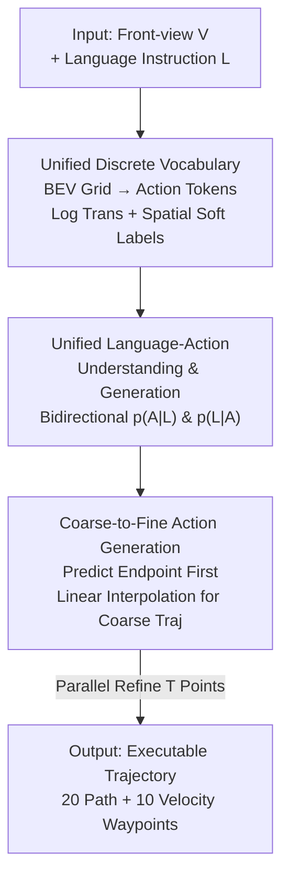

# Unifying Language-Action Understanding and Generation for Autonomous Driving

**Conference**: CVPR 2026  
**Paper**: [CVF Open Access](https://openaccess.thecvf.com/content/CVPR2026/html/Wang_Unifying_Language-Action_Understanding_and_Generation_for_Autonomous_Driving_CVPR_2026_paper.html)  
**Code**: https://github.com/x1nyangwang/Link-VLA (Available)  
**Area**: Autonomous Driving / Multimodal VLM  
**Keywords**: VLA, Language-Action Alignment, Unified Discrete Vocabulary, Coarse-to-Fine Generation, Closed-loop Driving

## TL;DR
LinkVLA integrates language instructions and driving trajectories into a unified discrete vocabulary and enforces language-action alignment through an "action understanding" task (inferring instructions from trajectories). It replaces point-by-point autoregression with a two-step coarse-to-fine decoding, achieving a driving score of 91.01 on the CARLA closed-loop benchmark while reducing inference latency from 361ms to 48ms (saving 86%).

## Background & Motivation

**Background**: A recent trend in end-to-end autonomous driving is expanding Vision-Language Models (VLM) into Vision-Language-Action models (VLA). This allows vehicles to move beyond "reactive" mapping from sensors to controls, instead leveraging the world knowledge of VLMs for explicit reasoning and following natural language instructions (e.g., "Bypass the construction area and merge after a gap in traffic"). Instruction following is a core capability for deploying VLAs, as it supports dynamic task reassignment and enables transparent human supervision of vehicle behavior.

**Limitations of Prior Work**: Current VLAs suffer from two critical issues. First, a **persistent misalignment between language understanding and physical action**: models may correctly output a "change left" decision in text but generate a "keep lane" trajectory, compromising safety and reliability. Second, **slow autoregressive action generation**: generating a trajectory with $T$ waypoints requires $T$ sequential forward passes. Some variants of models like ORION exhibit latencies as high as 361ms, making real-vehicle deployment impossible.

**Key Challenge**: Previous attempts to fix alignment addressed symptoms rather than causes—relying on counterfactual data labeling to bypass modeling issues, using RL fine-tuning as a post-hoc patch, or using implicit distribution matching in latent space which lacks direct, verifiable supervision. This paper argues that the semantic gap between language and action stems from an **architectural separation of the two modalities** (continuous trajectory regression vs. discrete text generation). A "verifiable, bidirectional, and explicit" connection must be woven into the primary supervised learning phase.

**Goal**: To (1) eliminate the modal gap architecturally, placing language and action in the same representation space, and (2) solve the latency bottleneck of autoregressive generation without sacrificing alignment.

**Core Idea**: A triple combination of a "Unified Discrete Vocabulary + Action Understanding Target + Coarse-to-Fine Decoding" is proposed to make alignment an endogenous property of the model while compressing sequential decoding into two parallel steps.

## Method

### Overall Architecture
LinkVLA is a VLA model that takes a front-view image $V$, a language instruction $L$, and (during training) a trajectory $A$ as input to output an executable trajectory. Its backbone is InternVL2-1B (InternViT-300M vision encoder + Qwen2-0.5B language model). The method revolves around three layers: discretizing actions into tokens to form a **unified discrete space** with the text vocabulary (eliminating architectural cracks); adding an **action understanding goal** to force the model to infer instructions from trajectories (strengthening semantic binding); and using **coarse-to-fine two-step decoding** to replace point-by-point autoregression (solving latency). The first two handle "alignment," while the latter handles "efficiency," all sharing parameters within a single transformer decoder by switching prediction targets.

### Key Designs

**1. Unified Discrete Vocabulary: Quantizing continuous trajectories into tokens and merging them into the text vocabulary space**

The root of misalignment is the separate processing of modalities. LinkVLA unifies them by partitioning the local BEV space ($x \in [0,50]\text{m}$, $y \in [-30,30]\text{m}$) into a grid, where each cell is a unique "action token." A trajectory $T=\{w_1, \dots, w_T\}$ is mapped to an action token sequence $A=\{a_1, \dots, a_T\}$. This action vocabulary $C_{action}$ is concatenated with the text vocabulary (size $K_{text}$) to form the unified vocabulary $C$ with size $K=K_{text}+K_{action}$, learned end-to-end by the VLM. 

To refine this, **Logarithmic Coordinate Transformation** is used to increase precision near the vehicle:
$$z' = \text{sign}(z)\cdot\log(1+k\cdot|z|)$$
where $k=5$. This creates a dense region near the origin and compresses distant areas before uniform quantization ($56\times101$ grid, $K_{action}=5656$ action tokens). **Spatial Soft Labels** incorporate spatial topology priors into the supervision signal. Instead of one-hot labels, a normalized 2D Gaussian distribution centered on the ground-truth token $a_{gt}$ is used:
$$q(a) = \frac{1}{Z}\exp\left(-\frac{\|\text{pos}(a)-\text{pos}(a_{gt})\|_2^2}{2\sigma^2}\right)$$
The generation loss uses cross-entropy: $L_{generation} = -\sum_{a\in C_{action}} q(a)\log p(a)$ (radius $R=10$, $\sigma=1.2$). This allows the model to learn a locally smooth action manifold.

**2. Unified Language-Action Understanding and Generation: A reverse "action-to-instruction" task for bidirectional consistency**

To ensure language and action are tightly coupled, the authors introduce a dual task. While the standard task is action generation $p(A|L)$ (instruction $\to$ trajectory), the **Action Understanding** task $p(L|A)$ requires the model to infer the original language instruction given an executed trajectory. Formally, in addition to $L_{generation}$, it introduces:
$$L_{understanding} = -\sum_j \log p(l_j \mid V, A, l_{<j})$$
Total loss: $L_{total} = L_{generation} + \lambda L_{understanding}$. This forces the shared embedding space to be bidirectionally consistent, significantly grounding semantics.

**3. Coarse-to-Fine Action Generation: Collapsing T-step sequential decoding into two steps**

To eliminate the autoregressive bottleneck, LinkVLA uses two stages: **(a) Endpoint Prediction + Coarse Trajectory Initialization** and **(b) Parallel Trajectory Refinement**. During training, the model is taught to bind a special token at the start of the sequence to the prediction of the final waypoint $w_T$. In the refinement stage, linear interpolation from the start to the ground-truth endpoint serves as a structural prior. During inference, the model predicts the endpoint first, performs linear interpolation, and then **parallely** predicts $T$ refinement points $w_i^{fine}$ using cross-attention to visual-language context. This reduces latency from 361ms to 48ms (saving 86%).

### Loss & Training
Total Objective: $L_{total} = L_{generation} + \lambda L_{understanding}$. When using Chain-of-Thought (CoT), standard language generation cross-entropy is added. The backbone is InternVL2-1B, trained with AdamW + cosine scheduler, base lr 1e-4, weight decay 0.1, 30 epochs on 32 H20 GPUs with LoRA (rank 32, $\alpha=64$). Inference uses CoT: generating a textual rationale before predicting the trajectory (20 path tokens + 10 velocity tokens per frame).

## Key Experimental Results

### Main Results
On Bench2Drive (CARLA v2 closed-loop, 220 official routes), LinkVLA achieved SOTA in Driving Score and Success Rate.

| Dataset/Metric | Ours (LinkVLA) | SimLingo (Prev. SOTA) | Gain |
| :--- | :--- | :--- | :--- |
| Driving Score (DS) ↑ | 91.01 | 85.07 | +5.94 (+6.98%) |
| Success Rate (%) ↑ | 74.55 | 67.27 | +7.28 (+10.82%) |
| Efficiency ↑ | 255.84 | — | Exceeds Orion 151.48 |
| Multi-Ability Mean ↑ | 73.40 | 67.28 | +6.12 (+9.09%) |

Latency-Performance Trade-off (H20 Average Per-step Inference Time):

| Method | Type | Latency ↓ | Driving Score ↑ |
| :--- | :--- | :--- | :--- |
| SimLingo | MLP | 34 ms | 85.07 |
| Orion | VAE | 65 ms | 77.74 |
| Ours (AR variant) | AR | 361 ms | 90.66 |
| **Ours (C2F)** | C2F | **48 ms** | **91.01** |

### Ablation Study
(Token = Unified Action Vocab, C2F = Coarse-to-Fine, Align = Understanding Target):

| Config | Closed-loop DS | Closed-loop SR (%) | Instruction Following Mean (%) |
| :--- | :--- | :--- | :--- |
| baseline | 85.07 | 67.27 | 70.11 |
| + Token | 89.57 | 73.18 | 81.63 |
| + Token + C2F | 89.85 | 72.27 | 81.87 |
| + Token + C2F + Align (Full) | **91.01** | **74.55** | **87.16** |

### Key Findings
- **Unified Discrete Vocabulary (Token) contributes most**: Adding it increases DS from 85.07 to 89.57 and instruction following from 70.11 to 81.63, proving that modal gaps are the root of misalignment.
- **Action Understanding (Align) is the "final push"**: It increases the instruction following mean from 81.87 to 87.16, specifically improving lane changes (97.42%) and target velocity (74.73%).
- **C2F optimizes efficiency, not performance**: DS only slightly increases (89.57 to 89.85), but latency drops from 361ms to 48ms.
- **Language capability benefits**: Scores on DriveLM-VQA (SPICE 66.7 to 73.0) improved, showing the unified vocabulary benefits the language side as well.

## Highlights & Insights
- **Alignment as an inherent modeling property**: Instead of post-hoc patches, LinkVLA weaves a verifiable language-action link into the architecture through a unified vocabulary and bidirectional objectives.
- **Zero-cost alignment gain**: The action understanding target reuses the decoder without extra annotation, providing a "free" boost to instruction following.
- **Solving the VLA dilemma**: By combining unified discrete spaces with coarse-to-fine decoding, the model achieves the alignment of autoregressive models with the speed of parallel models.

## Limitations & Future Work
- **CoT Latency Excluded**: The 48ms figure excludes the time for Chain-of-Thought reasoning, which varies by query.
- **Sim-only evaluation**: Validated only on CARLA closed-loop benchmarks; the sim-to-real gap remains unexplored.
- **Hyperparameter Sensitivity**: Parameters for discrete vocabulary and soft labels ($k, R, \sigma$) may require significant tuning for new data domains.

## Related Work & Insights
- **vs. SimLingo**: Inherits the data pipeline but eliminates the modal gap using the unified vocabulary, improving DS by 5.94.
- **vs. ORION**: Orion's VAE decoder is slow (361ms in some variants); LinkVLA's C2F reduces this to 48ms while achieving higher DS (+13.27).
- **vs. CAST / OmniDrive**: These rely on counterfactual data; LinkVLA achieves alignment endogenously through its understanding objective.

## Rating
- Novelty: ⭐⭐⭐⭐
- Experimental Thoroughness: ⭐⭐⭐⭐
- Writing Quality: ⭐⭐⭐⭐
- Value: ⭐⭐⭐⭐

<!-- RELATED:START -->

## Related Papers

- [\[CVPR 2026\] E3AD: An Emotion-Aware Vision-Language-Action Model for Human-Centric End-to-End Autonomous Driving](e3ad_an_emotion-aware_vision-language-action_model_for_human-centric_end-to-end_.md)
- [\[CVPR 2026\] DriveMoE: Mixture-of-Experts for Vision-Language-Action Model in End-to-End Autonomous Driving](drivemoe_mixture-of-experts_for_vision-language-action_model_in_end-to-end_auton.md)
- [\[CVPR 2026\] HybridDriveVLA: Vision-Language-Action Model with Visual CoT reasoning and ToT Evaluation for Autonomous Driving](hybriddrivevla_vision-language-action_model_with_visual_cot_reasoning.md)
- [\[CVPR 2026\] Counterfactual VLA: Self-Reflective Vision-Language-Action Model with Adaptive Reasoning](counterfactual_vla_self-reflective_vision-language-action_model_with_adaptive_re.md)
- [\[CVPR 2026\] DrivePI: Spatial-aware 4D MLLM for Unified Autonomous Driving Understanding, Perception, Prediction and Planning](drivepi_spatial-aware_4d_mllm_for_unified_autonomous_driving_understanding_perce.md)

<!-- RELATED:END -->
