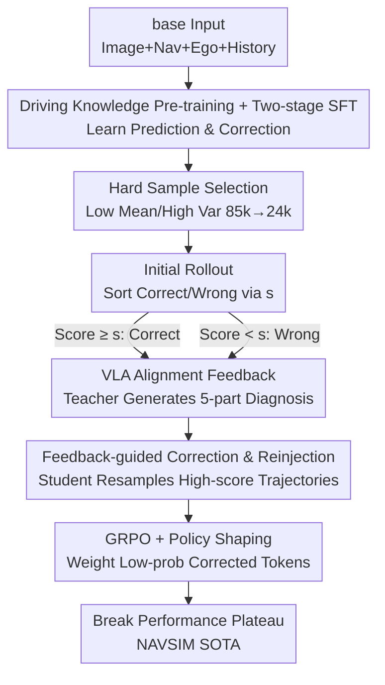

# Unleashing VLA Potentials in Autonomous Driving via Explicit Learning from Failures

**Conference**: CVPR 2026  
**Paper**: [CVF Open Access](https://openaccess.thecvf.com/content/CVPR2026/html/Luo_Unleashing_VLA_Potentials_in_Autonomous_Driving_via_Explicit_Learning_from_CVPR_2026_paper.html)  
**Area**: Autonomous Driving / Vision-Language-Action (VLA) / Reinforcement Learning  
**Keywords**: VLA, Autonomous Driving, GRPO, Failure Feedback, Long-tail Scenarios

## TL;DR
ELF-VLA enables autonomous driving VLA models to overcome performance plateaus during Reinforcement Learning (RL). When sparse rewards in long-tail scenarios fail to provide guidance (where all rollouts receive zero scores), a teacher VLM generates a three-layer structured failure diagnosis ("planning/reasoning/execution"). This guides the student to resample high-score corrected trajectories, which are reinjected into the GRPO training batch. This approach breaks the performance bottleneck, achieving a new SOTA PDMS of 91.0 on NAVSIM.

## Background & Motivation
**Background**: Autonomous driving is shifting from modular pipelines to end-to-end systems. VLA models directly map camera inputs to vehicle motion commands and output intermediate reasoning trajectories (CoT) via a "think" module for interpretability. The mainstream training paradigm involves a two-stage process: Supervised Fine-Tuning (SFT) on driving data, followed by RL (predominantly GRPO) using driving scores (PDMS) as rewards.

**Limitations of Prior Work**: RL phases commonly hit a **performance plateau**. Common scenarios dominate SFT data, while safety-critical long-tail scenarios (e.g., complex unprotected left turns, emergency evasions) are extremely rare. This severely constrains the model's exploration capability after SFT. During RL, these critical scenarios often result in zero driving scores regardless of the number of rollouts, halting the learning process.

**Key Challenge**: Current VLA-RL compresses training evaluation into a **single scalar reward** (e.g., PDMS). When the model fails, this information-sparse reward indicates "incorrectness" but fails to specify the cause—whether it is a cumulative error in the "think" module's high-level planning, cognitive reasoning failures regarding key objects, or dynamical flaws in the low-level trajectory itself. Without clear failure causes, gradients cannot provide corrective signals.

**Goal**: In long-tail "persistent failure" scenarios with zero rewards, the goal is to both **diagnose failure modes** and **correct policies** accordingly, allowing the RL process to regain effective gradients.

**Key Insight**: Drawing from LLM successes in using non-numerical feedback (textual criticism) for fine-grained guidance and hybrid policies to internalize high-quality data. The authors apply this to autonomous driving: when a VLA model fails persistently, an external teacher model analyzes and corrects its erroneous driving behavior.

**Core Idea**: Replace "single scalar rewards" with "structured failure diagnosis + feedback-guided trajectory correction + high-score sample reinjection" to create target-oriented gradient signals that solve critical scenarios where unguided exploration fails.

## Method

### Overall Architecture
ELF-VLA utilizes a **three-stage training** framework based on InternVL3-8B. A key design is that the same VLA model serves as **both generator and refiner**, capable of processing two types of inputs: "base" inputs (front-view images + navigation commands + ego-state + historical trajectories) and "feedback" inputs (base inputs concatenated with error correction guidance).

The pipeline consists of: ① **Driving Knowledge Pre-training**—pre-training on large-scale open-source driving QA data to instill basic driving cognition such as drivable area estimation and ego-action prediction; ② **Two-stage SFT**—fine-tuning on a mixed dataset of base and feedback inputs to enable both "trajectory prediction" and "feedback-based trajectory refinement"; ③ **RL with Failure Feedback**—during the GRPO rollout phase, a teacher model (Qwen3-VL-32B) generates structured feedback for failed samples, guiding the student to resample high-score trajectories for batch reinjection to reduce the proportion of zero-reward rollouts.

### Key Designs

**1. VLA-Aligned Structured Failure Feedback: Replacing Scalar Zeros with Diagnostic Reports**

To address the "single scalar reward" bottleneck, ELF-VLA introduces a VLM teacher model triggered by persistent VLA failures. Correctness is determined by a threshold $s$: the model produces an original response $o$ (trajectory + CoT) for base input $q_{base}$; PDMS $> s$ is marked as correct $o_c$, and PDMS $< s$ as wrong $o_w$. For wrong responses, the teacher consumes $q_{base}$, $o_w$, and the ground truth $o_{gt}$ to generate a **five-part structured diagnosis**: (1) Meta Action analysis, (2) Think reasoning process analysis, (3) Safety failure analysis, (4) Efficiency failure analysis, and (5) Executable lateral/longitudinal correction suggestions. This report aligns with the VLA's own capability layers—planning, reasoning, and execution—providing precise diagnostic signals. For correct responses, rule-based positive feedback $f^{rule}$ is used. The feedback input is constructed as:

$$q_{fb} = \begin{cases} \langle q_{base}, o_c, f^{rule} \rangle & \text{if } o_c \\ \langle q_{base}, o_w, f^{teacher} \rangle & \text{if } o_w \end{cases}$$

**2. Two-stage SFT for "Cognition" and "Correction": Enabling Feedback Interpretation**

To utilize feedback during RL, the model must first learn to correct trajectories based on diagnostics. The second-stage SFT trains on a **mixed dataset** of $q_{base}$ and $q_{fb}$, supervised by ground truth $o_{gt}$ to maximize conditional likelihood:

$$L_{SFT} = \mathbb{E}_{(q,o)\sim D}\left[-\log \pi_\theta(o \mid q)\right]$$

This mixed training grants the model dual capabilities in trajectory prediction and feedback-based refinement.

**3. Efficient Hard Sample Selection: Focusing Compute on Learning Signals**

Standard RL wastes compute on simple scenarios the model has already mastered. The authors use the SFT model to sample $N$ rollouts per query to estimate reward mean and variance. Samples with **high mean and low variance** (consistent success) are discarded, concentrating training on hard samples (low mean and low variance) and ambiguous samples (high variance). This distills the initial 85k items into a 24k high-value core set.

**4. Feedback-guided Correction Reinjection + Policy Shaping: Stabilizing High-Advantage Trajectories**

During GPRO rollouts, a batch $\{o_i\}_{i=1}^n$ is sampled. For failures, feedback inputs guide the VLA to generate a new set $\{o_i^{fb}\}$. From these, $k$ "superior" responses where the reward exceeds the original batch maximum $\max(r_{traj})$ are selected and reinjected. Policy optimization then uses the unified reward distribution $r_{union} = \{r_j\}_{j=1}^n \cup \{r_{j'}^{fb}\}_{j'=1}^k$.

To handle the conditioning mismatch where $o^{fb}$ is generated under $q_{fb}$ but optimized under $q_{base}$, **Policy Shaping** $f(x) = \frac{x}{x+\gamma}$ ($0 < \gamma < 1$) is used. This assigns higher weights to low-probability tokens in $o^{fb}$, forcing the model to learn rare but correct trajectories. The final objective is:

$$J(\theta) = \mathbb{E}\left[\frac{1}{n}\sum_{i=1}^n J_i + \frac{1}{k}\sum_{j=1}^k J_j^{fb} - \beta D_{KL}\right]$$

where $J_j^{fb} = f(c_j^{fb}(\theta))A_j^{fb}$ and $f(c_j^{fb}(\theta)) = \frac{\pi_\theta(o_j^{fb}|q_{base})}{\pi_\theta(o_j^{fb}|q_{base}) + \gamma}$.

### Loss & Training
Three phases: ① Driving knowledge QA pre-training; ② Mixed-dataset SFT; ③ GRPO with failure feedback. Base: InternVL3-8B, Teacher: Qwen3-VL-32B, 64x H20 GPUs. Key RL hyperparams: 8 rollouts per batch, $s=0.8$, $\gamma=0.1$, $k=1$.

## Key Experimental Results

### Main Results
Evaluated on NAVSIM (OpenScene-based planning dataset) using PDMS (v1) and EPDMS (v2).

| Dataset | Metric | Ours (ELF-VLA-8B) | Prev. SOTA (vision-only) | Gain |
|--------|------|------|----------|------|
| NAVSIMv1 | PDMS | 91.0 | 89.1 (AutoVLA-3B) | +1.9 |
| NAVSIMv1 | PDMS vs SFT Baseline | 91.0 | 87.4 (InternVL3-8B-SFT) | +3.6 |
| NAVSIMv1 | PDMS vs Trad. RL | 91.0 | 89.0 (InternVL3-8B-RL) | +2.0 |
| NAVSIMv2 | EPDMS | 87.1 | 87.1 (DriveSuprim) | +0.0 (tied) |
| High-level Planning | Accuracy | 80.3 | 79.3 (GRPO) | +1.0 |

### Ablation Study
| Configuration | PDMS↑ | Description |
|------|---------|------|
| SFT | 87.4 | Baseline supervised fine-tuning |
| GRPO | 89.0 | Standard GRPO |
| GT-GRPO | 89.2 | Augmented with ground truth trajectories |
| Rule-GRPO | 89.6 | Feedback based on predefined rules |
| ELF-VLA | **91.0** | Teacher structured feedback (Full Model) |

| Configuration | PDMS↑ | Description |
|------|---------|------|
| 85k Full | 89.1 | Gradient dilution from easy samples |
| 24k† Random | 88.9 | No information gain |
| 24k* Selected | **91.0** | Hard sample selection concentrates signal |
| $k=1$, PS✗ | 89.3 | Without Policy Shaping |
| $k=1$, PS✓ | **91.0** | Single precise correction + PS (Optimal) |

### Key Findings
- **Structured feedback is the primary driver**: ELF-VLA outperforms standard GRPO by 2.0 PDMS. Rule-GRPO falls short as its feedback is too coarse for effective correction.
- **Significant reduction in persistent failures**: ELF-VLA reduces the ratio of "all rollout failures" from 2.73% (GRPO) to 1.08%.
- **$k=1$ is optimal**: A single precise correction is more effective; increasing $k$ tends to bias the policy away from the optimal distribution.
- **Policy Shaping is essential**: Removing it results in a 1.7 PDMS drop, proving it is vital for preventing training collapse.

## Highlights & Insights
- **Upgrading Rewards from Scalars to Explanatory Diagnostics**: Scalar rewards are uninformative in long-tail cases. Structured feedback aligned with model capabilities creates target-oriented gradients.
- **Dual-mode VLA**: Training the same model to be both the generator and refiner avoids extra correction networks.
- **Mean-Variance Selection**: Discarding "high mean, low variance" samples distills the dataset into effective signals, boosting PDMS significantly.
- **Solving Conditioning Mismatch**: Policy Shaping handles the discrepancy between feedback generation and base optimization.

## Limitations & Future Work
- **Teacher Dependency**: Performance relies on the Qwen3-VL-32B teacher's diagnostic quality.
- **High Computational Cost**: 64x H20 GPUs and triple-stage training represent a high barrier to reproduction.
- **Single Benchmark Evaluation**: Testing is limited to NAVSIM; performance in real-road tests or under multi-view inputs remains unknown.
- **Hyperparameter Sensitivity**: The optimal $k=1$ suggests the feedback injection is highly sensitive.

## Related Work & Insights
- **vs. Standard GRPO**: ELF-VLA handles zero-reward scenarios where standard RL provides no gradient.
- **vs. GT-GRPO**: ELF-VLA uses **in-distribution** high-score trajectories from the model itself rather than out-of-distribution ground truth, making it easier to optimize.
- **vs. Senna/EMMA**: These works focus on SFT-based CoT; ELF-VLA provides an orthogonal improvement for the RL pipeline.

## Rating
- Novelty: ⭐⭐⭐⭐ (Structured failure diagnosis reinjected into RL for VLA).
- Experimental Thoroughness: ⭐⭐⭐⭐ (Dual SOTA, but limited to a single simulator).
- Writing Quality: ⭐⭐⭐⭐ (Clear motivation and well-organized technical sections).
- Value: ⭐⭐⭐⭐ (Addresses the RL plateau problem in VLA/Embodied tasks).

<!-- RELATED:START -->

## Related Papers

- [\[CVPR 2026\] Learning Vision-Language-Action World Models for Autonomous Driving](vla_world_learning_vision_language_action_world_models_for_autonomous_driving.md)
- [\[CVPR 2026\] ActiveAD: Planning-Oriented Active Learning for End-to-End Autonomous Driving](activead_planning-oriented_active_learning_for_end-to-end_autonomous_driving.md)
- [\[CVPR 2026\] DynamicVGGT: Learning Dynamic Point Maps for 4D Scene Reconstruction in Autonomous Driving](dynamicvggt_learning_dynamic_point_maps_for_4d_scene_reconstruction_in_autonomou.md)
- [\[CVPR 2026\] Unifying Language-Action Understanding and Generation for Autonomous Driving](unifying_language-action_understanding_and_generation_for_autonomous_driving.md)
- [\[CVPR 2026\] RaGS: Unleashing 3D Gaussian Splatting from 4D Radar and Monocular Cue for 3D Object Detection](rags_unleashing_3d_gaussian_splatting_from_4d_radar_and_monocular_cue_for_3d_obj.md)

<!-- RELATED:END -->
