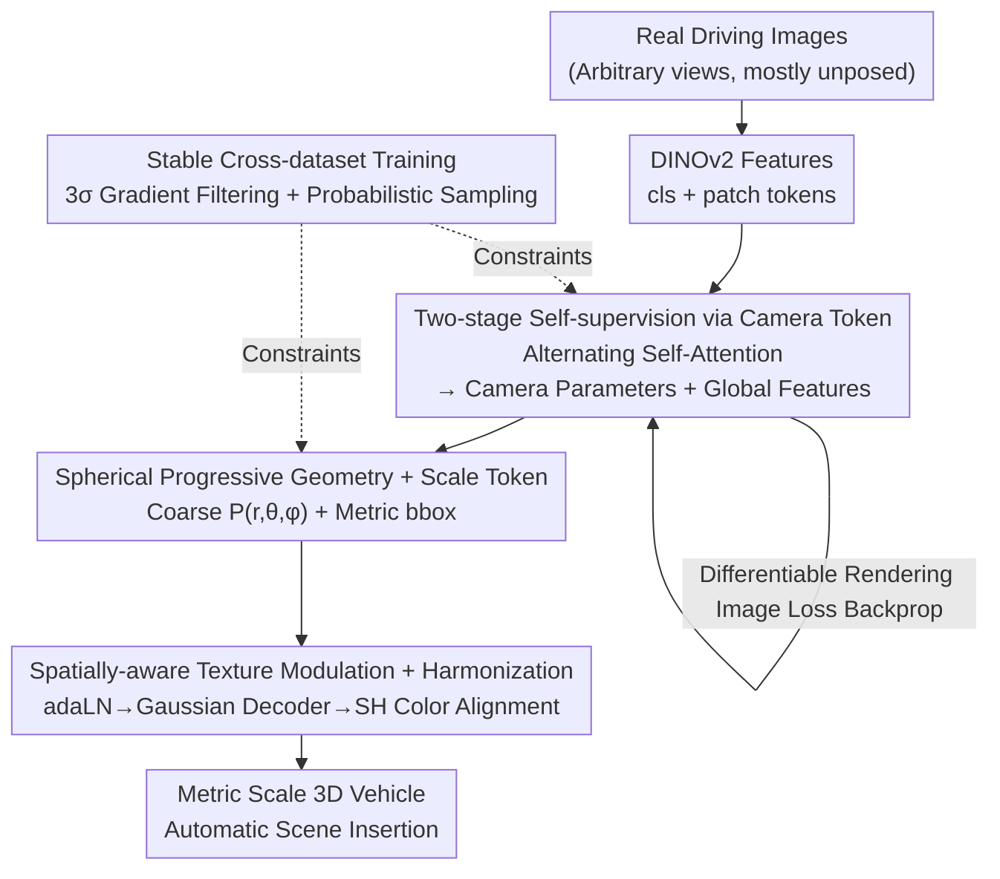

# Unposed-to-3D: Learning Simulation-Ready Vehicles from Real-World Images

**Conference**: CVPR 2026  
**arXiv**: [2604.19257](https://arxiv.org/abs/2604.19257)  
**Code**: None  
**Area**: Autonomous Driving / 3D Reconstruction  
**Keywords**: Self-supervised 3D Reconstruction, Pose-free, 3D Gaussian Splatting, Simulation Assets, Camera Pose Prediction

## TL;DR
Unposed-to-3D reconstructs "simulation-ready" 3D vehicles from real-world driving images using pure image supervision (without any 3D ground truth or camera pose annotations). By utilizing a camera prediction head to estimate poses and backpropagating image reconstruction losses through differentiable rendering to the geometry—combined with scale prediction and lighting harmonization modules—the reconstructed vehicles can be directly inserted into driving scenes with correct orientation, physical scale, and consistent lighting. This improves downstream 3D detection AP by approximately 1 point.

## Background & Motivation

**Background**: Closed-loop driving simulation requires populating scenes with foreground vehicles. Current approaches follow two main paths: either reconstructing vehicles directly within a scene using NeRF/3DGS (e.g., ProtoCar, DreamCar) or generating 3D objects from single images using large object-level reconstruction/generative models (LRM, TRELLIS, LGM, etc.).

**Limitations of Prior Work**: Both paths face significant challenges. ① Reconstruction methods rely on posed images and 3D supervision; rendering artifacts or geometric collapses occur when viewpoints deviate from the training range. ② Generative models are mostly trained on synthetic datasets (ShapeNet/Objaverse), leading to a significant domain gap and a "synthetic look." More critically, their outputs have **arbitrary poses and undetermined scales**, requiring manual alignment and rescaling before insertion. ③ Visual inconsistencies in lighting, shadows, and weather occur when inserting pre-generated assets into target scenes.

**Key Challenge**: High-quality real 3D assets are scarce and expensive, while real 2D driving images are abundant. Can we **bypass 3D supervision** and learn 3D vehicles solely from massive real images? The obstacle lies in the lack of camera poses for differentiable rendering supervision, alongside an inherent ambiguity between geometry and camera parameters—a distant camera with a narrow FOV and distorted geometry may produce a "correct-looking" image, leading to geometric collapse during joint optimization.

**Goal**: (1) Reconstruct vehicles from real image sequences without 3D supervision or pose annotations; (2) Produce assets with fixed metric scales and poses for direct simulation use; (3) Automatically adapt assets to target scene lighting.

**Key Insight**: Driving data is naturally sequential, providing multi-frame temporal observations of the same vehicle. A network is first pre-trained on a small set of posed images to "guess" camera parameters, then scaled to massive unposed images where **predicted poses** drive differentiable rendering, using image reconstruction loss to self-supervise geometry.

**Core Idea**: Replace manual pose annotations and 3D ground truth with a "learnable camera token + differentiable rendering self-supervision." This converts 2D real images into 3D supervision signals while predicting metric scale and coordinating lighting for simulation-ready assets.

## Method

### Overall Architecture
The method addresses the problem of learning 3D vehicles for driving simulation using only real images (mostly without camera poses). It features a feed-forward reconstruction pipeline plus a two-stage training paradigm: input images from arbitrary views are processed by a frozen DINOv2 to extract features (cls and patch tokens), with a shared learnable **camera token** prepended. Next, Alternating Self-Attention (intra-frame for local texture, inter-frame for global geometry) decodes the camera token into parameters (quaternion/translation/FOV) and pools multi-frame features into global $\mathbf{z}^{\text{cls}}$ (coarse geometry) and $\mathbf{z}^{\text{patch}}$ (fine texture). The Geometry Block then uses learnable structure tokens and a scale token to solve for coarse positions and metric bounding boxes. Finally, a Gaussian Decoder, modulated by texture features via adaLN, generates 3D Gaussian attributes for each token. A harmonization module fine-tunes the Spherical Harmonic (SH) colors for seamless scene insertion.

Training occurs in two stages: **Stage 1** involves pre-training on a small posed dataset (3DRealCar, ~1000 samples) with direct camera and scale supervision. **Stage 2** switches to the MAD-Cars dataset (70k instances, 5M unannotated images), **removing camera and scale supervision** and relying solely on image-level reconstruction loss. Gradients from image loss are backpropagated to camera parameters (Eq. 5) via differentiable rendering. To handle geometric-camera ambiguity and cross-domain instability, 3σ gradient filtering and probabilistic multi-view sampling are introduced.

### Key Designs

**1. Camera token driven two-stage self-supervision: Turning "missing pose" into a supervision signal**
A shared learnable camera token $\mathbf{x}^{\text{cam}}\in\mathbb{R}^d$ (Eq. 1) is prepended to the DINOv2 sequence. After Alternating Self-Attention, it decodes camera parameters $\theta_i=\{\mathbf{q}_i,\mathbf{t}_i,\mathbf{f}_i\}$. In Stage 1, camera supervision uses $\mathcal{L}_{\text{rot}}=\min(|\mathbf{q}_i-\hat{\mathbf{q}}_i|_1,|\mathbf{q}_i+\hat{\mathbf{q}}_i|_1)$ to handle quaternion ambiguity. In Stage 2, supervision relies on 3DGS differentiable rendering gradients (Eq. 5):
$$\frac{\partial\mathcal{L}}{\partial\theta}=\sum_i\Big(\frac{\partial\mathcal{L}}{\partial\mu_i}^{\top}\frac{\partial\mu_i}{\partial\theta}+\big\langle\frac{\partial\mathcal{L}}{\partial\Sigma_i},\frac{\partial\Sigma_i}{\partial\theta}\big\rangle\Big)$$
Extrinsic parameters $(\mathbf{q},\mathbf{t})$ are driven by projection center errors, while intrinsic $\mathbf{f}$ is affected by both mean and covariance. This "predict $\to$ render $\to$ compare $\to$ joint correction" loop enables self-supervised geometry learning on 70k instances.

**2. Spherical progressive geometry optimization + scale token: Learning stable geometry with metric size**
To avoid convergence issues when regressing Cartesian $(x,y,z)$ without 3D supervision, the method uses $N$ learnable structure tokens $\mathbf{E}=\{\mathbf{e}^1,\dots,\mathbf{e}^N\}$. **Spherical progressive optimization** replaces $(x,y,z)$ with $(r,\theta,\phi)$. Since objects are centered at the origin, the radial distance $r$ is optimized first, followed by azimuth $\theta$ and elevation $\phi$. This reduces the search space during early training. Simultaneously, a scale token decodes a 3-axis bounding box $b\in\mathbb{R}^3$ for physical sizing.

**3. Spatially-aware texture modulation + harmonization: Geometry-texture alignment + lighting adaptation**
Predicted positions $P_i$ modulate geometric features $\mathbf{G}_i$ via adaLN: $\gamma_i,\beta_i=f_{\mathbf{mod}}(P_i)$, yielding texture features $\mathbf{T}_i=(1+\gamma_i)\cdot\text{LN}(\mathbf{G}_i)+\beta_i$ (Eq. 6). This ensures texture features "know" their spatial location. For lighting, a **one-step 2D diffusion model** acts as a harmonization supervisor. Only the SH colors $c$ are fine-tuned using a self-attention modulation block $\{\Delta c_j\}=\text{Harm}(\mathbf{T}_i)$ while freezing geometry, allowing assets to adapt to overcast or sunny scenes.

**4. Stable cross-dataset training: 3σ gradient filtering + probabilistic multi-view sampling**
To mitigate geometric-camera ambiguity and domain gaps, **gradient filtering** is used. By treating a batch as a sliding window, gradients $L_i$ that deviate beyond $3\sigma$ are discarded: $M_i=\mathbf{1}[\bar{L}-3\sigma_L<L_i<\bar{L}+3\sigma_L]$. This ensures supervision only occurs when the predicted pose is reasonably aligned. **Probabilistic multi-view sampling** uses an exponential decay $\pi_v=\exp(-\lambda(v-1))$ to prioritize single-view reconstruction while gradually incorporating multi-view information.

### Loss & Training
**Stage 1** (Posed 3DRealCar):
$$\mathcal{L}_1=\mathcal{L}_{\text{L1}}+\mathcal{L}_{\text{SSIM}}+\mathcal{L}_{\text{LPIPS}}+\mathcal{L}_{\text{scale}}+\mathcal{L}_{\text{cam}}+\mathcal{L}_{\text{reg}}$$
**Stage 2** (Unposed MAD-Cars):
$$\mathcal{L}_2=\mathcal{L}_{\text{L1}}+\mathcal{L}_{\text{SSIM}}+\mathcal{L}_{\text{LPIPS}}+\mathcal{L}_{\text{reg}}$$
The regularization term $\mathcal{L}_{\text{reg}}=\frac{1}{N}\sum_i(\alpha_i-1)^2+\frac{1}{N}\sum_i\max_j s_{i,j}$ (Eq. 10) prevents degenerate or oversized Gaussians.

## Key Experimental Results

### Main Results: Single-view Reconstruction (Table 1)
Baselines were manually aligned to standard poses/scales, whereas Ours requires no manual adjustment.

| Method | Dataset | SSIM↑ | PSNR↑ | LPIPS↓ | CD↓ | F-score↑ |
|------|--------|-------|-------|--------|-----|----------|
| DGS | 3DRealCar | 0.8635 | 19.62 | 0.1442 | 1.3511 | 0.3022 |
| TRELLIS | 3DRealCar | 0.8879 | 19.51 | 0.0884 | 1.3111 | 0.4744 |
| **Ours** | 3DRealCar | **0.9172** | **21.20** | **0.0571** | **0.5782** | **0.5341** |
| **Ours** | CFV (Zero-shot) | **0.9183** | **21.73** | **0.0508** | **0.7439** | **0.4252** |

Ours leads in all 2D and 3D metrics. CD is reduced by over half compared to the best baseline (TRELLIS), and zero-shot generalization on CFV remains superior.

### Metric Scale and Camera Prediction (Table 3/4)

| Evaluation | Dataset | Metric |
|------|--------|------|
| Rendering w/ predicted cam (Tab 3) | 3DRealCar | SSIM 0.9263 / PSNR 21.76 / LPIPS 0.0500 |
| Metric Scale Accuracy (Tab 4) | 3DRealCar | CD 0.0160 m / F-score@0.05m 0.4886 |

Rendering with predicted cameras achieves quality comparable to using ground truth cams. The metric scale error is only 1.6 cm.

### Downstream Sim2Real: 3D Detection (Table 5, Waymo)

| Setting | L1/AP↑ | L1/APH↑ | L2/AP↑ | L2/APH↑ |
|------|--------|---------|--------|---------|
| Real | 0.8837 | 0.8594 | 0.8026 | 0.7793 |
| Real + Sim (Ours assets) | **0.8946** | **0.8738** | **0.8198** | **0.7996** |

Integrating generated assets into 100 Waymo scenes consistently improves AP/APH by 1.0~1.7 points, validating the assets' utility.

### Key Findings
- **Diminishing returns**: Increasing views from 1 to 4 improves PSNR significantly (~0.35), but gains from 4 to 10 views are minimal (~0.07).
- **Probabilistic sampling**: Allows a single model to handle varying input view counts effectively.
- **Unique Capabilities**: Camera and metric scale prediction are unique to this method; baselines require manual alignment for evaluation.

## Highlights & Insights
- **Leveraging "Missing Poses"**: The shared camera token and 3DGS backpropagation turn a missing annotation into a self-supervision lever, a paradigm applicable to any object-level reconstruction task lacking poses.
- **Solving Ambiguity**: Spherical progressive optimization and 3σ gradient filtering offer lightweight, architectural-agnostic fixes for the inherent ill-posedness of unposed geometry learning.
- **Defining "Simulation-Ready"**: By addressing metric scale, fixed pose, and lighting harmonization simultaneously, the work provides a complete pipeline for automated asset generation.

## Limitations & Future Work
- **Category range**: Assets are limited to vehicles; generalization to pedestrians or diverse roadside objects is unverified.
- **Cold start**: Stage 1 still requires a small posed dataset like 3DRealCar.
- **Harmonization dependency**: Quality depends on the external one-step diffusion model; a quantitative ablation of this module is missing.
- **Ablation detail**: While the overall chain is verified, individual contributions of components like adaLN or 3σ filtering lack separate quantitative ablation tables.

## Related Work & Insights
- **vs TRELLIS/LGM**: These models offer strong generalization but suffer from a "synthetic look" and arbitrary scaling. Ours uses real images for authentic geometry and fixed metric scales.
- **vs DUSt3R/VGGT**: While also pose-free, this work highlights that direct pose-free generation often collapses; hence the "posed pre-training $\to$ unposed fine-tuning" strategy is essential for object-level stability.

## Rating
- Novelty: ⭐⭐⭐⭐ Excellent use of camera prediction heads for self-supervised object reconstruction.
- Experimental Thoroughness: ⭐⭐⭐ Good variety of metrics and downstream tasks, though missing some component-level quantitative ablations.
- Writing Quality: ⭐⭐⭐⭐ Clear motivation-to-validation logic.
- Value: ⭐⭐⭐⭐ Provides a scalable path for generating simulation assets from real-world data.

## Related Papers

- [\[CVPR 2026\] SimScale: Learning to Drive via Real-World Simulation at Scale](simscale_learning_to_drive_via_real-world_simulation_at_scale.md)
- [\[CVPR 2026\] WorldLens: Full-Spectrum Evaluations of Driving World Models in Real World](worldlens_full-spectrum_evaluations_of_driving_world_models_in_real_world.md)
- [\[CVPR 2026\] Learning to Drive is a Free Gift: Large-Scale Label-Free Autonomy Pretraining from Unposed In-The-Wild Videos](learning_to_drive_is_a_free_gift_large-scale_label-free_autonomy_pretraining_fro.md)
- [\[CVPR 2026\] V2U4Real: A Real-world Large-scale Dataset for Vehicle-to-UAV Cooperative Perception](v2u4real_a_real-world_large-scale_dataset_for_vehicle-to-uav_cooperative_percept.md)
- [\[CVPR 2026\] Learning Vision-Language-Action World Models for Autonomous Driving](vla_world_learning_vision_language_action_world_models_for_autonomous_driving.md)

<!-- RELATED:END -->

<!-- RELATED:START -->

## Related Papers

- [\[CVPR 2026\] SimScale: Learning to Drive via Real-World Simulation at Scale](simscale_learning_to_drive_via_real-world_simulation_at_scale.md)
- [\[CVPR 2026\] WorldLens: Full-Spectrum Evaluations of Driving World Models in Real World](worldlens_full-spectrum_evaluations_of_driving_world_models_in_real_world.md)
- [\[CVPR 2026\] Learning to Drive is a Free Gift: Large-Scale Label-Free Autonomy Pretraining from Unposed In-The-Wild Videos](learning_to_drive_is_a_free_gift_large-scale_label-free_autonomy_pretraining_fro.md)
- [\[CVPR 2026\] Open-Ended Instruction Realization with LLM-Enabled Multi-Planner Scheduling in Autonomous Vehicles](open-ended_instruction_realization_with_llm-enabled_multi-planner_scheduling_in_.md)
- [\[CVPR 2026\] Learning to Identify Out-of-Distribution Objects for 3D LiDAR Anomaly Segmentation](learning_to_identify_out-of-distribution_objects_for_3d_lidar_anomaly_segmentati.md)

<!-- RELATED:END -->
