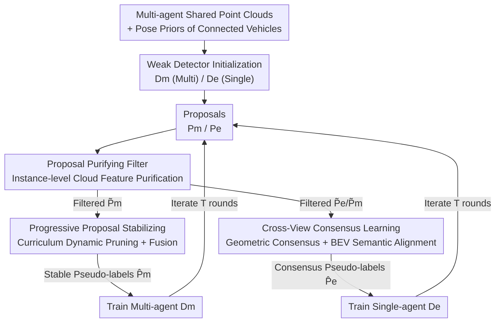

# Unsupervised Multi-agent and Single-agent Perception from Cooperative Views

**Conference**: CVPR 2026  
**Paper**: [CVF Open Access](https://openaccess.thecvf.com/content/CVPR2026/html/Yang_Unsupervised_Multi-agent_and_Single-agent_Perception_from_Cooperative_Views_CVPR_2026_paper.html)  
**Area**: Autonomous Driving / V2V Collective Perception / Unsupervised 3D Detection  
**Keywords**: V2V Cooperative Perception, Unsupervised 3D Object Detection, Pseudo-labels, Point Cloud Density, Cross-view Consistency

## TL;DR
UMS utilizes the cooperative perspective brought by Vehicle-to-Vehicle (V2V) communication to develop a pseudo-label refinement framework (PPF Filtering + PPS Stabilizing + CCL Cross-view Consistency) without any manual annotation. Based on observations that "dense multi-vehicle point clouds make classification easier" and "cooperative views can supervise single-vehicle detection," it is the first to train both multi-agent and single-agent 3D detection to significantly surpass existing unsupervised methods.

## Background & Motivation

**Background**: LiDAR 3D object detection in autonomous driving, whether for single-agent (ego-only) or multi-agent cooperation (V2V cloud sharing to expand perception range), primarily relies on large-scale manually annotated 3D bounding boxes for strong supervision.

**Limitations of Prior Work**: Manual 3D box annotation is expensive and difficult to scale, and labels are unavailable in many real-world scenarios. Existing unsupervised 3D detection methods (e.g., OYSTER based on clustering, CPD based on prototype templates and commonsense filtering, DOtA extending rule filtering to multi-agent) are mostly designed for single-agent settings and depend on heuristic rules. These rules produce numerous false positives/negatives in sparse point clouds or occluded scenes; DOtA’s rule-based filtering degrades significantly under occlusion. **To date, no method has simultaneously addressed both multi-agent and single-agent perception using a pure communication-based, label-free approach.**

**Key Challenge**: Sparse single-perspective LiDAR lacks geometric information, causing weak detectors to produce noisy and incomplete proposal boxes. Meanwhile, manual rules fail to learn instance-level features to distinguish real vehicles from background clutter. In unsupervised scenarios, there is a lack of reliable supervision signals to train a learnable filter.

**Goal**: Train both multi-agent cooperative detection and single-agent detection using only inter-vehicle communication with zero manual annotation. Furthermore, the ego vehicle must function under two deployment conditions: with or without shared data from other vehicles (considering low V2V penetration in reality).

**Key Insight**: The authors start from two physical facts of cooperative views. First is the **point cloud density gain**: shared multi-agent point clouds become denser, creating a distribution gap in confidence between True Positives (TP) and False Positives (FP) (Paper Fig.4), enabling self-supervised "vehicle/non-vehicle" binary classification. Second is the **cross-view consistency gain**: multi-agent cooperative views provide complementary geometric and contextual cues for distant or occluded targets missed in single-agent views, which can serve as label-free supervision for single-agent detection.

**Core Idea**: Replace manual labels with "dense cooperative point clouds from communication." This is converted into two supervision signals: learning an instance-level learnable filter on dense clouds to purify pseudo-labels, and using geometric/semantic consistency between cooperative and single-agent views to guide the single-agent detector. Both detectors are improved simultaneously in an iterative pseudo-supervision loop.

## Method

### Overall Architecture
Focusing on V2V cooperation, $V$ connected vehicles provide shared LiDAR point clouds $\{X_v\}_{v=1}^{V}$ and GPS poses, all aligned to the ego coordinate system $X_e$ using homogeneous transformation matrices $\{T_{v\to e}\}$. During training, two detectors are maintained: a single-agent detector $D_e$ (no shared data) and a multi-agent detector $D_m$ (shared data), jointly optimized via iterative pseudo-supervision.

At start-up, with no manual labels, two weak detectors are trained using "pose priors of communicated vehicles." $D_e$ processes $X_e$ to output candidates $P_e=\{b_e,c_e\}$, and $D_m$ processes $\{X_v\}$ to output $P_m=\{b_m,c_m\}$ ($b$ as box, $c$ as confidence). These initial boxes are noisy and incomplete. UMS refines them in three stages: **PPF** filters unreliable boxes using instance-level feature to obtain $\tilde P_e, \tilde P_m$; **PPS** fuses $\tilde P_m$ with historical boxes in a memory bank $\mathcal B$ to obtain stable $\hat P_m$; **CCL** enforces geometric and BEV semantic consistency between detectors to generate consensus pseudo-labels $\hat P_e$ to train $D_e$. Through iterative rounds, both weak detectors are continuously enhanced.

### Key Designs

**1. Proposal Purifying Filter (PPF): Converting "Unlabeled" Challenges into Confidence-based Self-supervised Instance Classification**

Proposals from weak detectors are full of background clutter. Clustering methods (DBSCAN/OYSTER/CPD) use heuristic grouping and cannot perform instance-level feature learning, while unsupervised settings lack labels to train a learnable classifier. PPF breaks this by observing that in dense multi-agent clouds, high-confidence boxes from $D_m$ are mostly true vehicles, while low-confidence boxes are mostly false positives (Fig. 4). Thus, confidence scores are used as free labels. Specifically, a negative set $S^-$ and a positive set $S^+$ are selected from $P_m$ based on confidence. For each box $b_i$, points are extracted via $\mathrm{crop}(X, b_i)$ and fed into a PointNet++-based hierarchical classifier $C_\phi$ to predict a score $q_i = C_\phi(\mathrm{crop}(X,b_i))$, trained using Binary Cross-Entropy:

$$\mathcal{L}_{\mathrm{ppf}} = -\sum_i [y_i\log q_i + (1-y_i)\log(1-q_i)]$$

During inference, $q_i$ is calculated for every box in $P_e, P_m$, keeping only those with $q_i \ge 0.5$ to get the purified sets $\tilde P_e, \tilde P_m$. Since the filter learns hierarchical features on **dense cooperative clouds**, it suppresses clutter in sparse single-agent clouds more effectively than manual rules.

**2. Progressive Proposal Stabilizing (PPS): Stabilizing Intermittent Boxes via Curriculum Learning**

PPF removes unreliable boxes, but the remaining boxes still fluctuate due to intermittent visibility, viewpoint changes, or sparsity. PPS observes that boxes appearing consistently across iterations are likely real targets, while noise is short-lived. It uses two dynamic mechanisms: **Dynamic Pruning** employs a confidence threshold $\tau_t$ that increases with iterations:

$$\tau_t = \tau_{\min} + (\tau_{\max}-\tau_{\min})\,\sigma\big(k_\tau(t-\beta_\tau)\big)$$

where $\sigma$ is the sigmoid function. Early $\tau_t$ is low to include more pseudo-labels (easy, ensuring recall), while later $\tau_t$ is high to keep only high-confidence boxes (hard, ensuring precision). **Dynamic Fusion** gradually increases the weight of historical boxes in the memory bank $\mathcal B$: historical confidence is weighted as $\tilde c_j^h = \lambda_t c_j^h$, and current as $\tilde c_i = (1-\lambda_t)c_i$, with $\lambda_t = \sigma(k_\lambda(t-\beta_\lambda))$, followed by NMS fusion:

$$\hat{\mathcal{P}}_m = \mathrm{NMS}\big(\{b_j,\tilde c_j^h\}_{\mathcal B}\cup\{b_i,\tilde c_i\}_{\tilde{\mathcal P}_m},\ \eta\big)$$

**3. Cross-View Consensus Learning (CCL): Distilling Cooperative Cues to the Single-agent Detector**

Single-agent branches often miss distant or occluded targets, which purified multi-agent boxes can provide. CCL transfers these cues to $D_e$ via two paths. **Multi-view Geometric Consensus** matches boxes between branches using a Rotated IoU threshold $\eta_{ccl}$. Multi-agent boxes that are unmatched but have sufficient points in the ego cloud are added back—the unmatched valid set requires $\pi(b_j^m; X^e) \ge \rho$ (where $\pi$ counts ego points inside the box). The final consensus labels are $\hat P_e = \mathrm{NMS}(\tilde P_e \cup \mathcal U, \eta_{ccl})$. **BEV Semantic Alignment** adds high-level context by aligning BEV feature maps $F_e, F_m \in \mathbb R^{H \times W \times C}$. A visibility mask $M$ is constructed from $F_e$ (based on channel mean threshold $\gamma$) to exclude empty regions:

$$\mathcal{L}_{\mathrm{bev}} = \frac{1}{Z}\big\|(F_e-F_m)\odot M\big\|_2^2,\quad Z=\sum_{i,j}M(i,j)$$

### Loss & Training
The framework iterates for $T$ rounds, each with $E$ epochs. In each round, PPS yields $\hat P_m$ and CCL yields $\hat P_e$ to supervise $D_m$ and $D_e$ respectively. Classification uses focal loss $\mathcal L_{cls}$ and regression uses smooth L1 $\mathcal L_{reg}$ ($\mu_1=\mu_2=1$), with an additional BEV alignment loss $\mathcal L_{bev}$ (weight $\mu_3$) for the single-agent branch:

$$\mathcal{L}_m = \mu_1\mathcal{L}_{cls}(\hat P_m) + \mu_2\mathcal{L}_{reg}(\hat P_m)$$

$$\mathcal{L}_e = \mu_1\mathcal{L}_{cls}(\hat P_e) + \mu_2\mathcal{L}_{reg}(\hat P_e) + \mu_3\mathcal{L}_{bev}$$

The detectors are optimized separately within each round. The PPF classifier is trained once at $t=1$.

## Key Experimental Results

### Main Results
Evaluated on V2V4Real (real-world, 2 vehicles, ~20k frames) and OPV2V (CARLA simulation, 11,464 frames). Metrics: 3D AP@0.3 / AP@0.5 for the vehicle class.

| Dataset | Setting | Metric | DOtA (Prev. SOTA) | UMS | Gain |
|--------|------|------|------|------|------|
| V2V4Real | Multi-agent | AP@0.5 | 48.84 | 52.03 | +3.19 |
| V2V4Real | Single-agent | AP@0.5 | 40.41 | 44.27 | +3.86 |
| OPV2V | Multi-agent | AP@0.5 | 52.37 | 83.89 | +31.52 |
| OPV2V | Single-agent | AP@0.5 | 46.87 | 71.30 | +24.43 |

UMS achieves unsupervised SOTA across all settings. Gains are massive on OPV2V due to clean data allowing PPF to learn reliable hierarchical features. On V2V4Real, real-world noise limits gains. For reference, full supervision on OPV2V Multi-agent AP@0.5 is 94.11; UMS approaches this upper bound in simulation.

### Ablation Study
Incremental module addition (Table 4, starting from weak detector baseline):

| Configuration | V2V4Real Multi AP@0.5 | OPV2V Multi AP@0.5 | OPV2V Single AP@0.5 |
|------|------|------|------|
| Weak Detector (Baseline) | 16.87 | 19.33 | 14.62 |
| + PPF | 46.02 | 59.55 | 45.98 |
| + PPF + PPS | 52.03 | 83.89 | 66.44 |
| + PPF + PPS + CCL | — | — | 71.30 |

PPF provides the largest single-step improvement (+40 points on OPV2V Multi). CCL specifically improves single-agent performance (+4.86 points).

### Key Findings
- **PPF is the Foundation**: Simply adding PPF boosts AP@0.5 from the teens to correctly distinguishing vehicles, confirming that self-supervised instance filtering is the key to unsupervised detection.
- **Three Modules, Distinct Roles**: PPF and PPS drive multi-agent performance, while CCL focuses on single-agent gains, mirroring the two insights (density for classification, consistency for single-agent supervision).
- **Simulation vs. Real Gap**: Gains are amplified on clean OPV2V data but compressed on noisy/sparse V2V4Real, revealing that instance-level feature learning is sensitive to point cloud quality.

## Highlights & Insights
- **Communication as Supervision**: By using shared point clouds to create density and view complementarity, the model generates label-free supervision signals without extra sensors.
- **Confidence Gap for Self-supervision**: The observation that dense clouds naturally separate TP/FP confidence distributions allows for training classifiers without manual labels.
- **Curriculum Threshold Scheduling**: PPS uses a sigmoid logic to transition from low to high thresholds, a stable pseudo-label refinement trick that balances recall and precision.
- **Dual-path Distillation**: CCL combines geometric matching with visibility-masked BEV alignment to systematically transfer knowledge from collective views to the single-agent detector.

## Limitations & Future Work
- **Dependency on Point Cloud Quality**: Improvement on V2V4Real is much smaller than on OPV2V; instance learning struggles with extreme sparsity and noise.
- **Reliance on Pose Priors**: The cold start depends on communication pose priors. If these are highly inaccurate, the weak detector initialization may fail.
- **Narrow Category Coverage**: Primarily evaluated on vehicles; multi-class extension currently requires external pre-trained components.
- **Hyperparameter Sensitivity**: PPS and CCL involve numerous parameters for threshold scheduling and alignment that may require tuning across different environments.

## Related Work & Insights
- **vs. DOtA**: DOtA uses rule-based filtering which fails under occlusion; UMS introduced learnable filtering (PPF) and curriculum stabilization, improving pseudo-label precision from 60.42 to 85.98.
- **vs. OYSTER / CPD**: These depend on clustering/prototypes in single views, often leading to false positives from structural background. UMS uses cooperative density to virtually eliminate such noise.

## Rating
- Novelty: ⭐⭐⭐⭐⭐ First framework to solve both multi and single-agent unsupervised detection; the "communication as supervision" insights are well-grounded.
- Experimental Thoroughness: ⭐⭐⭐⭐ Extensive testing across datasets, distances, and robustness, though real-world gains could be further analyzed.
- Writing Quality: ⭐⭐⭐⭐ Clear mapping between motivation and modules.
- Value: ⭐⭐⭐⭐ Unsupervised cooperative perception is highly relevant for deployment; PPF and PPS mechanisms are reusable tricks for the community.

<!-- RELATED:START -->

## Related Papers

- [\[CVPR 2026\] F3DGS: Federated 3D Gaussian Splatting for Decentralized Multi-Agent World Modeling](f3dgs_federated_3d_gaussian_splatting_for_decentralized_multi-agent_world_modeli.md)
- [\[CVPR 2026\] Efficient Equivariant Transformer for Self-Driving Agent Modeling](efficient_equivariant_transformer_for_self-driving_agent_modeling.md)
- [\[CVPR 2026\] Beyond Rule-Based Agents: Active Markov Games for Realistic Multi-Agent Interaction in Autonomous Driving](beyond_rule-based_agents_active_markov_games_for_realistic_multi-agent_interacti.md)
- [\[CVPR 2026\] CATNet: Collaborative Alignment and Transformation Network for Cooperative Perception](catnet_collaborative_alignment_and_transformation_network_for_cooperative_percep.md)
- [\[CVPR 2026\] RLFTSim: Realistic and Controllable Multi-Agent Traffic Simulation via Reinforcement Learning Fine-Tuning](rlftsim_realistic_and_controllable_multi-agent_traffic_simulation_via_reinforcem.md)

<!-- RELATED:END -->
