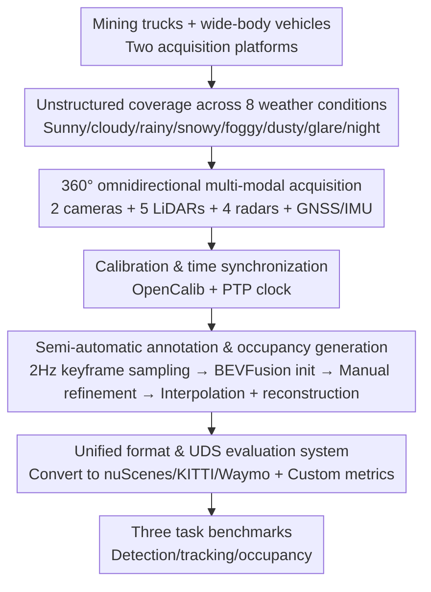

# URScenes: A Multi-scenario Dataset for Unstructured Road Environments

**Conference**: CVPR 2026  
**Paper**: [CVF Open Access](https://openaccess.thecvf.com/content/CVPR2026/html/Liu_URScenes_A_Multi-scenario_Dataset_for_Unstructured_Road_Environments_CVPR_2026_paper.html)  
**Code**: http://www.sav-lab.com (data and toolkit, ⚠️ refer to the original paper for authoritative information)  
**Area**: Autonomous Driving / Perception Datasets  
**Keywords**: Unstructured roads, open-pit mines, multi-modal perception, 3D object detection, occupancy prediction

## TL;DR
URScenes is the first multi-scenario, open-source, multi-modal perception dataset for unstructured road environments (represented by open-pit mines). Captured using two platforms, mining trucks and wide-body vehicles, it covers 472 scenarios across eight weather and lighting conditions (sunny, cloudy, rainy, snowy, foggy, dusty, strong glare, and nighttime). It uniformly supports three key tasks: 3D object detection, multi-object tracking, and 3D occupancy prediction, while providing evaluation metrics redesigned for the scale characteristics of objects in mining areas and format conversion tools to nuScenes, KITTI, and Waymo.

## Background & Motivation

**Background**: Autonomous driving perception heavily relies on large-scale annotated datasets. However, mainstream datasets such as KITTI, Cityscapes, nuScenes, and Waymo almost exclusively focus on **structured urban roads and highways**, with most data collected under clear weather conditions.

**Limitations of Prior Work**: When autonomous driving and unmanned operations expand to harsher environments such as open-pit mines, geological exploration, and large-scale agriculture, existing datasets prove insufficient. Existing unstructured datasets each have their own limitations: ORFD, OFFSEG, CARL-D, and IDD primarily target "simple" unstructured scenarios like forest areas or rural dirt roads; although R²100K and RELLIS-3D define diverse road surface characteristics, they **virtually ignore adverse weather** (RELLIS-3D has no weather-based splits, R²100K only covers sunny, cloudy, and dusty conditions and focuses mainly on semantic segmentation); AutoMine (2022) is the first open-pit mine dataset, but **only supports 3D detection and localization**, failing to cover extreme weather such as heavy snow or dense fog common in mining areas.

**Key Challenge**: To date, **no single dataset achieves all of the following**: ① comprehensive coverage of unstructured road environments and their associated adverse weather conditions; ② unified support for three critical perception tasks: 3D detection, multi-object tracking, and occupancy prediction; and ③ alignment with the data structures and toolchains of mainstream benchmarks to allow low-cost model migration. The absence of these three properties combined represents a major bottleneck in unstructured perception research.

**Goal**: To construct a multi-scenario, multi-modal, multi-task unstructured road perception dataset that is "ready-to-use" out-of-the-box, supporting direct conversion to mainstream formats along with accompanying evaluation metrics.

**Key Insight**: The authors take **open-pit mines** as a representative case of unstructured road environments (characterized by extremely wide spans of object scales, extreme weather, and complex terrain), collecting data over two years using two types of real mining vehicles.

**Core Idea**: Using a unified pipeline encompassing 360° multi-modal data acquisition, semi-automatic annotation, and format conversion to construct the first unstructured perception dataset supporting "eight weather conditions × three tasks", accompanied by a customized detection metric (UDS) tailored to the scale of mining objects.

## Method

### Overall Architecture

Since this is a dataset paper, the "method" refers to the **dataset construction pipeline**. The entire pipeline can be viewed as five serial steps: using mining trucks and wide-body vehicles as collection platforms equipped with 360° multi-modal sensor suites to collect raw data → calibrating all sensors and performing time synchronization using a PTP clock → sampling keyframes from LiDAR sequences at 2 Hz, generating initial 3D bounding boxes using pre-trained BEVFusion, and manually refining them → propagating refined bounding boxes to non-keyframes via interpolation, and generating occupancy grid ground truth using static-dynamic separation and multi-view reconstruction → storing data in a unified annotation structure, providing automatic conversion to nuScenes/KITTI/Waymo, and performing benchmark evaluation using custom metrics after conversion to the nuScenes format.

### Key Designs

**1. Unstructured coverage of eight scenarios: Addressing "adverse weather × mining terrain" all at once**

In response to the primary gap where "existing unstructured datasets either lack weather variety or lack task diversity", URScenes for the first time covers **eight typical atmospheric and lighting conditions** in unstructured road environments: rainy, snowy, foggy, dusty, glare, nighttime, cloudy, and sunny; among these, sunny and cloudy are normal conditions, while the remaining six represent adverse conditions. Using open-pit mines as the representative scenario, road surfaces cover mud, pooled water, slippery ground, gravel, etc. Semantic object categories include wide-body vehicles, mining trucks, bulldozers, excavators, and pedestrians, totaling 36 semantic categories. In the comparison in Table 1, URScenes is the only dataset that **ticks all boxes** in the six adverse weather columns ("fog/snow/rain/dust/glare/night") and the "unstructured roads" column. While AutoMine also targets mines, it lacks snow/fog, whereas urban datasets like nuScenes/Waymo are marked "No" in the "unstructured" column. This level of coverage directly qualifies it to support research on robustness under adverse conditions.

**2. 360° omnidirectional multi-modal acquisition platform: Redundant signals for near-to-far and variable light conditions**

Object scales in mining areas span a massive range (pedestrians with a 1.1 m diagonal vs. excavators at 20.1 m), and dust/fog significantly attenuates LiDAR signals, making single-sensor setups insufficient. The authors equip both mining trucks and wide-body vehicles with a synchronized 360° sensor suite: one 128-beam long-range LiDAR (120° HFOV, 200 m) + four 32-beam near-range blind-spot BPearl LiDARs (360° HFOV, 50 m) to cover the near field; one 60° telephoto camera + one 200° fisheye camera to cover near/far fields; four 76–77 GHz millimeter-wave radars to provide penetrating signals under adverse weather; and GNSS+IMU for localization. Data is recorded at 10 Hz, yielding 472 scenarios (each ~30 s) collected over two years, containing approximately 294K images, 736K LiDAR scans, and 589K radar frames. 

For calibration, OpenCalib is used to find LiDAR-to-vehicle extrinsic parameters via figure-8 driving trajectories on flat ground. Camera intrinsic parameters are obtained using Zhang's calibration method, and camera-to-LiDAR extrinsics are determined through PnP corner detection with QR code targets. Time synchronization is governed by a PTP master clock deployed on a Jetson domain controller, aligning the PPS and GPRMC signals of the INS to UTC to guarantee temporal alignment of multi-source raw data.

**3. Semi-automatic annotation and occupancy grid generation: Reducing annotation costs using pre-trained models and interpolation**

Manually annotating 28K+ keyframes frame-by-frame is extremely expensive. The authors' strategy is to **sample keyframes at 2 Hz** from LiDAR sequences, leverage a pre-trained BEVFusion model to generate initial 3D bounding boxes, and then **manually refine them**. The refined bounding boxes are then propagated to non-keyframes via **interpolation**, significantly reducing the annotation workload (resulting in 28K+ keyframe annotations and 119K non-keyframe annotations). Ground truth occupancy generation utilizes both keyframes and non-keyframes: **static-dynamic separation** is performed first, followed by multi-view reconstruction for dense mapping in complex environments, and finally localization data is used to crop and voxelize the valid regions, yielding accurate occupancy grids. This workflow avoids the trade-off between high-quality annotations and manageable costs.

**4. Unified format and the UDS evaluation framework: Redefining accuracy for mining scales**

To facilitate low-cost model migration, all data is annotated using a unified structure supporting automatic conversion to nuScenes, KITTI, and Waymo formats (which was converted to nuScenes in the experiments). Crucially, regarding detection metrics: the fixed center-distance thresholds of nuScenes are unfair for mining objects with vast size variations. Thus, the authors calculate the mean 2D bounding box diagonal $Dia_c$ for each category $c$ and construct category-dependent distance thresholds $Th{d}_c=\{0.125Dia_c,\,0.25Dia_c,\,0.5Dia_c,\,Dia_c\}$ (e.g., $Dia_c=20$ m for excavators, $Dia_c=1$ m for pedestrians). AP is then accumulated across these thresholds and categories to obtain the mAP (using $P_{min}=R_{min}=0.1$ during integration). For TP objects, the mean of the three pose error metrics from nuScenes (ATE/ASE/AOE) is calculated across categories (mTP). Finally, the URScenes Dataset Score (UDS) is defined as:

$$UDS=\frac{1}{6}\Big[3\,mAP+\sum_{mTP}\big(1-\min(1,mTP)\big)\Big]$$

This assigns a triple weight to mAP and incorporates three pose error terms normalized to "the larger, the better". Tracking follows AMOTA/AMOTP, and occupancy prediction uses mIoU. This metric system ensures that situations where the overall mAP drops under adverse weather but near-field poses remain accurate can be fairly evaluated.

### A Complete Example

Taking the **dust subset** as an example to illustrate how these metrics explain physical phenomena: suspended dust particles severely attenuate LiDAR penetration, failing to detect distant targets and resulting in very low mAP—the best fusion model, BEVFusion, achieves only 16.7% mAP on the dust subset, while the LiDAR-only FUTR3D drops to 15.3%. However, near-field targets can still be reliably detected with relatively accurate poses (ATE/ASE/AOE), pulling the UDS up to 44.3% and 34.6%, respectively. The paper utilizes the difference $UDS-mAP$ to quantify the degree of "far-field failure with feasible near-field performance": dust (27.3%), fog (29.1%), and snow (24.2%) show the largest differences among all subsets, perfectly matching the physical realities of LiDAR degradation under suspended particles. This demonstrates that the design intent of UDS—not completely penalizing a model that remains useful in the near field due to distant target misses—is indeed supported by the experiments.

## Key Experimental Results

Experiments are conducted on 472 scenarios (filtered from an initial 900 scenarios by removing those with too few, too dense, or heavily occluded targets, such as parking lots) with an 8:2 train/test split, validating 12 detection models, 6 tracking models, and 7 occupancy models.

### Main Results: Detection Across Weather Subsets (UDS%/mAP%)

| Model | Cloudy | Sunny | Dust | Fog | Snow |
|------|------|------|------|------|------|
| PointPillars (L) | 79.6/71.9 | 67.3/62.2 | 48.9/17.3 | 57.3/28.5 | 60.0/35.3 |
| BEVFusion* (L+C) | 78.0/70.2 | 61.4/61.3 | 44.3/16.7 | 59.4/27.8 | 60.3/34.9 |
| CenterPoint (L) | 78.7/69.6 | 62.0/57.9 | 46.5/15.6 | 59.2/27.8 | 60.7/34.4 |
| FUTR3D (L, LiDAR-only) | 62.9/66.5 | 56.7/52.3 | 34.6/15.3 | 52.7/33.8 | 52.2/34.8 |

All models perform well in normal scenarios (cloudy, sunny, rainy), but experience significant degradation under dust, fog, and snow. For instance, BEVFusion achieves 78.0/70.2 on cloudy but plummets to 44.3/16.7 on dust. The LiDAR-only FUTR3D drops to the lowest score of 34.6/15.3 under dust, confirming the severe degradation of LiDAR point cloud quality by adverse weather.

### Modality Comparison (Cloudy Subset, Table 5)

| Model | Modality | UDS↑% | mAP↑% | ATE↓m | ASE↓ | AOE↓rad |
|------|------|------|------|------|------|------|
| BEVFusion | L+C | 78.0 | 70.2 | 0.18 | 0.07 | 0.17 |
| FUTR3D | L+C | 75.7 | 69.6 | 0.34 | 0.11 | 0.10 |
| BEVFusion | L | 75.8 | 69.4 | 0.23 | 0.08 | 0.22 |
| FUTR3D | L | 62.9 | 66.5 | 0.98 | 0.12 | 0.12 |
| FUTR3D | C+R | 54.5 | 32.2 | 0.56 | 0.09 | 0.04 |
| BEVDepth | C | 67.4 | 58.5 | 0.63 | 0.05 | 0.04 |

LiDAR+camera fusion consistently outperforms single modalities: fusion-based BEVFusion (78.0) and FUTR3D (75.7) are both superior to their LiDAR-only versions (75.8 and 62.9, respectively), proving the effectiveness of sensor fusion in unstructured environments.

### Occupancy Prediction (Table 6, mIoU%) and Tracking (Table 7)

| Occupancy Method | Modality | mIoU | Engineering Vehicle | Road Surface | Small Obstacle |
|------|------|------|------|------|------|
| FB-Occ | C | 30.94 | 15.14 | 35.28 | 19.74 |
| SparseOcc | C | 26.83 | 11.83 | 30.69 | 18.36 |
| Co-Occ | C&L | 25.41 | 24.70 | 23.80 | 7.40 |
| SurroundOcc | C | 17.13 | 13.23 | 19.97 | 6.24 |

Multi-modal approaches generally dominate in occupancy prediction. Within vision-only methods, FB-Occ leads with 30.94% mIoU, excelling in hilly terrain (Hill 43.46%) but bounded in vehicle categories due to monocular depth limits. SparseOcc achieves competitive small obstacle scores (18.36%) despite using a very low resolution (704×256), indicating that efficient design outperforms merely stacking resolution. In tracking, end-to-end methods exhibit stability; ADA-Track achieves the highest MOTA (35.2%) and AMOTA (33.9%), while among two-stage paradigms, MCTrack comprehensively leads in MOTA (34.6%), AMOTA (34.7%), and AMOTP (1.37 m).

### Key Findings
- **The $UDS-mAP$ difference acts as an adverse weather diagnostic tool**: Dust (27.3%), fog (29.1%), and snow (24.2%) show the largest differences, aligning with the physical reality of LiDAR far-field failures while near-field accuracy remains intact.
- **Class imbalance directly impacts detection difficulty**: Wide-body vehicles have abundant instances, leading to the highest average UDS (60.6%) across the five models. Conversely, excavators have sparse and unbalanced distributions, resulting in an average UDS of only 32.4%.
- **Fusion > single modality is more pronounced in adverse environments**, but the camera+radar (C+R) suite yields an mAP of only 32.2%, lagging far behind LiDAR-inclusive pipelines.

## Highlights & Insights
- **Redesign of metrics based on data characteristics**: Eschewing the fixed thresholds of nuScenes in favor of adaptive distance thresholds based on category 2D diagonals $Dia_c$ and defining UDS is the most valuable engineering insight of this paper. When object scales span an order of magnitude, fixed-threshold evaluations systematically bias towards very small or very large targets.
- **Reusable closed-loop semi-automatic annotation**: Utilizing pre-trained detectors for initial labeling + manual refinement + keyframe-to-non-keyframe interpolation represents a mature paradigm for reducing the cost of large-scale 3D datasets. The occupancy ground truth generation pipeline utilizing static-dynamic separation, multi-view reconstruction, and localization-cropped voxelization can also be directly transferred to other multi-modal acquisition pipelines.
- **"Eight weather conditions × three tasks" in one table**: Presenting adverse weather coverage as a quantifiable comparative dimension (fully checked in Table 1) makes the dataset's unique contributions immediately clear.

## Limitations & Future Work
- **The authors acknowledge**: Currently, 4D radar is not included, and standardized textual descriptions of scenarios/objects are missing; future work plans to incorporate these to enhance diversity.
- **Still reliant on open-pit mines as the sole representative**: Although titled "unstructured roads", the actual data is highly concentrated on mining vehicles and terrains; other unstructured types such as forests, agricultural fields, and exploration scenes are not covered, leaving the models' generalization ability to these domains questionable.
- **Data scale and class imbalance**: Insufficient samples for minority classes (e.g., excavators) increase detection difficulty; whether the sample sizes across different weather subsets are balanced is not fully disclosed in the paper (⚠️ subject to the original text).
- **Benchmarks only run off-the-shelf models**: No new methodology tailored to unstructured or adverse weather conditions is proposed; the work is purely a benchmark, leaving the exploration of best practices in adverse weather to future research.

## Related Work & Insights
- **vs. nuScenes / Waymo / KITTI**: These are large-scale structured urban/highway datasets with limited weather coverage and no unstructured road scenarios. URScenes specializes in unstructured mining areas across eight weather conditions and provides conversion tools to these mainstream formats to leverage their ecosystems.
- **vs. AutoMine**: Both are open-pit mining datasets, but AutoMine (2022) only supports 3D detection and localization and lacks heavy snow/dense fog. URScenes expands this to 3D detection, tracking, and occupancy tasks while covering extreme weather conditions.
- **vs. R²100K / RELLIS-3D**: They define rich unstructured road surface features but primarily focus on semantic segmentation with virtually no consideration of adverse weather. URScenes differentiates itself via multi-modal 3D perception and a systematic set of weather sub-datasets.

## Rating
- Novelty: ⭐⭐⭐⭐ First "eight weather conditions × three tasks" unstructured multi-modal dataset. The design of the UDS metric is a key highlight, though the core contribution lies in the data rather than methodology.
- Experimental Thoroughness: ⭐⭐⭐⭐ Baselines are solid, benchmarking 12 detection, 6 tracking, and 7 occupancy models across three tasks and eight subsets.
- Writing Quality: ⭐⭐⭐⭐ Clear tables and well-defined comparison dimensions; some OCR-rendered formulas are slightly cluttered and should be cross-referenced with the original text.
- Value: ⭐⭐⭐⭐ Fills the gap in unstructured, adverse-weather perception data, offering high practical utility with the accompanying conversion tools and customized metrics.

<!-- RELATED:START -->

## Related Papers

- [\[CVPR 2026\] CARD: A Multi-Modal Automotive Dataset for Dense 3D Reconstruction in Challenging Road Topography](card_a_multi-modal_automotive_dataset_for_dense_3d_reconstruction_in_challenging.md)
- [\[CVPR 2026\] RefAV: Towards Planning-Centric Scenario Mining](refav_towards_planning-centric_scenario_mining.md)
- [\[CVPR 2025\] Scenario Dreamer: Vectorized Latent Diffusion for Generating Driving Simulation Environments](../../CVPR2025/autonomous_driving/scenario_dreamer_vectorized_latent_diffusion_for_generating_driving_simulation_e.md)
- [\[CVPR 2026\] RoadSceneBench: A Lightweight Benchmark for Mid-Level Road Scene Understanding](roadscenebench_a_lightweight_benchmark_for_mid-level_road_scene_understanding.md)
- [\[CVPR 2026\] V2U4Real: A Real-world Large-scale Dataset for Vehicle-to-UAV Cooperative Perception](v2u4real_a_real-world_large-scale_dataset_for_vehicle-to-uav_cooperative_percept.md)

<!-- RELATED:END -->
