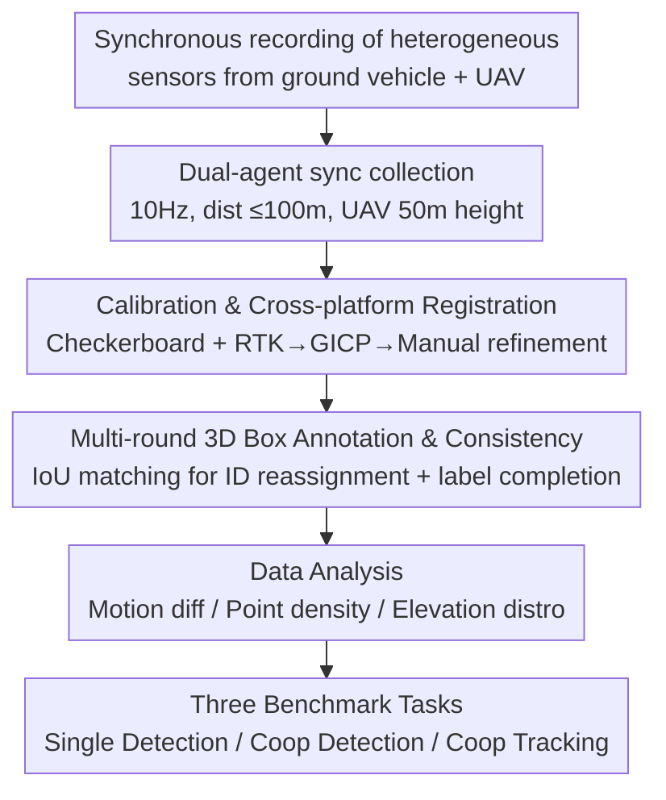

# V2U4Real: A Real-world Large-scale Dataset for Vehicle-to-UAV Cooperative Perception

**Conference**: CVPR 2026  
**Paper**: [CVF Open Access](https://openaccess.thecvf.com/content/CVPR2026/html/Li_V2U4Real_A_Real-world_Large-scale_Dataset_for_Vehicle-to-UAV_Cooperative_Perception_CVPR_2026_paper.html)  
**Code**: https://github.com/VjiaLi/V2U4Real  
**Area**: Autonomous Driving / Cooperative Perception / 3D Object Detection  
**Keywords**: Vehicle-to-UAV Cooperation, V2U, Real-world Dataset, 3D Object Detection, Multi-agent Tracking

## TL;DR
V2U4Real is the first real-world, large-scale, multi-modal dataset for Vehicle-to-UAV (V2U) cooperative perception. Collected by a ground vehicle and a UAV equipped with multi-beam LiDAR and RGB cameras, it provides 56k LiDAR frames, 56k images, and 700k manual 3D bounding box annotations. Benchmarks for single-agent/cooperative 3D detection and tracking demonstrate that the bird's-eye view (BEV) from UAVs significantly enhances perception robustness in long-range and occluded scenarios.

## Background & Motivation
**Background**: The mainstream cooperative perception paradigms in autonomous driving are Vehicle-to-Vehicle (V2V, e.g., OPV2V, V2V4Real) and Vehicle-to-Infrastructure (V2I, e.g., DAIR-V2X, V2X-Real). Multiple agents share sensor information to compensate for blind spots, mitigating occlusion, limited range, and sensor failure in single-vehicle views.

**Limitations of Prior Work**: All perspectives in V2V are grounded, restricted by ground-level field-of-view (FoV). They remain ineffective against large-scale occlusions (e.g., complex intersections blocked by leading vehicles). While V2I can be mounted high, it depends on expensive fixed roadside infrastructure, suffering from inflexible deployment and limited coverage. Unmanned Aerial Vehicles (UAVs), with global BEV perspectives and high mobility, could fill this gap—this is the V2U paradigm.

**Key Challenge**: V2U faces two primary obstacles. First, **motion differences**: UAVs possess full 6-DOF motion ($x, y, z$ plus $roll/pitch/yaw$), with inter-frame pose jitter far exceeding ground vehicles, leading to geometric misalignment between aerial and ground LiDAR point clouds, making coordinate alignment and cross-view fusion difficult. Second, **data scarcity**: Existing UAV-related datasets (CoP-UAVs, UAV3D, Griffin, AirV2X) are almost entirely synthesized via simulators like CARLA/AirSim/SUMO, lacking real-world pose perturbations, occlusions, and dynamic interactions; the only real aerial-ground dataset, CoPeD, provides only semantic labels and focuses on static or low-dynamic scenes.

**Goal**: Fill the gap in real-world, large-scale, multi-modal V2U cooperative perception data with 3D bounding box annotations and establish a research platform for benchmarking.

**Key Insight**: Utilize real vehicles and UAVs equipped with heterogeneous sensors for field collection. Employ multi-round manual annotation, sensor calibration, and multi-source point cloud registration to unify aerial-ground annotations into a single coordinate system, thereby validating the actual gains of BEV cooperation.

**Core Idea**: Construct a real-world multi-modal dataset collected cooperatively by a ground vehicle (ego) and a UAV. Fuse the UAV's BEV LiDAR point clouds into the ground vehicle's perspective and quantify the improvements of V2U cooperation for long-range and occluded perception across three benchmark tasks.

## Method
As a dataset paper, the "Method" refers to **data generation + accompanying evaluation benchmarks**. The pipeline progresses from dual-agent raw data collection to sensor calibration, cross-platform registration, multi-round manual annotation, and cross-sensor consistency correction, ending with three downstream task benchmarks (Single-agent Detection / Cooperative Detection / Cooperative Tracking).

### Overall Architecture
The input consists of raw streams recorded synchronously from heterogeneous sensors on the ground vehicle and UAV (multiple LiDARs + multiple cameras + RTK GPS/IMU). The output is a multi-modal dataset aligned to a unified coordinate system with 700k 3D boxes and cross-frame IDs, along with defined benchmarks. The process involves four stages: ① Synchronous dual-agent data collection → ② Sensor calibration + Vehicle-UAV point cloud registration → ③ Multi-round 3D box annotation + Cross-sensor ID consistency correction → ④ Data distribution analysis + Benchmark task definition.

### Key Designs

**1. V2U Real Heterogeneous Collection Platform: Avoiding the unreality of simulation**

To address the lack of real pose perturbations and occlusions in simulated datasets, the authors built two real agents. The ground vehicle (ego) is equipped with two mechanical LiDARs (OS-128, RS-128), one solid-state LiDAR (M1-Plus), and three RGB cameras (Left/Center/Right). The UAV (DJI M300 RTK) carries one OS-128 LiDAR and one downward-facing camera. Both utilize 1000Hz RTK GPS/IMU for initial positioning. During collection, horizontal distance was kept within 100m, with the UAV flying at 50m. Relative poses $(\theta_r, \theta_p, \theta_y)$ were intentionally varied. Sensors recorded at 10Hz across urban, rural, and campus roads, resulting in 44 representative sequences (~56.2k frames).

**2. Calibration and Cross-platform Registration: Solving geometric misalignment from 6-DoF jitter**

UAV motion causes inherent aerial-ground misalignment. Alignment involves two steps: camera intrinsics calibrated via checkerboard, and LiDAR-camera extrinsics solved by minimizing reprojection error of 2D-3D points. LiDAR registration between platforms used RTK for initial values, followed by GICP fine-tuning and manual refinement. Three coordinate conventions are used: LiDAR local (X/Y/Z as Front/Left/Up), Camera (Z as depth), and World (NED - North-East-Down). This ensures precise fusion in the ego coordinate system while allowing single-agent tasks via independent local LiDAR annotations.

**3. Multi-round Annotation and Cross-sensor Consistency: Ensuring consistent IDs and boxes**

Four classes (Car, Cyclist, Pedestrian, Truck) were annotated using SusTechPoint. Each box includes center $(x,y,z)$, dimensions $(l,w,h)$, and Euler angles $(\text{roll},\text{pitch},\text{yaw})$. Cross-frame IDs and velocities were recorded. To fix inconsistencies between independent LiDAR annotations, boxes were transformed to the ego frame for IoU-based matching and ID alignment. Missed instances (points > 5) were back-filled to ensure ground truth consistency—a prerequisite for cooperative tasks.

**4. Three Benchmarks and Cooperation-specific Protocols**

**Single 3D Detection** (Vehicle/UAV) uses local data. Range: $x \in [-100, 100]$ m, $y \in [-80, 80]$ m. **Cooperative 3D Detection** fuses UAV points into the ego frame. $GT = GT_v \cup GT_u$. Range narrows to $x \in [-15, 100]$ m to focus on forward safety. It introduces **Average MegaByte (AM)** to measure bandwidth and differentiates between **Sync** (ideal) and **Async** (simulating 0–1000 ms latency) settings. Seven SOTA methods (AttFuse, Where2comm, etc.) were benchmarked. **Cooperative 3D Tracking** follows a tracking-by-detection paradigm using AB3Dmot as a baseline.

## Key Experimental Results

### Main Results: Cooperative Detection vs. Single Agent (Vehicle, Sync/Async)
Cooperative methods significantly outperform single-agent baselines, with CoAlign being the most stable.

| Method | Sync AP@0.5/0.7 | Async AP@0.5/0.7 | 50–100m Sync AP@0.5/0.7 | AM(MB) |
|------|------|------|------|------|
| Vehicle only (No Fusion) | 27.53/12.75 | 27.53/12.75 | 15.54/6.23 | 0 |
| UAV only (No Fusion) | 32.44/14.31 | 32.44/14.31 | 19.74/10.11 | 0 |
| Early Fusion | 51.31/30.97 | 30.94/13.99 | 24.47/14.99 | 3.18 |
| Late Fusion | 43.61/27.74 | 28.08/16.18 | 16.75/8.56 | 0.009 |
| Where2comm | 53.85/29.71 | 48.99/28.36 | 26.73/16.59 | 0.65 |
| **CoAlign** | **56.67/36.61** | **50.81/33.33** | 30.20/19.25 | 0.65 |
| DSRC | 54.64/31.77 | 47.63/26.05 | **33.26/20.63** | 0.65 |

**Key Findings**: CoAlign achieved the best overall performance (Sync 56.67/36.61) due to spatial misalignment mitigation. DSRC outperformed in the 50–100m range (33.26/20.63) via semantic-guided reconstruction. Async latency degrades all cooperative methods, but intermediate feature fusion is more robust than Early/Late fusion.

### Single Agent Detection: UAV vs. Ground Vehicle

| Platform | Method | Veh. AP@0.5 | Veh. AP@0.7 | Cyc. AP@0.25 | Cyc. AP@0.5 |
|------|------|------|------|------|------|
| Vehicle | PV-RCNN | 68.18 | 36.23 | 59.51 | 51.31 |
| UAV | PointPillars | 70.09 | 47.06 | 57.33 | 41.61 |
| UAV | PV-RCNN | **72.26** | **55.15** | 64.28 | 50.86 |

### Key Findings
- **UAV single-agent detection is generally stronger than vehicle-based**: Vehicle AP@0.5/0.7 is ~5%/20% higher on UAVs due to fewer occlusions in BEV. However, small targets like Cyclists suffer from sparse point clouds in top-down views.
- **Cooperation extends the perception horizon**: Cross-agent exchange improves AP@0.5 for 50–100m targets by ~10%, validating the value of the UAV's perspective.
- **Motion difference is a real challenge**: Vehicle inter-frame roll/pitch jitter is usually $|\theta_r, \theta_p| \le 2^\circ$, while UAV jitter reaches $\le 10^\circ$, making cross-view alignment difficult.

## Highlights & Insights
- **First real-world V2U multi-modal dataset**: Outperforms CoPeD in scale and dynamic content. 56.2k frames / 703k boxes represent significant engineering effort.
- **Practical AM (Average MegaByte) metric**: Provides a "Performance-vs-Bandwidth" trade-off perspective crucial for deployment.
- **Sync/Async settings mimic reality**: Simulating latency reveals the sensitivity of fusion strategies to temporal misalignment.
- **Transferable Pipeline**: The registration flow (RTK → GICP → Fine-tuning) and annotation consistency scheme are reusable for other multi-agent datasets.

## Limitations & Future Work
- **Small scale compared to simulation**: while leading among real-world sets, 44 snippets lack the diversity of 500k-frame simulated sets. Coverage of weather/night conditions is limited.
- **Single-vehicle/Single-UAV**: Does not cover multi-vehicle or drone-swarm coordination.
- **Benchmarking on val set**: Most main results focus on the validation set; test set results are relegated to supplemental materials.
- **Lack of new algorithms**: As a benchmark paper, it leaves the development of V2U-specific fusion (e.g., 6-DoF jitter modeling) to future work.

## Related Work & Insights
- **vs V2V4Real / OPV2V (V2V Paradigm)**: These are ground-to-ground; V2U4Real introduces aerial BEV to resolve large-scale occlusions.
- **vs DAIR-V2X (V2I Paradigm)**: V2U replaces fixed infra with mobile drones, offering flexible deployment at the cost of handling 6-DoF motion.
- **vs CoPeD (Real Aerial-Ground)**: V2U4Real provides 3D boxes and tracking IDs in high-dynamic scenes, whereas CoPeD is primarily semantic and static.
- **vs AirV2X / Griffin (Simulated V2U)**: V2U4Real exposes real-world pose perturbations and alignment issues that are often oversimplified in simulators.

## Rating
- **Novelty**: ⭐⭐⭐⭐⭐ First real-world V2U multi-modal dataset.
- **Experimental Thoroughness**: ⭐⭐⭐⭐ Solid task definitions and metrics; however, main body lacks comprehensive test set reporting.
- **Writing Quality**: ⭐⭐⭐⭐ Clear description of the data construction pipeline and data distribution analysis.
- **Value**: ⭐⭐⭐⭐⭐ Essential infrastructure for the cooperative perception community.

<!-- RELATED:START -->

## Related Papers

- [\[CVPR 2026\] SearchAD: Large-Scale Rare Image Retrieval Dataset for Autonomous Driving](searchad_large-scale_rare_image_retrieval_dataset_for_autonomous_driving.md)
- [\[NeurIPS 2025\] UrbanIng-V2X: A Large-Scale Multi-Vehicle Multi-Infrastructure Dataset Across Multiple Intersections for Cooperative Perception](../../NeurIPS2025/autonomous_driving/urbaning-v2x_a_large-scale_multi-vehicle_multi-infrastructure_dataset_across_mul.md)
- [\[CVPR 2026\] Ghost-FWL: A Large-Scale Full-Waveform LiDAR Dataset for Ghost Detection and Removal](ghost-fwl_a_large-scale_full-waveform_lidar_dataset_for_ghost_detection_and_remo.md)
- [\[CVPR 2026\] Real-World On-Vehicle Evaluation of Embedding-Based Anomaly Detection](real-world_on-vehicle_evaluation_of_embedding-based_anomaly_detection.md)
- [\[CVPR 2026\] SimScale: Learning to Drive via Real-World Simulation at Scale](simscale_learning_to_drive_via_real-world_simulation_at_scale.md)

<!-- RELATED:END -->
