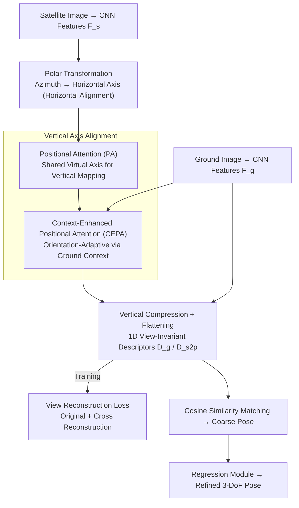

# VIRD: View-Invariant Representation through Dual-Axis Transformation for Cross-View Pose Estimation

**Conference**: CVPR2026  
**arXiv**: [2603.12918](https://arxiv.org/abs/2603.12918)  
**Code**: To be confirmed  
**Area**: Autonomous Driving  
**Keywords**: cross-view pose estimation, view-invariant representation, polar transformation, positional attention, autonomous driving localization

## TL;DR

VIRD is proposed to construct view-invariant representations through dual-axis transformation (polar transformation + context-enhanced positional attention). It achieves SOTA cross-view pose estimation without orientation priors, reducing position and orientation errors on KITTI by 50.7% and 76.5%, respectively.

## Background & Motivation

**Global localization is a key requirement for autonomous driving**: Accurate global localization is crucial for autonomous driving and mobile robots, serving as a fundamental capability for real-world navigation.

**GNSS is unreliable in urban scenes**: In dense urban areas, GNSS signals degrade significantly due to occlusion and multi-path effects, leading to a substantial drop in positioning accuracy.

**Cross-view pose estimation as an alternative**: Estimating the 3-DoF pose of a ground camera using geo-referenced satellite imagery is a promising alternative, though a massive viewpoint gap exists between ground and satellite views.

**Existing methods rely on orientation priors**: Early methods assume a known rough orientation and perform iterative optimization within a narrow search space, but orientation priors are often inaccurate or unavailable in practice, leading to sub-optimal convergence.

**Semantic methods ignore spatial correspondence**: Recent omni-directional CVPE methods bridge the viewpoint gap through semantic similarity (cross-attention, contrastive learning) but ignore spatial correspondences, failing to fundamentally resolve the viewpoint gap.

**Geometric transformation methods have limitations**: Polar transformation only addresses horizontal alignment while ignoring the vertical axis. Projective transformation depends on camera parameters and produces severe artifacts around vertical structures such as buildings.

## Method

### Overall Architecture

VIRD is an omni-directional cross-view pose estimation framework. Its core mechanism uses "dual-axis transformation" to unify ground and satellite images into a single view-invariant descriptor. First, pre-trained CNNs (VGG16 / EfficientNet-B0) extract ground features $F_g \in \mathbb{R}^{C \times H \times W_g}$ and satellite features $F_s \in \mathbb{R}^{C \times A \times A}$. Alignment is then performed in two steps: polar transformation maps the azimuth of satellite features to the horizontal axis (horizontal alignment), and Context-Enhanced Positional Attention (CEPA) eliminates vertical axis misalignment (CEPA is built upon Positional Attention, PA). Aligned features are compressed vertically and flattened into orientation-aware 1D descriptors $D_g$ and $D_{s2p}$. Coarse poses are obtained via cosine similarity matching, followed by a regression module to predict residual refinements.

### Key Designs

**1. Polar Transformation: Solving Horizontal Axis Alignment**

The fundamental difficulty in cross-view tasks is the drastic difference between ground and satellite views. VIRD performs polar sampling on satellite feature maps centered at candidate positions, mapping azimuth and radial distance to horizontal and vertical axes, respectively. The transformation width $W_s = \frac{2\pi}{\text{HFoV}} \cdot W_g$ ensures scale consistency across different fields of view. This step focuses solely on the horizontal direction to align rotational angles.

**2. Positional Attention (PA): Learning Vertical Axis Mapping Without Camera Parameters**

Instead of relying on camera parameters and depth which cause artifacts, PA utilizes attention to learn the mapping: defining three sets of sinusoidal positional encodings—shared virtual encoding $P_a$, ground encoding $P_g$, and satellite encoding $P_{s2p}$. The mapping between vertical coordinates is learned via:

$$\mathcal{A}_v = \text{Softmax}\left(\frac{(P_a W_v^Q)(P_v W_v^K)^\top}{\sqrt{d_k}}\right)$$

The key is reinterpreting positional attention as learning a cross-view vertical coordinate transformation through a shared virtual axis, eliminating the need for camera parameters.

**3. Context-Enhanced Positional Attention (CEPA): Adaptive Vertical Transformation**

PA assumes that vertical transformations are consistent across all horizontal directions. However, vertical structures (building heights, terrain) vary across directions. CEPA enhances attention weights using the local context of ground features:

$$\mathcal{A}_{g'} = \mathcal{A}_g + \text{Softmax}\left(\Phi(\mathcal{A}_g \oplus F_g)\right)$$

The convolutional layer $\Phi$ processes the concatenated attention weights and features, allowing the model to adaptively transform ground features based on scene context.

**4. View Reconstruction Loss: Enforcing Encoding of Vertical Structures**

To ensure descriptors capture view-invariant structural information, the model is required to reconstruct both original and cross-view images during training. The original reconstruction loss $\mathcal{L}_{\text{origin}}$ ensures fidelity, while the cross reconstruction loss $\mathcal{L}_{\text{cross}}$ forces the descriptor to capture shared vertical structures, enhancing view invariance.

### Loss & Training

The total loss consists of three components:

$$\mathcal{L} = \mathcal{L}_{\text{recon}} + \mathcal{L}_{\text{match}} + \mathcal{L}_{\text{reg}}$$

- $\mathcal{L}_{\text{recon}} = \alpha_1 \mathcal{L}_{\text{origin}} + \alpha_2 \mathcal{L}_{\text{cross}}$: View reconstruction loss ($\ell_1$-loss)
- $\mathcal{L}_{\text{match}}$: InfoNCE matching loss to encourage high similarity at GT poses
- $\mathcal{L}_{\text{reg}}$: $\ell_2$-loss for pose residuals

## Key Experimental Results

### Main Results

**KITTI Dataset** (No orientation prior, Cross-area, EfficientNet-B0):

| Method | Mean Pos (m)↓ | Median Pos (m)↓ | Mean Ori (°)↓ | Median Ori (°)↓ |
|------|:---:|:---:|:---:|:---:|
| HighlyAccurate | 15.50 | 16.02 | 89.84 | 89.85 |
| SliceMatch | 14.85 | 11.85 | 23.64 | 7.96 |
| CCVPE | 13.94 | 10.98 | 77.84 | 63.84 |
| FG2 | 13.58 | 11.72 | 90.12 | 90.42 |
| **VIRD (Ours)** | **11.12** | **5.41** | **22.03** | **1.87** |

**VIGOR Dataset** (No orientation alignment, Cross-area, EfficientNet-B0):

| Method | Mean Pos (m)↓ | Median Pos (m)↓ | Mean Ori (°)↓ | Median Ori (°)↓ |
|------|:---:|:---:|:---:|:---:|
| CCVPE | 5.41 | 1.89 | 27.78 | 13.58 |
| DenseFlow | 7.67 | 3.67 | 17.63 | 2.94 |
| FG2† | 5.95 | 2.40 | 28.41 | 2.20 |
| **VIRD (Ours)** | **4.61** | **1.55** | **16.50** | **1.17** |

### Ablation Study

**Ablation of Dual-Axis Transformation** (KITTI Cross-area, VGG16):

| Strategy | Median Pos (m) | Median Ori (°) |
|----------|:---:|:---:|
| Projective S2G | 10.59 | 3.84 |
| Projective G2S | 15.20 | 5.44 |
| Polar Only | 11.75 | 4.00 |
| Polar + PA | 9.76 | 3.44 |
| Polar + CEPA | **8.88** | **3.36** |

**Ablation of Model Components** (KITTI Cross-area, VGG16):

| Config | Median Pos (m) | Median Ori (°) |
|------|:---:|:---:|
| Polar + CEPA | 8.88 | 3.36 |
| + $\mathcal{L}_{\text{origin}}$ | 8.29 | 3.31 |
| + $\mathcal{L}_{\text{cross}}$ | 8.10 | 3.21 |
| + Both | 7.90 | 3.05 |
| + Both + Reg | **7.05** | **2.22** |

### Key Findings

- Dual-axis transformation significantly outperforms all single geometric transformation baselines; PA and CEPA provide consistent improvements.
- View reconstruction loss contributes most to orientation estimation, reducing mean orientation error by 39.1%.
- VIRD maintains low error across different orientation noise levels (±10° to ±180°), showing superior robustness compared to CCVPE and FG2.

## Highlights & Insights

- **Sophisticated Dual-Axis Design**: Decomposes cross-view matching into manageable horizontal (polar) and vertical (positional attention) sub-problems, avoiding dependence on camera parameters.
- **Clear Intuition for CEPA**: Reinterprets positional attention as a coordinate transform via a virtual axis, with context enhancement for scene-adaptive vertical adaptation.
- **Effective Reconstruction Strategy**: Enforces view invariance by requiring descriptors to reconstruct cross-view images, focusing the model on shared structures.
- **Orientation-Agnostic**: Achieves SOTA in a full 360° search space, offering high practical value.

## Limitations & Future Work

- Currently handles only 3-DoF poses (x, y, yaw), assuming pitch and roll are negligible, which may fail in complex terrains.
- In settings with aligned orientations, positional accuracy is inferior to methods like FG2 that utilize 3D structural information.
- The regression module may amplify errors if the coarse matching direction is incorrect.
- Generalization to a wider variety of urban scenes and countries remains to be validated.

## Related Work & Insights

- **Limited Angle CVPE**: HighlyAccurate and PIDLoc use LM algorithms or neural optimizers within narrow ranges, limited by orientation priors.
- **Omni-directional CVPE**: SliceMatch (content-based cross-attention) and CCVPE (contrastive learning) focus on semantic similarity while ignoring spatial correspondence.
- **Geometric Transformations**: Polar transformations solve horizontal alignment; projective transformations attempt dual-axis handling but suffer from artifacts and parameter dependence.

## Rating

- Novelty: ⭐⭐⭐⭐
- Experimental Thoroughness: ⭐⭐⭐⭐
- Writing Quality: ⭐⭐⭐⭐
- Value: ⭐⭐⭐⭐

<!-- RELATED:START -->

## Related Papers

- [\[CVPR 2026\] CycleBEV: Regularizing View Transformation Networks via View Cycle Consistency for Bird's-Eye-View Semantic Segmentation](cyclebev_regularizing_view_transformation_networks_via_view_cycle_consistency_fo.md)
- [\[CVPR 2026\] Towards Balanced Multi-Modal Learning in 3D Human Pose Estimation](towards_balanced_multi-modal_learning_in_3d_human_pose_estimation.md)
- [\[CVPR 2026\] SToRe3D: Sparse Token Relevance in ViTs for Efficient Multi-View 3D Object Detection](store3d_sparse_token_relevance_in_vits_for_efficient_multi-view_3d_object_detect.md)
- [\[CVPR 2026\] CoIn3D: Revisiting Configuration-Invariant Multi-Camera 3D Object Detection](coin3d_revisiting_configuration-invariant_multi-camera_3d_object_detection.md)
- [\[CVPR 2026\] LA-Pose: Latent Action Pretraining Meets Pose Estimation](la-pose_latent_action_pretraining_meets_pose_estimation.md)

<!-- RELATED:END -->
