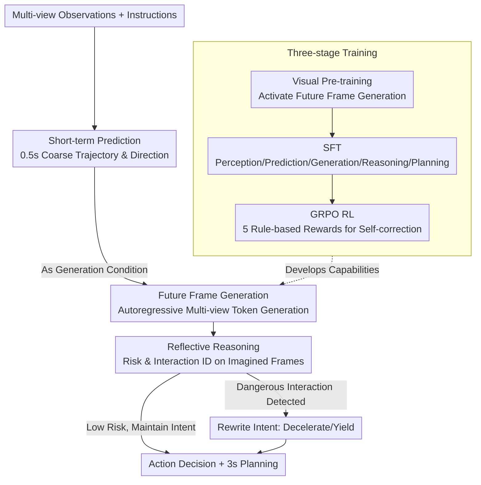

# Learning Vision-Language-Action World Models for Autonomous Driving

**Conference**: CVPR 2026  
**arXiv**: [2604.09059](https://arxiv.org/abs/2604.09059)  
**Code**: [https://vlaworld.github.io](https://vlaworld.github.io)  
**Area**: Autonomous Driving  
**Keywords**: VLA Model, World Model, Autonomous Driving, Reflective Reasoning, Reinforcement Learning

## TL;DR

VLA-World unifies the predictive imagination of world models with the reflective reasoning of VLA models into a single framework. By generating future frames and reasoning about them to improve trajectory planning, it achieves the lowest collision rates and FID scores.

## Background & Motivation

**Background**: End-to-end autonomous driving currently exists in two main paradigms—VLA models (which unify perception, reasoning, and control but lack spatial-temporal modeling) and world models (which predict environmental evolution but cannot reason about or evaluate the imagined future).

**Limitations of Prior Work**: VLA models lack explicit motion modeling for dynamic traffic participants, focusing only on the ego-vehicle trajectory and failing to predict the evolution of complex scenes. World models rely on large-scale visual data to learn prior distributions but cannot capture causal relationships, simulating the world without truly understanding it.

**Key Challenge**: The ability to predict the future (the strength of world models) and the ability to understand and evaluate the future (the strength of VLA) are fragmented into two independent frameworks.

**Goal**: To construct a unified autonomous driving framework capable of both imagining future scenarios and performing reflective reasoning on those imagined futures.

**Key Insight**: An analogy to human driving—drivers rely on intuitive imagination while cruising but immediately switch to a reflective reasoning mode when a pedestrian suddenly crosses the street.

**Core Idea**: Use a short-term predicted trajectory to guide the generation of future frames, then perform reasoning on these self-generated future frames to optimize the final trajectory, forming an "imagine-reflect" closed loop.

## Method

### Overall Architecture

VLA-World aims to solve a paradigm fragmentation: world models can predict future visuals but cannot evaluate them, while VLA models can reason but do not explicitly model the evolution of dynamic environments. The authors' approach is to have the same model first "imagine" and then "reflect"—after perceiving current multi-view observations, it first performs a short-term prediction (a 0.5s coarse trajectory and driving direction), using this as a condition to guide the generation of future frame images. Once this imagined future frame is obtained, the model looks back at it, identifies risks and interactions, and finally outputs action decisions and a 3s long-term planning trajectory. The entire model is trained sequentially through three stages: visual pre-training, supervised fine-tuning (SFT), and GRPO reinforcement learning, enabling it to first learn multi-view image generation, then reasoning on frames, and finally self-correcting exploration for optimal planning.

### Key Designs

**1. Visual Pre-training: Establishing Multi-view Future Frame Generation**

VLA models inherently possess understanding capabilities but lack the ability to generate future visuals. Since subsequent reflective reasoning must be built upon credible future frames, the first step is to activate visual generation. Given multi-view images and instructions, the model predicts the next frame's visual token sequence in an autoregressive next-token fashion:

$$P(Q_{t+1}^k) = \prod_i P_\theta(q_i^k \mid q_{<i}^k, h_t, L)$$

Where visual tokens are handled by a VQGAN encoder-decoder for discretization and reconstruction. A key difference from predecessors like FSDrive is that VLA-World explicitly enforces consistency between multiple viewpoints $k$ during pre-training—only if the future is self-consistent in all directions can the subsequent safety assessment be reliable. This stage lays a multi-view, goal-conditioned world model foundation for SFT and RL.

**2. "Thinking" with Imagined Future Frames: Moving Generation from Output to Input**

Most world models treat generated future frames as collateral output for display, but VLA-World treats them as input for reasoning—effectively allowing the model to "draw" the future on a scratchpad and then make judgments based on it. After the generation module produces a future frame $\hat{x}_{t+1}$, the reflection module analyzes salient entities, motion cues, and potential interactions, evaluating environmental risks to correct its intended behavior:

$$\tilde{\tau}_{t:t+H} = f_{ref}(o_{1:t}, \hat{x}_{t+1}, \hat{\tau}_{t:t+1})$$

This is effective because short-term predicted future frames naturally encode rich spatial-temporal information—where the ego-vehicle is going and how surrounding agents will move is already "drawn" in the frame. Reasoning based on a specific future image is far more reliable than abstract mental simulation.

**3. GRPO Reinforcement Learning: Driving Exploration of Optimal Solutions**

SFT only allows the model to replicate reasoning patterns seen in training data; it tends to get stuck in sub-optimal strategies in novel scenarios. The authors employ the GRPO algorithm for reinforcement learning, designing five rule-based rewards to cover the entire pipeline: a format reward $R_{fmt}$ ensures parsable output; a short-term prediction reward $R_{pred}$ constrains the 0.5s trajectory accuracy; a visual constraint reward $R_{vis}$ checks generated token counts and codebook validity; an action reward $R_{act}$ uses F1 scores to evaluate discrete behavior decisions; and a trajectory reward $R_{traj}$ assesses both precision and kinematic consistency. Each reward manages a different segment, forcing the model to transition from "mimicry" to "exploration" through self-correction.

### A Complete Example

Imagine the ego-vehicle is cruising forward, and an observation frame shows a pedestrian standing at the edge of the sidewalk ahead. The model first performs short-term prediction, yielding a 0.5s coarse trajectory of continuing straight with a slight rightward bias. Using this as a condition, the generation module produces a multi-view future frame for 0.5s later—in this imagined frame, the pedestrian has stepped into the lane. The reflection module takes this frame, identifies the "pedestrian crossing, intersecting with ego trajectory" high-risk interaction, rewrites the intent from cruising to decelerating/yielding, and outputs the corresponding action decision and a re-planned 3s long-term trajectory. This precisely mirrors human Dual Process Theory: relying on intuitive imagination while cruising, but switching to reflective reasoning as soon as danger signals appear.

### Loss & Training

Three-stage training: (1) Pre-training on large-scale image-instruction datasets to activate multi-view generation; (2) SFT on multi-task mixed datasets covering perception, prediction, generation, reasoning, and planning; (3) GRPO reinforcement learning, where the final reward is a weighted combination:

$$R_{all} = \lambda_{fmt} R_{fmt} + \lambda_{pred} R_{pred} + \lambda_{vis} R_{vis} + \lambda_{act} R_{act} + \lambda_{traj} R_{traj}$$

## Key Experimental Results

### Main Results

| Method | L2 1s↓ | L2 3s↓ | Collision 1s↓ | Collision 3s↓ | LLM |
|------|--------|--------|---------|---------|-----|
| VAD* | 0.17 | 0.60 | 0.04 | 0.67 | None |
| BEV-Planner* | 0.16 | 0.57 | 0.00 | 0.73 | None |
| DriveVLM | 0.15 | 0.38 | 0.05 | 0.54 | 7B |
| VLA-World (Ours) | **Best** | **Best** | **Best** | **Best** | 7B |

### Ablation Study

| Configuration | Key Metric | Description |
|------|---------|------|
| w/o World Model | High Collision Rate | Lacks future imagination capability |
| w/o Reflection | Low Trajectory Quality | Simulates without understanding |
| w/o RL | Sub-optimal Performance | Limited by SFT patterns |
| Full VLA-World | **Best** | Synergy of imagination, reasoning, and RL |

### Key Findings

- The combination of future frame imagination and reflective reasoning is critical—neither a standalone world model nor VLA can reach equal performance.
- Each of the five reward functions in the RL stage plays an irreplaceable role: format rewards ensure output parsability, while trajectory rewards ensure kinematic consistency.
- Multi-view pre-training is necessary; single-view generation cannot support comprehensive safety assessments.

## Highlights & Insights

- **"Imagine then Reflect" Paradigm**: Drawing an analogy to human driving's dual systems of intuition and reflection, using world model output as a "scratchpad" for reasoning is an elegant architectural design.
- **Multi-view Consistent Future Frame Generation**: Going beyond FSDrive's single front-view limitation to ensure consistent future predictions from any perspective.
- **Granular GRPO Reward Design**: Covering the full pipeline from format to kinematics ensures that RL does not optimize one dimension at the expense of another.

## Limitations & Future Work

- The scale of the nuScenes dataset is limited; nuScenes-GR-20K may not be sufficient to cover long-tail driving scenarios.
- Generating future frames introduces additional computational overhead, which may limit real-time performance.
- Verified only on nuScenes; not yet tested on larger-scale or more challenging datasets.

## Related Work & Insights

- **vs FSDrive**: This work extends to a multi-view world model and adds an RL stage for reasoning knowledge exploration.
- **vs DriveMoE**: While DriveMoE uses MoE to handle diverse scenarios, VLA-World uses imagination + reflection to handle safety.

## Rating

- Novelty: ⭐⭐⭐⭐ The unified paradigm of world model + VLA is highly innovative.
- Experimental Thoroughness: ⭐⭐⭐⭐ Comprehensive comparisons under two evaluation protocols.
- Writing Quality: ⭐⭐⭐⭐ Clear motivation with appropriate human driving analogies.
- Value: ⭐⭐⭐⭐ Opens a new integrated paradigm of imagination and reasoning for autonomous driving.

<!-- RELATED:START -->

## Related Papers

- [\[CVPR 2026\] Drive My Way: Preference Alignment of Vision-Language-Action Model for Personalized Driving](drive_my_way_preference_alignment_of_vision-language-action_model_for_personaliz.md)
- [\[CVPR 2026\] DriveMoE: Mixture-of-Experts for Vision-Language-Action Model in End-to-End Autonomous Driving](drivemoe_mixture-of-experts_for_vision-language-action_model_in_end-to-end_auton.md)
- [\[CVPR 2026\] NoRD: A Data-Efficient Vision-Language-Action Model that Drives without Reasoning](nord_a_data-efficient_vision-language-action_model_that_drives_without_reasoning.md)
- [\[CVPR 2026\] HybridDriveVLA: Vision-Language-Action Model with Visual CoT reasoning and ToT Evaluation for Autonomous Driving](hybriddrivevla_vision-language-action_model_with_visual_cot_reasoning.md)
- [\[CVPR 2026\] Unifying Language-Action Understanding and Generation for Autonomous Driving](unifying_language-action_understanding_and_generation_for_autonomous_driving.md)

<!-- RELATED:END -->
