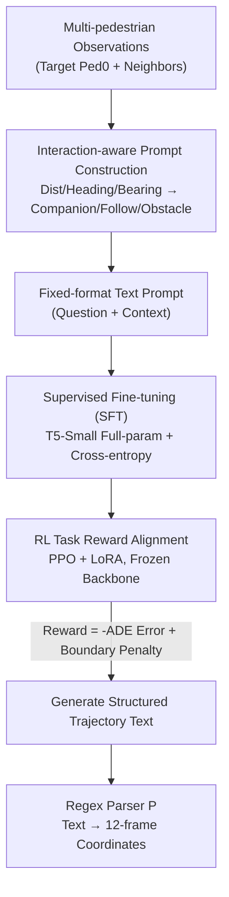

# W2W: Language-Model-Based Trajectory Prediction with Reinforcement Learning

**Conference**: CVPR 2026  
**Code**: [CVF Open Access](https://openaccess.thecvf.com/content/CVPR2026/html/Xu_W2W_Language-Model-Based_Trajectory_Prediction_with_Reinforcement_Learning_CVPR_2026_paper.html)  
**Code**: https://github.com/VoyagerXu21/W2W  
**Area**: Autonomous Driving / Pedestrian Trajectory Prediction  
**Keywords**: Trajectory Prediction, Language Models, Reinforcement Learning, PPO, Scene Compliance

## TL;DR
Pedestrian trajectory prediction is reformulated as a "parsable language generation" task. Multi-pedestrian coordinates and interaction relationships (companion/following/obstacle) are translated into fixed-format text prompts. T5-Small undergoes full-parameter SFT to learn the output format, followed by reinforcement learning alignment using PPO+LoRA with a "ADE error + boundary penalty" reward. This achieves ADE/FDE comparable to recent LM-based and deep learning baselines on ETH/UCY and SDD while maintaining the interpretability of language models.

## Background & Motivation

**Background**: Pedestrian trajectory prediction is a critical module for systems like autonomous driving and social robots—given observed trajectories of the past few frames, it predicts future motion. Mainstream approaches fall into two categories: rule-based methods (social forces, velocity models) are interpretable but struggle with the complexity of real-world scenarios; data-driven deep learning methods (RNN, attention, GAT/GCN, GAN/CVAE, diffusion models) offer high accuracy but are essentially black boxes, lacking interpretability and making them difficult to deploy in safety-critical scenarios. Recent works have introduced pre-trained Language Models (LMs) into trajectory prediction: LMTraj was the first to use pre-trained LMs for this task, and GUIDE-CoT added a target point module. Their outputs are natural language text, which provides inherent interpretability and leverages LM priors in mathematics and motion sequences.

**Limitations of Prior Work**: Existing LM-based methods suffer from two specific issues. First is the **misalignment of objective functions**: after textualizing trajectories, they only perform cross-entropy supervised fine-tuning, optimizing for "textual likelihood." However, the metrics that truly matter are ADE/FDE (L2 distance between predicted points and ground truth) and scene compliance—neither of which can be directly optimized by token-level cross-entropy, leading to compromised accuracy. Second is the **lack of explicit interaction semantics and oversimplified scene descriptions**: their text inputs consist mainly of discretized coordinate points and pedestrian IDs, omitting social semantics like "who is whose companion" or "who is an obstacle." Conversely, compressing the entire scene into a natural language sentence lengthens the token sequence and dilutes observation signals, often leading to performance drops and making it difficult to enforce real scene constraints.

**Key Challenge**: Trajectory prediction aims to minimize **non-differentiable metrics** such as L2 distance (text must be deterministically parsed back to coordinates to calculate ADE or check boundaries), while the LM training paradigm only optimizes differentiable token likelihood—the two are inherently misaligned.

**Goal**: (1) Enable explicit and parsable expression of interaction semantics in the input; (2) directly align the training objective with ADE accuracy and scene compliance rather than just token likelihood.

**Core Idea**: Use "behavior-driven parsable text representation + two-stage SFT→RL training" to bridge this gap. SFT teaches the model "how to answer" (learning format and interaction semantics), while RL teaches the model "how to walk" (optimizing accuracy and boundary constraints directly using programmatic task rewards). The authors name the method Write-to-Walk (W2W).

## Method

### Overall Architecture

W2W completely rewrites pedestrian trajectory prediction as a sequence-to-sequence (Seq2Seq) **text generation** problem. Formally, the prediction process is expressed as:

$$\hat{S}_{pred} = P\big(f_{\theta^\star}(M(F(S_{obs}),\, H(S_{obs}, S_{nb})))\big)$$

Where $F$ converts observed trajectories into natural language text, $H$ is an interaction classifier based on distance/heading cues, $M$ is a structured prompt template, $f_{\theta^\star}$ is the T5 policy after SFT and RL alignment, and $P$ is a regex parser that deterministically converts generated text back into coordinates. This differs fundamentally from the numerical regression paradigm $\hat{S}_{pred} = g_{\theta^\star}(S_{obs}, S_{nb}, U_s)$ that uses RNNs/Graph Networks/Transformers.

The pipeline consists of three stages: **① Interaction-aware prompt construction**—writing 8 frames of observations for the target (fixed ID=0) and neighbor interaction semantics into a fixed template, using consistent brackets/delimiters to ensure bi-directional parsability; **② SFT**—full-parameter supervised fine-tuning using T5-Small as the backbone to teach the model to generate the "Answer (future 12-frame sequence)" from the "Question/Context" via cross-entropy; **③ RL+LoRA alignment**—freezing the T5-Small backbone and updating only LoRA adapters using a programmatic reward composed of "ADE error + binary mask boundary penalty" via PPO.

### Key Designs

**1. Behavior-driven interaction-aware prompt construction: Explicit social semantics and reversible parsing**

This addresses the pain point of "implicit interaction semantics and unreliable parsing." Instead of feeding raw coordinates, the authors select a target pedestrian (ID=0) for each clip, take its 8-frame observations, and categorize interactions within the time window. Specifically, for each target-neighbor pair, they calculate initial/final/maximum distances $d_{init}, d_{final}, d_{max}$, global and final heading differences $\Delta\theta_{global}, \Delta\theta_{Final}$, and relative bearing $\phi_{final}$. A fused heading consistency score $\Delta\theta_{fused} = w\cdot\Delta\theta_{Final} + (1-w)\cdot\Delta\theta_{global}$ is used to determine three useful semantic types:

- **Companion**: Long-term proximity + aligned heading + side-by-side bearing ($d_{max} < d_c$, $\Delta\theta_{fused} < \tau_{Align}$, and $\phi_{final} < \pi/4$);
- **Obstacle**: Fast approach from afar + significant turn + large relative bearing ($d_{init} > d_{far}$, $d_{final} < d_{near}$, $\Delta\theta_{fused} \geq \tau_{turn}$, and $\phi_{final} > \pi/3$);
- **Following**: Final distance within a range + aligned heading + target in the neighbor's rear sector ($d_{final} \in [d_{fmin}, d_{fmax}]$, $\Delta\theta_{fused} < \tau_{align}$, and $|\pi - \phi_{final}| < \pi/6$).

Pairs not fitting these types are discarded. The target's coordinates and retained interactions are serialized into a template (e.g., "Pedestrian 1 is a companion/obstacle of pedestrian 0"). This approach relies on interpretable physical quantities, does not require expensive semantic maps, and uses fixed syntax to guarantee one-to-one correspondence between text and coordinates.

**2. Full-parameter Supervised Fine-Tuning (SFT): Ensuring output parsability**

This stage is a prerequisite for RL, addressing the issue that rewards cannot be calculated if the output is unparsable. Using T5-Small, the model learns the mapping $f_\theta: x \to y$, transforming the interaction prompt $x$ into structured text $y$ encoding future coordinates. The objective is token-level cross-entropy:

$$L_{SFT} = -\sum_t \log p_\theta(y_t \mid y_{<t}, x)$$

Output follows strict syntax (brackets, commas, length constraints), ensuring deterministic parsing. SFT increases the Format Execution Rate (FER) from near 0% (pre-trained T5 producing gibberish) to nearly 100%, providing stable text for downstream RL.

**3. Task-reward-based RL+LoRA alignment: Direct optimization of accuracy and constraints**

This is the core innovation targeting "objective misalignment." Since ADE and boundary penalties are **non-differentiable** with respect to tokens, the authors freeze the SFT backbone and update only LoRA adapters via PPO. The reward includes an **accuracy term** (negative ADE):

$$r_{L2} = -\lambda_{L2}\,\frac{1}{T}\sum_{t=1}^{T} \|\hat{\tau}_t - \tau^\star_t\|_2$$

And a **scene compliance term** using a binary mask $M_{scene}(\cdot)\in\{0,1\}$ to penalize points in non-navigable areas:

$$r_{occ} = -\lambda_{occ}\sum_{t=1}^{T} \mathbf{1}[M_{scene}(\hat{\tau}_t)=1]$$

The total task reward is $r(x,\hat{y}) = r_{L2} + r_{occ}$. To maintain the learned grammar, a token-level KL divergence penalty against the SFT model is applied, with the task reward issued at the final step: $r^{step}_t = -\beta[\mathrm{KL}_t(\pi_\theta\|\pi_{ref})]^{\delta}_+ + \mathbf{1}[t=T_y]\,r(x,\hat{y})$. This design puts scene constraints into the **optimization objective** rather than the prompt, avoiding the dilution of signals, while LoRA ensures low training costs.

### Loss & Training

SFT uses token-level cross-entropy (Eq. 3) with full-parameter tuning. RL freezes the backbone and tunes LoRA, using a scalar value head for GAE-based state value estimation and clipped PPO (Eq. 9). Settings: $T_{obs}=8, T_{pred}=12$. T5-Small was chosen for fair comparison with LMTraj and computational feasibility during PPO. Training on two RTX 4090Ds: SFT ~8h (13GB VRAM); RL ~29h (43GB VRAM).

## Key Experimental Results

Evaluated on ETH-UCY and Stanford Drone Dataset (SDD). Metrics: $\text{minADE}_K$ / $\text{minFDE}_K$ ($K=20$), ORR (Out-of-Road Rate), and FER (Format Execution Rate).

### Main Results

W2W achieved ADE/FDE of 0.21/0.29 on ETH-UCY and 7.42/10.13 on SDD, performing competitively with deep learning baselines and other LM-based methods.

| Model | Year | ETH/UCY AVG (ADE/FDE) | SDD (ADE/FDE) | Type |
|------|------|------|------|------|
| Trajectron++ | 2020 | 0.31/0.52 | 11.4/20.1 | DL |
| AgentFormer | 2021 | 0.23/0.40 | 8.7/14.9 | DL |
| PPT | 2024 | 0.20/0.31 | 7.03/10.65 | DL |
| LMTraj-SUP | 2024 | 0.22/0.32 | 7.8/10.1 | LM-based |
| VLMTraj-SUP | 2025 | 0.18/0.27 | 7.4/10.3 | LM-based |
| **W2W (Ours)** | 2026 | **0.21/0.29** | **7.42/10.13** | LM-based |

W2W outperforms LMTraj-SUP and GUIDE-CoT, though it lags behind VLMTraj-SUP which incorporates multimodal inputs. It stays within reach of DL SOTA (PPT/MoFlow). Its value lies in balancing accuracy with linguistic interpretability.

### Ablation Study

| Configuration | ETH/UCY AVG (ADE/FDE) | ORR↓ | FER↑ | Description |
|------|------|------|------|------|
| Pretrained T5-Small | – | – | ≈0 | Gibberish output |
| W2W-Base | 0.22/0.32 | – | – | SFT w/o interaction semantics |
| W2W-SFT | 0.21/0.30 | 11.30% | ≈100% | +interaction semantics: ADE↓5.4% |
| **W2W (SFT+RL)** | **0.21/0.29** | **8.85%** | ≈100% | +RL: ADE↓2.8%, ORR↓21.7% |

Ablation on prompt length (Table 4) shows that long scene descriptions (W2W-SFT+) performed worse (0.22/0.32) than concise interaction semantics (W2W-SFT, 0.21/0.30), proving that small LMs are sensitive to prompt length.

### Key Findings

- **SFT is the gateway to parsability**: Pre-trained T5-Small has FER ≈ 0; SFT raises it to ≈ 100%, enabling downstream RL.
- **Interaction semantics contribute significantly**: Explicitly writing "companion/follow/obstacle" reduces ADE/FDE by ~5% and enables active obstacle avoidance.
- **RL primarily improves scene compliance**: SFT→RL reduced ORR from 11.30% to 8.85% (a 21.7% drop) while marginally improving ADE/FDE, without breaking the output format.
- **Reward weighting favors accuracy**: The best results were found when the accuracy weight $\lambda_{L2}$ was higher than the occupancy weight $\lambda_{occ}$.

## Highlights & Insights
- **Reinforcement for non-differentiable metrics**: Trajectory metrics like ADE/FDE are non-differentiable. W2W uses "Text → Parsing → Programmatic Reward → PPO" to bypass this, a formula applicable to any task where output is structural but evaluation is non-differentiable (e.g., code or table generation).
- **Optimization objectives vs. Prompting**: Placing scene constraints in the reward rather than the prompt avoids signal dilution in small LMs.
- **Less is more for small LMs**: Small parameters models like T5-Small are sensitive to prompt length; concise, explicit semantics are more effective than exhaustive descriptions.
- **Interpretability as a utility**: Natural language output is auditable and deployable in safety-critical automated driving scenarios.

## Limitations & Future Work
- **Not absolute SOTA**: While leading in many LM-based categories, it falls short of multimodal models like VLMTraj-SUP.
- **High RL training cost**: RL training takes ~29h compared to ~8h for SFT, with higher VRAM requirements.
- **Fixed target ID**: Predictions are currently made for a single target pedestrian (ID=0), leaving joint multi-pedestrian prediction for future work.
- **Manual interaction thresholds**: The detection of "companion/following/obstacle" relies on hand-tuned physical thresholds, which may lack generalization.
- **Dependence on scene masks**: Scene compliance optimization requires pre-existing high-quality binary road masks.

## Related Work & Insights
- **vs LMTraj**: LMTraj uses only SFT (optimizing likelihood). W2W adds interaction semantics and RL for direct ADE/boundary optimization.
- **vs VLMTraj-SUP**: VLMTraj achieves higher accuracy (0.18/0.27) using multimodal inputs; W2W focuses on a lightweight, text-only T5-Small approach.
- **Transferable Insight**: The "Textualization + SFT for Format + RL for Non-differentiable Metrics" pipeline is a robust recipe for bridging structural language generation with specific performance goals.

## Rating
- Novelty: ⭐⭐⭐⭐ Bridging LM training with trajectory goals via PPO-RL for non-differentiable metrics is clear and valuable.
- Experimental Thoroughness: ⭐⭐⭐⭐ Evaluation across two datasets with comprehensive ablations on RL, SFT, and prompts.
- Writing Quality: ⭐⭐⭐⭐ Clear motivation-contradiction-method chain; well-illustrated pipeline.
- Value: ⭐⭐⭐⭐ "Interpretable and competitive" is highly relevant for safety-critical autonomous systems.

<!-- RELATED:START -->

## Related Papers

- [\[CVPR 2026\] EE-RL: Vision Language Guided Reinforcement Learning with Explorer and Expert model for End-to-End Autonomous Driving](ee-rl_vision_language_guided_reinforcement_learning_with_explorer_and_expert_mod.md)
- [\[CVPR 2026\] Recover to Predict: Progressive Retrospective Learning for Variable-Length Trajectory Prediction](recover_to_predict_progressive_retrospective_learning_for_variable-length_trajec.md)
- [\[CVPR 2026\] ReMoT: Reinforcement Learning with Motion Contrast Triplets](remot_reinforcement_learning_with_motion_contrast_triplets.md)
- [\[CVPR 2026\] RAG-TP: A General Framework for Vehicle Trajectory Prediction via Retrieval-Augmented Generation](rag-tp_a_general_framework_for_vehicle_trajectory_prediction_via_retrieval-augme.md)
- [\[CVPR 2026\] Den-TP: A Density-Balanced Data Curation and Evaluation Framework for Trajectory Prediction](den_tp_a_density_balanced_data_curation_and_evaluation_framework_for_trajectory.md)

<!-- RELATED:END -->
