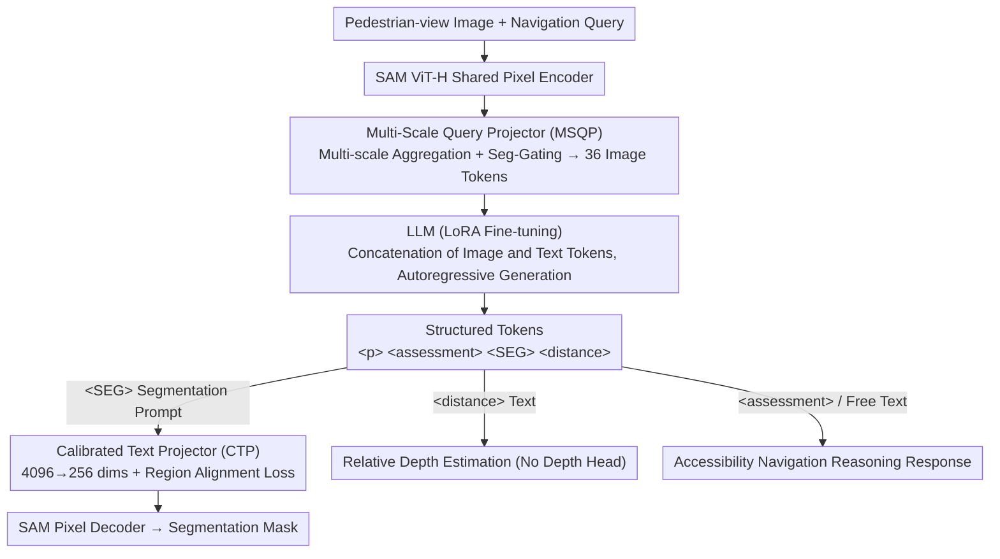

# WalkGPT: Grounded Vision-Language Conversation with Depth-Aware Segmentation for Pedestrian Navigation

**Conference**: CVPR2026  
**arXiv**: [2603.10703](https://arxiv.org/abs/2603.10703)  
**Code**: [Project Page](https://arxiv.org/abs/2603.10703) (Code and dataset are open-sourced)  
**Area**: Autonomous Driving / Pedestrian Navigation / Accessibility Support  
**Keywords**: Vision-Language Models, Pixel-level Grounding, Depth-Aware Segmentation, Pedestrian Navigation, Accessibility Reasoning, VQA

## TL;DR

Proposes WalkGPT—the first pixel-grounded large vision-language model for pedestrian accessibility navigation, unifying conversational reasoning, segmentation masks, and depth estimation into a single architecture, accompanied by the 41k-scale PAVE dataset.

## Background & Motivation

**Urgent Safety Needs in Pedestrian Navigation**: Urban pedestrian routes contain static and dynamic barriers such as stairs, uneven ground, parked vehicles, and temporary obstacles, posing severe risks to people with mobility impairments. However, automated navigation systems are almost entirely vehicle-oriented, leaving a critical gap in pedestrian-level navigation.

**Existing LVLMs Lack Spatial Reasoning**: Although large vision-language models (LVLMs) like LLaVA and InstructBLIP can describe visual content, they lack explicit spatial reasoning capabilities and cannot infer geometric structures or depth relationships, making them unsuitable for pedestrian navigation.

**Spatial Reasoning Methods Depend on User Input**: Spatial-aware models such as SpatialRGPT and DepthLM require users to provide visual anchors or markers to estimate depth, which is impractical in real-time pedestrian navigation scenarios.

**Hallucination Issues Pose Safety Risks**: LVLMs are prone to describing non-existent objects in a scene (hallucination), which could lead to dangerous guidance in pedestrian navigation.

**Grounded LVLMs Lack Depth Information**: Grounding models such as GLAMM and LISA can generate 2D segmentation masks but lack depth information, failing to understand relative distances and spatial hierarchies, which limits accessibility applications.

**Lack of Large-Scale Pedestrian-View Datasets**: Previously, there were no large-scale datasets containing both pedestrian-view QA annotations and spatial grounding annotations, hindering development in this field.

## Method

### Overall Architecture

WalkGPT adopts a unified architecture, sharing a single SAM ViT-H pixel encoder to serve both text generation and mask prediction. Inputs consist of a pedestrian-view image and a navigation query; the model outputs structured responses including free-text reasoning, segmentation masks, and relative depth estimation. Four structured tokens are utilized: `
` (object reference), `<assessment>` (accessibility evaluation), `<SEG>` (segmentation prompt), and `<distance>` (distance description), which explicitly link language generation with segmentation and depth reasoning.

### Key Designs

**1. Multi-Scale Query Projector (MSQP): Compressing High-Resolution Detail and Global Context into Compact Image Tokens**

Simple MLP projections often lose spatial structure, which is crucial for the geometric and depth cues required in pedestrian navigation. MSQP aggregates feature maps from the pixel encoder across multiple spatial scales (original resolution, 2× pooling, 4× pooling, and global average). Each scale extracts information via two layers of cross-attention using a set of learnable query embeddings. It also introduces a segmentation-aware gating function to emphasize regions rich in structure and edges. Finally, multi-scale outputs are concatenated and projected into $Q=36$ fixed-length tokens $\mathbf{V}_{\text{proj}} \in \mathbb{R}^{B \times Q \times H}$ for the LLM. Compared to single-scale MLPs, it preserves both local details and global scene context, preventing significant drops across all performance metrics as shown in ablation studies.

**2. Calibrated Text Projector (CTP) + Region Alignment Loss: Preventing Semantic Loss during Dimensionality Compression**

The hidden states of the `<SEG>` tokens generated by the LLM are $H=4096$ dimensions. Mapping these directly to the $d_{\text{vis}}=256$ dimensional visual space via "hard" compression would lose fine-grained semantics. CTP expands each reduced vector into $K_{\text{bank}}$ calibrated sub-embeddings using an MLP with learnable biases to preserve semantics. It is accompanied by a Region Alignment Loss—an InfoNCE contrastive loss—that uses Top-K attention to select the most salient image tokens as positive samples and tokens from other images as negatives. This aligns each `<SEG>` token with its corresponding visual region while pushing away irrelevant regions, ensuring semantic integrity and precise language-vision correspondence during $H \to d_{\text{vis}}$ compression.

**3. Structured Tokens Unifying Conversation/Segmentation/Depth: Predicting Depth as Language**

Pedestrian navigation requires both segmentation and distance information. Conventional approaches typically attach an additional depth head and rely on dense depth supervision. WalkGPT instead uses four structured tokens to weave multi-modal outputs into the same autoregressive sequence: `<assessment>` provides accessibility judgments, `
` anchors referred objects in conversation, `<SEG>` serves as the segmentation prompt for the pixel decoder, and `<distance>` describes the relative distance from the object to the camera in natural language. Depth is thus predicted as standard text tokens without a dedicated depth head—the model reuses object scale, occlusion, and boundary cues implicit in the image tokens for spatial reasoning. Furthermore, because the distance token is in the same sequence as segmentation references and navigation text, autoregressive conditioning forces depth expressions to remain consistent with the overall scene description. Ablation results show that removing the `<distance>` token causes depth accuracy to plummet from 48.95 to 38.77, while segmentation remains stable (20.16 to 20.01), confirming that this explicit distance supervision is the source of the depth capability.

### Loss & Training

The total loss is a weighted sum of three components:

$$\mathcal{L}_{\text{total}} = \alpha_1 \mathcal{L}_{\text{CE}} + \alpha_2 \mathcal{L}_{\text{seg}} + \alpha_3 \mathcal{L}_{\text{NCE}}$$

- $\mathcal{L}_{\text{CE}}$: Autoregressive cross-entropy (for dialogue generation and depth text prediction).
- $\mathcal{L}_{\text{seg}} = \mathcal{L}_{\text{Dice}} + \mathcal{L}_{\text{CE}_{seg}}$: For segmentation mask prediction.
- $\mathcal{L}_{\text{NCE}}$: Region alignment contrastive loss.

Relative depth is predicted via the `<distance>` token in natural language within the autoregressive sequence, requiring no specialized depth head or dense depth supervision.

### PAVE Dataset

- 41k pedestrian-view image-question-answer triplets derived from the SANPO real-world subset.
- Each frame includes RGB, semantic/instance segmentation masks, depth maps, and accessibility labels.
- Structured VQA pairs generated using GPT-5-nano, combined with automated validation and manual review.
- Training set consists of 85 video sessions (~8.5k frames), with 6 sessions (~600 frames) for validation.

## Experiments

### Main Results: Grounded Navigation Conversation (Table 1)

| Model | CIDEr↑ | METEOR↑ | mIoU↑ | Depth Acc.↑ | AbsRel↓ |
|------|--------|---------|-------|-------------|---------|
| GLAMM-FT | 37.96 | 39.12 | 18.23 | 38.95 | 77.05 |
| PixelLM-FT | 37.49 | 38.02 | 18.10 | 39.00 | 74.61 |
| Sa2VA-FT | 38.82 | 39.66 | 16.10 | 40.54 | 73.82 |
| **WalkGPT (7B)** | **41.97** | 42.36 | 19.95 | 41.97 | 67.88 |
| **WalkGPT (13B)** | 41.17 | **43.01** | **20.16** | **48.95** | **70.66** |

- All zero-shot baselines failed entirely to produce depth estimates.
- Fine-tuned baselines showed improvement but remained insufficient.
- WalkGPT 13B outperformed PixelLM-FT by over 10% in mIoU (20.16 vs 18.10) and improved depth accuracy by over 25% (48.95 vs 39.00).

### RES Benchmarking (Table 2)

| Model | refCOCO val | refCOCO+ val | refCOCOg val |
|------|------------|-------------|-------------|
| LISA | 74.1 | 62.4 | 66.4 |
| PixelLM | 73.0 | 66.3 | 69.3 |
| **WalkGPT** | **76.2** | **70.0** | **72.6** |

WalkGPT outperformed LISA and PixelLM by 3–4% even on RES tasks for which it was not specifically designed.

### Ablation Study (Table 5)

| Variant | METEOR↑ | mIoU↑ | Depth Acc.↑ |
|------|---------|-------|-------------|
| WalkGPT (Full) | 43.01 | 20.16 | 48.95 |
| w/o MSQP → MLP | 39.50 | 17.40 | 43.39 |
| w/o Multi-scale Aggregation | 41.60 | 19.30 | 44.70 |
| CTP → Linear | 40.70 | 18.60 | 47.98 |
| w/o $\mathcal{L}_{\text{NCE}}$ | 41.00 | 18.90 | 47.00 |
| w/o `<distance>` | 41.22 | 20.01 | 38.77 |

### Key Findings

- MSQP is the core component for performance gains; replacing it with an MLP led to substantial declines across all three metrics.
- Multi-scale aggregation is vital for capturing spatial structures and depth cues.
- The `<distance>` token contributes most to depth prediction (dropping Depth Acc. from 48.95 to 38.77 when removed) without affecting segmentation.
- The hallucination rate CHAIRi is only 18.49 (compared to 22.16 for LLaVA-1.5), and object coverage reached 83.66% (vs 33.04% for LLaVA-1.5), demonstrating that pixel-level grounding effectively suppresses hallucination.

## Highlights & Insights

- **Pioneering Work**: The first pixel-grounded LVLM for pedestrian accessibility navigation, introducing the new task of Grounded Navigation Guide.
- **Elegant Unified Architecture**: Conversational reasoning, segmentation, and depth estimation are completed in a single autoregressive process via structured tokens, eliminating the need for specialized depth heads.
- **Exquisite MSQP Design**: Multi-scale gated cross-attention compresses high-resolution details and global context into compact tokens, significantly outperforming MLP projections.
- **Effective Region Alignment Loss**: Contrastive learning prevents semantic loss during dimensionality compression and strengthens language-vision correspondence.
- **Large-Scale Dataset Contribution**: PAVE fills the gap in datasets containing pedestrian-view VQA and spatial grounding annotations.

## Limitations & Future Work

- Misjudgment of highly reflective surfaces (e.g., pavement reflections on glass facades) as physical obstacles; distinguishing real geometry from visual artifacts remains challenging in single-view settings.
- Motion blur, noisy surfaces, and severe class imbalance affect segmentation quality.
- The dataset is derived solely from the SANPO real-world subset, and cross-domain generalization has not been verified.
- The absolute value of segmentation mIoU is relatively low (~20%), reflecting the inherent difficulty of the PAVE scene while also limiting practical utility.
- Depth estimation is output in discrete text format, with precision limited by the granularity of linguistic expression.
- Training data is sampled at 100 frames/session from 91 sessions, which may miss important scene transitions.

## Related Work & Insights

- **Grounded LVLM**: GLAMM, LISA, PixelLM, GSVA, OMG-LLaVA, and Sa2VA unify semantic reasoning with pixel-level localization but have not addressed pedestrian navigation.
- **Spatial Reasoning LVLM**: SpatialRGPT, DepthLM, and SpatialVLM utilize depth maps or visual anchors but depend on user input.
- **Pedestrian Navigation**: WalkNet and StreetViewAI focus on static detection or metadata dependency, lacking fine-grained localization.
- **Visual Segmentation**: Standard methods like U-Net, nnU-Net, and Swin-UNETR achieve mIoU < 21% on PAVE, demonstrating the scene's inherent difficulty.
- **RES**: Standard methods include MCN, VLT, CRIS, LAVT, and ReLA; WalkGPT outperforms these without specialized training.

## Rating

- Novelty: ⭐⭐⭐⭐⭐ (Pioneering task definition + Unified architecture + New dataset)
- Experimental Thoroughness: ⭐⭐⭐⭐ (Multi-dimensional evaluation + thorough ablation, though dataset scale and cross-domain experiments are limited)
- Writing Quality: ⭐⭐⭐⭐ (Clear structure, standardized formulas, and rich tables/figures)
- Value: ⭐⭐⭐⭐ (Fills an important gap with significant social impact, though practical utility is constrained by segmentation accuracy)

<!-- RELATED:START -->

## Related Papers

- [\[CVPR 2026\] DriveVLN: Towards Mapless Vision-and-Language Navigation in Autonomous Driving](drivevln_towards_mapless_vision-and-language_navigation_in_autonomous_driving.md)
- [\[CVPR 2026\] EventDrive: Event Cameras for Vision-Language Driving Intelligence](eventdrive_event_cameras_for_vision-language_driving_intelligence.md)
- [\[CVPR 2026\] Learning Vision-Language-Action World Models for Autonomous Driving](vla_world_learning_vision_language_action_world_models_for_autonomous_driving.md)
- [\[NeurIPS 2025\] Leveraging Depth and Language for Open-Vocabulary Domain-Generalized Semantic Segmentation](../../NeurIPS2025/autonomous_driving/leveraging_depth_and_language_for_open-vocabulary_domain-generalized_semantic_se.md)
- [\[CVPR 2026\] NoRD: A Data-Efficient Vision-Language-Action Model that Drives without Reasoning](nord_a_data-efficient_vision-language-action_model_that_drives_without_reasoning.md)

<!-- RELATED:END -->
