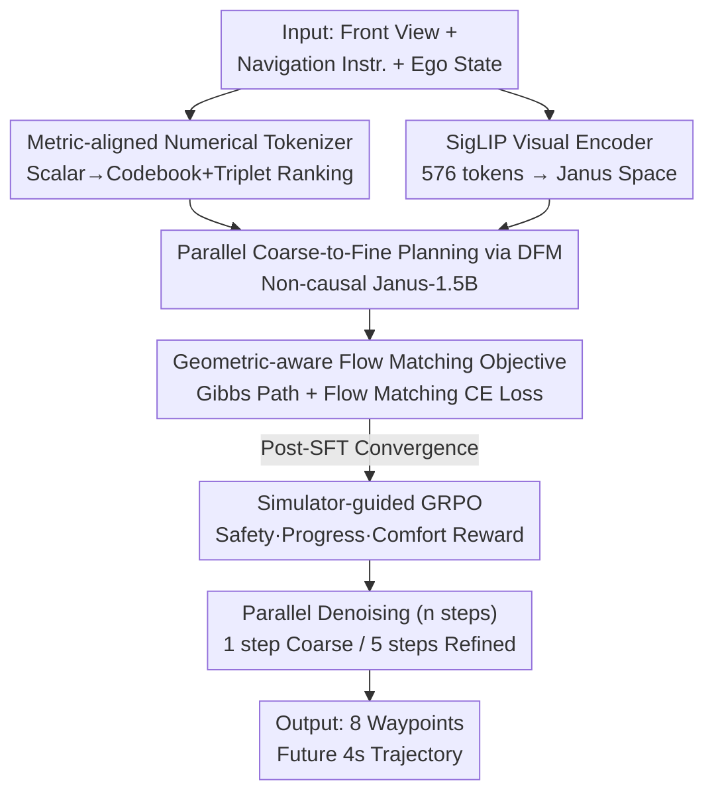

# WAM-Flow: Parallel Coarse-to-Fine Motion Planning via Discrete Flow Matching for Autonomous Driving

**Conference**: CVPR 2026  
**Paper**: [CVF Open Access](https://openaccess.thecvf.com/content/CVPR2026/html/Xu_WAM-Flow_Parallel_Coarse-to-Fine_Motion_Planning_via_Discrete_Flow_Matching_for_CVPR_2026_paper.html)  
**Code**: https://github.com/fudan-generative-vision/WAM-Flow (Available)  
**Area**: Autonomous Driving / Motion Planning  
**Keywords**: Discrete Flow Matching, Vision-Language-Action Model, Trajectory Planning, Numerical Tokenizer, GRPO

## TL;DR
WAM-Flow reformulates trajectory planning for end-to-end autonomous driving as "Discrete Flow Matching (DFM) in a discrete token space." By replacing autoregressive token-by-token decoding with fully parallel, bidirectional denoising, it achieves "coarse-to-fine" planning with an adjustable number of steps—obtaining 89.1 PDMS with a single denoising step (approx. 4.67× faster than autoregressive baselines) and refining to 90.3 PDMS with 5 steps, outperforming autoregressive and diffusion-based VLA baselines on NAVSIM-v1.

## Background & Motivation

**Background**: The mainstream of end-to-end autonomous driving involves Vision-Language-Action (VLA) models that map front-view images and navigation instructions to the ego-vehicle's future trajectory. Currently, there are two major paradigms: "dual-system" approaches—using autoregressive VLMs for high-level reasoning/scene understanding followed by a diffusion planner to iteratively generate smooth trajectories (e.g., ReCogDrive, DiffusionDrive); and "single-system" approaches—treating trajectories directly as text tokens for autoregressive generation via VLM (e.g., EMMA, DrivingGPT, AutoVLA).

**Limitations of Prior Work**: Autoregressive decoding requires sequential generation token-by-token, leading to low parallelism, slow inference, and accumulated exposure bias (each step requires committing a token, making it impossible to correct previous errors). Autoregressive solutions like FSDrive take 10.58s for a single inference. While diffusion-based solutions support parallel sampling, they usually lack explicit linguistic reasoning interpretability and involve a high number of denoising steps in continuous action spaces.

**Key Challenge**: Policy representation needs to balance three competing objectives: **expressive reasoning capabilities**, **high-precision continuous control**, and **robust closed-loop performance**. Autoregression sacrifices speed and parallelism, while diffusion sacrifices reasoning interpretability; neither can freely switch between "fast coarse solutions for simple scenarios" and "slow refined solutions for complex interactions."

**Key Insight**: The authors observe that Discrete Flow Matching (DFM) natively supports **full parallelism and bidirectional denoising**: it uses a Continuous-Time Markov Chain (CTMC) to transport a simple prior distribution to the data distribution, where all coordinates are updated simultaneously and can be corrected iteratively during denoising. This implies that one can start from a coarse trajectory hypothesis and gradually improve accuracy by increasing denoising steps, obtaining an **adjustable compute-accuracy trade-off**—perfectly matching the driving demand for "speed in simple roads and precision in complex interactions."

**Goal / Core Idea**: Introduce DFM into autonomous driving VLAs. Three main obstacles exist: (1) training DFM from scratch is computationally expensive, requiring initialization from a general autoregressive VLM (Janus-1.5B) which lacks road condition knowledge; (2) standard text token embeddings weakly encode numerical metric relationships, failing at high-precision trajectory regression; (3) likelihood-based flow matching only aligns with expert trajectories without explicitly constraining closed-loop metrics like safety, progress, and comfort. WAM-Flow addresses these via "multi-stage adaptation + metric-aligned numerical tokenizer + geometric-aware flow matching objective + simulator-guided GRPO."

## Method

### Overall Architecture

The input to WAM-Flow includes: a single front-view image + natural language navigation instructions (including system prompt) + current ego-vehicle status (position, heading, velocity, acceleration). The output is a trajectory of 8 waypoints for the future 4 seconds. The backbone is a modified Janus-1.5B multimodal model: images are encoded by SigLIP into 576 visual tokens and aligned to a 2048-dimensional text space via MLP; the language side expands the Janus vocabulary with 20,001 "numerical tokens" specifically for ego-status numbers and output waypoint coordinates, totaling 122,401 tokens.

The key shift is **changing the decoding method from autoregressive (causal, token-by-token) to discrete flow matching (non-causal, fully parallel)**: instead of spitting out tokens one by one, the model learns a "velocity field / posterior estimation" to denoise all coordinates simultaneously over the time interval $[0,1]$, completing the full trajectory in $n$ steps. Training involves supervised fine-tuning (SFT) with flow matching loss followed by simulator-guided GRPO reinforcement learning to align closed-loop behavior.

### Key Designs

**1. Parallel Coarse-to-Fine Planning via DFM: Replacing Autoregression with Parallel Bidirectional Denoising**

This is the paradigm foundation, addressing the "AR is slow and suffers from exposure bias, while diffusion lacks reasoning" conflict. DFM defines the state space as $S=\mathcal{T}^D$ ($D$ discrete variables in $\mathcal{T}=\{1,\dots,K\}$) and uses a time-dependent probability path $\{p_t(x)\}_{t\in[0,1]}$ to transport a simple source distribution $p(x)=\prod_i p_i(x^i)$ to the data distribution $q(x)$, with boundary conditions $p_0(x)=p(x)$ and $p_1(x)=q(x)$. This path is implemented by a CTMC whose rate matrix $u_t(x,z)$ gives the transition probability under a small step $h$:

$$P(x_{t+h}=x \mid x_t=z) = \delta_z(x) + h\,u_t(x,z) + o(h)$$

Constraints include $u_t(x,z)\ge 0\ (x\neq z)$, $\sum_x u_t(x,z)=0$, and satisfying the Kolmogorov forward equation $\dot p_t(x)+\mathrm{div}_x(j_t)=0$. The fundamental difference from AR's "token-by-token commitment" is that DFM allows every coordinate to transition repeatedly and reference others (bidirectional) during denoising, with all coordinates updating in parallel—eliminating the sequential bottleneck and preventing early errors from propagating. Inference uses Euler discretization to slice $[0,1]$ into $n$ steps of length $h=1/n$; more steps lead to higher precision.

**2. Metric-Aligned Numerical Tokenizer: Enforcing Latent Space Distances to Reflect Scalar Differences**

Addressing the issue where standard text token embeddings lack metric structure for high-precision regression. The authors discretize continuous scalars (position, heading, velocity, acceleration) on $[-100, 100]$ with 0.01 resolution into a unified codebook $V=\{v_1,\dots,v_N\}$ ($N=20001$). Each scalar token is mapped via linear projection $E:\mathbb{R}\to\mathbb{R}^d$ and L2-normalized to embedding $z=E(v)/\lVert E(v)\rVert_2$. The core constraint is that **Euclidean distance in latent space is monotonic to scalar differences**: for any triplet $(i,j,k)$, if $|v_i-v_j|<|v_i-v_k|$, then $d_{ij}<d_{ik}$ (where $d_{ij}=\lVert z_i-z_j\rVert_2$). This is enforced via a triplet margin ranking loss:

$$\mathcal{L}_{\mathrm{num}} = \mathbb{E}_{(i,j,k)\sim\mathcal{T}}\big[\max(0,\; d_{ij}-d_{ik}+\alpha)\big]$$

where $\alpha>0$ is a fixed margin (0.05 in experiments). This ensures "similar numerical values → similar embeddings," making DFM's "coarse-to-fine" refinement numerically stable. The distance $d_i(\cdot,\cdot)$ is also directly used in the geometric-aware objective. This step is a major performance driver: changing Janus text tokenizers to specialized numerical tokenizers improved PDMS from 76.2 to 81.1 (+4.9), and adding metric alignment further gained +2.3 to 83.4.

**3. Geometric-Aware Flow Matching Objective: Defining Transitions Toward the Target via Distance-based Gibbs Paths**

To ensure the probability path respects the underlying geometry, a distance metric $d$ induces a Gibbs distribution as the conditional path:

$$p_t(x \mid x_1) = \mathrm{softmax}\big(-\beta_t\, d(x,x_1)\big), \quad \beta_0=0,\ \beta_1\to\infty$$

$\beta_t$ is a monotonically increasing schedule on $[0,1]$. $d(x,x_1)=\sum_i w_i d_i(x^i,x_1^i)$ is a weighted sum of coordinate differences (using tokenizer distances for numbers, cyclic metrics for angles, and semantic distances for text). The corresponding conditional transition rate pushes states toward the target:

$$u_t(x,z\mid x_1) = p_t(x\mid x_1)\,\dot\beta_t\big[d(z,x_1)-d(x,x_1)\big]_+$$

The $[\cdot]_+=\max(0,\cdot)$ operator ensures transitions only reward lowering the distance to the target. The training objective is for the model to estimate the true posterior $p_{1|t}(x_1\mid x)$ by minimizing the conditional flow matching cross-entropy:

$$\mathcal{L}_{\mathrm{CE}}(\theta) = \mathbb{E}_{t\sim\mathcal{U}[0,1],\,x_1\sim q,\,x\sim p_t(\cdot\mid x_1)}\Big[-\sum_{i=1}^D \log p_{1|t}^{\theta,i}(x_1^i\mid x)\Big]$$

Transitions are limited to single coordinates to ensure high-dimensional tractability. This geometric awareness allows for efficient parallel decoding and controllable refinement.

**4. Simulator-Guided GRPO: Explicitly Including Safety/Progress/Comfort in Rewards Without Breaking Parallelism**

Likelihood flow matching ensures the model "looks like expert trajectories" but doesn't explicitly guarantee closed-loop safety (collisions, drivable area) or comfort. The authors decompose the NAVSIM PDMS score into a composite reward of "Safety Penalties × Performance Goals":

$$R(\tau) = \underbrace{\Big(\textstyle\prod_{m\in\mathcal{M}} s_m(\tau)\Big)}_{\text{Safety Penalties}} \cdot \underbrace{\Big(\frac{\sum_{w\in\mathcal{W}}\lambda_w s_w(\tau)}{\sum_{w\in\mathcal{W}}\lambda_w}\Big)}_{\text{Performance Goals}}$$

Where $\mathcal{M}=\{\text{NC, DAC}\}$ are safety terms (no-collision, drivable area compliance) and $\mathcal{W}=\{\text{EP, TTC, C}\}$ are performance terms (progress, time-to-collision, comfort). Safety terms use **multiplication**—any violation clears the total reward to 0, ensuring hard constraint satisfaction. Performance terms use weighted averages for smooth trade-offs. For each context $c$, $G$ trajectories are sampled via parallel denoising, and advantages $A_i=R_i-\frac1G\sum_j R_j$ are calculated for the GRPO surrogate with clipping and KL regularization:

$$\mathcal{L}_{\mathrm{GRPO}}(\theta) = \mathbb{E}_c\Big[\tfrac1G\sum_{i=1}^G\tfrac{1}{T_i}\sum_{k=1}^{T_i}\big(\min\{r_i^k A_i,\ \mathrm{clip}(r_i^k,1-\epsilon,1+\epsilon)A_i\} - \beta D_{\mathrm{KL}}(\pi_\theta\,\Vert\,\pi_{\mathrm{ref}})\big)\Big]$$

This step boosted PDMS from 86.7 (SFT-only) to 90.3.

### Loss & Training

The autoregressive backbone is adapted via a **four-stage curriculum**: ① Freeze VLA backbone, train newly initialized numerical embeddings + LM head on 668K nuPlan (4 epochs, $\mathcal{L}_{\mathrm{CE}}$ + $\mathcal{L}_{\mathrm{num}}$); ② Pre-train on 6.5M VQA (3.4M general LLaVA + 3.1M driving-specific RecogDrive VQA) for road condition awareness (3 epochs, $\mathcal{L}_{\mathrm{CE}}$); ③ SFT on nuPlan (2 epochs, $\mathcal{L}_{\mathrm{CE}}$); ④ Run simulator-guided GRPO on 103K NAVSIM (0.5 epoch). Training uses 4×8 Ascend 910B NPUs.

## Key Experimental Results

### Main Results (NAVSIM-v1 Closed-loop)

Using only a single front-view camera, Ours outperforms methods using multi-view or LiDAR. 5-step inference achieves the highest PDMS of 90.3, with top-tier safety scores (NC, DAC).

| Method | Paradigm | Backbone | Input | NC↑ | DAC↑ | TTC↑ | EP↑ | PDMS↑ |
|------|------|------|------|-----|------|------|-----|-------|
| DiffusionDrive | Diff. | - | 3×Cam+L | 98.2 | 96.0 | 94.8 | 82.2 | 88.1 |
| AutoVLA | AR | Qwen2.5-3B | 3×Cam | 98.4 | 95.6 | 98.0 | 81.9 | 89.1 |
| ReCogDrive | AR+Diff. | InternVL3-8B | 3×Cam | 98.2 | 97.5 | 95.2 | 83.5 | 89.6 |
| **WAM-Flow (Ours)** | **DFM** | **Janus-1.5B** | **1×Cam** | **99.2** | **98.3** | **97.0** | 82.3 | **90.3** |

On NAVSIM-v2, Ours reaches 84.7, leading ReCogDrive (83.6), and excels in sub-metrics like DDC (99.5) and LK (97.4).

### Ablation Study (NAVSIM-v1, Cumulative)

| Num. Tokenizer | Metric Alignment | VQA Pre-training | SG-GRPO | PDMS↑ | Gain |
|:---:|:---:|:---:|:---:|------|------|
| ✗ | ✗ | ✗ | ✗ | 76.2 | Baseline (Janus text tokens) |
| ✓ | ✗ | ✗ | ✗ | 81.1 | +4.9 |
| ✓ | ✓ | ✗ | ✗ | 83.4 | +2.3 |
| ✓ | ✓ | ✓ | ✗ | 86.7 | +3.3 |
| ✓ | ✓ | ✓ | ✓ | **90.3** | +3.6 |

### Efficiency and Coarse-to-Fine Analysis (NAVSIM-v1)

A monotonic trade-off exists between denoising steps and precision/latency; 1 step already exceeds most baselines with the lowest latency.

| Method | Paradigm | Steps | PDMS↑ | Inference Latency↓ |
|------|------|:---:|------|------|
| FSDrive | AR | - | 85.1 | 10.58s |
| DiffusionDrive | Diff. | 2 | 88.1 | 0.20s |
| ReCogDrive | AR+Diff. | 5 | 89.6 | 0.42s |
| **WAM-Flow** | DFM | 1 | 89.1 | **0.09s** |
| **WAM-Flow** | DFM | 5 | **90.3** | 0.48s |
| **WAM-Flow** | DFM | 10 | 90.2 | 0.94s |

### Key Findings
- **Numerical Tokenizer is the biggest contributor**: Switching from text tokens to dedicated numerical tokens improved PDMS by 4.9 in a single step, proving that "enforcing metric relationships in token space" is a prerequisite for high-precision regression in generative paradigms.
- **Coarse-to-fine holds true**: PDMS increases monotonically from 1 to 5 steps (89.1→90.3) with linear latency growth. Benefits saturate at 5 steps, with a slight drop at 10 steps (90.2).
- **Safety as multiplicative, performance as additive**: The reward structure ensures safety is a "hard constraint."
- **Small model outperforming larger baselines**: The 1.5B model with single camera and 1-step denoising is approx. 3× faster than Janus AR baselines.

## Highlights & Insights
- **First systematic introduction of "Discrete Flow Matching" to driving VLAs**: Parallel bidirectional denoising naturally provides adjustable steps, avoiding AR sequential bottlenecks while maintaining VLM reasoning capabilities.
- **Metric-aligned numerical tokenizer is a transferable trick**: This "triplet-margin" approach can be applied wherever language models are used for high-precision scalar regression.
- **Multiplicative safety rewards**: An elegant implementation of hard constraints to prevent performance metrics from "averaging out" safety risks.

## Limitations & Future Work
- **Weaker comfort metrics**: On NAVSIM-v2, scores for HC (97.6) and EC (73.9) lag behind ReCogDrive, suggesting reward trade-offs were biased toward safety and progress.
- **Dependency on simulator rewards**: GRPO relies on NAVSIM's PDMS decomposition, limiting transferability if the simulator's fidelity is capped.
- **Single-camera perception ceiling**: While cost-effective, the lack of surround-view information in complex/occluded scenarios remains a safety concern.

## Related Work & Insights
- **vs. Autoregressive VLAs (EMMA/DrivingGPT)**: These are slow due to sequential commit and suffer exposure bias; WAM-Flow's 1-step parallel denoising provides a 89.1 PDMS solution in 0.09s.
- **vs. Diffusion Planning (DiffusionDrive)**: WAM-Flow operates in **discrete token space**, leveraging VLM's pre-trained reasoning, and supports efficiency down to a single step.
- **vs. GRPO in Driving**: This is the first instance of applying GRPO to **Discrete Flow Matching** with explicit safety alignment rewards.

## Rating
- Novelty: ⭐⭐⭐⭐⭐ 
- Experimental Thoroughness: ⭐⭐⭐⭐ 
- Writing Quality: ⭐⭐⭐⭐ 
- Value: ⭐⭐⭐⭐⭐ 

<!-- RELATED:START -->

## Related Papers

- [\[CVPR 2026\] GuideFlow: Constraint-Guided Flow Matching for Planning in End-to-End Autonomous Driving](guideflow_constraint-guided_flow_matching_for_planning_in_end-to-end_autonomous_.md)
- [\[CVPR 2026\] ColaVLA: Leveraging Cognitive Latent Reasoning for Hierarchical Parallel Trajectory Planning in Autonomous Driving](colavla_leveraging_cognitive_latent_reasoning_for_hierarchical_parallel_trajecto.md)
- [\[NeurIPS 2025\] Flow Matching-Based Autonomous Driving Planning with Advanced Interactive Behavior Modeling](../../NeurIPS2025/autonomous_driving/flow_matching-based_autonomous_driving_planning_with_advanced_interactive_behavi.md)
- [\[AAAI 2026\] DiffRefiner: Coarse to Fine Trajectory Planning via Diffusion Refinement with Semantic Interaction for End to End Autonomous Driving](../../AAAI2026/autonomous_driving/diffrefiner_coarse_to_fine_trajectory_planning_via_diffusion_refinement_with_sem.md)
- [\[CVPR 2026\] Unleashing VLA Potentials in Autonomous Driving via Explicit Learning from Failures](unleashing_vla_potentials_in_autonomous_driving_via_explicit_learning_from_failu.md)

<!-- RELATED:END -->
