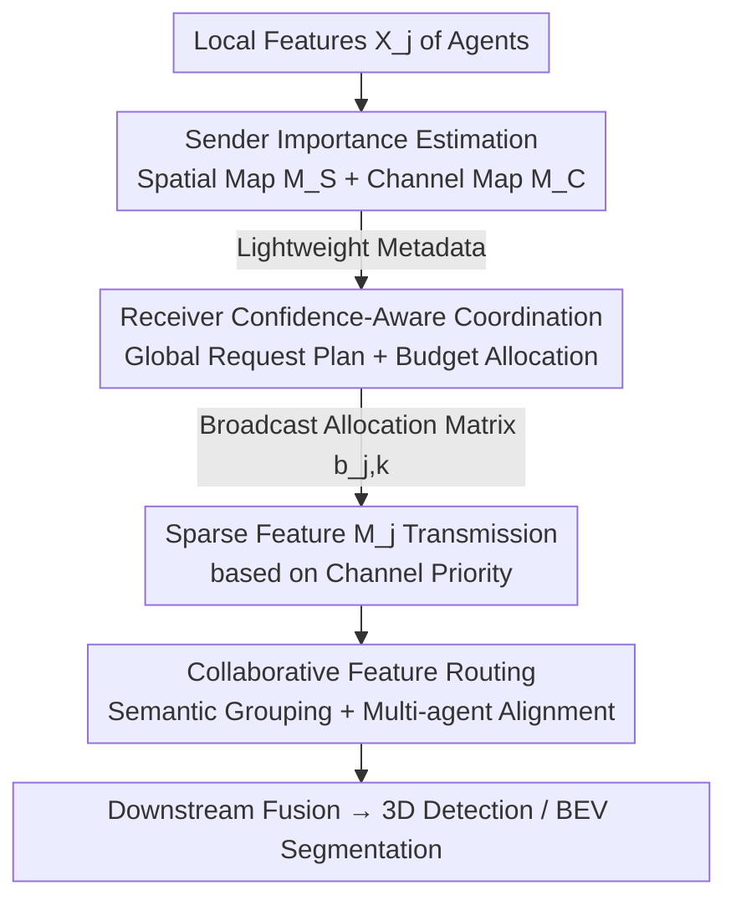

# WhisperNet: A Scalable Solution for Bandwidth-Efficient Collaboration

**Conference**: CVPR 2026  
**Paper**: [CVF Open Access](https://openaccess.thecvf.com/content/CVPR2026/html/Chen_WhisperNet_A_Scalable_Solution_for_Bandwidth-Efficient_Collaboration_CVPR_2026_paper.html)  
**Code**: TBD  
**Area**: Autonomous Driving / Collaborative Perception  
**Keywords**: Collaborative Perception, V2X Communication, Bandwidth Efficiency, Channel Redundancy, Receiver-Side Coordination

## TL;DR
WhisperNet flips the collaborative perception communication strategy from "senders choosing spatial regions" to "receiver-centric global scheduling." Based on lightweight metadata reported by all parties, the receiver simultaneously determines "where (spatial)" and "what (channels)" to transmit, improving AP@0.7 by 2.4% while using only 0.5% bandwidth on OPV2V.

## Background & Motivation

**Background**: Collaborative Perception (CP) enables multiple vehicles and roadside units to share intermediate features via V2X communication, compensating for occlusions in single-vehicle perspectives. This is a critical support for autonomous driving safety. Leading intermediate fusion schemes (e.g., V2VNet, V2X-ViT) trade off accuracy for bandwidth, but bandwidth remains the primary bottleneck for large-scale deployment.

**Limitations of Prior Work**: To save bandwidth, previous research followed two paths. The first is **feature compression and reconstruction** (e.g., CORE, AttFuse), which uses fixed-rate encoders to compress the entire feature map into a latent representation. The problem is that static codebooks cannot adapt to scene complexity or dynamic bandwidth, forcing a hard trade-off between fidelity and throughput. The second is **spatial selection** (e.g., Where2comm, CoSDH), which transmits only foreground salient regions. However, these only optimize the "where" and still transmit **all channels** for every selected region, ignoring the massive redundancy in the channel dimension.

**Key Challenge**: The authors conducted a key observation experiment: pruning channels based on L1-norm revealed that **removing nearly half of the channels results in negligible performance drops** (a 6.67× compression on OPV2V with less than a 6.5% drop in AP@0.3). this suggests channels can be categorized into three types: **primary channels** defining objects, **secondary channels** providing context, and **marginal channels** that are largely redundant and introduce noise. Current methods focus solely on the spatial dimension, solving only half of the problem.

**Goal**: An efficient communication strategy must **jointly optimize "where" and "what" to transmit**, performing content-aware budget allocation in both spatial and channel dimensions.

**Key Insight**: Rather than having each sender decide what to transmit based on an ego-centric or pairwise view—which leads to redundant uploads in some areas and gaps in others—the **receiver should act as a global coordinator**. By summarizing metadata from all vehicles, the receiver can orchestrate a system-level plan to avoid redundancy and ensure scene completeness.

**Core Idea**: Flip the "sender-side filtering" paradigm into a "receiver-centric global coordination." Senders report lightweight saliency metadata, and the receiver formulates a global request plan to dynamically allocate bandwidth across vehicles and channels, retrieving only the most informative feature subsets.

## Method

### Overall Architecture

WhisperNet implements the "communication module $C$" within a CP system. Given a bandwidth budget $B_j$, each agent $j$ determines which features to emit to maximize the fusion performance of the ego agent $i$:

$$\max_{C}\ P\!\left(F\!\left(X_i, \{M_j^{(k)}\}_{j\neq i,\forall k}\right)\right)\quad \text{s.t.}\ \sum_{k=1}^{K}\text{Size}(M_j^{(k)})\le B_j,\ \forall j\in V$$

The pipeline consists of three modules following a "request-response" protocol: ① **Sender Importance Estimation**: Each vehicle analyzes local features to generate lightweight spatial and channel saliency maps. ② **Receiver Confidence-Aware Coordination**: The ego agent aggregates all metadata, formulates a global plan (assigning budgets per region and agent), and broadcasts it. ③ **Sparse Feature Transmission & Routing**: Agents transmit requested sparse features, followed by **Collaborative Feature Routing** for channel alignment before fusion.

### Key Designs

**1. Sender Spatial-Channel Joint Importance Estimation: Channel Grading via Laplacian Energy**

To address the oversight of channel redundancy, each vehicle computes two maps for local features $X_j \in \mathbb{R}^{H \times W \times C}$. For the spatial side, a two-layer convolutional head $G_S$ predicts a spatial importance map $M_{S,j} = G_S(X_j) \in [0,1]^{H \times W}$. For the channel side, the core insight is that "high-frequency details are more valuable than low-frequency information." Features are partitioned into patches, and a $3 \times 3$ Laplacian kernel computes the information density score $S(p^k_{j,c}) = \|\nabla^2 p^k_{j,c}\|_1$. Channels are classified into primary/secondary/marginal groups via a $1 \times 1$ convolution head with Softmax probabilities $\pi_{j,k,c}$ and learnable group weights $\omega$. The channel saliency map is the weighted max score:

$$M_{C,j}(k) = \max_c \big[ (\omega^\top \pi_{j,k,c}) \, S(p^k_{j,c}) \big]$$

The local channel weights $W_{C,j}$ are retained locally and not transmitted, serving as the basis for selecting specific channels once the budget is received.

**2. Receiver Confidence-Aware Coordination: Global Budget Redistribution**

Acting as the coordinator, the receiver uses a **Channel Merit Distributor** (CMD) to refine reported channel maps: $\hat{M}_{C,j} = H(\{M_{C,l}\}_{l \neq i})$, where $H$ performs convolution and Gaussian filtering for cross-agent smoothing. The "collaboration share" $s_{j,k}$ for agent $j$ at patch $k$ is calculated as its relative importance. Simultaneously, the **Spatial Focus Engine** (SFE) aggregates spatial maps to derive a global budget distribution $P_S(k)$. The budget for a patch is $\hat{B}_{patch}(k) = B \cdot P_S(k)$, which is then distributed to agents as $b_{j,k} = \lfloor \hat{B}_{patch}(k) \cdot s_{j,k} \rfloor$. Agents respond by transmitting channels in order of priority: primary first, then secondary, with marginal channels sent only if budget remains.

**3. Collaborative Feature Routing: Alignment via Multi-Scale Experts**

To resolve inconsistencies in received sparse feature channels, this module performs semantic alignment. Sparse features $\{M_j\}$ are zero-padded and concatenated. For each channel $c$, a routing network generates a soft assignment vector $g_c = \text{Softmax}(\text{MLP}(\text{GlobalAvgPool}(X_{in}^c))) \in \mathbb{R}^m$, assigning the channel to the most compatible experts. Each expert uses parallel $3 \times 3, 5 \times 5, 7 \times 7$ multi-scale convolutions to align intra-agent representations and attention-based inter-agent recalibration. A residual Squeeze-and-Excitation branch performs global channel recalibration.

### Loss & Training

The backbone utilizes PointPillars (voxel size 0.4m), following OpenCOOD/OPV2V benchmarks with a 70m communication range. The spatial budget temperature $\tau_s$ is set to 1, and the number of experts is 4. All communication rates are measured relative to a 16× compressed intermediate fusion baseline.

## Key Experimental Results

### Main Results

WhisperNet achieves state-of-the-art accuracy with the fewest parameters (7.28M) on OPV2V and DAIR-V2X:

| Method | Params | OPV2V AP@0.5 | OPV2V AP@0.7 | DAIR-V2X AP@0.5 | DAIR-V2X AP@0.7 |
| :--- | :--- | :--- | :--- | :--- | :--- |
| CoAlign | 11.42M | 0.9132 | 0.8381 | 0.7772 | 0.6284 |
| DSRC | 10.14M | 0.9183 | 0.8526 | 0.7852 | 0.6360 |
| ERMVP | 11.87M | 0.9139 | 0.8404 | 0.7675 | 0.6350 |
| CoSDH | 8.52M | 0.8952 | 0.8373 | 0.7042 | 0.5766 |
| **Ours** | **7.28M** | **0.9334** | **0.8764** | **0.7915** | **0.6480** |

At a 1% communication rate, WhisperNet outperforms competitors by 10.6% and 11.7% on OPV2V and DAIR-V2X, respectively. Even at 0.5% bandwidth, it maintains baseline performance.

### Ablation Study

Incremental contribution of modules (OPV2V, transmission limit <50%):

| Config (CMD/SFE/CFR) | OPV2V Comm. Vol. | OPV2V AP@0.5/0.7 | DAIR-V2X AP@0.5/0.7 |
| :--- | :--- | :--- | :--- |
| Baseline | 32.81 | 0.8926/0.8333 | 0.7532/0.5907 |
| CMD | 16.40 | 0.9206/0.8532 | 0.7627/0.6036 |
| CMD + SFE | 15.62 | 0.9310/0.8683 | 0.7741/0.6271 |
| **Full** | **15.62** | **0.9334/0.8764** | **0.7915/0.6480** |

### Key Findings
- **CMD is the primary bandwidth saver**: Adding CMD alone halves communication volume while increasing accuracy, confirming that pruning marginal channels removes noise.
- **Low-bandwidth favors channel selection**: The advantage is most pronounced at 1% bandwidth, indicating that joint spatial-channel selection is critical under extreme constraints.
- **Expert trade-off**: Performance peaks at 4 experts; increasing to 8 degrades results due to over-specialization and information fragmentation.
- **Noise Robustness**: Maintains high performance under pose noise ($\sigma=0.6$), dropping only 16.0% compared to $>75\%$ for competitors like ERMVP.

## Highlights & Insights
- **Channel Redundancy is the Core Pivot**: The preliminary experiment showing that pruning half the channels does not degrade accuracy provides a strong motivation and shifts the research focus from the saturated spatial dimension to the overlooked channel dimension.
- **Paradigm Shift**: Transitioning from "sender-side decision" to "receiver-centric global coordination" structuraly resolves the problem of redundant or missing information inherent in pairwise methods.
- **Protocol Transferability**: The two-stage "metadata-first, feature-later" protocol is highly applicable to any bandwidth-constrained multi-agent system (e.g., multi-robotics, sensor networks).
- **Laplacian as Saliency**: Using Laplacian energy for channel importance is a simple yet theoretically grounded trick (high-frequency = details) that proves superior to alternatives like Jacobian or Max/Mean pooling.

## Limitations & Future Work
- **Multi-round Communication Overhead**: The cost of metadata exchange (broadcasting maps and allocation matrices) is not fully dissected, especially its proportion at the 0.5% extreme bandwidth.
- **Feature Space Consistency**: The channel routing assumes semantic alignment across agents, which may not hold for heterogeneous fleets (different backbones or sensors).
- **Laplacian Sensitivity to Noise**: In adverse weather (fog/rain), high-frequency noise might be misinterpreted as high information density.
- **Dynamic Scale Selection**: The choice between single and multi-scale experts is currently manual rather than bandwidth-adaptive.

## Related Work & Insights
- **vs. Where2comm / CoSDH**: These focus only on "where" to transmit. WhisperNet adds "what" (channels) and upgrades decision-making to a global receiver-centric coordination.
- **vs. CORE / AttFuse**: These rely on static compression. WhisperNet provides content-aware dynamic budget allocation, remaining robust at 0.5% bandwidth where static methods fail.

## Rating
- Novelty: ⭐⭐⭐⭐⭐ (Dual focus on channel redundancy + receiver-centric coordination).
- Experimental Thoroughness: ⭐⭐⭐⭐⭐ (Across two datasets, bandwidth curves, and noise robustness).
- Writing Quality: ⭐⭐⭐⭐ (Clear motivation, though module naming and notation are dense).
- Value: ⭐⭐⭐⭐⭐ (High practical value for real-world deployment with 0.5% bandwidth usability).

<!-- RELATED:START -->

## Related Papers

- [\[ICLR 2026\] DriveMamba: Task-Centric Scalable State Space Model for Efficient End-to-End Autonomous Driving](../../ICLR2026/autonomous_driving/drivemamba_task-centric_scalable_state_space_model_for_efficient_end-to-end_auto.md)
- [\[CVPR 2026\] CoLC: Communication-Efficient Collaborative Perception with LiDAR Completion](colc_communication-efficient_collaborative_perception_with_lidar_completion.md)
- [\[CVPR 2026\] Efficient Equivariant Transformer for Self-Driving Agent Modeling](efficient_equivariant_transformer_for_self-driving_agent_modeling.md)
- [\[CVPR 2026\] MAD: Motion Appearance Decoupling for Efficient Driving World Models](mad_motion_appearance_decoupling_for_efficient_driving_world_models.md)
- [\[CVPR 2026\] NoRD: A Data-Efficient Vision-Language-Action Model that Drives without Reasoning](nord_a_data-efficient_vision-language-action_model_that_drives_without_reasoning.md)

<!-- RELATED:END -->
