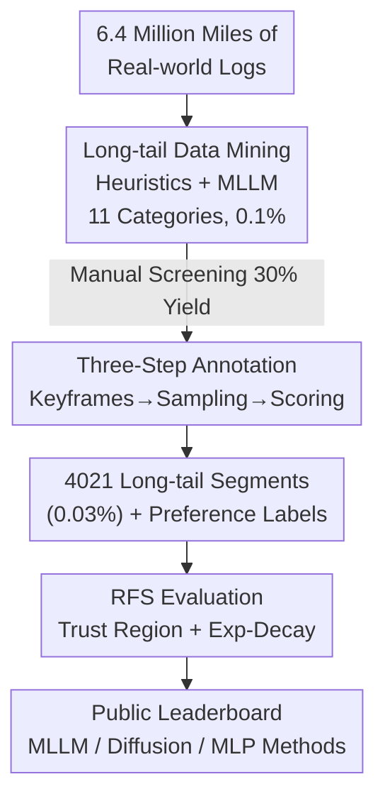

# WOD-E2E: Waymo Open Dataset for End-to-End Driving in Challenging Long-tail Scenarios

**Conference**: CVPR 2026  
**Paper**: [CVF Open Access](https://openaccess.thecvf.com/content/CVPR2026/html/Xu_WOD-E2E_Waymo_Open_Dataset_for_End-to-End_Driving_in_Challenging_Long-tail_CVPR_2026_paper.html)  
**Code**: TBD (Dataset released with the 2025 WOD-E2E Challenge)  
**Area**: Autonomous Driving  
**Keywords**: End-to-End Driving, Long-Tail Scenarios, Evaluation Benchmark, Human Preference Scoring, Multimodal Trajectories

## TL;DR
Waymo extracted 4,021 long-tail driving segments (approx. 12 hours) with an occurrence frequency below 0.03% from 6.4 million miles of real-world road tests to create the WOD-E2E dataset. It proposes the RFS (Rater Feedback Score), an open-loop metric based on human expert preference scores, to replace ADE (which only measures distance error against a single future trajectory). This allows for a fair evaluation of vision-based end-to-end models in safety-critical scenarios where "multiple reasonable trajectories coexist."

## Background & Motivation

**Background**: Vision-based end-to-end (E2E) driving—directly mapping multi-camera images to future trajectories while bypassing the perception-prediction-planning cascade—is becoming a research hotspot due to its scalability and natural fit with the reasoning capabilities of Multimodal Large Language Models (MLLM). Advancing this field requires suitable datasets and evaluation metrics.

**Limitations of Prior Work**: The authors highlight two independent gaps. First, **Data Distribution**: Existing E2E datasets (nuScenes, NAVSIM, WOMD, CoVLA) consist mostly of "nominal scenarios"—standard following and intersection crossing—rarely exposing the system to infrequent hazards, thus failing to measure robustness and generalization. Second, **Evaluation Metrics**: Mainstream ADE/L2 errors only compare the predicted trajectory against a **single** ground truth trajectory. However, driving is inherently multimodal (decelerating, swerving, or stopping might all be correct in a hazard). Metrics like PDMS depend on annotated positions of road users to calculate collision rates, failing for amorphous obstacles like "a flock of birds," and they strictly penalize lane crossing/departure, though emergency maneuvers often require brief boundary crossings.

**Key Challenge**: In long-tail safety scenarios, "correct driving" is not a single line but a set of acceptable trajectories. Any metric that compares predictions against a single ground truth or enforces rigid rule-based penalties will provide incorrect signals.

**Goal**: (1) Create a real-world E2E dataset **specifically focused on the long tail**; (2) Design an open-loop evaluation metric that **aligns with human judgment and tolerates multimodality**.

**Key Insight**: Since "right or wrong" cannot be defined solely by rules, human experts are invited to provide scores. Multiple candidate trajectories are sampled for the same hazard, and annotators score them from 0–10 based on safety, legality, and response time, ensuring at least one is a "good answer." The model receives a high score as long as it is close to any high-scoring trajectory.

**Core Idea**: Replace distance error with RFS, which utilizes "human preference scores + exponential decay within a trust region." This is supported by a data pipeline that mines long-tail events from massive road tests followed by a three-step manual annotation process, turning long-tail E2E driving into a quantifiable, leaderboard-ready benchmark.

## Method

As a dataset and evaluation protocol paper, the "method" consists of two parts: **how to mine and annotate the 0.03% long-tail segments from 6.4 million miles**, and **the definition of the RFS metric**. The overall data pipeline is: Massive road test logs → Long-tail mining (Rules + MLLM) → Manual re-screening → Three-step annotation (Keyframe selection / Candidate trajectory sampling / Scoring) → RFS evaluation supported by preference labels.

### Overall Architecture

The dataset consists of 4,021 segments, each 20 seconds long, partitioned into 2,037 / 479 / 1,505 for training/validation/testing. Each segment provides 360° coverage via 8 surround-view cameras (one JPEG per direction at 10Hz, with intrinsics/extrinsics to project 3D trajectories back to images), high-level routing commands (enumerated as `GO_STRAIGHT / GO_LEFT / GO_RIGHT`, derived from the actual route over the next 10 seconds), and ego-vehicle states (trajectory, velocity, and acceleration for the past 4 seconds at 4Hz; future 5s ground truth is provided for training/validation). Each segment is labeled with one of 11 scenario categories (Construction, Intersection, Pedestrian, Cyclist, Multi/Single lane maneuver, Cut-in, Road debris/FOD, Emergency vehicle, Spotlight, Others). The following key designs correspond to the mining, annotation, and evaluation stages.

### Key Designs

**1. Long-tail Data Mining: Extracting 0.03% Rare Hazards from Nominal Data**

The pain point is that 99.9% of real-world logs are mundane, making manual searching for long-tail events extremely costly. The authors use a two-stage "Heuristics + MLLM" mining process: initially, all logs are tagged with the 11 categories using rules based on existing auto-annotations (3D detection, mapping, tracking, prediction). Automated mining on 6,391,012 miles of logs yielded only 6,888 miles (0.1%) hitting long-tail criteria. This was followed by **manual re-screening** (approx. 30% yield, removing false positives), compressing the ratio further to 0.03%. The effectiveness of this filtering was validated using Gemini 2.5 Pro to score the rarity of various datasets (0–100, based on complexity/risk/long-tail factors). WOD-E2E showed the highest rarity scores across all percentiles, with the top 10% averaging ~93, significantly higher than nuScenes or NAVSIM.

**2. Three-Step Manual Annotation: Decomposing Correct Actions into Selection, Sampling, and Scoring**

Defining "correct action" in long-tail scenarios is ambiguous, so annotation is split into three steps. First, **Key Moment Selection**: Annotators watch the video to establish high-level understanding (e.g., "opposing car crossing double yellow lines to cut in, ego needs to nudge right") and precisely select the frame where the hazard first becomes visible and ego action should begin (early selection avoids historical motion bias). Second, **Trajectory Sampling**: An existing motion planner (e.g., Wayformer) generates up to 64 diverse candidate trajectories based on perception and prediction. These are automatically binned (speed, lane change, etc.), and humans select the final 3 trajectories—covering a spectrum from optimal to sub-optimal. Third, **Trajectory Scoring**: Annotators review the 3 candidates (Optimal / Reasonable / Sub-optimal) overlaid on the 20s scene using five dimensions: Safety, Legality, Response Time, Braking Necessity, and Efficiency. Scoring starts at 10, with deductions for violations (-2 for major, -1 for minor). Every segment is guaranteed to have at least one trajectory score above 6.

**3. Rater Feedback Score (RFS): Measuring Proximity to High-Score Trajectories**

At the core of the paper, RFS addresses the "single ground truth" limitation of ADE. Each segment has 3 reference trajectories with human scores $s_{\text{rater}}\in[0,10]$. RFS measures how well the predicted trajectory $t \in \{3,5\}$ matches these: a rectangular **trust region** is defined around each reference trajectory, bounded by longitudinal threshold $\tau_{\text{lng}}$ and lateral threshold $\tau_{\text{lat}}$. Baseline thresholds follow WOMD: $\bar\tau_{\text{lat}}=1.0, \bar\tau_{\text{lng}}=4.0$ for $t=3$ and $\bar\tau_{\text{lat}}=1.8, \bar\tau_{\text{lng}}=7.2$ for $t=5$. Thresholds are scaled linearly by the initial velocity $v$ (m/s) of the reference trajectory:

$$\text{scale}(v)=\begin{cases}0.5, & v<1.4,\\ 0.5+0.5\times\dfrac{v-1.4}{11-1.4}, & 1.4\le v<11,\\ 1, & v\ge 11.\end{cases}$$

Final thresholds are $\tau_{\text{lng}}=\text{scale}(v)\cdot\bar\tau_{\text{lng}}$ and $\tau_{\text{lat}}=\text{scale}(v)\cdot\bar\tau_{\text{lat}}$. Given longitudinal/lateral errors $\Delta_{\text{lng}}, \Delta_{\text{lat}}$, the score against a single reference trajectory is:

$$s_{\text{rater}}\times 0.1^{\;\max\left\{\max\left\{\frac{\Delta_{\text{lng}}}{\tau_{\text{lng}}},\ \frac{\Delta_{\text{lat}}}{\tau_{\text{lat}}}\right\}-1,\ 0\right\}}.$$

Intutively: predictions within the trust region receive the full human score $s_{\text{rater}}$, while those outside decay **exponentially** based on the distance exceeded. The final RFS is the maximum score among the 3 references (closeness to any good answer suffices), averaged over $t=3,5$, with a floor value of 4.

## Key Experimental Results

The paper does *not* propose a new model; experiments validate (1) dataset rarity, (2) RFS metric rationality, and (3) community leaderboard results. The baseline is NaiveEMMA (a simplified EMMA): Gemini Flash fine-tuned on the WOD-E2E train set with 8 cameras concatenated into a single 768×768 input, omitting chain-of-thought and test-time scaling.

### Main Results: Leaderboard Representative Methods

| Category | Method | RFS↑ | ADE↓ | Training Strategy | Backbone / Params |
|----------|--------|------|------|-------------------|-------------------|
| MLP | Swin-Trajectory | 7.543 | 2.814 | SFT | Swin Transformer / 36M |
| Diffusion | DiffusionLTF | 7.717 | 2.977 | SFT | DiffusionDrive / 60M |
| Diffusion | UniPlan | 7.779 | 2.986 | SFT | DiffusionDrive / 60M |
| MLLM | Baseline (NaiveEMMA) | 7.528 | 3.018 | SFT | Gemini Nano / 3B |
| MLLM | AutoVLA | 7.556 | 2.958 | SFT+RL | Qwen2.5 / 3B |
| MLLM | HMVLM | 7.736 | 3.071 | SFT | Qwen2.5 / 3B |
| MLLM | Poutine | **7.986** | **2.741** | SFT+RL | Qwen2.5 / 3B |

### Ablation Study: Does RFS Reward Long-tail Adaptation?

| Model Config | RFS | Description |
|--------------|-----|-------------|
| Baseline | 7.14 | NaiveEMMA start point |
| + WOD-E2E Finetune | 7.22 | Exposure to long-tail training data |
| + Multi-camera Input | 7.30 | 360° view aids context understanding |
| + Test-time Scaling | 7.39 | Handling scenario ambiguity via multi-sampling |

### Key Findings

- **RFS monotonically rewards long-tail handling**: Adding long-tail fine-tuning, multi-cameras, and multi-sampling consistently increases RFS (7.14 to 7.39), showing alignment with intuitions for long-tail robustness.
- **ADE and RFS are weakly correlated**: Scatter plots of 19 submissions show only slight positive correlation—e.g., WayNet has strong ADE but low RFS, whereas HMVLM has worse ADE but higher RFS. This proves ADE is insufficient in safety-critical multimodal scenarios.
- **Utility of extra data depends on model type**: MLLMs (Poutine, AutoVLA) benefit from out-of-distribution supplementary data, likely because chain-of-thought reasoning utilizes world knowledge to offset visual drift; Diffusion models (UniPlan) are more sensitive to pixel-level pixel distributions and may degrade with mixed data.
- **RL is effective only when rewards align with target metrics**: Both Poutine and AutoVLA used GRPO for RL, but Poutine used RFS as a reward while AutoVLA used ADE. Poutine achieved significantly higher RFS (7.986 vs 7.556), highlighting the need for reward alignment.

## Highlights & Insights

- **Human preference scoring is a pragmatic solution for multimodality**: Instead of struggling to define "correctness" via rules, the method acknowledges correctness as a set. Scoring optimal/reasonable/sub-optimal trajectories turns ambiguous safety judgments into comparable scalars while tolerating emergency boundary crossings.
- **RFS Design Triplets**: Max-pooling allows for multimodal tolerance; exponential decay provides smooth rather than cliff-like penalties; velocity scaling aligns with the physical intuition that longitudinal tolerance should increase at higher speeds.
- **MLLM as a "Rarity Judge"**: Using Gemini 2.5 Pro to score rarity across datasets provides a standardized, interpretable way to compare distribution tails, which could migrate to other data engineering tasks.
- **Leaderboard as Methodology**: Distilling 19 submissions into research questions (extra data influence, ADE-RFS relationship, RL reward alignment) adds methodological value to the dataset paper.

## Limitations & Future Work

- **Inherent Limits of Open-loop Evaluation**: WOD-E2E uses an open-loop setup—predictions do not affect the environment—preventing the assessment of error accumulation and closed-loop interaction. Moving to closed-loop remains a major bottleneck.
- **Subjectivity and Coverage of Preference Labels**: RFS depends on ratings of only 3 trajectories. If the true optimal trajectory is not sampled, the evaluation hits a ceiling. The deduction weights (-2/-1) are also heuristic.
- **RFS Floor Score (4) Compresses Discriminative Power**: All significantly deviant predictions receive 4 points, meaning RFS cannot easily distinguish "slightly bad" from "catastrophically dangerous" predictions.
- **Geographic and Scenario Skew**: Data is primarily from a few cities. While long-tail, behaviors like straight-line driving still dominate compared to extremely rare maneuvers like on-ramp merging or debris avoidance.

## Related Work & Insights

- **vs NAVSIM / nuPlan**: NAVSIM filters existing datasets and uses non-reactive simulation. WOD-E2E's advantage lies in mining rare events from raw logs and using human preference scores rather than PDMS, which can misjudge line-crossing for safety.
- **vs WOMD**: WOMD focuses on multi-agent interaction and only provides camera embeddings; WOD-E2E provides raw 360° images essential for vision-based E2E research.
- **vs ADE / PDMS**: Both metrics fail in multimodal or emergency-boundary scenarios; RFS replaces them by tolerating multiple solutions through human preference and trust regions.

## Rating
- Novelty: ⭐⭐⭐⭐ Combination of long-tail mining + human preference RFS is solid, though the engineering follows the WOD series paradigm.
- Experimental Thoroughness: ⭐⭐⭐⭐ Includes rarity comparison, RFS monotonicity, and leaderboard analysis; lacks a proprietary strong model and closed-loop validation.
- Writing Quality: ⭐⭐⭐⭐ Logical flow from motivation to solution; RFS formulas are complete.
- Value: ⭐⭐⭐⭐⭐ A real long-tail benchmark from Waymo with human-aligned metrics; already driving community progress through its challenge.

<!-- RELATED:START -->

## Related Papers

- [\[CVPR 2026\] LEAD: Minimizing Learner-Expert Asymmetry in End-to-End Driving](lead_minimizing_learner-expert_asymmetry_in_end-to-end_driving.md)
- [\[CVPR 2026\] Reliable Policy Transfer for Safety-Aware End-to-End Driving with Deep Reinforcement Learning](reliable_policy_transfer_for_safety-aware_end-to-end_driving_with_deep_reinforce.md)
- [\[ICML 2026\] DeepSight: Long-Horizon World Modeling via Latent States Prediction for End-to-End Autonomous Driving](../../ICML2026/autonomous_driving/deepsight_long-horizon_world_modeling_via_latent_states_prediction_for_end-to-en.md)
- [\[CVPR 2026\] TruckDrive: Long-Range Autonomous Highway Driving Dataset](truckdrive_long-range_autonomous_highway_driving_dataset.md)
- [\[CVPR 2026\] Scaling-Aware Data Selection for End-to-End Autonomous Driving Systems](scaling-aware_data_selection_for_end-to-end_autonomous_driving_systems.md)

<!-- RELATED:END -->
## Related Papers

- [\[CVPR 2026\] Reliable Policy Transfer for Safety-Aware End-to-End Driving with Deep Reinforcement Learning](reliable_policy_transfer_for_safety-aware_end-to-end_driving_with_deep_reinforce.md)
- [\[ICML 2026\] DeepSight: Long-Horizon World Modeling via Latent States Prediction for End-to-End Autonomous Driving](../../ICML2026/autonomous_driving/deepsight_long-horizon_world_modeling_via_latent_states_prediction_for_end-to-en.md)
- [\[CVPR 2026\] Scaling-Aware Data Selection for End-to-End Autonomous Driving Systems](scaling-aware_data_selection_for_end-to-end_autonomous_driving_systems.md)
- [\[CVPR 2026\] ActiveAD: Planning-Oriented Active Learning for End-to-End Autonomous Driving](activead_planning-oriented_active_learning_for_end-to-end_autonomous_driving.md)
- [\[CVPR 2026\] ResAD: Normalized Residual Trajectory Modeling for End-to-End Autonomous Driving](resad_normalized_residual_trajectory_modeling_for_end-to-end_autonomous_driving.md)

<!-- RELATED:END -->
