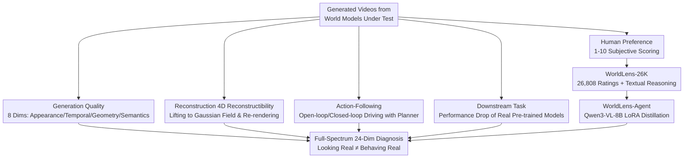

# WorldLens: Full-Spectrum Evaluations of Driving World Models in Real World

**Conference**: CVPR 2026  
**arXiv**: [2512.10958](https://arxiv.org/abs/2512.10958)  
**Code**: https://github.com/worldbench/WorldLens (Available)  
**Area**: Autonomous Driving / World Models / Evaluation Benchmark  
**Keywords**: Driving World Models, Full-Spectrum Evaluation, 4D Reconstruction, Closed-Loop Action-Following, Human Preference Alignment

## TL;DR
WorldLens proposes a full-spectrum evaluation benchmark for driving world models covering five dimensions—"generation, reconstruction, action-following, downstream tasks, and human preference"—with a total of 24 fine-grained metrics. Along with the WorldLens-26K human-annotated dataset and the distilled interpretable auto-evaluator WorldLens-Agent, it systematically reveals that current world models "look real but behave unreal"; no single model leads across all dimensions simultaneously.

## Background & Motivation

**Background**: Generative driving world models (MagicDrive, OpenDWM, DiST-4D, etc.) are now capable of synthesizing 4D driving sequences that are visually indistinguishable from dash-cam footage, becoming core components for embodied AI and autonomous driving simulation.

**Limitations of Prior Work**: Evaluation lags far behind generation. Mainstream metrics (FVD, LPIPS, MUSIQ, etc.) focus only on frame-level image quality and aesthetics but fail to clarify whether the generated world **maintains geometric consistency**, **obeys physical causality**, or **can support reliable control**. Consequently, papers use disparate metrics, leading to fragmented progress and incomparable results.

**Key Challenge**: "Looking real" and "behaving real" are two decoupled aspects often conflated by existing metrics—textures may be realistic while violating physics, or models may be geometrically stable but lack behavioral fidelity. There is a lack of a practical, unified evaluation protocol, similar to the SAE levels for autonomous driving, to quantify both appearance and behavior.

**Goal**: To decompose world model evaluation into interpretable and measurable multi-dimensional problems, answering whether a world model can "**build, understand, and behave**" within its generated world.

**Key Insight**: The authors observe that high scores in a single dimension can mask failures in others (e.g., low perceptual error but geometric "floaters" during 4D reconstruction, or good open-loop performance but frequent collisions in closed-loop). Thus, they advocate for a set of complementary dimensions covering everything from low-level appearance to high-level behavioral realism.

**Core Idea**: A full-spectrum evaluation involving "5 complementary aspects × 24 fine-grained metrics," combined with a "human-annotated dataset + distilled auto-evaluator," to convert subjective judgments into learnable, interpretable, and scalable supervisory signals.

## Method

### Overall Architecture

WorldLens is essentially an evaluation protocol rather than a single generative model: given video sequences generated by various driving world models (using real data like nuScenes as reference), it scores each model across five complementary aspects. It then uses a human-preference loop to automate subjective dimensions. The five aspects, from low-level appearance to high-level behavior, are: ① **Generation** (8 dimensions) evaluating visual/temporal/geometric/semantic consistency; ② **Reconstruction** (4 dimensions) lifting generated videos into Gaussian Fields and re-rendering to check for geometric collapse; ③ **Action-Following** (4 dimensions) running pre-trained planners in open/closed-loop within the generated world to check for safety; ④ **Downstream Task** (4 dimensions) measuring performance degradation of perception models pre-trained on real data when tested on synthetic data; ⑤ **Human Preference** (4 dimensions) using human ratings (1–10) for realism, physical plausibility, and behavioral safety.

To support the 5th dimension and automate it, the authors constructed the **WorldLens-26K** dataset and the **WorldLens-Agent** auto-evaluator, creating an ecosystem of "benchmark + data + evaluator."

### Key Designs

**1. 8-Dimensional Decomposition of Generation Quality: Breaking "Image Quality" into Interpretable Signals**

To address the issue where global metrics like FVD/LPIPS cannot pinpoint why a model is unrealistic, the Generation aspect decomposes quality into 8 fine-grained dimensions, each using a specific pre-trained model as a signal: **Subject Fidelity** ($\mathcal{S}_{\mathrm{SF}}=\frac{1}{N_g|\mathcal{C}|}\sum_j\sum_c\frac{1}{T}\sum_t\frac{1}{K}\sum_k p_{j,k}^{(t,c)}$) uses binary classifiers on cropped instances to measure class-wise realism; **Subject Coherence** uses ReID embeddings; **Subject Consistency** uses DINO features; **Depth Discrepancy** uses Depth Anything V2 + DINOv2; **Temporal Consistency** uses CLIP; **Semantic Consistency** uses SegFormer masks; **Perceptual Discrepancy** uses I3D (FVD); and **Cross-View Consistency** uses LoFTR for cross-camera feature matching.

**2. 4D Reconstruction Invertibility: Using "Generation → Gaussian Field → Re-rendering" to Expose Geometric Collapse**

Many models produce sharp frames, but the authors found that lifting them to a differentiable 4D representation and re-rendering from new viewpoints reveals geometric "floaters" and distortions. The Reconstruction aspect reconstructs each video into a Gaussian Field and measures: **Photometric Error** (LPIPS/PSNR/SSIM) of original-view re-renders; **Geometric Discrepancy** (AbsRel) against real sequences within Grounded-SAM2 regions; **Novel-View Quality** (MUSIQ); and **Novel-View Discrepancy** (I3D-based FVD).

**3. Open/Closed-Loop Action-Following: Running Planners in the Generated World to Distinguish "Visual Truth" from "Functional Truth"**

High open-loop realism does not guarantee safe closed-loop control. Action-Following lets pre-trained end-to-end planners (UniAD/VAD) drive along routes in generative simulators. Indicators include: **Displacement Error** (L2) between predicted trajectories on synthetic vs. real videos; **Open-Loop Adherence** (PDMS) following the NAVSIM protocol; **Route Completion** (percentage of route finished before collision/deviation/timeout); and **Closed-Loop Adherence** (Arena Driving Score, $\text{ADS}=\text{PDMS}\times\text{Route Completion}$), which rewards both safety and completion.

**4. Downstream Task Usability: Measuring Distribution Alignment by Performance Drop**

Visual appeal does not equate to utility. The Downstream Task dimension applies frozen perception models pre-trained on real data to generated videos to measure performance gaps: **Map Segmentation** (mIoU), **3D Object Detection** (NDS via BEVFusion), **3D Object Tracking** (AMOTA), and **Occupancy Prediction** (RayIoU). Higher drops indicate the synthetic scenes deviate further from the real task distribution.

**5. Human Preference Loop: 26K Annotated Samples + Distilled Interpretable Auto-Evaluator**

Physical plausibility and perceptual realism are often missed by quantitative metrics. The authors had 10 annotators score World Realism, Physical Plausibility, 3D&4D Consistency, and Behavioral Safety on a scale of 1–10, accompanied by textual reasons. This resulted in **WorldLens-26K**, consisting of 26,808 records. **WorldLens-Agent** was then distilled via SFT using LoRA on **Qwen3-VL-8B** to predict scores and generate natural language explanations aligned with human reasoning.

### Loss & Training

WorldLens is primarily an evaluation protocol; the only trainable component is **WorldLens-Agent**. It is fine-tuned on WorldLens-26K using LoRA (SFT) to make Qwen3-VL-8B output both numerical scores and textual justifications. The other 23 metrics use existing frozen pre-trained models (classifiers, ReID, DINO, Depth Anything V2, CLIP, SegFormer, I3D, LoFTR, Grounded-SAM2, UniAD/VAD, BEVFusion, SparseOcc, etc.) as measurement probes without further training.

## Key Experimental Results

The authors benchmarked representative models including MagicDrive, DreamForge, DriveDreamer-2, OpenDWM, DiST-4D, X-Scene, RLGF, and MagicDrive-V2, using "Empirical Max" (real data) as a reference.

### Main Results

**Generation + Reconstruction (Excerpt from Table 1)**:

| Model | Subject Fid.↑ | Temp. Cons.↑ | Percept. Disc.↓ | Photo. Error↓ | Geo. Disc.↓ | Novel Disc.↓ |
| :--- | :--- | :--- | :--- | :--- | :--- | :--- |
| MagicDrive (ICLR'23) | 28.49 | 74.44% | 222.00 | 0.140 | 0.115 | 427.30 |
| OpenDWM (CVPR'25) | **36.30** | 79.63% | 90.42 | **0.065** | 0.088 | 287.73 |
| DiST-4D (ICCV'25) | 30.32 | 77.76% | **58.08** | 0.066 | 0.080 | **192.39** |
| Empirical Max | 60.22 | 93.24% | – | 0.056 | – | – |

Key Findings: OpenDWM is the most balanced overall (due to large-scale multi-dataset training). DiST-4D has the lowest perceptual error and best novel-view reconstruction (RGB-D generation preserves depth better). However, all models fall significantly short of the Empirical Max—MagicDrive’s reconstruction error is over **2×** worse than OpenDWM’s.

**Action-Following (Table 2)**:

| Model | Displ. Error↓ | Open-Loop Adh.↑ | Route Compl.↑ | Closed-Loop Adh.↑ |
| :--- | :--- | :--- | :--- | :--- |
| MagicDrive | 0.57 | 71.23% | 6.89% | 4.82% |
| MagicDrive-V2 (ICCV'25) | **0.53** | **78.91%** | 12.31% | 9.50% |
| RLGF (NeurIPS'25) | **0.53** | 78.45% | **13.51%** | **10.59%** |

Key Findings: Open-loop PDMS is generally good, but **closed-loop performance collapses across the board**. The best Route Completion is only 13.51%, indicating synthetic data cannot yet replace real data for high-level control.

**Downstream Task (Table 3)**:

| Model | Map Seg.↑ | 3D Det.↑ | 3D Trk.↑ | Occ.↑ |
| :--- | :--- | :--- | :--- | :--- |
| MagicDrive | 18.34% | 22.41% | 7.90% | 23.14% |
| OpenDWM | 27.63% | 21.96% | 6.90% | 24.82% |
| DiST-4D | **35.55%** | **33.22%** | **15.30%** | 26.10% |
| DriveDreamer-2 | 33.62% | 30.90% | 13.30% | **26.82%** |
| Empirical Max | 40.64% | 44.72% | 36.30% | 37.05% |

Key Findings: DiST-4D leads significantly in segmentation, detection, and tracking. Interestingly, OpenDWM, despite strong perceptual quality, ranks last in detection (21.96%) and tracking (6.90%), suggesting that large-scale multi-domain training might actually hinder adaptation to specific dataset distributions.

**Human Preference (Figure 7)**: Average scores for the four subjective dimensions are only 2–3 out of 10. DiST-4D is the most balanced, while OpenDWM leads in realism but lags in physical consistency.

### Ablation Study

As a benchmark, "ablation" is reflected in the cross-dimensional decoupled analysis, verifying that aspects measure complementary rather than redundant capabilities:

| Configuration | Key Phenomenon | Explanation |
| :--- | :--- | :--- |
| Perceptual vs. Downstream | OpenDWM has best perception but 30% lower detection (vs DiST-4D) | Image quality ≠ usability; distribution alignment matters. |
| Open-loop vs. Closed-loop | High open-loop PDMS, but Route Completion <14% | Visual truth ≠ functional truth. |
| Geometry vs. Texture | Geometric supervision stabilizes depth but blurs details | Appearance and geometry are currently treated as independent goals. |
| WorldLens-Agent Zero-shot | Validated on unseen Gen3C videos | The distilled evaluator is generalizable. |

### Key Findings
- **No All-Rounders**: DiST-4D wins in geometry and novel-views, OpenDWM wins in photometric fidelity, and DriveDreamer-2 wins in depth accuracy—proving these dimensions are complementary.
- **Perceptual Quality Does Not Imply Usability**: OpenDWM’s high visual score doesn't translate to 3D detection, where it is 30% lower than DiST-4D.
- **Geometric Awareness Enhances Physical Coherence**: DiST-4D’s success stems from RGB-D generation and decoupled spatio-temporal diffusion.
- **Closed-Loop is the Ultimate Test**: Most models look good open-loop but fail closed-loop; temporal stability is the bottleneck for Route Completion.

## Highlights & Insights
- **"Build/understand/behave" Philosophy**: Upgrades world model evaluation from a "single image quality score" to a full-spectrum diagnosis of appearance → geometry → function → human alignment.
- **4D Re-rendering as a Lie Detector**: Lifting to Gaussian Fields exposes hidden geometric floaters that are invisible in 2D frames.
- **Systematic Reveal of the Open-Closed Loop Gap**: ADS quantifies the harsh reality that models which "look drivable" often result in immediate crashes when actually driven.
- **Subjective Eval to Learned Pipeline**: WorldLens-26K includes reasoning, making WorldLens-Agent capable of explaining its scores, providing a potential reward function for RLHF.

## Limitations & Future Work
- **Ours vs. Human Realism**: Current models are far from human-level realism (scoring 2–3/10). The benchmark diagnoses status but doesn't solve physical/causal modeling.
- **Evaluator Scale**: WorldLens-Agent is based on Qwen3-VL-8B; its reliability across much more diverse, unseen model architectures requires further testing.
- **Dependence on Frozen Probes**: 23 metrics depend on pre-trained models; the bias of these probes (e.g., sensitivity of detectors to synthetic textures) permeates the scores.
- **Driving Domain Specificity**: While the protocol is general, the instantiation is bound to nuScenes. Transferring it to robotics/indoor scenes requires rebuilding the probes.

## Related Work & Insights
- **vs VBench / EvalCrafter**: These expand to motion/temporal consistency but remain in 2D and focus on appearance. WorldLens introduces 4D reconstruction and action-following.
- **vs WorldScore / VideoWorld**: These use physics-inspired scores but are limited to 2D video settings. WorldLens puts planners into the world for closed-loop control.
- **vs DriveArena / NAVSIM**: These evaluate "agents," whereas WorldLens uses agents as probes to evaluate the "world's functional fidelity."

## Rating
- Novelty: ⭐⭐⭐⭐⭐ First full-spectrum benchmark evaluating world models from "appearance" to "behavior."
- Experimental Thoroughness: ⭐⭐⭐⭐⭐ Evaluation of 8+ models and 930+ hours of human annotation.
- Writing Quality: ⭐⭐⭐⭐ Clear structure; information density for 24 metrics is high, making tables slightly crowded.
- Value: ⭐⭐⭐⭐⭐ Provides a unified, practical protocol with open-source code and data for the community.

<!-- RELATED:START -->

## Related Papers

- [\[CVPR 2026\] MAD: Motion Appearance Decoupling for Efficient Driving World Models](mad_motion_appearance_decoupling_for_efficient_driving_world_models.md)
- [\[CVPR 2026\] Unposed-to-3D: Learning Simulation-Ready Vehicles from Real-World Images](unposed-to-3d_learning_simulation-ready_vehicles_from_real-world_images.md)
- [\[CVPR 2026\] V2U4Real: A Real-world Large-scale Dataset for Vehicle-to-UAV Cooperative Perception](v2u4real_a_real-world_large-scale_dataset_for_vehicle-to-uav_cooperative_percept.md)
- [\[CVPR 2026\] SimScale: Learning to Drive via Real-World Simulation at Scale](simscale_learning_to_drive_via_real-world_simulation_at_scale.md)
- [\[CVPR 2026\] DLWM: Dual Latent World Models enable Holistic Gaussian-centric Pre-training in Autonomous Driving](dlwm_dual_latent_world_models_enable_holistic_gaussian-centric_pre-training_in_a.md)

<!-- RELATED:END -->
