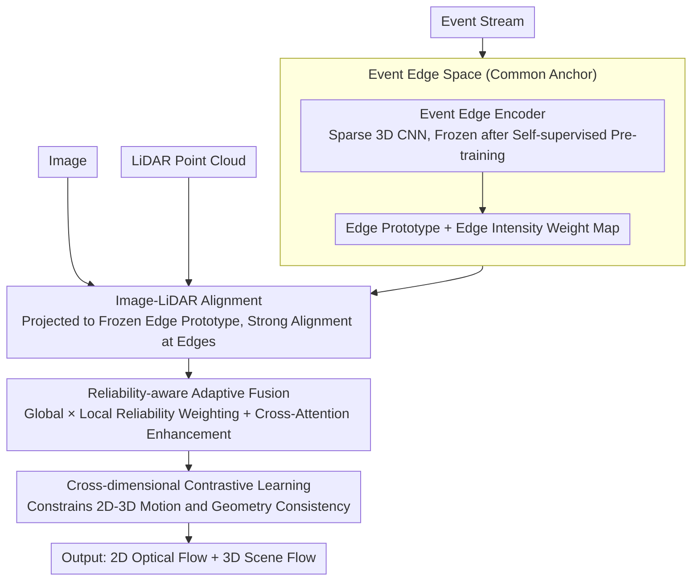

# x2-Fusion: Cross-Modality and Cross-Dimension Flow Estimation in Event Edge Space

**Conference**: CVPR 2026  
**arXiv**: [2603.16671](https://arxiv.org/abs/2603.16671)  
**Code**: None  
**Area**: Autonomous Driving  
**Keywords**: Optical Flow, Scene Flow, Event Camera, Multi-modal Fusion, Edge Space

## TL;DR

Ours proposes x2-Fusion, which constructs a unified Event Edge Space anchored by the spatio-temporal edge signals of event cameras. By aligning Image/LiDAR/Event features into a homogeneous edge space, the method performs reliability-aware adaptive fusion and cross-dimensional contrastive learning to simultaneously estimate 2D optical flow and 3D scene flow, achieving SOTA results on both synthetic and real-world datasets.

## Background & Motivation

Optical flow and scene flow are core tools for dynamic scene understanding. Existing multi-modal fusion methods maintain Image/LiDAR/Event features in their respective heterogeneous spaces, leading to three problems:

**High Complexity**: Without a shared channel foundation, modalities must be aligned pair-wise, leading to excessive modules.

**Information Erosion**: Heterogeneous spaces delay fusion to late stages, making early distortions difficult to correct.

**High Vulnerability**: Lacking a common representation base, the alignment itself collapses under degraded conditions.

Key Insight: Event cameras naturally provide spatio-temporal edge signals—pixel-level brightness changes that accurately mark motion edges—which can serve as a "unified edge anchor" for all modalities.

## Method

### Overall Architecture

Estimating 2D optical flow and 3D scene flow simultaneously is challenging because Image, LiDAR, and Event modalities reside in heterogeneous feature spaces. Previous methods aligned modalities pair-wise, which is modularly heavy and prone to uncorrected early distortions. The core idea of x2-Fusion is to first select a "common language" recognized by all modalities—the motion edge signals naturally provided by the event camera—and translate all three modalities into this unified Event Edge Space before fusion.

Specifically, an Event Edge Encoder is independently pre-trained to learn edge representations from event streams, then frozen as the "edge prototype" of the system. Image and LiDAR encoders then learn to align their features to this prototype space. Once all three modalities converge in the homogeneous space, a reliability-aware adaptive fusion module weights and merges them based on the current credibility of each modality. Finally, 2D and 3D flows constrain each other through cross-dimensional contrastive learning to output the final results.

### Key Designs

**1. Event Edge Space: Using Event Edges as a "Common Anchor" for All Modalities**

The root of heterogeneous space fusion is the lack of a shared representation base, forcing alignment to be pair-wise heuristics. This paper takes a different perspective: edges are modality-independent structural information; the same motion edge should appear at the same location regardless of the sensor. Event cameras are ideal for providing this anchor—they trigger precisely at pixel-level brightness changes (motion edges) and share 2D coordinates with images while being sparse and asynchronous like LiDAR.

To turn this anchor into a learnable representation, the Event Edge Encoder feeds voxelized event streams into a sparse 3D CNN to produce a multi-scale feature pyramid, pre-trained via self-supervision: using past events to predict future edge intensity. The edge intensity itself is defined as:

$$e^E(x,y) = \tilde{A}^E(x,y)\,\bigl(1 - \tilde{\sigma}_t(x,y)\bigr)$$

where $\tilde{A}^E$ is the normalized event activity and $(1-\tilde{\sigma}_t)$ is a temporal variance term. Higher activity with stable temporal consistency indicates a true motion edge. This edge intensity map is repeatedly used as a weight for "where to trust and where to relax."

**2. Image-LiDAR Alignment: Projecting Heterogeneous Features onto the Frozen Edge Prototype**

Creating the edge space is insufficient; Image and LiDAR features must be moved into it. The approach freezes the event encoder, treating its output as a fixed edge prototype. Image and LiDAR encoders each use a projection head to map their features into the same dimensional space toward the prototype. Freezing, rather than joint training, provides a stable reference frame to prevent alignment targets from drifting.

Alignment uses edge-anchored symmetric regularization: L1 distances between the three modalities are calculated in 2D (pixel-level) and 3D (point-level), with the event edge map $e^E$ serving as a per-pixel/per-point weight. The total loss is:

$$\mathcal{L}_{align} = \lambda_{2D}\,\mathcal{L}_{align}^{2D} + \lambda_{3D}\,\mathcal{L}_{align}^{3D}$$

Using $e^E$ as a weight ensures forced alignment at edges (where structure is most certain) while relaxing constraints in non-edge regions, avoiding noise introduced by forcing alignment in flat-textured areas.

**3. Reliability-aware Adaptive Fusion: Weighting Modalities by Current Credibility**

While the homogeneous space enables alignment, the system must determine which modality to trust in degraded scenes (e.g., extreme lighting, sparse LiDAR). This is addressed via dual-layer reliability. Global reliability $\omega_m$ measures the consistency between modality $m$ and the event motion signal via spatio-temporal decomposition. Local reliability $\mathcal{A}_m(x)$ captures per-position credibility using high-pass filtering and softmax. The modalities are weighted as:

$$F_{fused}(x) = \sum_m \frac{\omega_m\,\mathcal{A}_m(x)}{\sum_n \omega_n\,\mathcal{A}_n(x)}\,Z_m(x)$$

This ensures that if a modality fails globally, $\omega_m$ decreases, while still allowing reliable local regions to contribute via $\mathcal{A}_m(x)$, which is more robust than fixed weighting.

**4. Cross-dimensional Contrastive Learning: Mutual Correction of 2D and 3D Flow**

Optical flow (2D) and scene flow (3D) describe the same motion projected across different dimensions and should be self-consistent. A contrastive learning objective explicitly constrains inter-frame motion consistency and 2D-3D geometric consistency. The two tasks act as mutual regularizers: 3D geometric constraints stabilize 2D flow in occluded or textureless areas, while dense 2D observations help 3D flow interpolate motion between sparse LiDAR points.

## Key Experimental Results

### Main Results: EKubric Synthetic Data

| Method | EPE_2D ↓ | ACC_1px ↑ | EPE_3D ↓ | ACC_.05 ↑ |
|------|----------|-----------|----------|-----------|
| RPEFlow | 0.439 | 95.99% | 0.027 | 95.33% |
| **x2-Fusion** | **0.430** | **96.86%** | **0.024** | **96.78%** |

### Main Results: DSEC Real-world Data

| Method | EPE_2D ↓ | ACC_1px ↑ | EPE_3D ↓ |
|------|----------|-----------|----------|
| RPEFlow | 0.326 | 95.28% | 0.103 |
| **x2-Fusion** | **0.305** | **95.60%** | **0.092** |

### Key Experimental Results: Degraded Scenarios

| Condition | Gain |
|------|---------|
| Extreme Lighting | Significant Improvement |
| Sparse LiDAR | Significant Improvement |

### Ablation Study

| Config | EPE_2D | EPE_3D | Description |
|------|--------|--------|------|
| w/o Event Edge Space | +0.05 | +0.003 | Homogeneous space is crucial for fusion |
| w/o Reliability Fusion | +0.03 | +0.002 | Adaptive weights essential for degradation |
| w/o Cross-dim Contrast | +0.02 | +0.003 | 2D-3D mutual enhancement is effective |

### Key Findings

- Event Edge Space is the first design to unify three modalities into a homogeneous edge space.
- Reliability-aware fusion shows the greatest advantage in degraded scenarios.
- Cross-dimensional contrast enables 2D and 3D tasks to mutually improve.

## Highlights & Insights

1. The design philosophy of Event Edge Space is elegant—using natural event signals as a "universal anchor."
2. Simplifies fusion from "pair-wise alignment in heterogeneous spaces" to "weight distribution within a homogeneous space."
3. Edge intensity as an alignment weight—precise alignment at edges and relaxed constraints elsewhere.

## Limitations & Future Work

1. Post-training complexity increases due to event encoder pre-training.
2. Freezing the event encoder may limit adaptive capacity.
3. Current work does not explicitly handle dynamic object occlusions.
4. Dependency on event camera hardware limits application in pure Image+LiDAR scenarios.

## Related Work & Insights

- Compared to RPEFlow (staged fusion): The unified space design is more concise.
- Compared to VisMoFlow (hand-crafted physical space): Event Edge Space is data-driven and more generalized.
- The perspective of event cameras as "edge sensors" deserves exploration in more tasks.

## Rating

- Novelty: ⭐⭐⭐⭐⭐ The concept of Event Edge Space and the homogenization paradigm are original.
- Experimental Thoroughness: ⭐⭐⭐⭐ Validated on synthetic and real data, including degraded scenes.
- Writing Quality: ⭐⭐⭐⭐ Clear architecture diagrams and intuitive paradigm comparisons.
- Value: ⭐⭐⭐⭐⭐ Provides a completely new perspective for multi-modal fusion in flow estimation.

<!-- RELATED:START -->

## Related Papers

- [\[ICLR 2026\] x²-Fusion: Cross-Modality and Cross-Dimension Flow Estimation in Event Edge Space](../../ICLR2026/autonomous_driving/x2-fusion_cross-modality_and_cross-dimension_flow_estimation_in_event_edge_space.md)
- [\[CVPR 2026\] DSERT-RoLL: Robust Multi-Modal Perception for Diverse Driving Conditions with Stereo Event-RGB-Thermal Cameras, 4D Radar, and Dual-LiDAR](dsert-roll_robust_multi-modal_perception_for_diverse_driving_conditions_with_ste.md)
- [\[CVPR 2026\] EventDrive: Event Cameras for Vision-Language Driving Intelligence](eventdrive_event_cameras_for_vision-language_driving_intelligence.md)
- [\[CVPR 2026\] LiDAR-to-4DRadar Diffusion Bridge via Cross-Modal Alignment and Translation in Latent Space](lidar-to-4dradar_diffusion_bridge_via_cross-modal_alignment_and_translation_in_l.md)
- [\[CVPR 2026\] LiREC-Net: A Target-Free and Learning-Based Network for LiDAR, RGB, and Event Calibration](lirec-net_a_target-free_and_learning-based_network_for_lidar_rgb_and_event_calib.md)

<!-- RELATED:END -->
