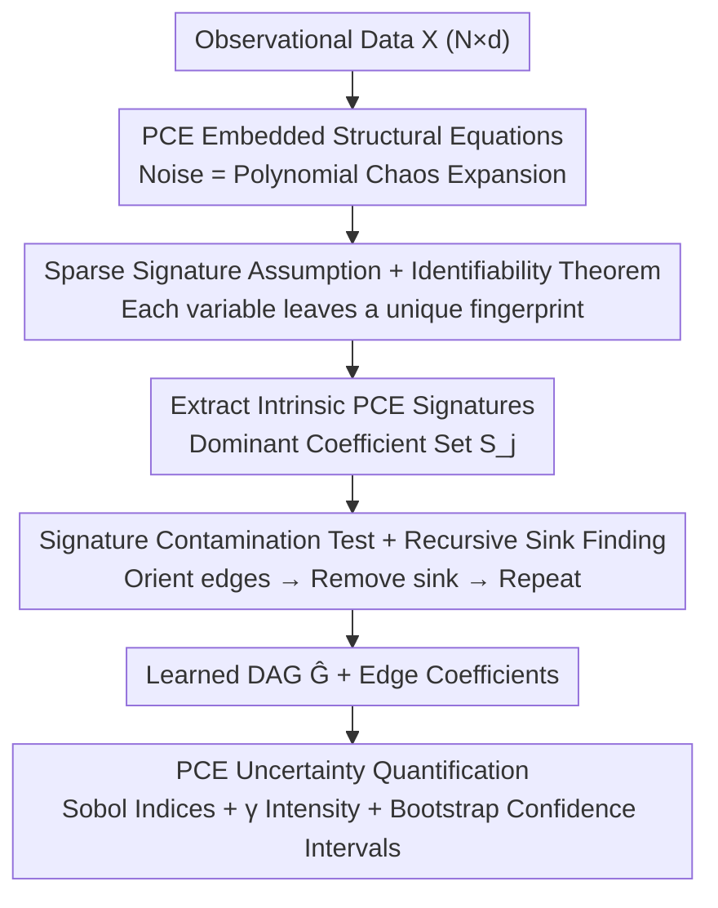

# A Polynomial Chaos Framework for Causal Discovery in Nonlinear Uncertain Systems

**Conference**: CVPR 2026  
**Paper**: [CVF Open Access](https://openaccess.thecvf.com/content/CVPR2026/html/Cao_A_Polynomial_Chaos_Framework_for_Causal_Discovery_in_Nonlinear_Uncertain_CVPR_2026_paper.html)  
**Code**: TBD  
**Area**: Causal Discovery  
**Keywords**: Causal Discovery, Polynomial Chaos Expansion, LiNGAM, Uncertainty Quantification, Industrial Processes  

## TL;DR
This paper embeds noise terms into structural equations using Polynomial Chaos Expansion (PCE) to develop PCE-LiNGAM. It proves that causal Directed Acyclic Graphs (DAGs) are uniquely identifiable under mild sparsity conditions. Using a polynomial-time algorithm involving "PCE signature contamination testing + recursive sink finding," the method improves average F1 scores from 0.50 to 0.756 on extreme non-Gaussian industrial data while providing uncertainty quantification based on Sobol indices.

## Background & Motivation

**Background**: Causal discovery (recovering the causal DAG between variables from observational data) comprises three main schools: constraint-based (PC, FCI), score-based (GES, NOTEARS, DAGMA), and functional causal models (LiNGAM family, ANM, PNL). A classic conclusion of LiNGAM is that **linearity + non-Gaussian noise** is sufficient for unique identifiability, as non-Gaussianity breaks the directional symmetry of linear Gaussian models.

**Limitations of Prior Work**: Industrial sensor data often violates multiple assumptions. Noise is frequently multi-modal, heavy-tailed, or drifts as equipment ages (far beyond Gaussian), and variables are coupled non-linearly (product terms, saturation, log/tanh). Constraint-based methods are unstable with finite samples and infeasible in high dimensions; continuous optimization like NOTEARS degrades under complex noise; even non-linear models like ANM/PNL provide only **point estimates** of the causal structure, failing to quantify "how certain this edge is." Industrial root cause analysis specifically requires confidence levels.

**Key Challenge**: Traditional intuition suggests that "more complex noise makes identification harder"—complex noise is treated as its enemy. Existing Bayesian methods (DiBS, BCD Nets) provide uncertainty but revert to assuming simple parameterized noise distributions, losing expressivity. Expressivity, identifiability, and uncertainty are difficult to achieve simultaneously.

**Key Insight**: The authors argue the opposite—**structured noise is information, not an obstacle**. Polynomial Chaos Expansion (PCE) can represent any distribution using a set of orthogonal polynomial bases (Hermite for Gaussian, Legendre for bounded, etc.) with convergence guarantees. If the noise of each variable leaves a "fingerprint" on its PCE coefficients, causal propagation will "contaminate" the parent's fingerprint into the child's expansion—this contamination direction is asymmetric, allowing for orientation determination.

**Core Idea**: Embed noise $\epsilon_j$ as a PCE into structural equations to obtain PCE-LiNGAM. Perform parent node selection using "contamination detection" of PCE coefficient signatures. Prove unique DAG identifiability under mild sparsity assumptions while retaining the PCE representation to obtain uncertainty quantification for free.

## Method

### Overall Architecture

The core of PCE-LiNGAM is a new structural equation model paired with a structural learning algorithm. The structural equations represent each variable as a "deterministic function (potentially non-linear) of parent nodes + non-Gaussian noise represented by PCE":

$$X_j = f_j(X_{\mathrm{Pa}(j)}) + \sum_{k=0}^{P} c_{jk}\Psi_{jk}(\zeta_j)$$

where $\zeta_j$ is the independent standardized latent random source driving $X_j$, $\{\Psi_{jk}\}$ are orthonormal polynomial bases (with $\Psi_{j0}\equiv1$) related to the distribution of $\zeta_j$, and $c_{jk}$ are expansion coefficients. When $f_j$ is linear and $P=0$, it reduces to a linear Gaussian model; if $f_j$ is linear, $P=0$, and noise is non-Gaussian, it becomes LiNGAM—thus, this model is a strict generalization of LiNGAM.

The learning stage is a **recursive sink-finding pipeline**: compute intrinsic PCE signatures for each variable under the "no-parent hypothesis" → identify the variable with the most unique signature as the sink → perform signature contamination testing for each candidate parent to determine edges → remove the sink and repeat on the remaining subgraph. After structure learning, the same PCE representation is used for Sobol variance decomposition and uncertainty quantification.

### Key Designs

**1. PCE-Embedded Structural Equations: Making Noise Carry Identifiable "Fingerprints"**

The pain point is that industrial noise is both non-Gaussian and complex, whereas LiNGAM only handles linear + single non-Gaussian noise. This paper uses PCE to represent noise $\epsilon_j = h_j(\zeta_j) = \sum_{k=0}^{P} c_{jk}\Psi_{jk}(\zeta_j)$ as a linear combination of orthogonal polynomial bases. The key here is not just "approximating any distribution" (which is a standard capability of PCE), but that the **expansion coefficients $\{c_{jk}\}$ constitute a structured signature of that variable's noise**. Once embedded into the structural equation, the joint distribution of the entire DAG can be written as a high-dimensional polynomial expansion of all independent noises $\{\zeta_1,\dots,\zeta_d\}$: $X_j = \sum_{\alpha\in A_j} C_{j,\alpha}\Phi_\alpha(\zeta_1,\dots,\zeta_d)$, where the multi-index $\alpha$ corresponds to products of basis functions for different $\zeta$. Due to noise independence, these multivariate polynomials are orthogonal across different $\zeta$ combinations. This orthogonality is the mathematical pivot for all subsequent identification and detection—it makes the presence of a specific $\zeta_i$ in the expansion of $X_j$ a clean, testable fact.

**2. Sparse Signature Assumption + Identifiability Theorem: Flipping "Noise Complexity" into an Aid**

Traditional views suggest that more complex noise makes identification harder; this paper proves the opposite. It introduces the **Sparse Expansion Coefficient Assumption** (Assumption 2.2): each noise $h_j$ is dominated by a few basis terms, meaning there exists $S_j\subseteq\{1,\dots,P\}$ with $|S_j|\ll P$ such that the energy of non-dominant terms $\sum_{k\notin S_j} c_{jk}^2$ is much smaller than the total energy; additionally, $S_i\ne S_j$ for $i\ne j$—**no two variables possess identical dominant chaos components**, meaning every variable's noise shape is unique.

Under this, Theorem 2.3 proves: if the data is generated by Eq. (3) and satisfies the sparsity assumption, the causal DAG is uniquely identifiable with probability 1 (relative to random realizations of true coefficients). The proof is constructive: since the graph is acyclic, each $X_j$ is ultimately a function of $\zeta_j$ and its ancestors $\zeta_i$; if $X_i$ is not an ancestor of $X_j$, all coefficients $C_{j,\alpha}$ for terms $\Phi_\alpha$ involving $\zeta_i$ in the expansion of $X_j$ are zero—**every non-edge is equivalent to a set of zero coefficients in the joint expansion**. Conversely, if $X_i$ is a parent, its chaos signature propagates into $X_j$, leaving an imprint that cannot be synthesized by other noises. Orthonormality + independence ensure that the only way to generate $\Psi_{ik}(\zeta_i)$ from scratch is if it was already present elsewhere, implying $X_i$ is indeed an ancestor. This extends LiNGAM's identifiability to non-linear settings with arbitrary noise.

**3. Signature Contamination Test + Recursive Sink Finding: Turning Theorems into Polynomial-Time Algorithms**

The theorem guarantees identifiability, but practical algorithms are needed. The core insight is that "parent-to-child causal propagation 'contaminates' the child's expansion with the parent's PCE signature," and this contamination is directional. The algorithm (Algorithm 1) follows three steps. ① **Extract Intrinsic Signatures**: For each variable, center it under the no-parent hypothesis and project it onto the basis: $\tilde c_{jk} = \frac1N\sum_n \tilde X_j^{(n)}\Psi_{jk}(\zeta_j^{(n)})$, using dominant indices $S_j=\{k:|\tilde c_{jk}|>\tau_s\|\tilde c_j\|_2\}$ as the signature. ② **Recursive Sink Finding**: In each round, select the variable with the most unique signature $j^*=\arg\max_j \min_{i}\|\mathrm{sig}[j]-\mathrm{sig}[i]\|_{\text{unique}}$ as the current sink. ③ **Signature Contamination Test for Parent Designation**: For each candidate parent $X_i$, use polynomial regression to fit $\hat f_{j,i}$ and calculate the residual $R_{j|i}=X_j-\hat f_{j,i}(X_i)$, then extract the PCE signature of $R_{j|i}$ using an independence score:

$$I(j,i) = \frac{\|P_{S_j}(\tilde c_{R_{j|i}})\|_2}{\|P_{S_j}(\tilde c_j)\|_2} - \rho(\tilde c_{R_{j|i}}, \tilde c_i)$$

to judge if an edge exists ($i$ enters the parent set if $I>\tau_i$); here $P_{S_j}$ projects onto the dominant coefficient indices and $\rho$ measures signature correlation. The intuition is: if $X_i$ is truly the parent, the residual signature after regression will be "cleaner" (closer to $X_j$'s own noise). For multiple parents, joint fitting $X_{j}=\sum_{i}\hat\beta_{ij}g_i(X_i)+\hat\epsilon_j$ is performed to verify joint independence and remove redundant parents. Once a sink is determined, it is removed from the set, and the process repeats on the remaining subgraph—the entire process is polynomial time and avoids the heavy parameter tuning of neural networks.

**4. Maintaining PCE Throughout: Free Uncertainty Quantification and Sensitivity Analysis**

After learning the structure, the same PCE representation is reused for uncertainty quantification, a "for free" benefit of this framework. For the learned structure, PCE coefficients for each variable's residual noise are re-estimated, and global coefficients $D_{j,\alpha}$ are computed recursively via Galerkin projection. This leads to a natural variance decomposition: $\mathrm{Var}(X_j)=\sum_{\alpha\ne 0}D_{j,\alpha}^2$. The partial variance contributed by noise source $\zeta_i$ is $\mathrm{Var}_i(X_j)=\sum_{\alpha:\alpha_i>0,\alpha_{k}=0(k\ne i)}D_{j,\alpha}^2$. Based on this, first-order/total-order Sobol indices $S_{ij}=\mathrm{Var}_i(X_j)/\mathrm{Var}(X_j)$ and $S^T_{ij}$ are provided, alongside a **PCE-based causal strength**:

$$\gamma_{ij} = \frac{\sum_{\alpha:\alpha_i>0}D_{j,\alpha}^2 - \sum_{\alpha:\alpha_i=0,\alpha_j>0}D_{j,\alpha}^2}{\sum_{\alpha\ne 0}D_{j,\alpha}^2}$$

which measures the portion of variance in $X_j$ attributable to $X_i$ beyond $X_j$'s own noise. Confidence intervals for Sobol indices are obtained via $B$ bootstrap resamples. The authors honestly position these metrics as "variance attribution under a surrogate model" rather than exact total causal effects (⚠️ see Limitations). Sparse PCE (restricting total order $\|\alpha\|_1\le p$ and interaction order $\|\alpha\|_0\le q$) + compressive sensing $\ell_1$ regularization are used for coefficients when $P$ is large to ensure computability.

## Key Experimental Results

### Main Results

Six datasets DS1–DS6 with increasing difficulty were used, covering various non-linear intensities and noise families (Uniform, Exponential, Cauchy, Beta, Lognormal, Laplace, Mixed Laplacian, Student-t, Weibull, and Industrial drift+outliers). Comparisons were made against NOTEARS, DirectLiNGAM, ICA-LiNGAM, and CAM using Precision/Recall/F1/SHD.

| Algorithm | Avg F1 | Precision | Recall | SHD (Lower is better) |
|------|---------|-----------|--------|-----------------|
| **PCE-LiNGAM (Ours)** | **0.756 ± 0.185** | **0.794** | **0.737** | **3.7 ± 3.1** |
| ICA-LiNGAM | 0.502 ± 0.156 | 0.453 | 0.568 | 8.3 |
| NOTEARS | 0.483 ± 0.167 | 0.606 | 0.412 | 6.8 |
| CAM | 0.274 ± 0.244 | 0.256 | 0.302 | 13.7 |
| DirectLiNGAM | 0.253 ± 0.155 | 0.237 | 0.281 | 13.2 |

PCE-LiNGAM leads across all six datasets. The average F1 of 0.756 is approximately 51% higher than the runner-up ICA-LiNGAM (0.502), with an SHD of only 3.7 (vs 6.8).

### Performance on Specific Datasets and Hard Cases

| Dataset | Characteristics | PCE-LiNGAM | Comparison |
|--------|------|-----------|------|
| DS1 (Diamond DAG, sign nonlinearity, 4 extreme noises) | Main Showcase | **F1=1.000, SHD=0** (All 4 edges correct, zero false positives) | Runner-up NOTEARS F1=0.571 |
| DS5 (Sparse 7-node, Weibull noise) | Sparse large graph | **F1=0.667** | DirectLiNGAM / CAM both **F1=0.000** |
| DS6 (Industrial sensor sim, drift+outliers+log/tanh/exp/product) | Hardest | F1=0.571 | Tied with best competitor NOTEARS |

On DS1, F1 is 75% higher than the runner-up and over 4x higher than DirectLiNGAM/CAM. On the hard case DS5, linear/additive methods collapsed to zero, while ours remained stable at 0.667.

### Directionality and Uncertainty Diagnosis

- **Directional Asymmetry Matrix (DS1)**: Asymmetry values for the four ground-truth edges were all positive ($X_1\!\to\!X_2$ +0.084 is the clearest, $X_1\!\to\!X_3$ +0.017 is the weakest). Positive values indicate that forward regression residuals are more independent, supporting that direction. The weak $X_1\!\to\!X_3$ contrast is consistent with its clipped Cauchy heavy-tailed noise.
- **Uncertainty Quantification (DS1, Bootstrap $B=150,\alpha=0.05$)**: $X_1\!\to\!X_2$ has the highest intensity $\gamma=0.648$ and concentrated first-order Sobol ($S^{(1)}=0.642\pm0.038$); $X_1\!\to\!X_3$ has low first-order ($0.100\pm0.086$) but wide total-order estimates ($S^T=0.654\pm0.500$). Based on this, the authors **conservatively determine the variance attribution for this edge is unstable under resampling**—positioning Sobol analysis as a "comparative diagnostic for edge-level stability."

### Key Findings
- **PCE signature mechanism is the primary contributor**: As non-Gaussianity and non-linearity intensify, linear/additive baselines fail significantly (e.g., DS5), whereas the signature contamination test uses the unique structure of noise for orientation, showing greater advantage in difficult cases.
- **Uncertainty is a free byproduct**: UQ is not an extra training step but a reuse of estimated PCE coefficients for variance decomposition, incurring almost zero additional cost.
- **Honest labeling of UQ boundaries**: The authors explicitly interpret Sobol/$\gamma$ as variance attribution under a surrogate model rather than ground-truth total causal effects, using wide confidence intervals to signal unreliable edges.

## Highlights & Insights
- **Turning "Complex Noise" from an Enemy into a Friend**: Traditional intuition suggests messy noise hinders identification. This paper uses PCE to structure any noise distribution into a coefficient fingerprint; complexity thus becomes an information source for distinguishing variables and orienting edges—a brilliant perspective shift.
- **Identifiability and Uncertainty in One Go**: The same PCE representation supports identifiability proofs and directly provides Sobol variance decomposition, avoiding the split of "learning structure first then building a separate Bayesian model for UQ."
- **Transferable Contamination Testing**: The concept of "parental features contaminating child residuals in an asymmetric manner" can theoretically be applied to any setting where noise/features can be orthogonally expanded (e.g., kernel expansions, Fourier features), Not limited to polynomial bases.
- **Sparsity + Compressive Sensing for Computability**: High-order PCE suffers from dimensionality explosion; using $\ell_1$-regularized sparse PCE (limiting total/interaction order) keeps the framework polynomial-time in practice.

## Limitations & Future Work
- **Authors acknowledge**: The method is designed for static, relatively low-dimensional settings; future work should extend to dynamic (time-series) and high-dimensional contexts, further improve efficiency, and incorporate domain constraints.
- **UQ as a Proxy (Explicitly Stated)**: Sobol indices and $\gamma$ strength are variance attributions under the learned surrogate model, not true population causal effects. On DS1, the total-order Sobol interval for $X_1\!\to\!X_3$ is as wide as $\pm0.500$, indicating diagnostic instability on some edges. ⚠️ These values should not be treated as direct causal effect sizes.
- **Small Experimental Scale**: The six datasets feature at most 7 nodes and 1500 samples, mostly synthetic/semi-synthetic, which is far from actual high-dimensional industrial scenarios; the CVPR audience might lack recent causal discovery baselines like DAGMA for comparison.
- **Reliance on Sparse Signature Assumption**: Assumption 2.2 requires no two variables to have the same dominant chaos components; if multiple variables have extremely similar noise distributions, identifiability might degrade.
- **Basis/Order Selection**: PCE basis types and truncation order $P$ must be chosen based on noise distribution; the paper is less clear on how to automatically select these when distributions are unknown (⚠️ pending citation on adaptive basis selection).

## Related Work & Insights
- **vs. LiNGAM / DirectLiNGAM / ICA-LiNGAM**: Classic LiNGAM relies on "linear + single non-Gaussian" to break symmetry. This work is a strict generalization (reducing to LiNGAM when $f_j$ is linear and $P=0$), upgrading noise to PCE-based arbitrary distributions and allowing non-linear $f_j$.
- **vs. NOTEARS / DAGMA (Continuous Optimization)**: These model acyclicity as a differentiable optimization but degrade under complex noise and provide only point estimates. Ours uses PCE signature contamination detection + recursive sink finding, maintaining interpretability and theoretical guarantees.
- **vs. ANM / PNL / CAM (Nonlinear Additive Models)**: These handle non-linearity but provide point estimates and have poor robustness against extreme non-Gaussian noise (CAM avg F1: 0.274). Ours provides additional UQ.
- **vs. DiBS / BCD Nets (Bayesian Structure Learning)**: These provide uncertainty but revert to simple parameterized noise assumptions. Ours allows arbitrary complexity without assuming parameterized noise while still outputting posterior-style variance attribution.

## Rating
- Novelty: ⭐⭐⭐⭐⭐ First use of PCE for the inverse problem of causal discovery, flipping the intuition on noise complexity.
- Experimental Thoroughness: ⭐⭐⭐ Proven advantage on six datasets, but scale is small (≤7 nodes), mostly synthetic, and lacks comparison with some recent methods.
- Writing Quality: ⭐⭐⭐⭐ Clear theoretical derivation; honest labeling of UQ as proxy metrics.
- Value: ⭐⭐⭐⭐ Provides a principled framework for industrial causal analysis that is identifiable, interpretable, and includes uncertainty.

<!-- RELATED:START -->

## Related Papers

- [\[ICLR 2026\] Efficient Ensemble Conditional Independence Test Framework for Causal Discovery](../../ICLR2026/causal_inference/efficient_ensemble_conditional_independence_test_framework_for_causal_discovery.md)
- [\[ACL 2025\] IRIS: An Iterative and Integrated Framework for Verifiable Causal Discovery](../../ACL2025/causal_inference/iris_an_iterative_and_integrated_framework.md)
- [\[AAAI 2026\] CaDyT: Causal Structure Learning for Dynamical Systems with Theoretical Score Analysis](../../AAAI2026/causal_inference/causal_structure_learning_for_dynamical_systems_with_theoretical_score_analysis.md)
- [\[ACL 2025\] On the Reliability of Large Language Models for Causal Discovery](../../ACL2025/causal_inference/llm_causal_discovery_reliability.md)
- [\[CVPR 2026\] CGU-Bayes: Causal Graph Uncertainty-Guided Bayesian Inference for Domain Generalization](cgu-bayes_causal_graph_uncertainty-guided_bayesian_inference_for_domain_generali.md)

<!-- RELATED:END -->
